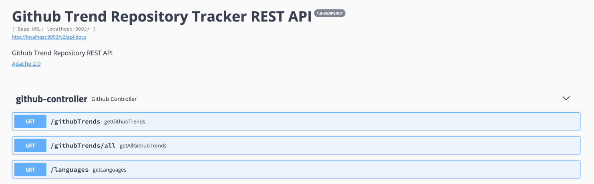

#  👁‍🗨 Github Trend Tracker API
Keep an eye on the latest trending repositories on GitHub with this Trend Repositories Tracker for all languages. This tool provides a simple and intuitive way to discover popular projects across various programming languages.

[](https://github.com/fatihyildizli/github-trend-tracker/stargazers)
[](https://github.com/fatihyildizli/github-trend-tracker/network/members)


Tracking url: https://github.com/trending

**Sample Output**

```json[
{
"repository_name": "Modern-CPP-Programming",
"repository_total_star_count": 9484,
"repository_daily_star_count": 47,
"repository_total_fork_count": 682,
"repository_description": "Modern C++ Programming Course (C++11/14/17/20/23)",
"repository_language": "",
"repository_author": "federico-busato",
"date": "20240130"
},
{
"repository_name": "project-based-learning",
"repository_total_star_count": 153682,
"repository_daily_star_count": 763,
"repository_total_fork_count": 20708,
"repository_description": "Curated list of project-based tutorials",
"repository_language": "",
"repository_author": "practical-tutorials",
"date": "20240130"
},
{
"repository_name": "90DaysOfCyberSecurity",
"repository_total_star_count": 4025,
"repository_daily_star_count": 171,
"repository_total_fork_count": 427,
"repository_description": "This repository contains a 90-day cybersecurity study plan, along with resources and materials for learning various cybersecurity concepts and technologies. The plan is organized into daily tasks, covering topics such as Network+, Security+, Linux, Python, Traffic Analysis, Git, ELK, AWS, Azure, and Hacking. The repository also includes a `LEARN.md",
"repository_language": "",
"repository_author": "farhanashrafdev",
"date": "20240130"
},
{
"repository_name": "the-book-of-secret-knowledge",
"repository_total_star_count": 120837,
"repository_daily_star_count": 279,
"repository_total_fork_count": 8339,
"repository_description": "A collection of inspiring lists, manuals, cheatsheets, blogs, hacks, one-liners, cli/web tools and more.",
"repository_language": "",
"repository_author": "trimstray",
"date": "20240130"
},
{
"repository_name": "DotNet-Developer-Roadmap",
"repository_total_star_count": 1024,
"repository_daily_star_count": 41,
"repository_total_fork_count": 98,
"repository_description": "The comprehensive .NET Developer Roadmap by seniority level.",
"repository_language": "",
"repository_author": "milanm",
"date": "20240130"
},
{
"repository_name": "oh-my-foss-android",
"repository_total_star_count": 783,
"repository_daily_star_count": 199,
"repository_total_fork_count": 39,
"repository_description": "个人收集的实用、良心开源安卓软件",
"repository_language": "",
"repository_author": "xlucn",
"date": "20240130"
},
{
"repository_name": "Ultimate-RAT-Collection",
"repository_total_star_count": 134,
"repository_daily_star_count": 39,
"repository_total_fork_count": 34,
"repository_description": "For educational purposes only, samples of old & new malware builders including screenshots!",
"repository_language": "",
"repository_author": "yuankong666",
"date": "20240130"
},
{
"repository_name": "SelfAssessment",
"repository_total_star_count": 71,
"repository_daily_star_count": 9,
"repository_total_fork_count": 358,
"repository_description": "Software engineering self assessment",
"repository_language": "",
"repository_author": "HowProgrammingWorks",
"date": "20240130"
},
{
"repository_name": "Awesome-GPT-Agents",
"repository_total_star_count": 3831,
"repository_daily_star_count": 31,
"repository_total_fork_count": 393,
"repository_description": "A curated list of GPT agents for cybersecurity",
"repository_language": "",
"repository_author": "fr0gger",
"date": "20240130"
},
{
"repository_name": "awesome-design-patterns",
"repository_total_star_count": 34847,
"repository_daily_star_count": 53,
"repository_total_fork_count": 2666,
"repository_description": "A curated list of software and architecture related design patterns.",
"repository_language": "",
"repository_author": "DovAmir",
"date": "20240130"
},
{
"repository_name": "AI-Chat-App-Hack",
"repository_total_star_count": 112,
"repository_daily_star_count": 18,
"repository_total_fork_count": 18,
"repository_description": "HackTogether: The Microsoft Python Chatbot Hack | Register, Hack, Win",
"repository_language": "",
"repository_author": "microsoft",
"date": "20240130"
},
{
"repository_name": "generative_agents",
"repository_total_star_count": 14324,
"repository_daily_star_count": 23,
"repository_total_fork_count": 1710,
"repository_description": "Generative Agents: Interactive Simulacra of Human Behavior",
"repository_language": "",
"repository_author": "joonspk-research",
"date": "20240130"
},
{
"repository_name": "computer-science",
"repository_total_star_count": 157472,
"repository_daily_star_count": 71,
"repository_total_fork_count": 19936,
"repository_description": "🎓 Path to a free self-taught education in Computer Science!",
"repository_language": "",
"repository_author": "ossu",
"date": "20240130"
},
{
"repository_name": "modern-unix",
"repository_total_star_count": 29194,
"repository_daily_star_count": 59,
"repository_total_fork_count": 745,
"repository_description": "A collection of modern/faster/saner alternatives to common unix commands.",
"repository_language": "",
"repository_author": "ibraheemdev",
"date": "20240130"
},
{
"repository_name": "IPTV",
"repository_total_star_count": 3772,
"repository_daily_star_count": 710,
"repository_total_fork_count": 226,
"repository_description": "IPTV直播源抓取 自动整合好趣网直播源+TVBox直播源+其他网上直播源 择取分辨率、速度最佳视频流 定期更新",
"repository_language": "",
"repository_author": "joevess",
"date": "20240130"
},
{
"repository_name": "system-design-101",
"repository_total_star_count": 53607,
"repository_daily_star_count": 255,
"repository_total_fork_count": 5399,
"repository_description": "Explain complex systems using visuals and simple terms. Help you prepare for system design interviews.",
"repository_language": "",
"repository_author": "ByteByteGoHq",
"date": "20240130"
},
{
"repository_name": "awesome-javascript",
"repository_total_star_count": 32366,
"repository_daily_star_count": 31,
"repository_total_fork_count": 4494,
"repository_description": "🐢 A collection of awesome browser-side JavaScript libraries, resources and shiny things.",
"repository_language": "",
"repository_author": "sorrycc",
"date": "20240130"
},
{
"repository_name": "awesome-virtual-try-on",
"repository_total_star_count": 1542,
"repository_daily_star_count": 7,
"repository_total_fork_count": 215,
"repository_description": "A curated list of awesome research papers, projects, code, dataset, workshops etc. related to virtual try-on.",
"repository_language": "",
"repository_author": "minar09",
"date": "20240130"
},
{
"repository_name": "AD-Attack-Defense",
"repository_total_star_count": 4195,
"repository_daily_star_count": 4,
"repository_total_fork_count": 1011,
"repository_description": "Attack and defend active directory using modern post exploitation adversary tradecraft activity",
"repository_language": "",
"repository_author": "infosecn1nja",
"date": "20240130"
},
{
"repository_name": "AspNetCore-Developer-Roadmap",
"repository_total_star_count": 17187,
"repository_daily_star_count": 14,
"repository_total_fork_count": 2336,
"repository_description": "Roadmap to becoming an ASP.NET Core developer in 2024",
"repository_language": "",
"repository_author": "MoienTajik",
"date": "20240130"
},
{
"repository_name": "Git-Commands",
"repository_total_star_count": 4758,
"repository_daily_star_count": 3,
"repository_total_fork_count": 3654,
"repository_description": "A list of commonly used Git commands",
"repository_language": "",
"repository_author": "joshnh",
"date": "20240130"
},
{
"repository_name": "Web",
"repository_total_star_count": 24551,
"repository_daily_star_count": 6,
"repository_total_fork_count": 6145,
"repository_description": "千古前端图文教程，超详细的前端入门到进阶知识库。从零开始学前端，做一名精致优雅的前端工程师。",
"repository_language": "",
"repository_author": "qianguyihao",
"date": "20240130"
},
{
"repository_name": "ddd-starter-modelling-process",
"repository_total_star_count": 4264,
"repository_daily_star_count": 10,
"repository_total_fork_count": 390,
"repository_description": "If you're new to DDD and not sure where to start, this process will guide you step-by-step",
"repository_language": "",
"repository_author": "ddd-crew",
"date": "20240130"
},
{
"repository_name": "full-stack-dev-2023",
"repository_total_star_count": 492,
"repository_daily_star_count": 0,
"repository_total_fork_count": 300,
"repository_description": "Full Stack Developer Course 2023 - CoderDost Youtube channel",
"repository_language": "",
"repository_author": "coderdost",
"date": "20240130"
},
{
"repository_name": "awesome-workflow-engines",
"repository_total_star_count": 5250,
"repository_daily_star_count": 8,
"repository_total_fork_count": 552,
"repository_description": "A curated list of awesome open source workflow engines",
"repository_language": "",
"repository_author": "meirwah",
"date": "20240130"
},
{
"repository_name": "OpenIntegrations",
"repository_total_star_count": 47,
"repository_daily_star_count": 6,
"repository_total_fork_count": 4,
"repository_description": "ОПИ - пакет библиотек для интеграции с API популярных сервисов",
"repository_language": "1C Enterprise",
"repository_author": "Bayselonarrend",
"date": "20240130"
},
{
"repository_name": "onec-mid-base-11",
"repository_total_star_count": 7,
"repository_daily_star_count": 0,
"repository_total_fork_count": 122,
"repository_description": "",
"repository_language": "1C Enterprise",
"repository_author": "netology-code",
"date": "20240130"
},
{
"repository_name": "vanessa-automation",
"repository_total_star_count": 415,
"repository_daily_star_count": 1,
"repository_total_fork_count": 185,
"repository_description": "BDD в 1С",
"repository_language": "1C Enterprise",
"repository_author": "Pr-Mex",
"date": "20240130"
},
{
"repository_name": "fonecmid-diplom",
"repository_total_star_count": 2,
"repository_daily_star_count": 0,
"repository_total_fork_count": 25,
"repository_description": "",
"repository_language": "1C Enterprise",
"repository_author": "netology-code",
"date": "20240130"
},
{
"repository_name": "Connector",
"repository_total_star_count": 521,
"repository_daily_star_count": 3,
"repository_total_fork_count": 176,
"repository_description": "Коннектор: удобный HTTP-клиент для 1С:Предприятие 8",
"repository_language": "1C Enterprise",
"repository_author": "vbondarevsky",
"date": "20240130"
},
{
"repository_name": "abap-cheat-sheets",
"repository_total_star_count": 559,
"repository_daily_star_count": 3,
"repository_total_fork_count": 150,
"repository_description": "Explore ABAP syntax in a nutshell supported by executable demo examples.",
"repository_language": "ABAP",
"repository_author": "SAP-samples",
"date": "20240130"
},
{
"repository_name": "abapGit",
"repository_total_star_count": 1390,
"repository_daily_star_count": 0,
"repository_total_fork_count": 520,
"repository_description": "Git client for ABAP",
"repository_language": "ABAP",
"repository_author": "abapGit",
"date": "20240130"
},
{
"repository_name": "abap2xlsx",
"repository_total_star_count": 637,
"repository_daily_star_count": 0,
"repository_total_fork_count": 276,
"repository_description": "Generate your professional Excel spreadsheet from ABAP",
"repository_language": "ABAP",
"repository_author": "abap2xlsx",
"date": "20240130"
},
{
"repository_name": "code-pal-for-abap",
"repository_total_star_count": 303,
"repository_daily_star_count": 0,
"repository_total_fork_count": 59,
"repository_description": "code pal for ABAP is a highly configurable engine, fully integrated into the ABAP development framework ensuring Cloud’s built-in quality.",
"repository_language": "ABAP",
"repository_author": "SAP",
"date": "20240130"
},
{
"repository_name": "backyard-monsters-refitted",
"repository_total_star_count": 11,
"repository_daily_star_count": 1,
"repository_total_fork_count": 3,
"repository_description": "The Backyard Monsters preservation project.",
"repository_language": "ActionScript",
"repository_author": "bym-refitted",
"date": "20240130"
},
{
"repository_name": "ruffle",
"repository_total_star_count": 14027,
"repository_daily_star_count": 8,
"repository_total_fork_count": 722,
"repository_description": "A Flash Player emulator written in Rust",
"repository_language": "Rust",
"repository_author": "ruffle-rs",
"date": "20240130"
},
{
"repository_name": "uAssets",
"repository_total_star_count": 3262,
"repository_daily_star_count": 2,
"repository_total_fork_count": 663,
"repository_description": "Resources for uBlock Origin, uMatrix: static filter lists, ready-to-use rulesets, etc.",
"repository_language": "Adblock Filter List",
"repository_author": "uBlockOrigin",
"date": "20240130"
},
{
"repository_name": "GoodbyeAds",
"repository_total_star_count": 1038,
"repository_daily_star_count": 0,
"repository_total_fork_count": 139,
"repository_description": "",
"repository_language": "Adblock Filter List",
"repository_author": "jerryn70",
"date": "20240130"
},
{
"repository_name": "AdguardFilters",
"repository_total_star_count": 2607,
"repository_daily_star_count": 2,
"repository_total_fork_count": 596,
"repository_description": "AdGuard Content Blocking Filters",
"repository_language": "Adblock Filter List",
"repository_author": "AdguardTeam",
"date": "20240130"
},
{
"repository_name": "agda-stdlib",
"repository_total_star_count": 539,
"repository_daily_star_count": 1,
"repository_total_fork_count": 236,
"repository_description": "The Agda standard library",
"repository_language": "Agda",
"repository_author": "agda",
"date": "20240130"
},
{
"repository_name": "ALAppExtensions",
"repository_total_star_count": 676,
"repository_daily_star_count": 0,
"repository_total_fork_count": 582,
"repository_description": "Repository for collaboration on Microsoft AL application add-on and localization extensions for Microsoft Dynamics 365 Business Central.",
"repository_language": "AL",
"repository_author": "microsoft",
"date": "20240130"
},
{
"repository_name": "BCApps",
"repository_total_star_count": 169,
"repository_daily_star_count": 0,
"repository_total_fork_count": 46,
"repository_description": "Repository for collaboration on Microsoft Dynamics 365 Business Central applications.",
"repository_language": "AL",
"repository_author": "microsoft",
"date": "20240130"
},
{
"repository_name": "grammars-v4",
"repository_total_star_count": 9582,
"repository_daily_star_count": 4,
"repository_total_fork_count": 3648,
"repository_description": "Grammars written for ANTLR v4; expectation that the grammars are free of actions.",
"repository_language": "ANTLR",
"repository_author": "antlr",
"date": "20240130"
},
{
"repository_name": "eForms-SDK",
"repository_total_star_count": 49,
"repository_daily_star_count": 0,
"repository_total_fork_count": 28,
"repository_description": "eForms is the notification standard for public procurement procedures in the EU. The eForms SDK is a collection of resources providing the foundation for building eForms applications.",
"repository_language": "ANTLR",
"repository_author": "OP-TED",
"date": "20240130"
},
{
"repository_name": "starter-web",
"repository_total_star_count": 396,
"repository_daily_star_count": 0,
"repository_total_fork_count": 20048,
"repository_description": "Simple starting point website project based upon Initializr",
"repository_language": "ApacheConf",
"repository_author": "scm-ninja",
"date": "20240130"
},
{
"repository_name": "fflib-apex-common",
"repository_total_star_count": 849,
"repository_daily_star_count": 0,
"repository_total_fork_count": 499,
"repository_description": "Common Apex Library supporting Apex Enterprise Patterns and much more!",
"repository_language": "Apex",
"repository_author": "apex-enterprise-patterns",
"date": "20240130"
},
{
"repository_name": "NebulaLogger",
"repository_total_star_count": 559,
"repository_daily_star_count": 2,
"repository_total_fork_count": 139,
"repository_description": "The most robust logger for Salesforce. Works with Apex, Lightning Components, Flow, Process Builder & Integrations. Designed for Salesforce admins, developers & architects.",
"repository_language": "Apex",
"repository_author": "jongpie",
"date": "20240130"
},
{
"repository_name": "declarative-lookup-rollup-summaries",
"repository_total_star_count": 671,
"repository_daily_star_count": 1,
"repository_total_fork_count": 234,
"repository_description": "Declarative Lookup Rollup Summaries (DLRS) is a community built and maintained Salesforce application that allows you to create cross object roll-ups declaratively - no code! For install instructions and documentation, visit our website https://sfdo-community-sprints.github.io/DLRS-Documentation/",
"repository_language": "Apex",
"repository_author": "SFDO-Community",
"date": "20240130"
},
{
"repository_name": "LightningFlowComponents",
"repository_total_star_count": 541,
"repository_daily_star_count": 0,
"repository_total_fork_count": 537,
"repository_description": "A collection of unofficial Flow extensions that can be used to enhance Salesforce Flow and Orchestrator.",
"repository_language": "Apex",
"repository_author": "alexed1",
"date": "20240130"
},
{
"repository_name": "link",
"repository_total_star_count": 15,
"repository_daily_star_count": 0,
"repository_total_fork_count": 8,
"repository_description": "Source code for Link – the built-in component that enables the use of text files as the primary storage mechanism for APL source code",
"repository_language": "APL",
"repository_author": "Dyalog",
"date": "20240130"
},
{
"repository_name": "GhostRider",
"repository_total_star_count": 1,
"repository_daily_star_count": 0,
"repository_total_fork_count": 2,
"repository_description": "Headless RIDE client for QA and automation",
"repository_language": "APL",
"repository_author": "Dyalog",
"date": "20240130"
},
{
"repository_name": "DBuildTest",
"repository_total_star_count": 2,
"repository_daily_star_count": 0,
"repository_total_fork_count": 1,
"repository_description": "Repository for ]DBuild & ]DTest",
"repository_language": "APL",
"repository_author": "Dyalog",
"date": "20240130"
},
{
"repository_name": "conga-apl",
"repository_total_star_count": 4,
"repository_daily_star_count": 0,
"repository_total_fork_count": 1,
"repository_description": "Source code, build and test scripts used to build and test Dyalog APL's core communication library, Conga (conga.dws)",
"repository_language": "APL",
"repository_author": "Dyalog",
"date": "20240130"
},
{
"repository_name": "library-conga",
"repository_total_star_count": 3,
"repository_daily_star_count": 0,
"repository_total_fork_count": 1,
"repository_description": "HTTP tools based on Dyalog APL's core communication library, Conga",
"repository_language": "APL",
"repository_author": "Dyalog",
"date": "20240130"
},
{
"repository_name": "HttpCommand",
"repository_total_star_count": 10,
"repository_daily_star_count": 0,
"repository_total_fork_count": 2,
"repository_description": "A utility to manage HTTP requests from APL",
"repository_language": "APL",
"repository_author": "Dyalog",
"date": "20240130"
},
{
"repository_name": "library-core",
"repository_total_star_count": 2,
"repository_daily_star_count": 0,
"repository_total_fork_count": 3,
"repository_description": "Core application development library for Dyalog APL",
"repository_language": "APL",
"repository_author": "Dyalog",
"date": "20240130"
},
{
"repository_name": "isolate",
"repository_total_star_count": 1,
"repository_daily_star_count": 0,
"repository_total_fork_count": 2,
"repository_description": "Source to build isolate.dws, the futures and isolates workspace deliviered with Dyalog APL",
"repository_language": "APL",
"repository_author": "Dyalog",
"date": "20240130"
},
{
"repository_name": "jtbin",
"repository_total_star_count": 228,
"repository_daily_star_count": 1,
"repository_total_fork_count": 66,
"repository_description": "Binary files for MiSTerFPGA, Pocket and other platforms",
"repository_language": "Arc",
"repository_author": "jotego",
"date": "20240130"
},
{
"repository_name": "docs",
"repository_total_star_count": 25,
"repository_daily_star_count": 0,
"repository_total_fork_count": 139,
"repository_description": "Official documentation for Vaadin and Hilla.",
"repository_language": "AsciiDoc",
"repository_author": "vaadin",
"date": "20240130"
},
{
"repository_name": "edk2-msm",
"repository_total_star_count": 2196,
"repository_daily_star_count": 1,
"repository_total_fork_count": 427,
"repository_description": "Broken edk2 port for Qualcomm platforms xD",
"repository_language": "ASL",
"repository_author": "edk2-porting",
"date": "20240130"
},
{
"repository_name": "MIOpen",
"repository_total_star_count": 937,
"repository_daily_star_count": 12,
"repository_total_fork_count": 203,
"repository_description": "AMD's Machine Intelligence Library",
"repository_language": "Assembly",
"repository_author": "ROCm",
"date": "20240130"
},
{
"repository_name": "purego",
"repository_total_star_count": 1732,
"repository_daily_star_count": 2,
"repository_total_fork_count": 57,
"repository_description": "",
"repository_language": "Assembly",
"repository_author": "ebitengine",
"date": "20240130"
},
{
"repository_name": "BLAKE3",
"repository_total_star_count": 4437,
"repository_daily_star_count": 6,
"repository_total_fork_count": 312,
"repository_description": "the official Rust and C implementations of the BLAKE3 cryptographic hash function",
"repository_language": "Assembly",
"repository_author": "BLAKE3-team",
"date": "20240130"
},
{
"repository_name": "blst",
"repository_total_star_count": 412,
"repository_daily_star_count": 1,
"repository_total_fork_count": 143,
"repository_description": "Multilingual BLS12-381 signature library",
"repository_language": "Assembly",
"repository_author": "supranational",
"date": "20240130"
},
{
"repository_name": "cva6",
"repository_total_star_count": 1953,
"repository_daily_star_count": 2,
"repository_total_fork_count": 589,
"repository_description": "The CORE-V CVA6 is an Application class 6-stage RISC-V CPU capable of booting Linux",
"repository_language": "Assembly",
"repository_author": "openhwgroup",
"date": "20240130"
},
{
"repository_name": "Apollo-11",
"repository_total_star_count": 56020,
"repository_daily_star_count": 7,
"repository_total_fork_count": 6911,
"repository_description": "Original Apollo 11 Guidance Computer (AGC) source code for the command and lunar modules.",
"repository_language": "Assembly",
"repository_author": "chrislgarry",
"date": "20240130"
},
{
"repository_name": "MS-DOS",
"repository_total_star_count": 17639,
"repository_daily_star_count": 4,
"repository_total_fork_count": 2713,
"repository_description": "The original sources of MS-DOS 1.25 and 2.0, for reference purposes",
"repository_language": "Assembly",
"repository_author": "microsoft",
"date": "20240130"
},
{
"repository_name": "intel-sgx-ssl",
"repository_total_star_count": 216,
"repository_daily_star_count": 0,
"repository_total_fork_count": 76,
"repository_description": "Intel® Software Guard Extensions SSL",
"repository_language": "Assembly",
"repository_author": "intel",
"date": "20240130"
},
{
"repository_name": "hello-world",
"repository_total_star_count": 10431,
"repository_daily_star_count": 3,
"repository_total_fork_count": 1901,
"repository_description": "Hello world in every computer language. Thanks to everyone who contributes to this, make sure to see contributing.md for contribution instructions!",
"repository_language": "Assembly",
"repository_author": "leachim6",
"date": "20240130"
},
{
"repository_name": "hipBLASLt",
"repository_total_star_count": 26,
"repository_daily_star_count": 0,
"repository_total_fork_count": 35,
"repository_description": "hipBLASLt is a library that provides general matrix-matrix operations with a flexible API and extends functionalities beyond a traditional BLAS library",
"repository_language": "Assembly",
"repository_author": "ROCm",
"date": "20240130"
},
{
"repository_name": "x265",
"repository_total_star_count": 700,
"repository_daily_star_count": 0,
"repository_total_fork_count": 294,
"repository_description": "https://bitbucket.org/multicoreware/x265/ git mirror",
"repository_language": "Assembly",
"repository_author": "videolan",
"date": "20240130"
},
{
"repository_name": "Embedded-C",
"repository_total_star_count": 379,
"repository_daily_star_count": 1,
"repository_total_fork_count": 354,
"repository_description": "Repository for udemy Embedded-C course",
"repository_language": "Assembly",
"repository_author": "niekiran",
"date": "20240130"
},
{
"repository_name": "riscv-v-spec",
"repository_total_star_count": 824,
"repository_daily_star_count": 1,
"repository_total_fork_count": 269,
"repository_description": "Working draft of the proposed RISC-V V vector extension",
"repository_language": "Assembly",
"repository_author": "riscv",
"date": "20240130"
},
{
"repository_name": "ring",
"repository_total_star_count": 3479,
"repository_daily_star_count": 2,
"repository_total_fork_count": 663,
"repository_description": "Safe, fast, small crypto using Rust",
"repository_language": "Assembly",
"repository_author": "briansmith",
"date": "20240130"
},
{
"repository_name": "pokewilds",
"repository_total_star_count": 2435,
"repository_daily_star_count": 2,
"repository_total_fork_count": 185,
"repository_description": "PokeWilds - A Gen 2 Game/Engine using libGDX",
"repository_language": "Assembly",
"repository_author": "SheerSt",
"date": "20240130"
},
{
"repository_name": "hg-engine",
"repository_total_star_count": 91,
"repository_daily_star_count": 2,
"repository_total_fork_count": 34,
"repository_description": "complete heart gold engine",
"repository_language": "Assembly",
"repository_author": "BluRosie",
"date": "20240130"
},
{
"repository_name": "pokecrystal",
"repository_total_star_count": 1961,
"repository_daily_star_count": 0,
"repository_total_fork_count": 669,
"repository_description": "Disassembly of Pokémon Crystal",
"repository_language": "Assembly",
"repository_author": "pret",
"date": "20240130"
},
{
"repository_name": "nasm",
"repository_total_star_count": 2018,
"repository_daily_star_count": 0,
"repository_total_fork_count": 250,
"repository_description": "A cross-platform x86 assembler with an Intel-like syntax",
"repository_language": "Assembly",
"repository_author": "netwide-assembler",
"date": "20240130"
},
{
"repository_name": "pokered",
"repository_total_star_count": 3686,
"repository_daily_star_count": 0,
"repository_total_fork_count": 828,
"repository_description": "Disassembly of Pokémon Red/Blue",
"repository_language": "Assembly",
"repository_author": "pret",
"date": "20240130"
},
{
"repository_name": "astrofy",
"repository_total_star_count": 573,
"repository_daily_star_count": 15,
"repository_total_fork_count": 200,
"repository_description": "Astrofy is a free and open-source template for your Personal Portfolio Website built with Astro and TailwindCSS. Create in minutes a website with Blog, CV, Project Section, Store and RSS Feed.",
"repository_language": "Astro",
"repository_author": "manuelernestog",
"date": "20240130"
},
{
"repository_name": "astroship",
"repository_total_star_count": 914,
"repository_daily_star_count": 3,
"repository_total_fork_count": 205,
"repository_description": "Astroship is a starter template for startups, marketing websites, landing pages & blog. Built with Astro & TailwindCSS",
"repository_language": "Astro",
"repository_author": "surjithctly",
"date": "20240130"
},
{
"repository_name": "astro-notion-blog",
"repository_total_star_count": 526,
"repository_daily_star_count": 2,
"repository_total_fork_count": 354,
"repository_description": "🚀 Begin building your very own Notion Blog with Astro.",
"repository_language": "Astro",
"repository_author": "otoyo",
"date": "20240130"
},
{
"repository_name": "Noctura",
"repository_total_star_count": 24,
"repository_daily_star_count": 0,
"repository_total_fork_count": 116,
"repository_description": "The blazing fast solution to internet censorship. Access blocked websites with ease while maintaining anonymity and security.",
"repository_language": "Astro",
"repository_author": "NebulaServices",
"date": "20240130"
},
{
"repository_name": "github-profile-generator",
"repository_total_star_count": 80,
"repository_daily_star_count": 8,
"repository_total_fork_count": 5,
"repository_description": "",
"repository_language": "Astro",
"repository_author": "wuyasong",
"date": "20240130"
},
{
"repository_name": "AdminLTE",
"repository_total_star_count": 43349,
"repository_daily_star_count": 5,
"repository_total_fork_count": 18296,
"repository_description": "AdminLTE - Free admin dashboard template based on Bootstrap 5",
"repository_language": "Astro",
"repository_author": "ColorlibHQ",
"date": "20240130"
},
{
"repository_name": "astroplate",
"repository_total_star_count": 292,
"repository_daily_star_count": 3,
"repository_total_fork_count": 92,
"repository_description": "Astroplate is a free starter template built with Astro, TailwindCSS & TypeScript providing everything you need to jumpstart your Astro project. Get started with Astroplate and save yourself hours of work!",
"repository_language": "Astro",
"repository_author": "zeon-studio",
"date": "20240130"
},
{
"repository_name": "astrowind",
"repository_total_star_count": 1922,
"repository_daily_star_count": 7,
"repository_total_fork_count": 520,
"repository_description": "⭕️ AstroWind: A free template using Astro 4.0 and Tailwind CSS. Astro starter theme.",
"repository_language": "Astro",
"repository_author": "onwidget",
"date": "20240130"
},
{
"repository_name": "nebulix",
"repository_total_star_count": 163,
"repository_daily_star_count": 1,
"repository_total_fork_count": 87,
"repository_description": "Nebulix, a Fast & Green Theme Based on Astro + Static CMS + Snipcart",
"repository_language": "Astro",
"repository_author": "unfolding-io",
"date": "20240130"
},
{
"repository_name": "astro-pwa-starter",
"repository_total_star_count": 163,
"repository_daily_star_count": 1,
"repository_total_fork_count": 34,
"repository_description": "✨ An opinionated Astro starter for building robust static websites.",
"repository_language": "Astro",
"repository_author": "shaunchander",
"date": "20240130"
},
{
"repository_name": "astro-landing-page",
"repository_total_star_count": 396,
"repository_daily_star_count": 3,
"repository_total_fork_count": 137,
"repository_description": "An Astro + Tailwind CSS Example/Template for Landing Pages",
"repository_language": "Astro",
"repository_author": "mhyfritz",
"date": "20240130"
},
{
"repository_name": "blog-template",
"repository_total_star_count": 255,
"repository_daily_star_count": 1,
"repository_total_fork_count": 80,
"repository_description": "📚 Openblog is an elegant, simple, and user-friendly blog. Focused on accessibility, SEO and performance.",
"repository_language": "Astro",
"repository_author": "danielcgilibert",
"date": "20240130"
},
{
"repository_name": "flowbite-astro-admin-dashboard",
"repository_total_star_count": 327,
"repository_daily_star_count": 0,
"repository_total_fork_count": 87,
"repository_description": "Open-source admin dashboard template built with Astro, Flowbite, and Tailwind CSS",
"repository_language": "Astro",
"repository_author": "themesberg",
"date": "20240130"
},
{
"repository_name": "astro-paper",
"repository_total_star_count": 1602,
"repository_daily_star_count": 3,
"repository_total_fork_count": 322,
"repository_description": "A minimal, accessible and SEO-friendly Astro blog theme",
"repository_language": "Astro",
"repository_author": "satnaing",
"date": "20240130"
},
{
"repository_name": "PetSim99AutoFish",
"repository_total_star_count": 1,
"repository_daily_star_count": 0,
"repository_total_fork_count": 1,
"repository_description": "A fishing macro for Pet Simulator 99",
"repository_language": "AutoHotkey",
"repository_author": "ItsCollector",
"date": "20240130"
},
{
"repository_name": "KBLAutoSwitch",
"repository_total_star_count": 550,
"repository_daily_star_count": 6,
"repository_total_fork_count": 41,
"repository_description": "AHK自动切换中英文输入法，输入法，自动切换",
"repository_language": "AutoHotkey",
"repository_author": "flyinclouds",
"date": "20240130"
},
{
"repository_name": "NatroMacro",
"repository_total_star_count": 664,
"repository_daily_star_count": 4,
"repository_total_fork_count": 68,
"repository_description": "A Bee Swarm Simulator macro for Windows",
"repository_language": "AutoHotkey",
"repository_author": "NatroTeam",
"date": "20240130"
},
{
"repository_name": "idm-trial-reset",
"repository_total_star_count": 2315,
"repository_daily_star_count": 5,
"repository_total_fork_count": 510,
"repository_description": "Use IDM forever without cracking",
"repository_language": "AutoIt",
"repository_author": "J2TEAM",
"date": "20240130"
},
{
"repository_name": "AutoWall",
"repository_total_star_count": 500,
"repository_daily_star_count": 3,
"repository_total_fork_count": 51,
"repository_description": "🌌 Live wallpapers on Windows 7/8/10/11 using open-source wallpaper engine",
"repository_language": "AutoIt",
"repository_author": "SegoCode",
"date": "20240130"
},
{
"repository_name": "translate-shell",
"repository_total_star_count": 6659,
"repository_daily_star_count": 0,
"repository_total_fork_count": 402,
"repository_description": "💬 Command-line translator using Google Translate, Bing Translator, Yandex.Translate, etc.",
"repository_language": "Awk",
"repository_author": "soimort",
"date": "20240130"
},
{
"repository_name": "java-interview",
"repository_total_star_count": 4664,
"repository_daily_star_count": 7,
"repository_total_fork_count": 1830,
"repository_description": "Вопросы и ответы к интервью Java разработчика",
"repository_language": "Batchfile",
"repository_author": "enhorse",
"date": "20240130"
},
{
"repository_name": "medicat_installer",
"repository_total_star_count": 1051,
"repository_daily_star_count": 10,
"repository_total_fork_count": 93,
"repository_description": "Medicat Installer Repo",
"repository_language": "Batchfile",
"repository_author": "mon5termatt",
"date": "20240130"
},
{
"repository_name": "PalWorld-Server-Unoffical-Fix",
"repository_total_star_count": 966,
"repository_daily_star_count": 42,
"repository_total_fork_count": 30,
"repository_description": "This is an unofficial palworld server binary distribution project that fixes some problems with the original server.",
"repository_language": "Batchfile",
"repository_author": "VeroFess",
"date": "20240130"
},
{
"repository_name": "stable-diffusion-portable",
"repository_total_star_count": 567,
"repository_daily_star_count": 3,
"repository_total_fork_count": 88,
"repository_description": "Stable Diffusion Portable",
"repository_language": "Batchfile",
"repository_author": "serpotapov",
"date": "20240130"
},
{
"repository_name": "Microsoft-Activation-Scripts",
"repository_total_star_count": 60668,
"repository_daily_star_count": 114,
"repository_total_fork_count": 6189,
"repository_description": "A Windows and Office activator using HWID / Ohook / KMS38 / Online KMS activation methods, with a focus on open-source code and fewer antivirus detections.",
"repository_language": "Batchfile",
"repository_author": "massgravel",
"date": "20240130"
},
{
"repository_name": "LxgwWenKai",
"repository_total_star_count": 15129,
"repository_daily_star_count": 22,
"repository_total_fork_count": 453,
"repository_description": "An open-source Chinese font derived from Fontworks' Klee One. 一款开源中文字体，基于 FONTWORKS 出品字体 Klee One 衍生。",
"repository_language": "Batchfile",
"repository_author": "lxgw",
"date": "20240130"
},
{
"repository_name": "IDM-Activation-Script",
"repository_total_star_count": 5143,
"repository_daily_star_count": 10,
"repository_total_fork_count": 818,
"repository_description": "IDM Activation & Trail Reset Script",
"repository_language": "Batchfile",
"repository_author": "lstprjct",
"date": "20240130"
},
{
"repository_name": "UniversalDynamicInput",
"repository_total_star_count": 114,
"repository_daily_star_count": 2,
"repository_total_fork_count": 14,
"repository_description": "a custom button pack for dolphin that supports over 150 games!",
"repository_language": "Batchfile",
"repository_author": "Venomalia",
"date": "20240130"
},
{
"repository_name": "melody_windows",
"repository_total_star_count": 115,
"repository_daily_star_count": 0,
"repository_total_fork_count": 13,
"repository_description": "Melody Optimization Script for Windows",
"repository_language": "Batchfile",
"repository_author": "ionuttbara",
"date": "20240130"
},
{
"repository_name": "mesa-dist-win",
"repository_total_star_count": 752,
"repository_daily_star_count": 3,
"repository_total_fork_count": 75,
"repository_description": "Pre-built Mesa3D drivers for Windows",
"repository_language": "Batchfile",
"repository_author": "pal1000",
"date": "20240130"
},
{
"repository_name": "One-Core-API-Binaries",
"repository_total_star_count": 478,
"repository_daily_star_count": 3,
"repository_total_fork_count": 39,
"repository_description": "",
"repository_language": "Batchfile",
"repository_author": "Skulltrail192",
"date": "20240130"
},
{
"repository_name": "Atlas",
"repository_total_star_count": 9525,
"repository_daily_star_count": 10,
"repository_total_fork_count": 410,
"repository_description": "🚀 An open and lightweight modification to Windows, designed to optimize performance, privacy and security.",
"repository_language": "Batchfile",
"repository_author": "Atlas-OS",
"date": "20240130"
},
{
"repository_name": "better-cloudflare-ip",
"repository_total_star_count": 2668,
"repository_daily_star_count": 4,
"repository_total_fork_count": 798,
"repository_description": "查找适合自己当前网络环境的优选cloudflare anycast IP",
"repository_language": "Batchfile",
"repository_author": "badafans",
"date": "20240130"
},
{
"repository_name": "windows-defender-remover",
"repository_total_star_count": 1992,
"repository_daily_star_count": 6,
"repository_total_fork_count": 140,
"repository_description": "A tool which is uses to remove Windows Defender in Windows 8.x, Windows 10 (every version) and Windows 11.",
"repository_language": "Batchfile",
"repository_author": "ionuttbara",
"date": "20240130"
},
{
"repository_name": "3d-tiles",
"repository_total_star_count": 1936,
"repository_daily_star_count": 2,
"repository_total_fork_count": 461,
"repository_description": "Specification for streaming massive heterogeneous 3D geospatial datasets 🌎",
"repository_language": "Batchfile",
"repository_author": "CesiumGS",
"date": "20240130"
},
{
"repository_name": "vim-win32-installer",
"repository_total_star_count": 2200,
"repository_daily_star_count": 0,
"repository_total_fork_count": 251,
"repository_description": "Vim Win32 Installer",
"repository_language": "Batchfile",
"repository_author": "vim",
"date": "20240130"
},
{
"repository_name": "WindowsRDP-1",
"repository_total_star_count": 4,
"repository_daily_star_count": 0,
"repository_total_fork_count": 465,
"repository_description": "",
"repository_language": "Batchfile",
"repository_author": "babadonpubg",
"date": "20240130"
},
{
"repository_name": "idea_activate",
"repository_total_star_count": 179,
"repository_daily_star_count": 2,
"repository_total_fork_count": 117,
"repository_description": "JetBrains全家桶激活 idea激活 Activator idea全家桶激活 JetBrains收费所有收费插件激活 idea收费所有收费插件激活 JetBrains 2017-2022所有版本激活 idea激活 phpstorm激活 pycharm激活 webstorm激活 AppCode激活 Goland激活 Rubymine激活 clion激活 datagrip激活 ride激活 IntelliJ IDEA PhpStorm AppCode DataGrip RubyMine WebStorm Rider CLion PyCharm GoLand DataSpell dotCover dotTrace dotMemory Symfony Support Wolfram La…",
"repository_language": "Batchfile",
"repository_author": "LemonIT66",
"date": "20240130"
},
{
"repository_name": "Office-2019-Activator",
"repository_total_star_count": 9,
"repository_daily_star_count": 0,
"repository_total_fork_count": 11,
"repository_description": "",
"repository_language": "Batchfile",
"repository_author": "techienikhil",
"date": "20240130"
},
{
"repository_name": "MediaCreationTool.bat",
"repository_total_star_count": 7878,
"repository_daily_star_count": 2,
"repository_total_fork_count": 2925,
"repository_description": "Universal MCT wrapper script for all Windows 10/11 versions from 1507 to 21H2!",
"repository_language": "Batchfile",
"repository_author": "AveYo",
"date": "20240130"
},
{
"repository_name": "Release",
"repository_total_star_count": 957,
"repository_daily_star_count": 3,
"repository_total_fork_count": 217,
"repository_description": "",
"repository_language": "Batchfile",
"repository_author": "FongMi",
"date": "20240130"
},
{
"repository_name": "python-guide",
"repository_total_star_count": 27205,
"repository_daily_star_count": 3,
"repository_total_fork_count": 5994,
"repository_description": "Python best practices guidebook, written for humans.",
"repository_language": "Batchfile",
"repository_author": "realpython",
"date": "20240130"
},
{
"repository_name": "Folia",
"repository_total_star_count": 2985,
"repository_daily_star_count": 2,
"repository_total_fork_count": 341,
"repository_description": "Fork of Paper which adds regionised multithreading to the dedicated server.",
"repository_language": "Batchfile",
"repository_author": "PaperMC",
"date": "20240130"
},
{
"repository_name": "NetherSX2-classic",
"repository_total_star_count": 33,
"repository_daily_star_count": 0,
"repository_total_fork_count": 1,
"repository_description": "NetherSX2 based on AetherSX2 3668",
"repository_language": "Batchfile",
"repository_author": "Trixarian",
"date": "20240130"
},
{
"repository_name": "AIO-Boot",
"repository_total_star_count": 482,
"repository_daily_star_count": 0,
"repository_total_fork_count": 88,
"repository_description": "AIO Boot is an All-in-One bootable software for USB and HDD. Is one of the best Multiboot USB Creator for Windows.",
"repository_language": "Batchfile",
"repository_author": "nguyentumine",
"date": "20240130"
},
{
"repository_name": "bicep-registry-modules",
"repository_total_star_count": 283,
"repository_daily_star_count": 3,
"repository_total_fork_count": 160,
"repository_description": "Bicep registry modules",
"repository_language": "Bicep",
"repository_author": "Azure",
"date": "20240130"
},
{
"repository_name": "ResourceModules",
"repository_total_star_count": 699,
"repository_daily_star_count": 0,
"repository_total_fork_count": 460,
"repository_description": "This repository includes a CI platform for and collection of mature and curated Bicep modules. The platform supports both ARM and Bicep and can be leveraged using GitHub actions as well as Azure DevOps pipelines.",
"repository_language": "Bicep",
"repository_author": "Azure",
"date": "20240130"
},
{
"repository_name": "bicep",
"repository_total_star_count": 3042,
"repository_daily_star_count": 0,
"repository_total_fork_count": 719,
"repository_description": "Bicep is a declarative language for describing and deploying Azure resources",
"repository_language": "Bicep",
"repository_author": "Azure",
"date": "20240130"
},
{
"repository_name": "azure-quickstart-templates",
"repository_total_star_count": 13529,
"repository_daily_star_count": 1,
"repository_total_fork_count": 16004,
"repository_description": "Azure Quickstart Templates",
"repository_language": "Bicep",
"repository_author": "Azure",
"date": "20240130"
},
{
"repository_name": "ALZ-Bicep",
"repository_total_star_count": 674,
"repository_daily_star_count": 0,
"repository_total_fork_count": 446,
"repository_description": "This repository contains the Azure Landing Zones (ALZ) Bicep modules that help deliver and deploy the Azure Landing Zone conceptual architecture in a modular approach. https://aka.ms/alz/docs",
"repository_language": "Bicep",
"repository_author": "Azure",
"date": "20240130"
},
{
"repository_name": "msdocs-django-postgresql-sample-app",
"repository_total_star_count": 41,
"repository_daily_star_count": 0,
"repository_total_fork_count": 468,
"repository_description": "A sample Django app using PostgreSQL for the Azure App Service Web App + Database tutorial",
"repository_language": "Bicep",
"repository_author": "Azure-Samples",
"date": "20240130"
},
{
"repository_name": "flask-surveys-container-app",
"repository_total_star_count": 9,
"repository_daily_star_count": 0,
"repository_total_fork_count": 5,
"repository_description": "An example Flask app for public surveys (no user auth) designed to be run inside Docker and deployed to Azure Container Apps with the Azure Developer CLI.",
"repository_language": "Bicep",
"repository_author": "pamelafox",
"date": "20240130"
},
{
"repository_name": "sonar-scanning-examples",
"repository_total_star_count": 857,
"repository_daily_star_count": 0,
"repository_total_fork_count": 2114,
"repository_description": "Shows how to use the Scanners",
"repository_language": "Bicep",
"repository_author": "SonarSource",
"date": "20240130"
},
{
"repository_name": "GPT-RAG",
"repository_total_star_count": 533,
"repository_daily_star_count": 2,
"repository_total_fork_count": 72,
"repository_description": "Sharing the learning along the way we been gathering to enable Azure OpenAI at enterprise scale in a secure manner. GPT-RAG core is a Retrieval-Augmented Generation pattern running in Azure, using Azure Cognitive Search for retrieval and Azure OpenAI large language models to power ChatGPT-style and Q&A experiences.",
"repository_language": "Bicep",
"repository_author": "Azure",
"date": "20240130"
},
{
"repository_name": "enterprise-azureai",
"repository_total_star_count": 30,
"repository_daily_star_count": 0,
"repository_total_fork_count": 13,
"repository_description": "Unleash the power of Azure AI to your application developers in a secure & manageable way with Azure API Management and Azure Developer CLI.",
"repository_language": "Bicep",
"repository_author": "Azure",
"date": "20240130"
},
{
"repository_name": "csswg-drafts",
"repository_total_star_count": 4180,
"repository_daily_star_count": 0,
"repository_total_fork_count": 707,
"repository_description": "CSS Working Group Editor Drafts",
"repository_language": "Bikeshed",
"repository_author": "w3c",
"date": "20240130"
},
{
"repository_name": "turtledove",
"repository_total_star_count": 479,
"repository_daily_star_count": 1,
"repository_total_fork_count": 209,
"repository_description": "TURTLEDOVE",
"repository_language": "Bikeshed",
"repository_author": "WICG",
"date": "20240130"
},
{
"repository_name": "attribution-reporting-api",
"repository_total_star_count": 320,
"repository_daily_star_count": 0,
"repository_total_fork_count": 156,
"repository_description": "Attribution Reporting API",
"repository_language": "Bikeshed",
"repository_author": "WICG",
"date": "20240130"
},
{
"repository_name": "first-party-sets",
"repository_total_star_count": 219,
"repository_daily_star_count": 0,
"repository_total_fork_count": 51,
"repository_description": "",
"repository_language": "Bikeshed",
"repository_author": "WICG",
"date": "20240130"
},
{
"repository_name": "topics",
"repository_total_star_count": 523,
"repository_daily_star_count": 3,
"repository_total_fork_count": 149,
"repository_description": "The Topics API",
"repository_language": "Bikeshed",
"repository_author": "patcg-individual-drafts",
"date": "20240130"
},
{
"repository_name": "gpuweb",
"repository_total_star_count": 4442,
"repository_daily_star_count": 2,
"repository_total_fork_count": 310,
"repository_description": "Where the GPU for the Web work happens!",
"repository_language": "Bikeshed",
"repository_author": "gpuweb",
"date": "20240130"
},
{
"repository_name": "meta-tegra",
"repository_total_star_count": 354,
"repository_daily_star_count": 0,
"repository_total_fork_count": 201,
"repository_description": "BSP layer for NVIDIA Jetson platforms, based on L4T",
"repository_language": "BitBake",
"repository_author": "OE4T",
"date": "20240130"
},
{
"repository_name": "meta-adlink-sema",
"repository_total_star_count": 3,
"repository_daily_star_count": 0,
"repository_total_fork_count": 2,
"repository_description": "Yocto layer for SEMA",
"repository_language": "BitBake",
"repository_author": "ADLINK",
"date": "20240130"
},
{
"repository_name": "meta-freescale-3rdparty",
"repository_total_star_count": 88,
"repository_daily_star_count": 0,
"repository_total_fork_count": 609,
"repository_description": "OpenEmbedded/Yocto BSP layer for Freescale's ARM based platforms",
"repository_language": "BitBake",
"repository_author": "Freescale",
"date": "20240130"
},
{
"repository_name": "meta-rauc",
"repository_total_star_count": 136,
"repository_daily_star_count": 0,
"repository_total_fork_count": 80,
"repository_description": "Yocto/Open Embedded meta layer for RAUC, the embedded Linux update framework",
"repository_language": "BitBake",
"repository_author": "rauc",
"date": "20240130"
},
{
"repository_name": "meta-xilinx-tools",
"repository_total_star_count": 44,
"repository_daily_star_count": 0,
"repository_total_fork_count": 49,
"repository_description": "Yocto Project layer enables AMD Xilinx tools related metadata for MicroBlaze, Zynq, ZynqMP and Versal devices.",
"repository_language": "BitBake",
"repository_author": "Xilinx",
"date": "20240130"
},
{
"repository_name": "meta-freescale",
"repository_total_star_count": 149,
"repository_daily_star_count": 0,
"repository_total_fork_count": 228,
"repository_description": "Layer containing NXP hardware support metadata",
"repository_language": "BitBake",
"repository_author": "Freescale",
"date": "20240130"
},
{
"repository_name": "meta-openembedded",
"repository_total_star_count": 367,
"repository_daily_star_count": 0,
"repository_total_fork_count": 649,
"repository_description": "",
"repository_language": "BitBake",
"repository_author": "openembedded",
"date": "20240130"
},
{
"repository_name": "meta-qt5",
"repository_total_star_count": 249,
"repository_daily_star_count": 0,
"repository_total_fork_count": 326,
"repository_description": "QT5 layer for openembedded",
"repository_language": "BitBake",
"repository_author": "meta-qt5",
"date": "20240130"
},
{
"repository_name": "meta-freescale-distro",
"repository_total_star_count": 59,
"repository_daily_star_count": 0,
"repository_total_fork_count": 79,
"repository_description": "OpenEmbedded/Yocto BSP layer for Freescale's ARM based platforms",
"repository_language": "BitBake",
"repository_author": "Freescale",
"date": "20240130"
},
{
"repository_name": "meta-rust-bin",
"repository_total_star_count": 86,
"repository_daily_star_count": 0,
"repository_total_fork_count": 59,
"repository_description": "Yocto layer for installing Rust toolchain from pre-built binaries",
"repository_language": "BitBake",
"repository_author": "rust-embedded",
"date": "20240130"
},
{
"repository_name": "Luma-AI",
"repository_total_star_count": 77,
"repository_daily_star_count": 0,
"repository_total_fork_count": 3,
"repository_description": "Luma AI- Ai Aimbot for Many Games!",
"repository_language": "Blade",
"repository_author": "shahvirag",
"date": "20240130"
},
{
"repository_name": "Complete-Ecommerce-in-laravel-10",
"repository_total_star_count": 663,
"repository_daily_star_count": 0,
"repository_total_fork_count": 421,
"repository_description": "Complete e-commerce website in laravel 10. Admin login:- https://ketramart.com/admin/login",
"repository_language": "Blade",
"repository_author": "Prajwal100",
"date": "20240130"
},
{
"repository_name": "lsky-pro",
"repository_total_star_count": 3632,
"repository_daily_star_count": 4,
"repository_total_fork_count": 577,
"repository_description": "☁️兰空图床(Lsky Pro) - Your photo album on the cloud.",
"repository_language": "Blade",
"repository_author": "lsky-org",
"date": "20240130"
},
{
"repository_name": "tenancy-docs",
"repository_total_star_count": 52,
"repository_daily_star_count": 0,
"repository_total_fork_count": 459,
"repository_description": "stancl/tenancy docs & website",
"repository_language": "Blade",
"repository_author": "stancl",
"date": "20240130"
},
{
"repository_name": "myStockMaster",
"repository_total_star_count": 184,
"repository_daily_star_count": 0,
"repository_total_fork_count": 91,
"repository_description": "MystockMaster - Inventory POS - built with Laravel TALLSTACK",
"repository_language": "Blade",
"repository_author": "Zakarialabib",
"date": "20240130"
},
{
"repository_name": "sneat-bootstrap-html-laravel-admin-template-free",
"repository_total_star_count": 323,
"repository_daily_star_count": 0,
"repository_total_fork_count": 119,
"repository_description": "Most Powerful & Comprehensive Free Bootstrap 5 HTML Laravel Admin Dashboard Template built for developers!",
"repository_language": "Blade",
"repository_author": "themeselection",
"date": "20240130"
},
{
"repository_name": "genesis",
"repository_total_star_count": 681,
"repository_daily_star_count": 2,
"repository_total_fork_count": 46,
"repository_description": "An Application Starter Kit - Built with Laravel Folio and Volt",
"repository_language": "Blade",
"repository_author": "thedevdojo",
"date": "20240130"
},
{
"repository_name": "filamentphp.com",
"repository_total_star_count": 103,
"repository_daily_star_count": 0,
"repository_total_fork_count": 166,
"repository_description": "Source code for the filamentphp.com website.",
"repository_language": "Blade",
"repository_author": "filamentphp",
"date": "20240130"
},
{
"repository_name": "dockerfiles",
"repository_total_star_count": 52,
"repository_daily_star_count": 0,
"repository_total_fork_count": 122,
"repository_description": "Demisto's Dockerfiles and Image Build Management",
"repository_language": "Brainfuck",
"repository_author": "demisto",
"date": "20240130"
},
{
"repository_name": "OpenWrt_x86-r2s-r4s-r5s-N1",
"repository_total_star_count": 6643,
"repository_daily_star_count": 4,
"repository_total_fork_count": 2664,
"repository_description": "一分钟在线定制编译 X86/64, NanoPi R2S R4S R5S R6S, 斐讯 Phicomm N1 K2P, 树莓派 Raspberry Pi, 香橙派 Orange Pi, 红米AX6, 小米AX3600, 小米AX9000, 红米AX6S 小米AX3200, 红米AC2100, 华硕ASUS, 网件NETGEAR 等主流软硬路由",
"repository_language": "Brainfuck",
"repository_author": "kiddin9",
"date": "20240130"
},
{
"repository_name": "samples",
"repository_total_star_count": 413,
"repository_daily_star_count": 1,
"repository_total_fork_count": 280,
"repository_description": "Collection of sample channels for side-loading on your Roku device",
"repository_language": "Brightscript",
"repository_author": "rokudev",
"date": "20240130"
},
{
"repository_name": "c_std",
"repository_total_star_count": 754,
"repository_daily_star_count": 231,
"repository_total_fork_count": 41,
"repository_description": "Implementation of C++ standard libraries in C",
"repository_language": "C",
"repository_author": "KaisenAmin",
"date": "20240130"
},
{
"repository_name": "my-tv",
"repository_total_star_count": 3407,
"repository_daily_star_count": 379,
"repository_total_fork_count": 468,
"repository_description": "我的电视 电视直播软件，安装即可使用",
"repository_language": "C",
"repository_author": "lizongying",
"date": "20240130"
},
{
"repository_name": "linux",
"repository_total_star_count": 164914,
"repository_daily_star_count": 75,
"repository_total_fork_count": 52075,
"repository_description": "Linux kernel source tree",
"repository_language": "C",
"repository_author": "torvalds",
"date": "20240130"
},
{
"repository_name": "react-native-code-push",
"repository_total_star_count": 8733,
"repository_daily_star_count": 2,
"repository_total_fork_count": 1432,
"repository_description": "React Native module for CodePush",
"repository_language": "C",
"repository_author": "microsoft",
"date": "20240130"
},
{
"repository_name": "curl",
"repository_total_star_count": 32994,
"repository_daily_star_count": 17,
"repository_total_fork_count": 6208,
"repository_description": "A command line tool and library for transferring data with URL syntax, supporting DICT, FILE, FTP, FTPS, GOPHER, GOPHERS, HTTP, HTTPS, IMAP, IMAPS, LDAP, LDAPS, MQTT, POP3, POP3S, RTMP, RTMPS, RTSP, SCP, SFTP, SMB, SMBS, SMTP, SMTPS, TELNET, TFTP, WS and WSS. libcurl offers a myriad of powerful features",
"repository_language": "C",
"repository_author": "curl",
"date": "20240130"
},
{
"repository_name": "lede",
"repository_total_star_count": 28148,
"repository_daily_star_count": 13,
"repository_total_fork_count": 19766,
"repository_description": "Lean's LEDE source",
"repository_language": "C",
"repository_author": "coolsnowwolf",
"date": "20240130"
},
{
"repository_name": "slurm",
"repository_total_star_count": 2189,
"repository_daily_star_count": 2,
"repository_total_fork_count": 603,
"repository_description": "Slurm: A Highly Scalable Workload Manager",
"repository_language": "C",
"repository_author": "SchedMD",
"date": "20240130"
},
{
"repository_name": "linux",
"repository_total_star_count": 376,
"repository_daily_star_count": 0,
"repository_total_fork_count": 801,
"repository_description": "Linux kernel variant from Analog Devices; see README.md for details",
"repository_language": "C",
"repository_author": "analogdevicesinc",
"date": "20240130"
},
{
"repository_name": "nuttx",
"repository_total_star_count": 2201,
"repository_daily_star_count": 2,
"repository_total_fork_count": 946,
"repository_description": "Apache NuttX is a mature, real-time embedded operating system (RTOS)",
"repository_language": "C",
"repository_author": "apache",
"date": "20240130"
},
{
"repository_name": "libevent",
"repository_total_star_count": 10503,
"repository_daily_star_count": 2,
"repository_total_fork_count": 3333,
"repository_description": "Event notification library",
"repository_language": "C",
"repository_author": "libevent",
"date": "20240130"
},
{
"repository_name": "fluent-bit",
"repository_total_star_count": 5130,
"repository_daily_star_count": 3,
"repository_total_fork_count": 1418,
"repository_description": "Fast and Lightweight Logs and Metrics processor for Linux, BSD, OSX and Windows",
"repository_language": "C",
"repository_author": "fluent",
"date": "20240130"
},
{
"repository_name": "Stardust",
"repository_total_star_count": 827,
"repository_daily_star_count": 30,
"repository_total_fork_count": 133,
"repository_description": "A modern 64-bit position independent implant template",
"repository_language": "C",
"repository_author": "Cracked5pider",
"date": "20240130"
},
{
"repository_name": "rknn-toolkit2",
"repository_total_star_count": 667,
"repository_daily_star_count": 1,
"repository_total_fork_count": 132,
"repository_description": "",
"repository_language": "C",
"repository_author": "rockchip-linux",
"date": "20240130"
},
{
"repository_name": "nanopb",
"repository_total_star_count": 3900,
"repository_daily_star_count": 3,
"repository_total_fork_count": 802,
"repository_description": "Protocol Buffers with small code size",
"repository_language": "C",
"repository_author": "nanopb",
"date": "20240130"
},
{
"repository_name": "wasm-micro-runtime",
"repository_total_star_count": 4308,
"repository_daily_star_count": 2,
"repository_total_fork_count": 547,
"repository_description": "WebAssembly Micro Runtime (WAMR)",
"repository_language": "C",
"repository_author": "bytecodealliance",
"date": "20240130"
},
{
"repository_name": "sudo",
"repository_total_star_count": 1024,
"repository_daily_star_count": 8,
"repository_total_fork_count": 192,
"repository_description": "Utility to execute a command as another user",
"repository_language": "C",
"repository_author": "sudo-project",
"date": "20240130"
},
{
"repository_name": "zephyr",
"repository_total_star_count": 9078,
"repository_daily_star_count": 2,
"repository_total_fork_count": 5616,
"repository_description": "Primary Git Repository for the Zephyr Project. Zephyr is a new generation, scalable, optimized, secure RTOS for multiple hardware architectures.",
"repository_language": "C",
"repository_author": "zephyrproject-rtos",
"date": "20240130"
},
{
"repository_name": "bcc",
"repository_total_star_count": 18828,
"repository_daily_star_count": 5,
"repository_total_fork_count": 3739,
"repository_description": "BCC - Tools for BPF-based Linux IO analysis, networking, monitoring, and more",
"repository_language": "C",
"repository_author": "iovisor",
"date": "20240130"
},
{
"repository_name": "cuda-samples",
"repository_total_star_count": 4807,
"repository_daily_star_count": 9,
"repository_total_fork_count": 1550,
"repository_description": "Samples for CUDA Developers which demonstrates features in CUDA Toolkit",
"repository_language": "C",
"repository_author": "NVIDIA",
"date": "20240130"
},
{
"repository_name": "lua",
"repository_total_star_count": 7698,
"repository_daily_star_count": 7,
"repository_total_fork_count": 1547,
"repository_description": "The Lua development repository, as seen by the Lua team. Mirrored irregularly. Please DO NOT send pull requests. Report issues in the Lua mailing list https://www.lua.org/lua-l.html",
"repository_language": "C",
"repository_author": "lua",
"date": "20240130"
},
{
"repository_name": "libmodbus",
"repository_total_star_count": 3058,
"repository_daily_star_count": 2,
"repository_total_fork_count": 1654,
"repository_description": "A Modbus library for Linux, Mac OS, FreeBSD and Windows",
"repository_language": "C",
"repository_author": "stephane",
"date": "20240130"
},
{
"repository_name": "yugabyte-db",
"repository_total_star_count": 8326,
"repository_daily_star_count": 4,
"repository_total_fork_count": 1011,
"repository_description": "YugabyteDB - the cloud native distributed SQL database for mission-critical applications.",
"repository_language": "C",
"repository_author": "yugabyte",
"date": "20240130"
},
{
"repository_name": "fio",
"repository_total_star_count": 4716,
"repository_daily_star_count": 4,
"repository_total_fork_count": 1200,
"repository_description": "Flexible I/O Tester",
"repository_language": "C",
"repository_author": "axboe",
"date": "20240130"
},
{
"repository_name": "edk2-platforms",
"repository_total_star_count": 493,
"repository_daily_star_count": 3,
"repository_total_fork_count": 441,
"repository_description": "EDK II sample platform branches and tags",
"repository_language": "C",
"repository_author": "tianocore",
"date": "20240130"
},
{
"repository_name": "memcached",
"repository_total_star_count": 12997,
"repository_daily_star_count": 3,
"repository_total_fork_count": 3261,
"repository_description": "memcached development tree",
"repository_language": "C",
"repository_author": "memcached",
"date": "20240130"
},
{
"repository_name": "arduimo",
"repository_total_star_count": 1,
"repository_daily_star_count": 0,
"repository_total_fork_count": 1,
"repository_description": "Amo + Arduino = Arduimo",
"repository_language": "Arduino",
"repository_author": "amowu",
"date": "20240130"
},
{
"repository_name": "blink",
"repository_total_star_count": 94,
"repository_daily_star_count": 0,
"repository_total_fork_count": 1865,
"repository_description": "Example file to blink the LED on an Arduino",
"repository_language": "Arduino",
"repository_author": "schacon",
"date": "20240130"
},
{
"repository_name": "carbon-lang",
"repository_total_star_count": 31870,
"repository_daily_star_count": 11,
"repository_total_fork_count": 1507,
"repository_description": "Carbon Language's main repository: documents, design, implementation, and related tools. (NOTE: Carbon Language is experimental; see README)",
"repository_language": "C++",
"repository_author": "carbon-language",
"date": "20240130"
},
{
"repository_name": "PalWorld-NetCrack",
"repository_total_star_count": 306,
"repository_daily_star_count": 58,
"repository_total_fork_count": 108,
"repository_description": "",
"repository_language": "C++",
"repository_author": "swordbluesword",
"date": "20240130"
},
{
"repository_name": "llama.cpp",
"repository_total_star_count": 49803,
"repository_daily_star_count": 80,
"repository_total_fork_count": 7128,
"repository_description": "Port of Facebook's LLaMA model in C/C++",
"repository_language": "C++",
"repository_author": "ggerganov",
"date": "20240130"
},
{
"repository_name": "shotcut",
"repository_total_star_count": 9728,
"repository_daily_star_count": 23,
"repository_total_fork_count": 1036,
"repository_description": "cross-platform (Qt), open-source (GPLv3) video editor",
"repository_language": "C++",
"repository_author": "mltframework",
"date": "20240130"
},
{
"repository_name": "gpupixel",
"repository_total_star_count": 471,
"repository_daily_star_count": 27,
"repository_total_fork_count": 52,
"repository_description": "Cross-Platform AI Beauty Filter Library, Achieving Commercial-Grade Beauty Effects. Written in C++11, Based on OpenGL/ES and VNN.",
"repository_language": "C++",
"repository_author": "pixpark",
"date": "20240130"
},
{
"repository_name": "serenity",
"repository_total_star_count": 27057,
"repository_daily_star_count": 19,
"repository_total_fork_count": 2944,
"repository_description": "The Serenity Operating System 🐞",
"repository_language": "C++",
"repository_author": "SerenityOS",
"date": "20240130"
},
{
"repository_name": "duckdb",
"repository_total_star_count": 14148,
"repository_daily_star_count": 28,
"repository_total_fork_count": 1307,
"repository_description": "DuckDB is an in-process SQL OLAP Database Management System",
"repository_language": "C++",
"repository_author": "duckdb",
"date": "20240130"
},
{
"repository_name": "typesense",
"repository_total_star_count": 16732,
"repository_daily_star_count": 15,
"repository_total_fork_count": 514,
"repository_description": "Open Source alternative to Algolia + Pinecone and an Easier-to-Use alternative to ElasticSearch ⚡ 🔍 ✨ Fast, typo tolerant, in-memory fuzzy Search Engine for building delightful search experiences",
"repository_language": "C++",
"repository_author": "typesense",
"date": "20240130"
},
{
"repository_name": "envoy",
"repository_total_star_count": 23418,
"repository_daily_star_count": 10,
"repository_total_fork_count": 4631,
"repository_description": "Cloud-native high-performance edge/middle/service proxy",
"repository_language": "C++",
"repository_author": "envoyproxy",
"date": "20240130"
},
{
"repository_name": "protobuf",
"repository_total_star_count": 62753,
"repository_daily_star_count": 16,
"repository_total_fork_count": 15443,
"repository_description": "Protocol Buffers - Google's data interchange format",
"repository_language": "C++",
"repository_author": "protocolbuffers",
"date": "20240130"
},
{
"repository_name": "mame",
"repository_total_star_count": 7146,
"repository_daily_star_count": 1,
"repository_total_fork_count": 1849,
"repository_description": "MAME",
"repository_language": "C++",
"repository_author": "mamedev",
"date": "20240130"
},
{
"repository_name": "RE-UE4SS",
"repository_total_star_count": 493,
"repository_daily_star_count": 27,
"repository_total_fork_count": 90,
"repository_description": "Injectable LUA scripting system, SDK generator, live property editor and other dumping utilities for UE4/5 games",
"repository_language": "C++",
"repository_author": "UE4SS-RE",
"date": "20240130"
},
{
"repository_name": "IoT-For-Beginners",
"repository_total_star_count": 14254,
"repository_daily_star_count": 18,
"repository_total_fork_count": 2186,
"repository_description": "12 Weeks, 24 Lessons, IoT for All!",
"repository_language": "C++",
"repository_author": "microsoft",
"date": "20240130"
},
{
"repository_name": "tesseract",
"repository_total_star_count": 56205,
"repository_daily_star_count": 28,
"repository_total_fork_count": 9027,
"repository_description": "Tesseract Open Source OCR Engine (main repository)",
"repository_language": "C++",
"repository_author": "tesseract-ocr",
"date": "20240130"
},
{
"repository_name": "Paddle",
"repository_total_star_count": 21290,
"repository_daily_star_count": 4,
"repository_total_fork_count": 5421,
"repository_description": "PArallel Distributed Deep LEarning: Machine Learning Framework from Industrial Practice （『飞桨』核心框架，深度学习&机器学习高性能单机、分布式训练和跨平台部署）",
"repository_language": "C++",
"repository_author": "PaddlePaddle",
"date": "20240130"
},
{
"repository_name": "ncnn",
"repository_total_star_count": 18717,
"repository_daily_star_count": 9,
"repository_total_fork_count": 4062,
"repository_description": "ncnn is a high-performance neural network inference framework optimized for the mobile platform",
"repository_language": "C++",
"repository_author": "Tencent",
"date": "20240130"
},
{
"repository_name": "WLED",
"repository_total_star_count": 13352,
"repository_daily_star_count": 14,
"repository_total_fork_count": 2784,
"repository_description": "Control WS2812B and many more types of digital RGB LEDs with an ESP8266 or ESP32 over WiFi!",
"repository_language": "C++",
"repository_author": "Aircoookie",
"date": "20240130"
},
{
"repository_name": "endless-sky",
"repository_total_star_count": 4778,
"repository_daily_star_count": 15,
"repository_total_fork_count": 928,
"repository_description": "Space exploration, trading, and combat game.",
"repository_language": "C++",
"repository_author": "endless-sky",
"date": "20240130"
},
{
"repository_name": "JoltPhysics",
"repository_total_star_count": 4928,
"repository_daily_star_count": 7,
"repository_total_fork_count": 295,
"repository_description": "A multi core friendly rigid body physics and collision detection library, written in C++, suitable for games and VR applications.",
"repository_language": "C++",
"repository_author": "jrouwe",
"date": "20240130"
},
{
"repository_name": "openvino",
"repository_total_star_count": 5342,
"repository_daily_star_count": 6,
"repository_total_fork_count": 1908,
"repository_description": "OpenVINO™ is an open-source toolkit for optimizing and deploying AI inference",
"repository_language": "C++",
"repository_author": "openvinotoolkit",
"date": "20240130"
},
{
"repository_name": "habitat-sim",
"repository_total_star_count": 2246,
"repository_daily_star_count": 4,
"repository_total_fork_count": 396,
"repository_description": "A flexible, high-performance 3D simulator for Embodied AI research.",
"repository_language": "C++",
"repository_author": "facebookresearch",
"date": "20240130"
},
{
"repository_name": "AdvancedLiterateMachinery",
"repository_total_star_count": 516,
"repository_daily_star_count": 5,
"repository_total_fork_count": 73,
"repository_description": "A collection of original, innovative ideas and algorithms towards Advanced Literate Machinery. This project is maintained by the OCR Team in the Language Technology Lab, Alibaba DAMO Academy.",
"repository_language": "C++",
"repository_author": "AlibabaResearch",
"date": "20240130"
},
{
"repository_name": "iree",
"repository_total_star_count": 2242,
"repository_daily_star_count": 2,
"repository_total_fork_count": 507,
"repository_description": "A retargetable MLIR-based machine learning compiler and runtime toolkit.",
"repository_language": "C++",
"repository_author": "openxla",
"date": "20240130"
},
{
"repository_name": "aria2",
"repository_total_star_count": 32694,
"repository_daily_star_count": 20,
"repository_total_fork_count": 3430,
"repository_description": "aria2 is a lightweight multi-protocol & multi-source, cross platform download utility operated in command-line. It supports HTTP/HTTPS, FTP, SFTP, BitTorrent and Metalink.",
"repository_language": "C++",
"repository_author": "aria2",
"date": "20240130"
},
{
"repository_name": "ppsspp",
"repository_total_star_count": 9994,
"repository_daily_star_count": 10,
"repository_total_fork_count": 2112,
"repository_description": "A PSP emulator for Android, Windows, Mac and Linux, written in C++. Want to contribute? Join us on Discord at https://discord.gg/5NJB6dD or just send pull requests / issues. For discussion use the forums at forums.ppsspp.org.",
"repository_language": "C++",
"repository_author": "hrydgard",
"date": "20240130"
},
{
"repository_name": "fiori-elements-feature-showcase",
"repository_total_star_count": 161,
"repository_daily_star_count": 0,
"repository_total_fork_count": 55,
"repository_description": "Sample application that demonstrates and documents a broad variety of features of SAP Fiori elements for OData V4. Developers can play around with the new features and learn how to implement them.",
"repository_language": "CAP CDS",
"repository_author": "SAP-samples",
"date": "20240130"
},
{
"repository_name": "openstreetmap-carto",
"repository_total_star_count": 1467,
"repository_daily_star_count": 0,
"repository_total_fork_count": 805,
"repository_description": "A general-purpose OpenStreetMap mapnik style, in CartoCSS",
"repository_language": "CartoCSS",
"repository_author": "gravitystorm",
"date": "20240130"
},
{
"repository_name": "FiraCode",
"repository_total_star_count": 74200,
"repository_daily_star_count": 32,
"repository_total_fork_count": 3126,
"repository_description": "Free monospaced font with programming ligatures",
"repository_language": "Clojure",
"repository_author": "tonsky",
"date": "20240130"
},
{
"repository_name": "babashka",
"repository_total_star_count": 3714,
"repository_daily_star_count": 0,
"repository_total_fork_count": 245,
"repository_description": "Native, fast starting Clojure interpreter for scripting",
"repository_language": "Clojure",
"repository_author": "babashka",
"date": "20240130"
},
{
"repository_name": "metabase",
"repository_total_star_count": 35652,
"repository_daily_star_count": 14,
"repository_total_fork_count": 4893,
"repository_description": "The simplest, fastest way to get business intelligence and analytics to everyone in your company 😋",
"repository_language": "Clojure",
"repository_author": "metabase",
"date": "20240130"
},
{
"repository_name": "status-mobile",
"repository_total_star_count": 3784,
"repository_daily_star_count": 0,
"repository_total_fork_count": 1022,
"repository_description": "a free (libre) open source, mobile OS for Ethereum",
"repository_language": "Clojure",
"repository_author": "status-im",
"date": "20240130"
},
{
"repository_name": "test-runner",
"repository_total_star_count": 274,
"repository_daily_star_count": 1,
"repository_total_fork_count": 32,
"repository_description": "A test runner for clojure.test",
"repository_language": "Clojure",
"repository_author": "cognitect-labs",
"date": "20240130"
},
{
"repository_name": "tools.build",
"repository_total_star_count": 190,
"repository_daily_star_count": 1,
"repository_total_fork_count": 27,
"repository_description": "Clojure builds as Clojure programs",
"repository_language": "Clojure",
"repository_author": "clojure",
"date": "20240130"
},
{
"repository_name": "selvage",
"repository_total_star_count": 53,
"repository_daily_star_count": 0,
"repository_total_fork_count": 2,
"repository_description": "Testing at the edges with a world-transition style integration test framework",
"repository_language": "Clojure",
"repository_author": "nubank",
"date": "20240130"
},
{
"repository_name": "workspaces",
"repository_total_star_count": 489,
"repository_daily_star_count": 0,
"repository_total_fork_count": 21,
"repository_description": "Live development environment for Clojurescript",
"repository_language": "Clojure",
"repository_author": "nubank",
"date": "20240130"
},
{
"repository_name": "clj-github-app",
"repository_total_star_count": 41,
"repository_daily_star_count": 0,
"repository_total_fork_count": 4,
"repository_description": "A library to implement GitHub Apps in Clojure.",
"repository_language": "Clojure",
"repository_author": "nubank",
"date": "20240130"
},
{
"repository_name": "docopt.clj",
"repository_total_star_count": 77,
"repository_daily_star_count": 0,
"repository_total_fork_count": 3,
"repository_description": "Clojure implementation of the docopt description language",
"repository_language": "Clojure",
"repository_author": "nubank",
"date": "20240130"
},
{
"repository_name": "new-grad-template",
"repository_total_star_count": 8,
"repository_daily_star_count": 0,
"repository_total_fork_count": 3,
"repository_description": "",
"repository_language": "Clojure",
"repository_author": "nubank",
"date": "20240130"
},
{
"repository_name": "k8s-api",
"repository_total_star_count": 122,
"repository_daily_star_count": 0,
"repository_total_fork_count": 12,
"repository_description": "Kubernetes client, data driven",
"repository_language": "Clojure",
"repository_author": "nubank",
"date": "20240130"
},
{
"repository_name": "nodely",
"repository_total_star_count": 45,
"repository_daily_star_count": 0,
"repository_total_fork_count": 1,
"repository_description": "",
"repository_language": "Clojure",
"repository_author": "nubank",
"date": "20240130"
},
{
"repository_name": "clj-kondo",
"repository_total_star_count": 1643,
"repository_daily_star_count": 0,
"repository_total_fork_count": 290,
"repository_description": "Static analyzer and linter for Clojure code that sparks joy",
"repository_language": "Clojure",
"repository_author": "clj-kondo",
"date": "20240130"
},
{
"repository_name": "state-flow",
"repository_total_star_count": 295,
"repository_daily_star_count": 0,
"repository_total_fork_count": 14,
"repository_description": "Integration testing framework using a state monad in the backend for building and composing flows",
"repository_language": "Clojure",
"repository_author": "nubank",
"date": "20240130"
},
{
"repository_name": "penpot",
"repository_total_star_count": 25464,
"repository_daily_star_count": 12,
"repository_total_fork_count": 1218,
"repository_description": "Penpot - The Open-Source design & prototyping platform",
"repository_language": "Clojure",
"repository_author": "penpot",
"date": "20240130"
},
{
"repository_name": "jepsen",
"repository_total_star_count": 6491,
"repository_daily_star_count": 4,
"repository_total_fork_count": 707,
"repository_description": "A framework for distributed systems verification, with fault injection",
"repository_language": "Clojure",
"repository_author": "jepsen-io",
"date": "20240130"
},
{
"repository_name": "clojure-lsp",
"repository_total_star_count": 1096,
"repository_daily_star_count": 0,
"repository_total_fork_count": 146,
"repository_description": "Clojure & ClojureScript Language Server (LSP) implementation",
"repository_language": "Clojure",
"repository_author": "clojure-lsp",
"date": "20240130"
},
{
"repository_name": "HumbleUI",
"repository_total_star_count": 1030,
"repository_daily_star_count": 4,
"repository_total_fork_count": 41,
"repository_description": "Clojure Desktop UI framework",
"repository_language": "Clojure",
"repository_author": "HumbleUI",
"date": "20240130"
},
{
"repository_name": "vcpkg",
"repository_total_star_count": 20784,
"repository_daily_star_count": 12,
"repository_total_fork_count": 5932,
"repository_description": "C++ Library Manager for Windows, Linux, and MacOS",
"repository_language": "CMake",
"repository_author": "microsoft",
"date": "20240130"
},
{
"repository_name": "cmake",
"repository_total_star_count": 20,
"repository_daily_star_count": 0,
"repository_total_fork_count": 4,
"repository_description": "Swift's commonly used CMake modules",
"repository_language": "CMake",
"repository_author": "swift-nav",
"date": "20240130"
},
{
"repository_name": "cmake-examples",
"repository_total_star_count": 11667,
"repository_daily_star_count": 5,
"repository_total_fork_count": 2463,
"repository_description": "Useful CMake Examples",
"repository_language": "CMake",
"repository_author": "ttroy50",
"date": "20240130"
},
{
"repository_name": "pcl_msgs",
"repository_total_star_count": 6,
"repository_daily_star_count": 0,
"repository_total_fork_count": 24,
"repository_description": "ROS package containing PCL-related messages",
"repository_language": "CMake",
"repository_author": "ros-perception",
"date": "20240130"
},
{
"repository_name": "CMakeModules",
"repository_total_star_count": 4,
"repository_daily_star_count": 0,
"repository_total_fork_count": 11,
"repository_description": "Common cmake module files used by spack and cmake to find dependencies",
"repository_language": "CMake",
"repository_author": "NOAA-EMC",
"date": "20240130"
},
{
"repository_name": "tl-cmake",
"repository_total_star_count": 3,
"repository_daily_star_count": 0,
"repository_total_fork_count": 3,
"repository_description": "",
"repository_language": "CMake",
"repository_author": "TartanLlama",
"date": "20240130"
},
{
"repository_name": "moveit_msgs",
"repository_total_star_count": 41,
"repository_daily_star_count": 0,
"repository_total_fork_count": 117,
"repository_description": "ROS messages used by MoveIt",
"repository_language": "CMake",
"repository_author": "ros-planning",
"date": "20240130"
},
{
"repository_name": "UE_msgs",
"repository_total_star_count": 4,
"repository_daily_star_count": 0,
"repository_total_fork_count": 1,
"repository_description": "",
"repository_language": "CMake",
"repository_author": "rapyuta-robotics",
"date": "20240130"
},
{
"repository_name": "ament_cmake",
"repository_total_star_count": 81,
"repository_daily_star_count": 0,
"repository_total_fork_count": 108,
"repository_description": "Supporting CMake packages for working with ament",
"repository_language": "CMake",
"repository_author": "ament",
"date": "20240130"
},
{
"repository_name": "sample_vehicle_launch",
"repository_total_star_count": 6,
"repository_daily_star_count": 0,
"repository_total_fork_count": 57,
"repository_description": "",
"repository_language": "CMake",
"repository_author": "autowarefoundation",
"date": "20240130"
},
{
"repository_name": "cpp-statsd-client",
"repository_total_star_count": 50,
"repository_daily_star_count": 0,
"repository_total_fork_count": 18,
"repository_description": "A header-only StatsD client implemented in C++",
"repository_language": "CMake",
"repository_author": "vthiery",
"date": "20240130"
},
{
"repository_name": "kvproto",
"repository_total_star_count": 148,
"repository_daily_star_count": 0,
"repository_total_fork_count": 213,
"repository_description": "Protocol buffer files for TiKV",
"repository_language": "CMake",
"repository_author": "pingcap",
"date": "20240130"
},
{
"repository_name": "toolchains",
"repository_total_star_count": 86,
"repository_daily_star_count": 0,
"repository_total_fork_count": 34,
"repository_description": "Toolchains for crosscompiling with CMake.",
"repository_language": "CMake",
"repository_author": "mosra",
"date": "20240130"
},
{
"repository_name": "cmake_helpers",
"repository_total_star_count": 3,
"repository_daily_star_count": 0,
"repository_total_fork_count": 1,
"repository_description": "",
"repository_language": "CMake",
"repository_author": "dominicpoeschko",
"date": "20240130"
},
{
"repository_name": "c-testrunnerswitcher",
"repository_total_star_count": 8,
"repository_daily_star_count": 0,
"repository_total_fork_count": 14,
"repository_description": "C test runner switcher repo to be broken off from azure-c-shared-utility so it can be reused in several of our IoT repos",
"repository_language": "CMake",
"repository_author": "Azure",
"date": "20240130"
},
{
"repository_name": "sanitizers-cmake",
"repository_total_star_count": 345,
"repository_daily_star_count": 0,
"repository_total_fork_count": 64,
"repository_description": "CMake modules to help use sanitizers",
"repository_language": "CMake",
"repository_author": "arsenm",
"date": "20240130"
},
{
"repository_name": "foonathan_memory_vendor",
"repository_total_star_count": 20,
"repository_daily_star_count": 0,
"repository_total_fork_count": 42,
"repository_description": "foonathan/memory vendor package for Fast DDS.",
"repository_language": "CMake",
"repository_author": "eProsima",
"date": "20240130"
},
{
"repository_name": "navigation_msgs",
"repository_total_star_count": 37,
"repository_daily_star_count": 0,
"repository_total_fork_count": 52,
"repository_description": "Message packages required by the navigation stack",
"repository_language": "CMake",
"repository_author": "ros-planning",
"date": "20240130"
},
{
"repository_name": "cmake_template",
"repository_total_star_count": 760,
"repository_daily_star_count": 2,
"repository_total_fork_count": 79,
"repository_description": "CMake for C++ Best Practices",
"repository_language": "CMake",
"repository_author": "cpp-best-practices",
"date": "20240130"
},
{
"repository_name": "ios-cmake",
"repository_total_star_count": 1723,
"repository_daily_star_count": 2,
"repository_total_fork_count": 466,
"repository_description": "A CMake toolchain file for iOS, macOS, watchOS & tvOS C/C++/Obj-C++ development",
"repository_language": "CMake",
"repository_author": "leetal",
"date": "20240130"
},
{
"repository_name": "CPM.cmake",
"repository_total_star_count": 2382,
"repository_daily_star_count": 2,
"repository_total_fork_count": 153,
"repository_description": "📦 CMake's missing package manager. A small CMake script for setup-free, cross-platform, reproducible dependency management.",
"repository_language": "CMake",
"repository_author": "cpm-cmake",
"date": "20240130"
},
{
"repository_name": "codeql",
"repository_total_star_count": 6755,
"repository_daily_star_count": 6,
"repository_total_fork_count": 1573,
"repository_description": "CodeQL: the libraries and queries that power security researchers around the world, as well as code scanning in GitHub Advanced Security",
"repository_language": "CodeQL",
"repository_author": "github",
"date": "20240130"
},
{
"repository_name": "vscode-codeql-starter",
"repository_total_star_count": 433,
"repository_daily_star_count": 0,
"repository_total_fork_count": 239,
"repository_description": "Starter workspace to use with the CodeQL extension for Visual Studio Code.",
"repository_language": "CodeQL",
"repository_author": "github",
"date": "20240130"
},
{
"repository_name": "node-csv",
"repository_total_star_count": 3776,
"repository_daily_star_count": 2,
"repository_total_fork_count": 267,
"repository_description": "Full featured CSV parser with simple api and tested against large datasets.",
"repository_language": "CoffeeScript",
"repository_author": "adaltas",
"date": "20240130"
},
{
"repository_name": "zxcvbn",
"repository_total_star_count": 14412,
"repository_daily_star_count": 4,
"repository_total_fork_count": 958,
"repository_description": "Low-Budget Password Strength Estimation",
"repository_language": "CoffeeScript",
"repository_author": "dropbox",
"date": "20240130"
},
{
"repository_name": "node-xml2js",
"repository_total_star_count": 4780,
"repository_daily_star_count": 2,
"repository_total_fork_count": 611,
"repository_description": "XML to JavaScript object converter.",
"repository_language": "CoffeeScript",
"repository_author": "Leonidas-from-XIV",
"date": "20240130"
},
{
"repository_name": "balena-variscite-mx8",
"repository_total_star_count": 8,
"repository_daily_star_count": 0,
"repository_total_fork_count": 3,
"repository_description": "",
"repository_language": "CoffeeScript",
"repository_author": "balena-os",
"date": "20240130"
},
{
"repository_name": "Chatbot_Automation",
"repository_total_star_count": 9,
"repository_daily_star_count": 0,
"repository_total_fork_count": 100,
"repository_description": "",
"repository_language": "CoffeeScript",
"repository_author": "praveen1994dec",
"date": "20240130"
},
{
"repository_name": "mojs",
"repository_total_star_count": 18197,
"repository_daily_star_count": 1,
"repository_total_fork_count": 945,
"repository_description": "The motion graphics toolbelt for the web",
"repository_language": "CoffeeScript",
"repository_author": "mojs",
"date": "20240130"
},
{
"repository_name": "pivottable",
"repository_total_star_count": 4276,
"repository_daily_star_count": 1,
"repository_total_fork_count": 1073,
"repository_description": "Open-source Javascript Pivot Table (aka Pivot Grid, Pivot Chart, Cross-Tab) implementation with drag'n'drop.",
"repository_language": "CoffeeScript",
"repository_author": "nicolaskruchten",
"date": "20240130"
},
{
"repository_name": "nyxt",
"repository_total_star_count": 9377,
"repository_daily_star_count": 5,
"repository_total_fork_count": 400,
"repository_description": "Nyxt - the hacker's browser.",
"repository_language": "Common Lisp",
"repository_author": "atlas-engineer",
"date": "20240130"
},
{
"repository_name": "coalton",
"repository_total_star_count": 931,
"repository_daily_star_count": 7,
"repository_total_fork_count": 57,
"repository_description": "Coalton is an efficient, statically typed functional programming language that supercharges Common Lisp.",
"repository_language": "Common Lisp",
"repository_author": "coalton-lang",
"date": "20240130"
},
{
"repository_name": "lem",
"repository_total_star_count": 1917,
"repository_daily_star_count": 1,
"repository_total_fork_count": 140,
"repository_description": "Common Lisp editor/IDE with high expansibility",
"repository_language": "Common Lisp",
"repository_author": "lem-project",
"date": "20240130"
},
{
"repository_name": "pgloader",
"repository_total_star_count": 4905,
"repository_daily_star_count": 0,
"repository_total_fork_count": 522,
"repository_description": "Migrate to PostgreSQL in a single command!",
"repository_language": "Common Lisp",
"repository_author": "dimitri",
"date": "20240130"
},
{
"repository_name": "Milo-v1.5",
"repository_total_star_count": 311,
"repository_daily_star_count": 4,
"repository_total_fork_count": 29,
"repository_description": "",
"repository_language": "Component Pascal",
"repository_author": "MillenniumMachines",
"date": "20240130"
},
{
"repository_name": "compcert",
"repository_total_star_count": 22,
"repository_daily_star_count": 0,
"repository_total_fork_count": 3,
"repository_description": "Fork of http://compcert.inria.fr/",
"repository_language": "Coq",
"repository_author": "robbertkrebbers",
"date": "20240130"
},
{
"repository_name": "invidious",
"repository_total_star_count": 14070,
"repository_daily_star_count": 11,
"repository_total_fork_count": 1603,
"repository_description": "Invidious is an alternative front-end to YouTube",
"repository_language": "Crystal",
"repository_author": "iv-org",
"date": "20240130"
},
{
"repository_name": "crystal",
"repository_total_star_count": 18981,
"repository_daily_star_count": 3,
"repository_total_fork_count": 1836,
"repository_description": "The Crystal Programming Language",
"repository_language": "Crystal",
"repository_author": "crystal-lang",
"date": "20240130"
},
{
"repository_name": "spring-petclinic",
"repository_total_star_count": 7039,
"repository_daily_star_count": 1,
"repository_total_fork_count": 21802,
"repository_description": "A sample Spring-based application",
"repository_language": "CSS",
"repository_author": "spring-projects",
"date": "20240130"
},
{
"repository_name": "springsecurity6",
"repository_total_star_count": 360,
"repository_daily_star_count": 2,
"repository_total_fork_count": 473,
"repository_description": "Spring Security Zero to Master along with JWT, OAUTH2 - Code Examples",
"repository_language": "CSS",
"repository_author": "eazybytes",
"date": "20240130"
},
{
"repository_name": "imersao-frontend",
"repository_total_star_count": 66,
"repository_daily_star_count": 11,
"repository_total_fork_count": 73,
"repository_description": "",
"repository_language": "CSS",
"repository_author": "RodrigoHarder",
"date": "20240130"
},
{
"repository_name": "Dashboard-Designs",
"repository_total_star_count": 526,
"repository_daily_star_count": 4,
"repository_total_fork_count": 253,
"repository_description": "AsmrProg Youtube Channel Dashboard Designs Code Collection",
"repository_language": "CSS",
"repository_author": "AsmrProg-YT",
"date": "20240130"
},
{
"repository_name": "animate.css",
"repository_total_star_count": 79336,
"repository_daily_star_count": 12,
"repository_total_fork_count": 16609,
"repository_description": "🍿 A cross-browser library of CSS animations. As easy to use as an easy thing.",
"repository_language": "CSS",
"repository_author": "animate-css",
"date": "20240130"
},
{
"repository_name": "devicon",
"repository_total_star_count": 8606,
"repository_daily_star_count": 7,
"repository_total_fork_count": 2226,
"repository_description": "Set of icons representing programming languages, designing & development tools",
"repository_language": "CSS",
"repository_author": "devicons",
"date": "20240130"
},
{
"repository_name": "js-developer-pokedex",
"repository_total_star_count": 522,
"repository_daily_star_count": 4,
"repository_total_fork_count": 3798,
"repository_description": "",
"repository_language": "CSS",
"repository_author": "digitalinnovationone",
"date": "20240130"
},
{
"repository_name": "message",
"repository_total_star_count": 352,
"repository_daily_star_count": 2,
"repository_total_fork_count": 344,
"repository_description": "",
"repository_language": "CSS",
"repository_author": "jeycaarce",
"date": "20240130"
},
{
"repository_name": "2048",
"repository_total_star_count": 11934,
"repository_daily_star_count": 5,
"repository_total_fork_count": 16890,
"repository_description": "A small clone of 1024 (https://web.archive.org/web/20140328011720/https://play.google.com/store/apps/details?id=com.veewo.a1024)",
"repository_language": "CSS",
"repository_author": "gabrielecirulli",
"date": "20240130"
},
{
"repository_name": "micro-app",
"repository_total_star_count": 4989,
"repository_daily_star_count": 1,
"repository_total_fork_count": 536,
"repository_description": "A simple, efficient and powerful micro front-end framework. 一款简约、高效、功能强大的微前端框架",
"repository_language": "CSS",
"repository_author": "micro-zoe",
"date": "20240130"
},
{
"repository_name": "flowers",
"repository_total_star_count": 395,
"repository_daily_star_count": 0,
"repository_total_fork_count": 166,
"repository_description": "",
"repository_language": "CSS",
"repository_author": "jeycaarce",
"date": "20240130"
},
{
"repository_name": "nerd-fonts",
"repository_total_star_count": 49475,
"repository_daily_star_count": 22,
"repository_total_fork_count": 3546,
"repository_description": "Iconic font aggregator, collection, & patcher. 3,600+ icons, 50+ patched fonts: Hack, Source Code Pro, more. Glyph collections: Font Awesome, Material Design Icons, Octicons, & more",
"repository_language": "CSS",
"repository_author": "ryanoasis",
"date": "20240130"
},
{
"repository_name": "sakai-ng",
"repository_total_star_count": 397,
"repository_daily_star_count": 3,
"repository_total_fork_count": 379,
"repository_description": "Free Angular Admin Template by PrimeNG",
"repository_language": "CSS",
"repository_author": "primefaces",
"date": "20240130"
},
{
"repository_name": "primeng",
"repository_total_star_count": 9074,
"repository_daily_star_count": 2,
"repository_total_fork_count": 4379,
"repository_description": "The Most Complete Angular UI Component Library",
"repository_language": "CSS",
"repository_author": "primefaces",
"date": "20240130"
},
{
"repository_name": "hextra",
"repository_total_star_count": 205,
"repository_daily_star_count": 2,
"repository_total_fork_count": 67,
"repository_description": "🔯 Modern, batteries-included Hugo theme for creating beautiful doc, blog and static websites",
"repository_language": "CSS",
"repository_author": "imfing",
"date": "20240130"
},
{
"repository_name": "missing-semester-cn.github.io",
"repository_total_star_count": 5789,
"repository_daily_star_count": 2,
"repository_total_fork_count": 802,
"repository_description": "the CS missing semester Chinese version",
"repository_language": "CSS",
"repository_author": "missing-semester-cn",
"date": "20240130"
},
{
"repository_name": "online-cv",
"repository_total_star_count": 2878,
"repository_daily_star_count": 2,
"repository_total_fork_count": 5604,
"repository_description": "A minimal Jekyll Theme to host your resume (CV) on GitHub with few clicks.",
"repository_language": "CSS",
"repository_author": "sharu725",
"date": "20240130"
},
{
"repository_name": "slider_1",
"repository_total_star_count": 27,
"repository_daily_star_count": 3,
"repository_total_fork_count": 12,
"repository_description": "",
"repository_language": "CSS",
"repository_author": "HoanghoDev",
"date": "20240130"
},
{
"repository_name": "fadblock",
"repository_total_star_count": 2260,
"repository_daily_star_count": 2,
"repository_total_fork_count": 96,
"repository_description": "Friendly Adblock for YouTube: A fast, lightweight, and undetectable YouTube Ads Blocker for Chrome, Opera and Firefox.",
"repository_language": "CSS",
"repository_author": "0x48piraj",
"date": "20240130"
},
{
"repository_name": "hass-config",
"repository_total_star_count": 4566,
"repository_daily_star_count": 2,
"repository_total_fork_count": 673,
"repository_description": "✨ A different take on designing a Lovelace UI (Dashboard)",
"repository_language": "CSS",
"repository_author": "matt8707",
"date": "20240130"
},
{
"repository_name": "PasswordPusher",
"repository_total_star_count": 1545,
"repository_daily_star_count": 9,
"repository_total_fork_count": 302,
"repository_description": "🔐 An application to securely communicate passwords over the web. Passwords automatically expire after a certain number of views and/or time has passed. Track who, what and when.",
"repository_language": "CSS",
"repository_author": "pglombardo",
"date": "20240130"
},
{
"repository_name": "primereact",
"repository_total_star_count": 5205,
"repository_daily_star_count": 3,
"repository_total_fork_count": 868,
"repository_description": "The Most Complete React UI Component Library",
"repository_language": "CSS",
"repository_author": "primefaces",
"date": "20240130"
},
{
"repository_name": "django-for-absolute-beginners",
"repository_total_star_count": 14,
"repository_daily_star_count": 6,
"repository_total_fork_count": 1,
"repository_description": "Step by Step to Master Django",
"repository_language": "CSS",
"repository_author": "HashimThePassionate",
"date": "20240130"
},
{
"repository_name": "eui",
"repository_total_star_count": 420,
"repository_daily_star_count": 1,
"repository_total_fork_count": 123,
"repository_description": "eui（原eadmin） - 极致用户体验与极简开发并存的开箱即用的后台UI框架，预览版账号：eui，密码：888888",
"repository_language": "CSS",
"repository_author": "suruibuas",
"date": "20240130"
},
{
"repository_name": "CUDA-code",
"repository_total_star_count": 212,
"repository_daily_star_count": 4,
"repository_total_fork_count": 22,
"repository_description": "",
"repository_language": "Cuda",
"repository_author": "sangyc10",
"date": "20240130"
},
{
"repository_name": "cugraph",
"repository_total_star_count": 1498,
"repository_daily_star_count": 1,
"repository_total_fork_count": 268,
"repository_description": "cuGraph - RAPIDS Graph Analytics Library",
"repository_language": "Cuda",
"repository_author": "rapidsai",
"date": "20240130"
},
{
"repository_name": "nccl-tests",
"repository_total_star_count": 597,
"repository_daily_star_count": 1,
"repository_total_fork_count": 188,
"repository_description": "NCCL Tests",
"repository_language": "Cuda",
"repository_author": "NVIDIA",
"date": "20240130"
},
{
"repository_name": "How_to_optimize_in_GPU",
"repository_total_star_count": 575,
"repository_daily_star_count": 7,
"repository_total_fork_count": 92,
"repository_description": "This is a series of GPU optimization topics. Here we will introduce how to optimize the CUDA kernel in detail. I will introduce several basic kernel optimizations, including: elementwise, reduce, sgemv, sgemm, etc. The performance of these kernels is basically at or near the theoretical limit.",
"repository_language": "Cuda",
"repository_author": "Liu-xiandong",
"date": "20240130"
},
{
"repository_name": "instant-ngp",
"repository_total_star_count": 14846,
"repository_daily_star_count": 3,
"repository_total_fork_count": 1845,
"repository_description": "Instant neural graphics primitives: lightning fast NeRF and more",
"repository_language": "Cuda",
"repository_author": "NVlabs",
"date": "20240130"
},
{
"repository_name": "diff-gaussian-rasterization",
"repository_total_star_count": 447,
"repository_daily_star_count": 0,
"repository_total_fork_count": 124,
"repository_description": "",
"repository_language": "Cuda",
"repository_author": "graphdeco-inria",
"date": "20240130"
},
{
"repository_name": "CUDA_Freshman",
"repository_total_star_count": 1646,
"repository_daily_star_count": 18,
"repository_total_fork_count": 369,
"repository_description": "",
"repository_language": "Cuda",
"repository_author": "Tony-Tan",
"date": "20240130"
},
{
"repository_name": "cub",
"repository_total_star_count": 1618,
"repository_daily_star_count": 0,
"repository_total_fork_count": 491,
"repository_description": "[ARCHIVED] Cooperative primitives for CUDA C++. See https://github.com/NVIDIA/cccl",
"repository_language": "Cuda",
"repository_author": "NVIDIA",
"date": "20240130"
},
{
"repository_name": "CUDALibrarySamples",
"repository_total_star_count": 1071,
"repository_daily_star_count": 2,
"repository_total_fork_count": 263,
"repository_description": "CUDA Library Samples",
"repository_language": "Cuda",
"repository_author": "NVIDIA",
"date": "20240130"
},
{
"repository_name": "hvm-core",
"repository_total_star_count": 341,
"repository_daily_star_count": 2,
"repository_total_fork_count": 25,
"repository_description": "",
"repository_language": "Cuda",
"repository_author": "HigherOrderCO",
"date": "20240130"
},
{
"repository_name": "causal-conv1d",
"repository_total_star_count": 70,
"repository_daily_star_count": 1,
"repository_total_fork_count": 13,
"repository_description": "Causal depthwise conv1d in CUDA, with a PyTorch interface",
"repository_language": "Cuda",
"repository_author": "Dao-AILab",
"date": "20240130"
},
{
"repository_name": "flashinfer",
"repository_total_star_count": 174,
"repository_daily_star_count": 0,
"repository_total_fork_count": 14,
"repository_description": "FlashInfer: Kernel Library for LLM Serving",
"repository_language": "Cuda",
"repository_author": "flashinfer-ai",
"date": "20240130"
},
{
"repository_name": "gsplat",
"repository_total_star_count": 561,
"repository_daily_star_count": 4,
"repository_total_fork_count": 39,
"repository_description": "CUDA accelerated rasterization of gaussian splatting",
"repository_language": "Cuda",
"repository_author": "nerfstudio-project",
"date": "20240130"
},
{
"repository_name": "line-protocol-corpus",
"repository_total_star_count": 2,
"repository_daily_star_count": 0,
"repository_total_fork_count": 1,
"repository_description": "A repository that stores a corpus of expected line-protocol codec results",
"repository_language": "CUE",
"repository_author": "influxdata",
"date": "20240130"
},
{
"repository_name": "kubeblocks-addons",
"repository_total_star_count": 18,
"repository_daily_star_count": 1,
"repository_total_fork_count": 14,
"repository_description": "KubeBlocks add-ons.",
"repository_language": "CUE",
"repository_author": "apecloud",
"date": "20240130"
},
{
"repository_name": "ta-lib-python",
"repository_total_star_count": 8706,
"repository_daily_star_count": 7,
"repository_total_fork_count": 1708,
"repository_description": "Python wrapper for TA-Lib (http://ta-lib.org/).",
"repository_language": "Cython",
"repository_author": "TA-Lib",
"date": "20240130"
},
{
"repository_name": "MACS",
"repository_total_star_count": 668,
"repository_daily_star_count": 0,
"repository_total_fork_count": 279,
"repository_description": "MACS -- Model-based Analysis of ChIP-Seq",
"repository_language": "Cython",
"repository_author": "macs3-project",
"date": "20240130"
},
{
"repository_name": "PyAV",
"repository_total_star_count": 2144,
"repository_daily_star_count": 1,
"repository_total_fork_count": 337,
"repository_description": "Pythonic bindings for FFmpeg's libraries.",
"repository_language": "Cython",
"repository_author": "PyAV-Org",
"date": "20240130"
},
{
"repository_name": "mujoco-py",
"repository_total_star_count": 2679,
"repository_daily_star_count": 0,
"repository_total_fork_count": 811,
"repository_description": "MuJoCo is a physics engine for detailed, efficient rigid body simulations with contacts. mujoco-py allows using MuJoCo from Python 3.",
"repository_language": "Cython",
"repository_author": "openai",
"date": "20240130"
},
{
"repository_name": "uvloop",
"repository_total_star_count": 9801,
"repository_daily_star_count": 1,
"repository_total_fork_count": 574,
"repository_description": "Ultra fast asyncio event loop.",
"repository_language": "Cython",
"repository_author": "MagicStack",
"date": "20240130"
},
{
"repository_name": "pysam",
"repository_total_star_count": 723,
"repository_daily_star_count": 0,
"repository_total_fork_count": 268,
"repository_description": "Pysam is a Python package for reading, manipulating, and writing genomics data such as SAM/BAM/CRAM and VCF/BCF files. It's a lightweight wrapper of the HTSlib API, the same one that powers samtools, bcftools, and tabix.",
"repository_language": "Cython",
"repository_author": "pysam-developers",
"date": "20240130"
},
{
"repository_name": "netcdf4-python",
"repository_total_star_count": 714,
"repository_daily_star_count": 1,
"repository_total_fork_count": 295,
"repository_description": "netcdf4-python: python/numpy interface to the netCDF C library",
"repository_language": "Cython",
"repository_author": "Unidata",
"date": "20240130"
},
{
"repository_name": "phobos",
"repository_total_star_count": 1164,
"repository_daily_star_count": 0,
"repository_total_fork_count": 740,
"repository_description": "The standard library of the D programming language",
"repository_language": "D",
"repository_author": "dlang",
"date": "20240130"
},
{
"repository_name": "dmd",
"repository_total_star_count": 2857,
"repository_daily_star_count": 1,
"repository_total_fork_count": 638,
"repository_description": "dmd D Programming Language compiler",
"repository_language": "D",
"repository_author": "dlang",
"date": "20240130"
},
{
"repository_name": "onedrive",
"repository_total_star_count": 8831,
"repository_daily_star_count": 8,
"repository_total_fork_count": 847,
"repository_description": "OneDrive Client for Linux",
"repository_language": "D",
"repository_author": "abraunegg",
"date": "20240130"
},
{
"repository_name": "ldc",
"repository_total_star_count": 1149,
"repository_daily_star_count": 0,
"repository_total_fork_count": 250,
"repository_description": "The LLVM-based D Compiler.",
"repository_language": "D",
"repository_author": "ldc-developers",
"date": "20240130"
},
{
"repository_name": "flutter",
"repository_total_star_count": 159601,
"repository_daily_star_count": 38,
"repository_total_fork_count": 26785,
"repository_description": "Flutter makes it easy and fast to build beautiful apps for mobile and beyond",
"repository_language": "Dart",
"repository_author": "flutter",
"date": "20240130"
},
{
"repository_name": "awesome-flutter",
"repository_total_star_count": 50053,
"repository_daily_star_count": 39,
"repository_total_fork_count": 6612,
"repository_description": "An awesome list that curates the best Flutter libraries, tools, tutorials, articles and more.",
"repository_language": "Dart",
"repository_author": "Solido",
"date": "20240130"
},
{
"repository_name": "Best-Flutter-UI-Templates",
"repository_total_star_count": 19195,
"repository_daily_star_count": 6,
"repository_total_fork_count": 4347,
"repository_description": "completely free for everyone. Its build-in Flutter Dart.",
"repository_language": "Dart",
"repository_author": "mitesh77",
"date": "20240130"
},
{
"repository_name": "packages",
"repository_total_star_count": 3780,
"repository_daily_star_count": 4,
"repository_total_fork_count": 2312,
"repository_description": "A collection of useful packages maintained by the Flutter team",
"repository_language": "Dart",
"repository_author": "flutter",
"date": "20240130"
},
{
"repository_name": "mobile_scanner",
"repository_total_star_count": 661,
"repository_daily_star_count": 0,
"repository_total_fork_count": 399,
"repository_description": "A universal scanner for Flutter based on MLKit. Uses CameraX on Android and AVFoundation on iOS.",
"repository_language": "Dart",
"repository_author": "juliansteenbakker",
"date": "20240130"
},
{
"repository_name": "gallery",
"repository_total_star_count": 6101,
"repository_daily_star_count": 3,
"repository_total_fork_count": 1523,
"repository_description": "Flutter Gallery was a resource to help developers evaluate and use Flutter",
"repository_language": "Dart",
"repository_author": "flutter",
"date": "20240130"
},
{
"repository_name": "revanced-manager",
"repository_total_star_count": 13372,
"repository_daily_star_count": 22,
"repository_total_fork_count": 586,
"repository_description": "💊 Application to use ReVanced on Android",
"repository_language": "Dart",
"repository_author": "ReVanced",
"date": "20240130"
},
{
"repository_name": "network_proxy_flutter",
"repository_total_star_count": 3415,
"repository_daily_star_count": 46,
"repository_total_fork_count": 267,
"repository_description": "Open source free packet capture software ProxyPin, supporting full platform systems, developed using the Flutter framework",
"repository_language": "Dart",
"repository_author": "wanghongenpin",
"date": "20240130"
},
{
"repository_name": "E-commerce-Complete-Flutter-UI",
"repository_total_star_count": 3689,
"repository_daily_star_count": 2,
"repository_total_fork_count": 1627,
"repository_description": "",
"repository_language": "Dart",
"repository_author": "abuanwar072",
"date": "20240130"
},
{
"repository_name": "dart_pdf",
"repository_total_star_count": 1245,
"repository_daily_star_count": 1,
"repository_total_fork_count": 552,
"repository_description": "Pdf creation module for dart/flutter",
"repository_language": "Dart",
"repository_author": "DavBfr",
"date": "20240130"
},
{
"repository_name": "bloc",
"repository_total_star_count": 11172,
"repository_daily_star_count": 5,
"repository_total_fork_count": 3348,
"repository_description": "A predictable state management library that helps implement the BLoC design pattern",
"repository_language": "Dart",
"repository_author": "felangel",
"date": "20240130"
},
{
"repository_name": "hiddify-next",
"repository_total_star_count": 3907,
"repository_daily_star_count": 46,
"repository_total_fork_count": 259,
"repository_description": "Multi-platform auto-proxy client, supporting Sing-box, X-ray, TUIC, Hysteria, Reality, Trojan, SSH etc. It’s an open-source, secure and ad-free.",
"repository_language": "Dart",
"repository_author": "hiddify",
"date": "20240130"
},
{
"repository_name": "fl_chart",
"repository_total_star_count": 6205,
"repository_daily_star_count": 5,
"repository_total_fork_count": 1612,
"repository_description": "FL Chart is a highly customizable Flutter chart library that supports Line Chart, Bar Chart, Pie Chart, Scatter Chart, and Radar Chart.",
"repository_language": "Dart",
"repository_author": "imaNNeo",
"date": "20240130"
},
{
"repository_name": "getx",
"repository_total_star_count": 9570,
"repository_daily_star_count": 4,
"repository_total_fork_count": 1557,
"repository_description": "Open screens/snackbars/dialogs/bottomSheets without context, manage states and inject dependencies easily with Get.",
"repository_language": "Dart",
"repository_author": "jonataslaw",
"date": "20240130"
},
{
"repository_name": "flutter-geolocator",
"repository_total_star_count": 1177,
"repository_daily_star_count": 0,
"repository_total_fork_count": 592,
"repository_description": "Android and iOS Geolocation plugin for Flutter",
"repository_language": "Dart",
"repository_author": "Baseflow",
"date": "20240130"
},
{
"repository_name": "riverpod",
"repository_total_star_count": 5490,
"repository_daily_star_count": 8,
"repository_total_fork_count": 855,
"repository_description": "A simple way to access state while robust and testable.",
"repository_language": "Dart",
"repository_author": "rrousselGit",
"date": "20240130"
},
{
"repository_name": "flutter-complete-guide-course-resources",
"repository_total_star_count": 1225,
"repository_daily_star_count": 4,
"repository_total_fork_count": 579,
"repository_description": "Course resources (code snapshots & slides) for our complete Flutter & Dart course (https://acad.link/flutter).",
"repository_language": "Dart",
"repository_author": "academind",
"date": "20240130"
},
{
"repository_name": "flutter",
"repository_total_star_count": 402,
"repository_daily_star_count": 1,
"repository_total_fork_count": 206,
"repository_description": "Flutter fitness/workout app for wger",
"repository_language": "Dart",
"repository_author": "wger-project",
"date": "20240130"
},
{
"repository_name": "BlackHole",
"repository_total_star_count": 8729,
"repository_daily_star_count": 11,
"repository_total_fork_count": 1145,
"repository_description": "A Music Player App made with Flutter",
"repository_language": "Dart",
"repository_author": "Sangwan5688",
"date": "20240130"
},
{
"repository_name": "drift",
"repository_total_star_count": 2247,
"repository_daily_star_count": 1,
"repository_total_fork_count": 313,
"repository_description": "Drift is an easy to use, reactive, typesafe persistence library for Dart & Flutter.",
"repository_language": "Dart",
"repository_author": "simolus3",
"date": "20240130"
},
{
"repository_name": "mobile",
"repository_total_star_count": 751,
"repository_daily_star_count": 4,
"repository_total_fork_count": 97,
"repository_description": "Lichess mobile app v2",
"repository_language": "Dart",
"repository_author": "lichess-org",
"date": "20240130"
},
{
"repository_name": "Agora-Flutter-SDK",
"repository_total_star_count": 702,
"repository_daily_star_count": 0,
"repository_total_fork_count": 360,
"repository_description": "Flutter plugin of Agora RTC SDK for Android/iOS/macOS/Windows",
"repository_language": "Dart",
"repository_author": "AgoraIO-Extensions",
"date": "20240130"
},
{
"repository_name": "instagram-flutter-clone",
"repository_total_star_count": 793,
"repository_daily_star_count": 1,
"repository_total_fork_count": 441,
"repository_description": "Responsive Instagram Clone developed with Flutter & Firebase",
"repository_language": "Dart",
"repository_author": "RivaanRanawat",
"date": "20240130"
},
{
"repository_name": "flutter_architecture_samples",
"repository_total_star_count": 8612,
"repository_daily_star_count": 2,
"repository_total_fork_count": 1704,
"repository_description": "TodoMVC for Flutter",
"repository_language": "Dart",
"repository_author": "brianegan",
"date": "20240130"
},
{
"repository_name": "FirebaseUI-Flutter",
"repository_total_star_count": 58,
"repository_daily_star_count": 0,
"repository_total_fork_count": 46,
"repository_description": "",
"repository_language": "Dart",
"repository_author": "firebase",
"date": "20240130"
},
{
"repository_name": "dhall-lang",
"repository_total_star_count": 4074,
"repository_daily_star_count": 0,
"repository_total_fork_count": 176,
"repository_description": "Maintainable configuration files",
"repository_language": "Dhall",
"repository_author": "dhall-lang",
"date": "20240130"
},
{
"repository_name": "Files",
"repository_total_star_count": 655,
"repository_daily_star_count": 3,
"repository_total_fork_count": 170,
"repository_description": "Directory for Hacxx Underground files",
"repository_language": "DIGITAL Command Language",
"repository_author": "hacxx-underground",
"date": "20240130"
},
{
"repository_name": "TIL",
"repository_total_star_count": 62,
"repository_daily_star_count": 0,
"repository_total_fork_count": 1,
"repository_description": "Today I Learned",
"repository_language": "DIGITAL Command Language",
"repository_author": "occidere",
"date": "20240130"
},
{
"repository_name": "tgstation",
"repository_total_star_count": 1565,
"repository_daily_star_count": 0,
"repository_total_fork_count": 4751,
"repository_description": "The /tg/station branch of SS13.",
"repository_language": "DM",
"repository_author": "tgstation",
"date": "20240130"
},
{
"repository_name": "NovaSector",
"repository_total_star_count": 13,
"repository_daily_star_count": 0,
"repository_total_fork_count": 83,
"repository_description": "A Nova Sector downstream of /tg/station SS13.",
"repository_language": "DM",
"repository_author": "NovaSector",
"date": "20240130"
},
{
"repository_name": "Paradise",
"repository_total_star_count": 366,
"repository_daily_star_count": 0,
"repository_total_fork_count": 1431,
"repository_description": "Paradise Station's GitHub main repository.",
"repository_language": "DM",
"repository_author": "ParadiseSS13",
"date": "20240130"
},
{
"repository_name": "goonstation",
"repository_total_star_count": 308,
"repository_daily_star_count": 0,
"repository_total_fork_count": 1265,
"repository_description": "Repository for the Goonstation branch of SS13",
"repository_language": "DM",
"repository_author": "goonstation",
"date": "20240130"
},
{
"repository_name": "f13babylon",
"repository_total_star_count": 9,
"repository_daily_star_count": 0,
"repository_total_fork_count": 58,
"repository_description": "",
"repository_language": "DM",
"repository_author": "f13babylon",
"date": "20240130"
},
{
"repository_name": "cmss13",
"repository_total_star_count": 67,
"repository_daily_star_count": 0,
"repository_total_fork_count": 392,
"repository_description": "Contains the code for CM-SS13",
"repository_language": "DM",
"repository_author": "cmss13-devs",
"date": "20240130"
},
{
"repository_name": "nodebestpractices",
"repository_total_star_count": 94910,
"repository_daily_star_count": 40,
"repository_total_fork_count": 9853,
"repository_description": "✅ The Node.js best practices list (December 2023)",
"repository_language": "Dockerfile",
"repository_author": "goldbergyoni",
"date": "20240130"
},
{
"repository_name": "nocode",
"repository_total_star_count": 58577,
"repository_daily_star_count": 29,
"repository_total_fork_count": 4729,
"repository_description": "The best way to write secure and reliable applications. Write nothing; deploy nowhere.",
"repository_language": "Dockerfile",
"repository_author": "kelseyhightower",
"date": "20240130"
},
{
"repository_name": "megalinter",
"repository_total_star_count": 1617,
"repository_daily_star_count": 3,
"repository_total_fork_count": 205,
"repository_description": "🦙 MegaLinter analyzes 50 languages, 22 formats, 21 tooling formats, excessive copy-pastes, spelling mistakes and security issues in your repository sources with a GitHub Action, other CI tools or locally.",
"repository_language": "Dockerfile",
"repository_author": "oxsecurity",
"date": "20240130"
},
{
"repository_name": "vulhub",
"repository_total_star_count": 15662,
"repository_daily_star_count": 15,
"repository_total_fork_count": 4319,
"repository_description": "Pre-Built Vulnerable Environments Based on Docker-Compose",
"repository_language": "Dockerfile",
"repository_author": "vulhub",
"date": "20240130"
},
{
"repository_name": "dotnet-docker",
"repository_total_star_count": 4122,
"repository_daily_star_count": 3,
"repository_total_fork_count": 1902,
"repository_description": "Docker images for .NET and the .NET Tools.",
"repository_language": "Dockerfile",
"repository_author": "dotnet",
"date": "20240130"
},
{
"repository_name": "dmarc-visualizer",
"repository_total_star_count": 497,
"repository_daily_star_count": 2,
"repository_total_fork_count": 132,
"repository_description": "Analyse and visualize DMARC results using open-source tools",
"repository_language": "Dockerfile",
"repository_author": "debricked",
"date": "20240130"
},
{
"repository_name": "docker",
"repository_total_star_count": 6326,
"repository_daily_star_count": 0,
"repository_total_fork_count": 4506,
"repository_description": "Docker official jenkins repo",
"repository_language": "Dockerfile",
"repository_author": "jenkinsci",
"date": "20240130"
},
{
"repository_name": "API-Security",
"repository_total_star_count": 1883,
"repository_daily_star_count": 0,
"repository_total_fork_count": 377,
"repository_description": "OWASP API Security Project",
"repository_language": "Dockerfile",
"repository_author": "OWASP",
"date": "20240130"
},
{
"repository_name": "labs-node-working-with-tenants",
"repository_total_star_count": 3,
"repository_daily_star_count": 0,
"repository_total_fork_count": 162,
"repository_description": "",
"repository_language": "Dockerfile",
"repository_author": "auth0-training",
"date": "20240130"
},
{
"repository_name": "mage-zoomcamp",
"repository_total_star_count": 21,
"repository_daily_star_count": 1,
"repository_total_fork_count": 19,
"repository_description": "This repository will contain all of the resources for the Mage component of the Data Engineering Zoomcamp: https://github.com/DataTalksClub/data-engineering-zoomcamp/tree/main",
"repository_language": "Dockerfile",
"repository_author": "mage-ai",
"date": "20240130"
},
{
"repository_name": "docker-webtop",
"repository_total_star_count": 1238,
"repository_daily_star_count": 10,
"repository_total_fork_count": 134,
"repository_description": "Ubuntu, Alpine, Arch, and Fedora based Webtop images, Linux in a web browser supporting popular desktop environments.",
"repository_language": "Dockerfile",
"repository_author": "linuxserver",
"date": "20240130"
},
{
"repository_name": "Aria2-Pro-Docker",
"repository_total_star_count": 2804,
"repository_daily_star_count": 7,
"repository_total_fork_count": 367,
"repository_description": "Aria2 Pro | A perfect Aria2 Docker image | 更好用的 Aria2 Docker 容器镜像",
"repository_language": "Dockerfile",
"repository_author": "P3TERX",
"date": "20240130"
},
{
"repository_name": "dockeransiblejenkins",
"repository_total_star_count": 9,
"repository_daily_star_count": 0,
"repository_total_fork_count": 724,
"repository_description": "",
"repository_language": "Dockerfile",
"repository_author": "javahometech",
"date": "20240130"
},
{
"repository_name": "symfony-docker",
"repository_total_star_count": 2212,
"repository_daily_star_count": 0,
"repository_total_fork_count": 647,
"repository_description": "A Docker-based installer and runtime for Symfony. Install: download and `docker compose up`.",
"repository_language": "Dockerfile",
"repository_author": "dunglas",
"date": "20240130"
},
{
"repository_name": "Self-Hosting-Guide",
"repository_total_star_count": 7487,
"repository_daily_star_count": 17,
"repository_total_fork_count": 377,
"repository_description": "Self-Hosting Guide. Learn all about locally hosting (on premises & private web servers) and managing software applications by yourself or your organization. Including Cloud, LLMs, WireGuard, Automation, Home Assistant, and Networking.",
"repository_language": "Dockerfile",
"repository_author": "mikeroyal",
"date": "20240130"
},
{
"repository_name": "hands-on-java-3080245",
"repository_total_star_count": 21,
"repository_daily_star_count": 0,
"repository_total_fork_count": 528,
"repository_description": "This is a code repository for the LinkedIn Learning course Hands-On Introduction: Java.",
"repository_language": "Dockerfile",
"repository_author": "LinkedInLearning",
"date": "20240130"
},
{
"repository_name": "nezha-agent",
"repository_total_star_count": 50,
"repository_daily_star_count": 0,
"repository_total_fork_count": 15,
"repository_description": "Dockerized nezha-agent.",
"repository_language": "Dockerfile",
"repository_author": "Redamancy2319",
"date": "20240130"
},
{
"repository_name": "alist-render",
"repository_total_star_count": 114,
"repository_daily_star_count": 0,
"repository_total_fork_count": 695,
"repository_description": "Deploy alist to render",
"repository_language": "Dockerfile",
"repository_author": "alist-org",
"date": "20240130"
},
{
"repository_name": "docker-node",
"repository_total_star_count": 7988,
"repository_daily_star_count": 1,
"repository_total_fork_count": 2007,
"repository_description": "Official Docker Image for Node.js 🐳 🐢 🚀",
"repository_language": "Dockerfile",
"repository_author": "nodejs",
"date": "20240130"
},
{
"repository_name": "jenkins-101",
"repository_total_star_count": 309,
"repository_daily_star_count": 0,
"repository_total_fork_count": 1096,
"repository_description": "",
"repository_language": "Dockerfile",
"repository_author": "devopsjourney1",
"date": "20240130"
},
{
"repository_name": "awx-on-k3s",
"repository_total_star_count": 404,
"repository_daily_star_count": 0,
"repository_total_fork_count": 114,
"repository_description": "An example implementation of AWX on single node K3s using AWX Operator, with easy-to-use simplified configuration with ownership of data and passwords.",
"repository_language": "Dockerfile",
"repository_author": "kurokobo",
"date": "20240130"
},
{
"repository_name": "ssh-action",
"repository_total_star_count": 3980,
"repository_daily_star_count": 2,
"repository_total_fork_count": 539,
"repository_description": "GitHub Actions for executing remote ssh commands.",
"repository_language": "Dockerfile",
"repository_author": "appleboy",
"date": "20240130"
},
{
"repository_name": "docs",
"repository_total_star_count": 4029,
"repository_daily_star_count": 1,
"repository_total_fork_count": 5867,
"repository_description": "This repository contains .NET Documentation.",
"repository_language": "Dockerfile",
"repository_author": "dotnet",
"date": "20240130"
},
{
"repository_name": "CanvOS",
"repository_total_star_count": 12,
"repository_daily_star_count": 0,
"repository_total_fork_count": 2,
"repository_description": "A utility for creating Edge artifacts for deploying Palette Edge clusters.",
"repository_language": "Earthly",
"repository_author": "spectrocloud",
"date": "20240130"
},
{
"repository_name": "HolaClient",
"repository_total_star_count": 152,
"repository_daily_star_count": 0,
"repository_total_fork_count": 39,
"repository_description": "A modern and sleek design dashboard for Pterodactyl & Jexactyl panel with tons of features. Easy to use and optimized for all devices such as Mobile, Desktop etc.",
"repository_language": "",
"repository_author": "HolaClient",
"date": "20240130"
},
{
"repository_name": "DummyJSON",
"repository_total_star_count": 1055,
"repository_daily_star_count": 2,
"repository_total_fork_count": 126,
"repository_description": "DummyJSON.com provides different types of REST Endpoints filled with JSON data which you can use in developing the frontend with your favorite framework and library without worrying about writing a backend.",
"repository_language": "EJS",
"repository_author": "Ovi",
"date": "20240130"
},
{
"repository_name": "create-expo-stack",
"repository_total_star_count": 535,
"repository_daily_star_count": 9,
"repository_total_fork_count": 39,
"repository_description": "CLI tool to initialize a React Native application with Expo. Provides options to include Typescript, file-based routing via Expo Router, configuration based routing via pure React Navigation, styling via Nativewind, Restyle, Unistyles, StyleSheets, or Tamagui, and/or backend as a service such as Firebase and Supabase.",
"repository_language": "EJS",
"repository_author": "danstepanov",
"date": "20240130"
},
{
"repository_name": "node-js-getting-started",
"repository_total_star_count": 1063,
"repository_daily_star_count": 0,
"repository_total_fork_count": 3787,
"repository_description": "Getting Started with Node.js on Heroku.",
"repository_language": "EJS",
"repository_author": "heroku",
"date": "20240130"
},
{
"repository_name": "reference",
"repository_total_star_count": 4187,
"repository_daily_star_count": 5,
"repository_total_fork_count": 620,
"repository_description": "⭕ Share quick reference cheat sheet for developers.",
"repository_language": "EJS",
"repository_author": "Fechin",
"date": "20240130"
},
{
"repository_name": "fake-store-api",
"repository_total_star_count": 1769,
"repository_daily_star_count": 1,
"repository_total_fork_count": 336,
"repository_description": "FakeStoreAPI is a free online REST API that provides you fake e-commerce JSON data",
"repository_language": "EJS",
"repository_author": "keikaavousi",
"date": "20240130"
},
{
"repository_name": "elixir",
"repository_total_star_count": 22513,
"repository_daily_star_count": 10,
"repository_total_fork_count": 3180,
"repository_description": "Elixir is a dynamic, functional language for building scalable and maintainable applications",
"repository_language": "Elixir",
"repository_author": "elixir-lang",
"date": "20240130"
},
{
"repository_name": "livebook",
"repository_total_star_count": 4171,
"repository_daily_star_count": 8,
"repository_total_fork_count": 362,
"repository_description": "Automate code & data workflows with interactive Elixir notebooks",
"repository_language": "Elixir",
"repository_author": "livebook-dev",
"date": "20240130"
},
{
"repository_name": "phoenix",
"repository_total_star_count": 20318,
"repository_daily_star_count": 5,
"repository_total_fork_count": 2795,
"repository_description": "Peace of mind from prototype to production",
"repository_language": "Elixir",
"repository_author": "phoenixframework",
"date": "20240130"
},
{
"repository_name": "analytics",
"repository_total_star_count": 17444,
"repository_daily_star_count": 20,
"repository_total_fork_count": 946,
"repository_description": "Simple, open source, lightweight (< 1 KB) and privacy-friendly web analytics alternative to Google Analytics.",
"repository_language": "Elixir",
"repository_author": "plausible",
"date": "20240130"
},
{
"repository_name": "firezone",
"repository_total_star_count": 5898,
"repository_daily_star_count": 9,
"repository_total_fork_count": 250,
"repository_description": "WireGuard®-based zero trust access platform that supports OIDC authentication, 2FA, user/group sync, and requires zero firewall configuration.",
"repository_language": "Elixir",
"repository_author": "firezone",
"date": "20240130"
},
{
"repository_name": "teslamate",
"repository_total_star_count": 4943,
"repository_daily_star_count": 4,
"repository_total_fork_count": 639,
"repository_description": "A self-hosted data logger for your Tesla 🚘",
"repository_language": "Elixir",
"repository_author": "teslamate-org",
"date": "20240130"
},
{
"repository_name": "blockscout",
"repository_total_star_count": 2976,
"repository_daily_star_count": 3,
"repository_total_fork_count": 2054,
"repository_description": "Blockchain explorer for Ethereum based network and a tool for inspecting and analyzing EVM based blockchains.",
"repository_language": "Elixir",
"repository_author": "blockscout",
"date": "20240130"
},
{
"repository_name": "elixir-security-advisories",
"repository_total_star_count": 99,
"repository_daily_star_count": 1,
"repository_total_fork_count": 3,
"repository_description": "🛡 Public database of Elixir security advisories pulled from GitHub Advisory Database",
"repository_language": "Elixir",
"repository_author": "mirego",
"date": "20240130"
},
{
"repository_name": "keila",
"repository_total_star_count": 1103,
"repository_daily_star_count": 9,
"repository_total_fork_count": 51,
"repository_description": "Open Source Newsletter Tool.",
"repository_language": "Elixir",
"repository_author": "pentacent",
"date": "20240130"
},
{
"repository_name": "bureaucrat",
"repository_total_star_count": 356,
"repository_daily_star_count": 0,
"repository_total_fork_count": 68,
"repository_description": "Generate Phoenix API documentation from tests",
"repository_language": "Elixir",
"repository_author": "api-hogs",
"date": "20240130"
},
{
"repository_name": "eventstore",
"repository_total_star_count": 994,
"repository_daily_star_count": 0,
"repository_total_fork_count": 143,
"repository_description": "Event store using PostgreSQL for persistence",
"repository_language": "Elixir",
"repository_author": "commanded",
"date": "20240130"
},
{
"repository_name": "electric",
"repository_total_star_count": 3788,
"repository_daily_star_count": 5,
"repository_total_fork_count": 89,
"repository_description": "Local-first sync layer for web and mobile apps. Build reactive, realtime, local-first apps directly on Postgres.",
"repository_language": "Elixir",
"repository_author": "electric-sql",
"date": "20240130"
},
{
"repository_name": "phoenix_live_view",
"repository_total_star_count": 5614,
"repository_daily_star_count": 4,
"repository_total_fork_count": 916,
"repository_description": "Rich, real-time user experiences with server-rendered HTML",
"repository_language": "Elixir",
"repository_author": "phoenixframework",
"date": "20240130"
},
{
"repository_name": "live_view_native",
"repository_total_star_count": 279,
"repository_daily_star_count": 1,
"repository_total_fork_count": 16,
"repository_description": "A framework for building native applications with Phoenix LiveView",
"repository_language": "Elixir",
"repository_author": "liveview-native",
"date": "20240130"
},
{
"repository_name": "hammer-backend-redis",
"repository_total_star_count": 36,
"repository_daily_star_count": 0,
"repository_total_fork_count": 30,
"repository_description": "A Redis backend for for the Hammer rate-limiter",
"repository_language": "Elixir",
"repository_author": "ExHammer",
"date": "20240130"
},
{
"repository_name": "manifold",
"repository_total_star_count": 1678,
"repository_daily_star_count": 0,
"repository_total_fork_count": 69,
"repository_description": "Fast batch message passing between nodes for Erlang/Elixir.",
"repository_language": "Elixir",
"repository_author": "discord",
"date": "20240130"
},
{
"repository_name": "papercups",
"repository_total_star_count": 5537,
"repository_daily_star_count": 2,
"repository_total_fork_count": 468,
"repository_description": "Open-source live customer chat",
"repository_language": "Elixir",
"repository_author": "papercups-io",
"date": "20240130"
},
{
"repository_name": "curriculum",
"repository_total_star_count": 752,
"repository_daily_star_count": 4,
"repository_total_fork_count": 221,
"repository_description": "",
"repository_language": "Elixir",
"repository_author": "DockYard-Academy",
"date": "20240130"
},
{
"repository_name": "distillery",
"repository_total_star_count": 2952,
"repository_daily_star_count": 0,
"repository_total_fork_count": 393,
"repository_description": "Simplify deployments in Elixir with OTP releases!",
"repository_language": "Elixir",
"repository_author": "bitwalker",
"date": "20240130"
},
{
"repository_name": "blockscout",
"repository_total_star_count": 38,
"repository_daily_star_count": 0,
"repository_total_fork_count": 22,
"repository_description": "",
"repository_language": "Elixir",
"repository_author": "OffchainLabs",
"date": "20240130"
},
{
"repository_name": "changelog.com",
"repository_total_star_count": 2645,
"repository_daily_star_count": 0,
"repository_total_fork_count": 246,
"repository_description": "Changelog is news and podcast for developers. This is our open source platform.",
"repository_language": "Elixir",
"repository_author": "thechangelog",
"date": "20240130"
},
{
"repository_name": "supavisor",
"repository_total_star_count": 1450,
"repository_daily_star_count": 4,
"repository_total_fork_count": 38,
"repository_description": "A cloud-native, multi-tenant Postgres connection pooler.",
"repository_language": "Elixir",
"repository_author": "supabase",
"date": "20240130"
},
{
"repository_name": "beacon",
"repository_total_star_count": 706,
"repository_daily_star_count": 1,
"repository_total_fork_count": 68,
"repository_description": "Open-source content management system (CMS) built with Phoenix LiveView. Faster render times to boost SEO performance, even for the most content-heavy pages.",
"repository_language": "Elixir",
"repository_author": "BeaconCMS",
"date": "20240130"
},
{
"repository_name": "realtime",
"repository_total_star_count": 6318,
"repository_daily_star_count": 1,
"repository_total_fork_count": 274,
"repository_description": "Broadcast, Presence, and Postgres Changes via WebSockets",
"repository_language": "Elixir",
"repository_author": "supabase",
"date": "20240130"
},
{
"repository_name": "elixir-boilerplate",
"repository_total_star_count": 1041,
"repository_daily_star_count": 1,
"repository_total_fork_count": 79,
"repository_description": "⚗ The stable base upon which we build our Elixir projects at Mirego.",
"repository_language": "Elixir",
"repository_author": "mirego",
"date": "20240130"
},
{
"repository_name": "azimutt",
"repository_total_star_count": 883,
"repository_daily_star_count": 3,
"repository_total_fork_count": 68,
"repository_description": "Next-Gen ERD: Design, Explore, Document and Analyze your database",
"repository_language": "Elm",
"repository_author": "azimuttapp",
"date": "20240130"
},
{
"repository_name": "doomemacs",
"repository_total_star_count": 18134,
"repository_daily_star_count": 8,
"repository_total_fork_count": 3014,
"repository_description": "An Emacs framework for the stubborn martian hacker",
"repository_language": "Emacs Lisp",
"repository_author": "doomemacs",
"date": "20240130"
},
{
"repository_name": "meow",
"repository_total_star_count": 996,
"repository_daily_star_count": 7,
"repository_total_fork_count": 120,
"repository_description": "Yet another modal editing on Emacs / 猫态编辑",
"repository_language": "Emacs Lisp",
"repository_author": "meow-edit",
"date": "20240130"
},
{
"repository_name": "org-timeblock",
"repository_total_star_count": 200,
"repository_daily_star_count": 2,
"repository_total_fork_count": 14,
"repository_description": "Schedule your day visually, using timeblocking technique inside Emacs",
"repository_language": "Emacs Lisp",
"repository_author": "ichernyshovvv",
"date": "20240130"
},
{
"repository_name": "nose.el",
"repository_total_star_count": 6,
"repository_daily_star_count": 0,
"repository_total_fork_count": 7,
"repository_description": "This gives a bunch of functions that handle running nosetests on a particular buffer or part of a buffer. Fork from https://bitbucket.org/durin42/nosemacs/overview",
"repository_language": "Emacs Lisp",
"repository_author": "syl20bnr",
"date": "20240130"
},
{
"repository_name": "info-plus",
"repository_total_star_count": 9,
"repository_daily_star_count": 0,
"repository_total_fork_count": 2,
"repository_description": "Extensions to `info.el'",
"repository_language": "Emacs Lisp",
"repository_author": "emacsmirror",
"date": "20240130"
},
{
"repository_name": "emacs-inspector",
"repository_total_star_count": 88,
"repository_daily_star_count": 0,
"repository_total_fork_count": 8,
"repository_description": "Inspection tool for Emacs Lisp objects.",
"repository_language": "Emacs Lisp",
"repository_author": "mmontone",
"date": "20240130"
},
{
"repository_name": "docker-nexus3",
"repository_total_star_count": 1267,
"repository_daily_star_count": 0,
"repository_total_fork_count": 550,
"repository_description": "Dockerized version of Nexus Repo Manager 3",
"repository_language": "Emacs Lisp",
"repository_author": "sonatype",
"date": "20240130"
},
{
"repository_name": "emacs",
"repository_total_star_count": 4157,
"repository_daily_star_count": 2,
"repository_total_fork_count": 1252,
"repository_description": "Mirror of GNU Emacs",
"repository_language": "Emacs Lisp",
"repository_author": "emacs-mirror",
"date": "20240130"
},
{
"repository_name": "emacs-widget-mvc",
"repository_total_star_count": 42,
"repository_daily_star_count": 0,
"repository_total_fork_count": 7,
"repository_description": "Web like MVC framework for emacs lisp",
"repository_language": "Emacs Lisp",
"repository_author": "kiwanami",
"date": "20240130"
},
{
"repository_name": "evil",
"repository_total_star_count": 3148,
"repository_daily_star_count": 2,
"repository_total_fork_count": 273,
"repository_description": "The extensible vi layer for Emacs.",
"repository_language": "Emacs Lisp",
"repository_author": "emacs-evil",
"date": "20240130"
},
{
"repository_name": "term-cursor.el",
"repository_total_star_count": 23,
"repository_daily_star_count": 0,
"repository_total_fork_count": 2,
"repository_description": "Bring GUI Emacs cursor behaviour to the terminal",
"repository_language": "Emacs Lisp",
"repository_author": "denrat",
"date": "20240130"
},
{
"repository_name": "devdocs.el",
"repository_total_star_count": 243,
"repository_daily_star_count": 1,
"repository_total_fork_count": 12,
"repository_description": "Emacs viewer for DevDocs",
"repository_language": "Emacs Lisp",
"repository_author": "astoff",
"date": "20240130"
},
{
"repository_name": "lsp-mode",
"repository_total_star_count": 4598,
"repository_daily_star_count": 1,
"repository_total_fork_count": 846,
"repository_description": "Emacs client/library for the Language Server Protocol",
"repository_language": "Emacs Lisp",
"repository_author": "emacs-lsp",
"date": "20240130"
},
{
"repository_name": "copilot.el",
"repository_total_star_count": 1479,
"repository_daily_star_count": 1,
"repository_total_fork_count": 97,
"repository_description": "An unofficial Copilot plugin for Emacs.",
"repository_language": "Emacs Lisp",
"repository_author": "copilot-emacs",
"date": "20240130"
},
{
"repository_name": "straight.el",
"repository_total_star_count": 2598,
"repository_daily_star_count": 2,
"repository_total_fork_count": 151,
"repository_description": "🍀 Next-generation, purely functional package manager for the Emacs hacker.",
"repository_language": "Emacs Lisp",
"repository_author": "radian-software",
"date": "20240130"
},
{
"repository_name": "eglot",
"repository_total_star_count": 2102,
"repository_daily_star_count": 0,
"repository_total_fork_count": 203,
"repository_description": "A client for Language Server Protocol servers",
"repository_language": "Emacs Lisp",
"repository_author": "joaotavora",
"date": "20240130"
},
{
"repository_name": "gptel",
"repository_total_star_count": 696,
"repository_daily_star_count": 3,
"repository_total_fork_count": 72,
"repository_description": "A simple LLM client for Emacs",
"repository_language": "Emacs Lisp",
"repository_author": "karthink",
"date": "20240130"
},
{
"repository_name": "lsp-bridge",
"repository_total_star_count": 1182,
"repository_daily_star_count": 1,
"repository_total_fork_count": 186,
"repository_description": "A blazingly fast LSP client for Emacs",
"repository_language": "Emacs Lisp",
"repository_author": "manateelazycat",
"date": "20240130"
},
{
"repository_name": "themes",
"repository_total_star_count": 2083,
"repository_daily_star_count": 0,
"repository_total_fork_count": 384,
"repository_description": "A megapack of themes for GNU Emacs.",
"repository_language": "Emacs Lisp",
"repository_author": "doomemacs",
"date": "20240130"
},
{
"repository_name": "dronecan_dsdlc",
"repository_total_star_count": 4,
"repository_daily_star_count": 0,
"repository_total_fork_count": 24,
"repository_description": "",
"repository_language": "EmberScript",
"repository_author": "dronecan",
"date": "20240130"
},
{
"repository_name": "otp",
"repository_total_star_count": 10876,
"repository_daily_star_count": 4,
"repository_total_fork_count": 2991,
"repository_description": "Erlang/OTP",
"repository_language": "Erlang",
"repository_author": "erlang",
"date": "20240130"
},
{
"repository_name": "couchdb",
"repository_total_star_count": 5930,
"repository_daily_star_count": 1,
"repository_total_fork_count": 1056,
"repository_description": "Seamless multi-master syncing database with an intuitive HTTP/JSON API, designed for reliability",
"repository_language": "Erlang",
"repository_author": "apache",
"date": "20240130"
},
{
"repository_name": "rabbitmq-delayed-message-exchange",
"repository_total_star_count": 1846,
"repository_daily_star_count": 0,
"repository_total_fork_count": 148,
"repository_description": "Delayed Messaging for RabbitMQ",
"repository_language": "Erlang",
"repository_author": "rabbitmq",
"date": "20240130"
},
{
"repository_name": "ejabberd-mod_rest",
"repository_total_star_count": 4,
"repository_daily_star_count": 0,
"repository_total_fork_count": 1,
"repository_description": "ejabberd REST module",
"repository_language": "Erlang",
"repository_author": "drscream",
"date": "20240130"
},
{
"repository_name": "emqtt",
"repository_total_star_count": 378,
"repository_daily_star_count": 0,
"repository_total_fork_count": 166,
"repository_description": "Erlang MQTT 5.0 Client",
"repository_language": "Erlang",
"repository_author": "emqx",
"date": "20240130"
},
{
"repository_name": "dgiot",
"repository_total_star_count": 5236,
"repository_daily_star_count": 1,
"repository_total_fork_count": 1470,
"repository_description": "Open source platform for iot , 6 min Quick Deployment,10M devices connection,Carrier level Stability;物联网开源平台,6分钟快速部署,千万级承载,电信级稳定性. Low code for Object model-Rule Engine-Data Channel-Configuration Page; Fully open source, Multi industrial protocols are compatible.物模型-规则引擎-数据通道-组态页面全流程零代码开发、全业务全链路模拟压测、前后端完全开源、多行业工业协议兼容。QQ群:346566935",
"repository_language": "Erlang",
"repository_author": "dgiot",
"date": "20240130"
},
{
"repository_name": "emqx",
"repository_total_star_count": 12826,
"repository_daily_star_count": 6,
"repository_total_fork_count": 2126,
"repository_description": "The most scalable open-source MQTT broker for IoT, IIoT, and connected vehicles",
"repository_language": "Erlang",
"repository_author": "emqx",
"date": "20240130"
},
{
"repository_name": "port_compiler",
"repository_total_star_count": 62,
"repository_daily_star_count": 0,
"repository_total_fork_count": 35,
"repository_description": "A rebar3 port compiler",
"repository_language": "Erlang",
"repository_author": "blt",
"date": "20240130"
},
{
"repository_name": "hackney",
"repository_total_star_count": 1304,
"repository_daily_star_count": 0,
"repository_total_fork_count": 433,
"repository_description": "simple HTTP client in Erlang",
"repository_language": "Erlang",
"repository_author": "benoitc",
"date": "20240130"
},
{
"repository_name": "epgsql",
"repository_total_star_count": 400,
"repository_daily_star_count": 0,
"repository_total_fork_count": 154,
"repository_description": "Erlang PostgreSQL client library.",
"repository_language": "Erlang",
"repository_author": "epgsql",
"date": "20240130"
},
{
"repository_name": "lager",
"repository_total_star_count": 1109,
"repository_daily_star_count": 0,
"repository_total_fork_count": 465,
"repository_description": "A logging framework for Erlang/OTP",
"repository_language": "Erlang",
"repository_author": "erlang-lager",
"date": "20240130"
},
{
"repository_name": "cowboy_swagger",
"repository_total_star_count": 117,
"repository_daily_star_count": 0,
"repository_total_fork_count": 57,
"repository_description": "Swagger integration for Cowboy (built on trails)",
"repository_language": "Erlang",
"repository_author": "inaka",
"date": "20240130"
},
{
"repository_name": "erlang-jose",
"repository_total_star_count": 295,
"repository_daily_star_count": 0,
"repository_total_fork_count": 94,
"repository_description": "JSON Object Signing and Encryption (JOSE) for Erlang and Elixir",
"repository_language": "Erlang",
"repository_author": "potatosalad",
"date": "20240130"
},
{
"repository_name": "ranch",
"repository_total_star_count": 1158,
"repository_daily_star_count": 0,
"repository_total_fork_count": 340,
"repository_description": "Socket acceptor pool for TCP protocols.",
"repository_language": "Erlang",
"repository_author": "ninenines",
"date": "20240130"
},
{
"repository_name": "ews",
"repository_total_star_count": 3,
"repository_daily_star_count": 0,
"repository_total_fork_count": 1,
"repository_description": "Erlang Web Services",
"repository_language": "Erlang",
"repository_author": "kivra",
"date": "20240130"
},
{
"repository_name": "chef-server",
"repository_total_star_count": 282,
"repository_daily_star_count": 0,
"repository_total_fork_count": 214,
"repository_description": "Chef Infra Server is a hub for configuration data; storing cookbooks, node policies and metadata of managed nodes.",
"repository_language": "Erlang",
"repository_author": "chef",
"date": "20240130"
},
{
"repository_name": "couchdb",
"repository_total_star_count": 128,
"repository_daily_star_count": 0,
"repository_total_fork_count": 55,
"repository_description": "CouchDB",
"repository_language": "Erlang",
"repository_author": "couchbase",
"date": "20240130"
},
{
"repository_name": "quic",
"repository_total_star_count": 194,
"repository_daily_star_count": 0,
"repository_total_fork_count": 33,
"repository_description": "QUIC protocol for Erlang & Elixir",
"repository_language": "Erlang",
"repository_author": "emqx",
"date": "20240130"
},
{
"repository_name": "oauth2_client",
"repository_total_star_count": 73,
"repository_daily_star_count": 0,
"repository_total_fork_count": 39,
"repository_description": "Erlang OAuth2 Client",
"repository_language": "Erlang",
"repository_author": "kivra",
"date": "20240130"
},
{
"repository_name": "erlydtl",
"repository_total_star_count": 501,
"repository_daily_star_count": 0,
"repository_total_fork_count": 197,
"repository_description": "Django templates for Erlang",
"repository_language": "Erlang",
"repository_author": "erlydtl",
"date": "20240130"
},
{
"repository_name": "ejabberd",
"repository_total_star_count": 5839,
"repository_daily_star_count": 0,
"repository_total_fork_count": 1521,
"repository_description": "Robust, Ubiquitous and Massively Scalable Messaging Platform (XMPP, MQTT, SIP Server)",
"repository_language": "Erlang",
"repository_author": "processone",
"date": "20240130"
},
{
"repository_name": "chronicle",
"repository_total_star_count": 18,
"repository_daily_star_count": 0,
"repository_total_fork_count": 10,
"repository_description": "",
"repository_language": "Erlang",
"repository_author": "couchbase",
"date": "20240130"
},
{
"repository_name": "sftp_utils",
"repository_total_star_count": 9,
"repository_daily_star_count": 0,
"repository_total_fork_count": 4,
"repository_description": "Erlang SFTP Utils",
"repository_language": "Erlang",
"repository_author": "kivra",
"date": "20240130"
},
{
"repository_name": "arduimo",
"repository_total_star_count": 1,
"repository_daily_star_count": 0,
"repository_total_fork_count": 1,
"repository_description": "Amo + Arduino = Arduimo",
"repository_language": "Arduino",
"repository_author": "amowu",
"date": "20240130"
},
{
"repository_name": "blink",
"repository_total_star_count": 94,
"repository_daily_star_count": 0,
"repository_total_fork_count": 1865,
"repository_description": "Example file to blink the LED on an Arduino",
"repository_language": "Arduino",
"repository_author": "schacon",
"date": "20240130"
},
{
"repository_name": "leap.nvim",
"repository_total_star_count": 3720,
"repository_daily_star_count": 4,
"repository_total_fork_count": 36,
"repository_description": "Neovim's answer to the mouse 🦘",
"repository_language": "Fennel",
"repository_author": "ggandor",
"date": "20240130"
},
{
"repository_name": "blurts-server",
"repository_total_star_count": 658,
"repository_daily_star_count": 0,
"repository_total_fork_count": 229,
"repository_description": "Firefox Monitor arms you with tools to keep your personal information safe. Find out what hackers already know about you and learn how to stay a step ahead of them.",
"repository_language": "Fluent",
"repository_author": "mozilla",
"date": "20240130"
},
{
"repository_name": "flux",
"repository_total_star_count": 749,
"repository_daily_star_count": 0,
"repository_total_fork_count": 148,
"repository_description": "Flux is a lightweight scripting language for querying databases (like InfluxDB) and working with data. It's part of InfluxDB 1.7 and 2.0, but can be run independently of those.",
"repository_language": "FLUX",
"repository_author": "influxdata",
"date": "20240130"
},
{
"repository_name": "fds",
"repository_total_star_count": 578,
"repository_daily_star_count": 2,
"repository_total_fork_count": 541,
"repository_description": "Fire Dynamics Simulator",
"repository_language": "Fortran",
"repository_author": "firemodels",
"date": "20240130"
},
{
"repository_name": "openfast",
"repository_total_star_count": 587,
"repository_daily_star_count": 0,
"repository_total_fork_count": 432,
"repository_description": "Main repository for the NREL-supported OpenFAST whole-turbine and FAST.Farm wind farm simulation codes.",
"repository_language": "Fortran",
"repository_author": "OpenFAST",
"date": "20240130"
},
{
"repository_name": "WRF",
"repository_total_star_count": 1101,
"repository_daily_star_count": 2,
"repository_total_fork_count": 635,
"repository_description": "The official repository for the Weather Research and Forecasting (WRF) model",
"repository_language": "Fortran",
"repository_author": "wrf-model",
"date": "20240130"
},
{
"repository_name": "nuopc-app-prototypes",
"repository_total_star_count": 3,
"repository_daily_star_count": 0,
"repository_total_fork_count": 7,
"repository_description": "Demonstrating the use of the NUOPC Layer in a number of simple application prototypes.",
"repository_language": "Fortran",
"repository_author": "esmf-org",
"date": "20240130"
},
{
"repository_name": "esmf",
"repository_total_star_count": 133,
"repository_daily_star_count": 0,
"repository_total_fork_count": 66,
"repository_description": "The Earth System Modeling Framework (ESMF) is a suite of software tools for developing high-performance, multi-component Earth science modeling applications.",
"repository_language": "Fortran",
"repository_author": "esmf-org",
"date": "20240130"
},
{
"repository_name": "hipfort",
"repository_total_star_count": 55,
"repository_daily_star_count": 0,
"repository_total_fork_count": 29,
"repository_description": "Fortran interfaces for ROCm libraries",
"repository_language": "Fortran",
"repository_author": "ROCm",
"date": "20240130"
},
{
"repository_name": "FMS",
"repository_total_star_count": 78,
"repository_daily_star_count": 0,
"repository_total_fork_count": 128,
"repository_description": "GFDL's Flexible Modeling System",
"repository_language": "Fortran",
"repository_author": "NOAA-GFDL",
"date": "20240130"
},
{
"repository_name": "cprnc",
"repository_total_star_count": 1,
"repository_daily_star_count": 0,
"repository_total_fork_count": 1,
"repository_description": "Fortran Utility to compare netcdf files.",
"repository_language": "Fortran",
"repository_author": "ESMCI",
"date": "20240130"
},
{
"repository_name": "CVMix-src",
"repository_total_star_count": 26,
"repository_daily_star_count": 0,
"repository_total_fork_count": 31,
"repository_description": "CVMix source code (including protex documentation) as well as build system and examples / tests",
"repository_language": "Fortran",
"repository_author": "CVMix",
"date": "20240130"
},
{
"repository_name": "WW3",
"repository_total_star_count": 231,
"repository_daily_star_count": 0,
"repository_total_fork_count": 464,
"repository_description": "WAVEWATCH III",
"repository_language": "Fortran",
"repository_author": "NOAA-EMC",
"date": "20240130"
},
{
"repository_name": "scream",
"repository_total_star_count": 69,
"repository_daily_star_count": 0,
"repository_total_fork_count": 47,
"repository_description": "Exascale global atmosphere model written in C++ as part of the E3SM project",
"repository_language": "Fortran",
"repository_author": "E3SM-Project",
"date": "20240130"
},
{
"repository_name": "Ocean-BGC",
"repository_total_star_count": 4,
"repository_daily_star_count": 0,
"repository_total_fork_count": 2,
"repository_description": "This repository will house the columnized ocean BGC modules",
"repository_language": "Fortran",
"repository_author": "E3SM-Project",
"date": "20240130"
},
{
"repository_name": "Yggdrasil",
"repository_total_star_count": 271,
"repository_daily_star_count": 0,
"repository_total_fork_count": 481,
"repository_description": "Collection of builder repositories for BinaryBuilder.jl",
"repository_language": "Fortran",
"repository_author": "JuliaPackaging",
"date": "20240130"
},
{
"repository_name": "cp2k",
"repository_total_star_count": 722,
"repository_daily_star_count": 0,
"repository_total_fork_count": 355,
"repository_description": "Quantum chemistry and solid state physics software package",
"repository_language": "Fortran",
"repository_author": "cp2k",
"date": "20240130"
},
{
"repository_name": "NightDriverStrip",
"repository_total_star_count": 1192,
"repository_daily_star_count": 4,
"repository_total_fork_count": 201,
"repository_description": "NightDriver client for ESP32",
"repository_language": "G-code",
"repository_author": "PlummersSoftwareLLC",
"date": "20240130"
},
{
"repository_name": "MarlinFirmware",
"repository_total_star_count": 158,
"repository_daily_star_count": 0,
"repository_total_fork_count": 5,
"repository_description": "This is [MARLIN-E3S1PROFORK-BYTT]. A Fork of Marlin 2.1.x-bugfix with the Creality Ender 3 S1 Pro source code included. Personal tweaks, fixes and enhancements included. This firmware is for the Ender 3 S1 Pro (touchscreen) and Ender 3 S1 Plus (touchscreen).",
"repository_language": "G-code",
"repository_author": "ThomasToka",
"date": "20240130"
},
{
"repository_name": "Pixel-Composer",
"repository_total_star_count": 518,
"repository_daily_star_count": 2,
"repository_total_fork_count": 18,
"repository_description": "Node base VFX editor for pixel art.",
"repository_language": "Game Maker Language",
"repository_author": "Ttanasart-pt",
"date": "20240130"
},
{
"repository_name": "godot-open-rpg",
"repository_total_star_count": 1652,
"repository_daily_star_count": 3,
"repository_total_fork_count": 215,
"repository_description": "Learn to create turn-based combat with this Open Source RPG demo ⚔",
"repository_language": "GDScript",
"repository_author": "gdquest-demos",
"date": "20240130"
},
{
"repository_name": "Lorien",
"repository_total_star_count": 4438,
"repository_daily_star_count": 7,
"repository_total_fork_count": 188,
"repository_description": "Infinite canvas drawing/whiteboarding app for Windows, Linux and macOS. Made with Godot.",
"repository_language": "GDScript",
"repository_author": "mbrlabs",
"date": "20240130"
},
{
"repository_name": "beehave",
"repository_total_star_count": 1364,
"repository_daily_star_count": 5,
"repository_total_fork_count": 88,
"repository_description": "🐝 behavior tree AI for Godot Engine",
"repository_language": "GDScript",
"repository_author": "bitbrain",
"date": "20240130"
},
{
"repository_name": "Rhythia",
"repository_total_star_count": 47,
"repository_daily_star_count": 0,
"repository_total_fork_count": 12,
"repository_description": "Rhythia is an aim-based rhythm game",
"repository_language": "GDScript",
"repository_author": "Rhythia",
"date": "20240130"
},
{
"repository_name": "godot-demo-projects",
"repository_total_star_count": 4716,
"repository_daily_star_count": 2,
"repository_total_fork_count": 1456,
"repository_description": "Demonstration and Template Projects",
"repository_language": "GDScript",
"repository_author": "godotengine",
"date": "20240130"
},
{
"repository_name": "engine",
"repository_total_star_count": 45,
"repository_daily_star_count": 2,
"repository_total_fork_count": 7,
"repository_description": "Tiance Engine based on Godot",
"repository_language": "GDScript",
"repository_author": "aithority",
"date": "20240130"
},
{
"repository_name": "Gaea",
"repository_total_star_count": 464,
"repository_daily_star_count": 2,
"repository_total_fork_count": 21,
"repository_description": "Procedural generation add-on for Godot 4.",
"repository_language": "GDScript",
"repository_author": "BenjaTK",
"date": "20240130"
},
{
"repository_name": "quest-system",
"repository_total_star_count": 20,
"repository_daily_star_count": 2,
"repository_total_fork_count": 3,
"repository_description": "📜 A simple quest system for Godot 4",
"repository_language": "GDScript",
"repository_author": "ShomyKohai",
"date": "20240130"
},
{
"repository_name": "godot-traits",
"repository_total_star_count": 37,
"repository_daily_star_count": 4,
"repository_total_fork_count": 4,
"repository_description": "Traits made easy in Godot 4",
"repository_language": "GDScript",
"repository_author": "AdrienQuillet",
"date": "20240130"
},
{
"repository_name": "dialogic",
"repository_total_star_count": 2917,
"repository_daily_star_count": 3,
"repository_total_fork_count": 188,
"repository_description": "💬 Create dialogs, characters and scenes to display conversations in your Godot games.",
"repository_language": "GDScript",
"repository_author": "dialogic-godot",
"date": "20240130"
},
{
"repository_name": "cyclopsLevelBuilder",
"repository_total_star_count": 656,
"repository_daily_star_count": 4,
"repository_total_fork_count": 27,
"repository_description": "A Godot plugin to let you block in levels inside the Godot editor.",
"repository_language": "GDScript",
"repository_author": "blackears",
"date": "20240130"
},
{
"repository_name": "sound-space-plus",
"repository_total_star_count": 46,
"repository_daily_star_count": 1,
"repository_total_fork_count": 9,
"repository_description": "Rhythm-based aim game",
"repository_language": "GDScript",
"repository_author": "krmeet",
"date": "20240130"
},
{
"repository_name": "deck_builder_tutorial",
"repository_total_star_count": 26,
"repository_daily_star_count": 1,
"repository_total_fork_count": 4,
"repository_description": "A roguelike deckbuilder tutorial project made in Godot 4.",
"repository_language": "GDScript",
"repository_author": "guladam",
"date": "20240130"
},
{
"repository_name": "godot-constraint-solving",
"repository_total_star_count": 206,
"repository_daily_star_count": 1,
"repository_total_fork_count": 8,
"repository_description": "WFC (Wave Function Collapse) and generic constraint satisfaction problem solver implementation for Godot 4",
"repository_language": "GDScript",
"repository_author": "AlexeyBond",
"date": "20240130"
},
{
"repository_name": "jdungeon",
"repository_total_star_count": 85,
"repository_daily_star_count": 2,
"repository_total_fork_count": 15,
"repository_description": "An opensource 2d morpg game based on the Godot engine in a medieval inspired fantasy world",
"repository_language": "GDScript",
"repository_author": "jonathaneeckhout",
"date": "20240130"
},
{
"repository_name": "Cogito",
"repository_total_star_count": 198,
"repository_daily_star_count": 4,
"repository_total_fork_count": 16,
"repository_description": "Immersive Sim Template Project for GODOT 4",
"repository_language": "GDScript",
"repository_author": "Phazorknight",
"date": "20240130"
},
{
"repository_name": "godot_sound_manager",
"repository_total_star_count": 332,
"repository_daily_star_count": 2,
"repository_total_fork_count": 15,
"repository_description": "A simple music and sound effect player for the Godot Engine",
"repository_language": "GDScript",
"repository_author": "nathanhoad",
"date": "20240130"
},
{
"repository_name": "learn-gdscript",
"repository_total_star_count": 1885,
"repository_daily_star_count": 1,
"repository_total_fork_count": 136,
"repository_description": "Learn Godot's GDScript programming language from zero, right in your browser, for free.",
"repository_language": "GDScript",
"repository_author": "GDQuest",
"date": "20240130"
},
{
"repository_name": "SaveMadeEasy",
"repository_total_star_count": 87,
"repository_daily_star_count": 2,
"repository_total_fork_count": 2,
"repository_description": "An easy to use, versatile Save/Load System for Godot 4 inspired by the simplicity of Unity's PlayerPrefs. Supports nested variables, Resources, Arrays and encryption.",
"repository_language": "GDScript",
"repository_author": "AdamKormos",
"date": "20240130"
},
{
"repository_name": "script-ide",
"repository_total_star_count": 138,
"repository_daily_star_count": 0,
"repository_total_fork_count": 8,
"repository_description": "Script-IDE is a plugin for Godot. It transforms the Script UI into an IDE like UI. Tabs are used for navigating between scripts. The default Outline got an overhaul and now shows all members of the script (not just methods) with unique icons for faster navigation.",
"repository_language": "GDScript",
"repository_author": "Maran23",
"date": "20240130"
},
{
"repository_name": "material-maker",
"repository_total_star_count": 2965,
"repository_daily_star_count": 2,
"repository_total_fork_count": 202,
"repository_description": "A procedural textures authoring and 3D model painting tool based on the Godot game engine",
"repository_language": "GDScript",
"repository_author": "RodZill4",
"date": "20240130"
},
{
"repository_name": "scatter",
"repository_total_star_count": 1740,
"repository_daily_star_count": 2,
"repository_total_fork_count": 79,
"repository_description": "Godot engine addon to randomly fill an area with props or other scenes",
"repository_language": "GDScript",
"repository_author": "HungryProton",
"date": "20240130"
},
{
"repository_name": "Pixelorama",
"repository_total_star_count": 5766,
"repository_daily_star_count": 5,
"repository_total_fork_count": 328,
"repository_description": "A free & open-source 2D sprite editor, made with the Godot Engine! Available on Windows, Linux, macOS and the Web!",
"repository_language": "GDScript",
"repository_author": "Orama-Interactive",
"date": "20240130"
},
{
"repository_name": "moodle-atto_wiris",
"repository_total_star_count": 8,
"repository_daily_star_count": 0,
"repository_total_fork_count": 12,
"repository_description": "Moodle Atto's editor plugin for MathType, the leading formula editor and equation writer for the web by Wiris",
"repository_language": "Gherkin",
"repository_author": "wiris",
"date": "20240130"
},
{
"repository_name": "sdkman-cli",
"repository_total_star_count": 5718,
"repository_daily_star_count": 3,
"repository_total_fork_count": 637,
"repository_description": "The SDKMAN! Command Line Interface",
"repository_language": "Gherkin",
"repository_author": "sdkman",
"date": "20240130"
},
{
"repository_name": "insights-behavioral-spec",
"repository_total_star_count": 3,
"repository_daily_star_count": 0,
"repository_total_fork_count": 10,
"repository_description": "Behavioral specifications for Insights pipelines and its integration into OCM, OCP, and ACM",
"repository_language": "Gherkin",
"repository_author": "RedHatInsights",
"date": "20240130"
},
{
"repository_name": "moodle-local_boostnavigation",
"repository_total_star_count": 39,
"repository_daily_star_count": 0,
"repository_total_fork_count": 31,
"repository_description": "Moodle plugin which tries to overcome some fixed appearance behaviours of Boost's nav drawer in a clean way",
"repository_language": "Gherkin",
"repository_author": "moodle-an-hochschulen",
"date": "20240130"
},
{
"repository_name": "factory_bot_rails",
"repository_total_star_count": 3001,
"repository_daily_star_count": 0,
"repository_total_fork_count": 369,
"repository_description": "Factory Bot ♥ Rails",
"repository_language": "Gherkin",
"repository_author": "thoughtbot",
"date": "20240130"
},
{
"repository_name": "photon",
"repository_total_star_count": 677,
"repository_daily_star_count": 6,
"repository_total_fork_count": 170,
"repository_description": "A shader pack for Minecraft: Java Edition",
"repository_language": "GLSL",
"repository_author": "sixthsurge",
"date": "20240130"
},
{
"repository_name": "SPIRV-Cross",
"repository_total_star_count": 1845,
"repository_daily_star_count": 1,
"repository_total_fork_count": 532,
"repository_description": "SPIRV-Cross is a practical tool and library for performing reflection on SPIR-V and disassembling SPIR-V back to high level languages.",
"repository_language": "GLSL",
"repository_author": "KhronosGroup",
"date": "20240130"
},
{
"repository_name": "Vulkan",
"repository_total_star_count": 9429,
"repository_daily_star_count": 4,
"repository_total_fork_count": 1928,
"repository_description": "Examples and demos for the new Vulkan API",
"repository_language": "GLSL",
"repository_author": "SaschaWillems",
"date": "20240130"
},
{
"repository_name": "cloudnative-pg",
"repository_total_star_count": 2763,
"repository_daily_star_count": 12,
"repository_total_fork_count": 202,
"repository_description": "CloudNativePG is a Kubernetes operator that covers the full lifecycle of a PostgreSQL database cluster with a primary/standby architecture, using native streaming replication",
"repository_language": "Go",
"repository_author": "cloudnative-pg",
"date": "20240130"
},
{
"repository_name": "coze-discord-proxy",
"repository_total_star_count": 363,
"repository_daily_star_count": 107,
"repository_total_fork_count": 92,
"repository_description": "代理discord-bot，api调用coze-bot",
"repository_language": "Go",
"repository_author": "deanxv",
"date": "20240130"
},
{
"repository_name": "ginkgo",
"repository_total_star_count": 7745,
"repository_daily_star_count": 4,
"repository_total_fork_count": 678,
"repository_description": "A Modern Testing Framework for Go",
"repository_language": "Go",
"repository_author": "onsi",
"date": "20240130"
},
{
"repository_name": "palworld-go",
"repository_total_star_count": 247,
"repository_daily_star_count": 71,
"repository_total_fork_count": 21,
"repository_description": "Pal World all-in-one webui for pc and mobile devices.",
"repository_language": "Go",
"repository_author": "Hoshinonyaruko",
"date": "20240130"
},
{
"repository_name": "go",
"repository_total_star_count": 117445,
"repository_daily_star_count": 50,
"repository_total_fork_count": 17652,
"repository_description": "The Go programming language",
"repository_language": "Go",
"repository_author": "golang",
"date": "20240130"
},
{
"repository_name": "sqlx",
"repository_total_star_count": 14933,
"repository_daily_star_count": 13,
"repository_total_fork_count": 1065,
"repository_description": "general purpose extensions to golang's database/sql",
"repository_language": "Go",
"repository_author": "jmoiron",
"date": "20240130"
},
{
"repository_name": "kyverno",
"repository_total_star_count": 4817,
"repository_daily_star_count": 9,
"repository_total_fork_count": 728,
"repository_description": "Kubernetes Native Policy Management",
"repository_language": "Go",
"repository_author": "kyverno",
"date": "20240130"
},
{
"repository_name": "learngo",
"repository_total_star_count": 18094,
"repository_daily_star_count": 10,
"repository_total_fork_count": 2513,
"repository_description": "❤️ 1000+ Hand-Crafted Go Examples, Exercises, and Quizzes. 🚀 Learn Go by fixing 1000+ tiny programs.",
"repository_language": "Go",
"repository_author": "inancgumus",
"date": "20240130"
},
{
"repository_name": "bubbletea",
"repository_total_star_count": 22192,
"repository_daily_star_count": 64,
"repository_total_fork_count": 666,
"repository_description": "A powerful little TUI framework 🏗",
"repository_language": "Go",
"repository_author": "charmbracelet",
"date": "20240130"
},
{
"repository_name": "go-zero",
"repository_total_star_count": 26939,
"repository_daily_star_count": 12,
"repository_total_fork_count": 3801,
"repository_description": "A cloud-native Go microservices framework with cli tool for productivity.",
"repository_language": "Go",
"repository_author": "zeromicro",
"date": "20240130"
},
{
"repository_name": "zap",
"repository_total_star_count": 20425,
"repository_daily_star_count": 10,
"repository_total_fork_count": 1448,
"repository_description": "Blazing fast, structured, leveled logging in Go.",
"repository_language": "Go",
"repository_author": "uber-go",
"date": "20240130"
},
{
"repository_name": "gorm",
"repository_total_star_count": 34709,
"repository_daily_star_count": 15,
"repository_total_fork_count": 3845,
"repository_description": "The fantastic ORM library for Golang, aims to be developer friendly",
"repository_language": "Go",
"repository_author": "go-gorm",
"date": "20240130"
},
{
"repository_name": "flyte",
"repository_total_star_count": 4426,
"repository_daily_star_count": 13,
"repository_total_fork_count": 479,
"repository_description": "Scalable and flexible workflow orchestration platform that seamlessly unifies data, ML and analytics stacks.",
"repository_language": "Go",
"repository_author": "flyteorg",
"date": "20240130"
},
{
"repository_name": "kin-openapi",
"repository_total_star_count": 2241,
"repository_daily_star_count": 0,
"repository_total_fork_count": 383,
"repository_description": "OpenAPI 3.0 (and Swagger v2) implementation for Go (parsing, converting, validation, and more)",
"repository_language": "Go",
"repository_author": "getkin",
"date": "20240130"
},
{
"repository_name": "containerd",
"repository_total_star_count": 15550,
"repository_daily_star_count": 13,
"repository_total_fork_count": 3274,
"repository_description": "An open and reliable container runtime",
"repository_language": "Go",
"repository_author": "containerd",
"date": "20240130"
},
{
"repository_name": "harbor",
"repository_total_star_count": 21645,
"repository_daily_star_count": 9,
"repository_total_fork_count": 4538,
"repository_description": "An open source trusted cloud native registry project that stores, signs, and scans content.",
"repository_language": "Go",
"repository_author": "goharbor",
"date": "20240130"
},
{
"repository_name": "grpc-go",
"repository_total_star_count": 19474,
"repository_daily_star_count": 2,
"repository_total_fork_count": 4245,
"repository_description": "The Go language implementation of gRPC. HTTP/2 based RPC",
"repository_language": "Go",
"repository_author": "grpc",
"date": "20240130"
},
{
"repository_name": "grpcurl",
"repository_total_star_count": 9681,
"repository_daily_star_count": 8,
"repository_total_fork_count": 471,
"repository_description": "Like cURL, but for gRPC: Command-line tool for interacting with gRPC servers",
"repository_language": "Go",
"repository_author": "fullstorydev",
"date": "20240130"
},
{
"repository_name": "rancher",
"repository_total_star_count": 22079,
"repository_daily_star_count": 6,
"repository_total_fork_count": 2983,
"repository_description": "Complete container management platform",
"repository_language": "Go",
"repository_author": "rancher",
"date": "20240130"
},
{
"repository_name": "helm-diff",
"repository_total_star_count": 2406,
"repository_daily_star_count": 5,
"repository_total_fork_count": 256,
"repository_description": "A helm plugin that shows a diff explaining what a helm upgrade would change",
"repository_language": "Go",
"repository_author": "databus23",
"date": "20240130"
},
{
"repository_name": "ebpf",
"repository_total_star_count": 5455,
"repository_daily_star_count": 6,
"repository_total_fork_count": 607,
"repository_description": "ebpf-go is a pure-Go library to read, modify and load eBPF programs and attach them to various hooks in the Linux kernel.",
"repository_language": "Go",
"repository_author": "cilium",
"date": "20240130"
},
{
"repository_name": "Havoc",
"repository_total_star_count": 5591,
"repository_daily_star_count": 11,
"repository_total_fork_count": 834,
"repository_description": "The Havoc Framework.",
"repository_language": "Go",
"repository_author": "HavocFramework",
"date": "20240130"
},
{
"repository_name": "terraform-provider-aws",
"repository_total_star_count": 9177,
"repository_daily_star_count": 4,
"repository_total_fork_count": 8659,
"repository_description": "Terraform AWS provider",
"repository_language": "Go",
"repository_author": "hashicorp",
"date": "20240130"
},
{
"repository_name": "pq",
"repository_total_star_count": 8561,
"repository_daily_star_count": 3,
"repository_total_fork_count": 961,
"repository_description": "Pure Go Postgres driver for database/sql",
"repository_language": "Go",
"repository_author": "lib",
"date": "20240130"
},
{
"repository_name": "etcd",
"repository_total_star_count": 45636,
"repository_daily_star_count": 10,
"repository_total_fork_count": 9677,
"repository_description": "Distributed reliable key-value store for the most critical data of a distributed system",
"repository_language": "Go",
"repository_author": "etcd-io",
"date": "20240130"
},
{
"repository_name": "GitHub-HW-471-24",
"repository_total_star_count": 1,
"repository_daily_star_count": 0,
"repository_total_fork_count": 15,
"repository_description": "",
"repository_language": "Grace",
"repository_author": "tsipantzi",
"date": "20240130"
},
{
"repository_name": "gradle",
"repository_total_star_count": 15750,
"repository_daily_star_count": 3,
"repository_total_fork_count": 4619,
"repository_description": "Adaptable, fast automation for all",
"repository_language": "Groovy",
"repository_author": "gradle",
"date": "20240130"
},
{
"repository_name": "rundeck",
"repository_total_star_count": 5193,
"repository_daily_star_count": 2,
"repository_total_fork_count": 896,
"repository_description": "Enable Self-Service Operations: Give specific users access to your existing tools, services, and scripts",
"repository_language": "Groovy",
"repository_author": "rundeck",
"date": "20240130"
},
{
"repository_name": "JenkinsPipelineUnit",
"repository_total_star_count": 1506,
"repository_daily_star_count": 0,
"repository_total_fork_count": 393,
"repository_description": "Framework for unit testing Jenkins pipelines",
"repository_language": "Groovy",
"repository_author": "jenkinsci",
"date": "20240130"
},
{
"repository_name": "pipeline-examples",
"repository_total_star_count": 4148,
"repository_daily_star_count": 0,
"repository_total_fork_count": 3413,
"repository_description": "A collection of examples, tips and tricks and snippets of scripting for the Jenkins Pipeline plugin",
"repository_language": "Groovy",
"repository_author": "jenkinsci",
"date": "20240130"
},
{
"repository_name": "nextflow",
"repository_total_star_count": 2449,
"repository_daily_star_count": 2,
"repository_total_fork_count": 579,
"repository_description": "A DSL for data-driven computational pipelines",
"repository_language": "Groovy",
"repository_author": "nextflow-io",
"date": "20240130"
},
{
"repository_name": "JenkinsScripts",
"repository_total_star_count": 1,
"repository_daily_star_count": 0,
"repository_total_fork_count": 1,
"repository_description": "",
"repository_language": "Groovy",
"repository_author": "The1Studio",
"date": "20240130"
},
{
"repository_name": "protobuf-gradle-plugin",
"repository_total_star_count": 1678,
"repository_daily_star_count": 0,
"repository_total_fork_count": 280,
"repository_description": "Protobuf Plugin for Gradle",
"repository_language": "Groovy",
"repository_author": "google",
"date": "20240130"
},
{
"repository_name": "gradle-node-plugin",
"repository_total_star_count": 568,
"repository_daily_star_count": 1,
"repository_total_fork_count": 146,
"repository_description": "Gradle plugin for integrating NodeJS in your build. 🚀",
"repository_language": "Groovy",
"repository_author": "node-gradle",
"date": "20240130"
},
{
"repository_name": "hands-on-jenkins",
"repository_total_star_count": 71,
"repository_daily_star_count": 0,
"repository_total_fork_count": 615,
"repository_description": "Companion code, slides and exercises of the video course Hands-on Continuous Integration and Automation with Jenkins by Packt Publishing",
"repository_language": "Groovy",
"repository_author": "cirulls",
"date": "20240130"
},
{
"repository_name": "job-dsl-plugin",
"repository_total_star_count": 1861,
"repository_daily_star_count": 0,
"repository_total_fork_count": 834,
"repository_description": "A Groovy DSL for Jenkins Jobs - Sweeeeet!",
"repository_language": "Groovy",
"repository_author": "jenkinsci",
"date": "20240130"
},
{
"repository_name": "micronaut-cassandra",
"repository_total_star_count": 8,
"repository_daily_star_count": 0,
"repository_total_fork_count": 9,
"repository_description": "Integration with the DataStax Cassandra Driver for Micronaut",
"repository_language": "Groovy",
"repository_author": "micronaut-projects",
"date": "20240130"
},
{
"repository_name": "issues",
"repository_total_star_count": 63,
"repository_daily_star_count": 0,
"repository_total_fork_count": 28,
"repository_description": "Gravitee.io - API Platform - Issues",
"repository_language": "Groovy",
"repository_author": "gravitee-io",
"date": "20240130"
},
{
"repository_name": "spotbugs-gradle-plugin",
"repository_total_star_count": 164,
"repository_daily_star_count": 0,
"repository_total_fork_count": 68,
"repository_description": "",
"repository_language": "Groovy",
"repository_author": "spotbugs",
"date": "20240130"
},
{
"repository_name": "shadow",
"repository_total_star_count": 3479,
"repository_daily_star_count": 0,
"repository_total_fork_count": 393,
"repository_description": "Gradle plugin to create fat/uber JARs, apply file transforms, and relocate packages for applications and libraries. Gradle version of Maven's Shade plugin.",
"repository_language": "Groovy",
"repository_author": "johnrengelman",
"date": "20240130"
},
{
"repository_name": "experience-manager-65.en",
"repository_total_star_count": 62,
"repository_daily_star_count": 0,
"repository_total_fork_count": 113,
"repository_description": "This is the repository for Adobe Experience Manager 6.5 documentation. Your contributions to the documentation are welcome.",
"repository_language": "Groovy",
"repository_author": "AdobeDocs",
"date": "20240130"
},
{
"repository_name": "gramazon",
"repository_total_star_count": 19,
"repository_daily_star_count": 0,
"repository_total_fork_count": 3,
"repository_description": "A Groovy library and Gradle plugin for working with Amazon EC2 instances.",
"repository_language": "Groovy",
"repository_author": "aestasit",
"date": "20240130"
},
{
"repository_name": "patterns",
"repository_total_star_count": 7467,
"repository_daily_star_count": 2,
"repository_total_fork_count": 333,
"repository_description": "A catalogue of Rust design patterns, anti-patterns and idioms",
"repository_language": "Handlebars",
"repository_author": "rust-unofficial",
"date": "20240130"
},
{
"repository_name": "integrations",
"repository_total_star_count": 148,
"repository_daily_star_count": 0,
"repository_total_fork_count": 332,
"repository_description": "Elastic Integrations",
"repository_language": "Handlebars",
"repository_author": "elastic",
"date": "20240130"
},
{
"repository_name": "postgres-operator-examples",
"repository_total_star_count": 161,
"repository_daily_star_count": 0,
"repository_total_fork_count": 3957,
"repository_description": "Examples for deploying applications with PGO, the Postgres Operator from Crunchy Data",
"repository_language": "Handlebars",
"repository_author": "CrunchyData",
"date": "20240130"
},
{
"repository_name": "copenhagen_theme",
"repository_total_star_count": 92,
"repository_daily_star_count": 0,
"repository_total_fork_count": 352,
"repository_description": "The default theme for Zendesk Guide",
"repository_language": "Handlebars",
"repository_author": "zendesk",
"date": "20240130"
},
{
"repository_name": "advanced-go-programming-book",
"repository_total_star_count": 18998,
"repository_daily_star_count": 3,
"repository_total_fork_count": 3246,
"repository_description": "📚 《Go语言高级编程》开源图书，涵盖CGO、Go汇编语言、RPC实现、Protobuf插件实现、Web框架实现、分布式系统等高阶主题(完稿)",
"repository_language": "Handlebars",
"repository_author": "chai2010",
"date": "20240130"
},
{
"repository_name": "shellcheck",
"repository_total_star_count": 34326,
"repository_daily_star_count": 3,
"repository_total_fork_count": 1771,
"repository_description": "ShellCheck, a static analysis tool for shell scripts",
"repository_language": "Haskell",
"repository_author": "koalaman",
"date": "20240130"
},
{
"repository_name": "compiler",
"repository_total_star_count": 7379,
"repository_daily_star_count": 0,
"repository_total_fork_count": 673,
"repository_description": "Compiler for Elm, a functional language for reliable webapps.",
"repository_language": "Haskell",
"repository_author": "elm",
"date": "20240130"
},
{
"repository_name": "pandoc",
"repository_total_star_count": 31366,
"repository_daily_star_count": 14,
"repository_total_fork_count": 3287,
"repository_description": "Universal markup converter",
"repository_language": "Haskell",
"repository_author": "jgm",
"date": "20240130"
},
{
"repository_name": "mariposa",
"repository_total_star_count": 190,
"repository_daily_star_count": 3,
"repository_total_fork_count": 3,
"repository_description": "A toy programming language with time travel",
"repository_language": "Haskell",
"repository_author": "ambulancja",
"date": "20240130"
},
{
"repository_name": "haskell-language-server",
"repository_total_star_count": 2523,
"repository_daily_star_count": 1,
"repository_total_fork_count": 349,
"repository_description": "Official haskell ide support via language server (LSP). Successor of ghcide & haskell-ide-engine.",
"repository_language": "Haskell",
"repository_author": "haskell",
"date": "20240130"
},
{
"repository_name": "cabal",
"repository_total_star_count": 1544,
"repository_daily_star_count": 0,
"repository_total_fork_count": 688,
"repository_description": "Official upstream development repository for Cabal and cabal-install",
"repository_language": "Haskell",
"repository_author": "haskell",
"date": "20240130"
},
{
"repository_name": "wire-server",
"repository_total_star_count": 2571,
"repository_daily_star_count": 0,
"repository_total_fork_count": 370,
"repository_description": "🇪🇺 Wire back-end services",
"repository_language": "Haskell",
"repository_author": "wireapp",
"date": "20240130"
},
{
"repository_name": "hadolint",
"repository_total_star_count": 9427,
"repository_daily_star_count": 1,
"repository_total_fork_count": 396,
"repository_description": "Dockerfile linter, validate inline bash, written in Haskell",
"repository_language": "Haskell",
"repository_author": "hadolint",
"date": "20240130"
},
{
"repository_name": "kmonad",
"repository_total_star_count": 3305,
"repository_daily_star_count": 5,
"repository_total_fork_count": 302,
"repository_description": "An advanced keyboard manager",
"repository_language": "Haskell",
"repository_author": "kmonad",
"date": "20240130"
},
{
"repository_name": "cardano-node",
"repository_total_star_count": 2986,
"repository_daily_star_count": 1,
"repository_total_fork_count": 736,
"repository_description": "The core component that is used to participate in a Cardano decentralised blockchain.",
"repository_language": "Haskell",
"repository_author": "IntersectMBO",
"date": "20240130"
},
{
"repository_name": "koka",
"repository_total_star_count": 2949,
"repository_daily_star_count": 3,
"repository_total_fork_count": 145,
"repository_description": "Koka language compiler and interpreter",
"repository_language": "Haskell",
"repository_author": "koka-lang",
"date": "20240130"
},
{
"repository_name": "flora-server",
"repository_total_star_count": 115,
"repository_daily_star_count": 0,
"repository_total_fork_count": 38,
"repository_description": "A package index for the Haskell ecosystem",
"repository_language": "Haskell",
"repository_author": "flora-pm",
"date": "20240130"
},
{
"repository_name": "simplex-chat",
"repository_total_star_count": 4897,
"repository_daily_star_count": 3,
"repository_total_fork_count": 235,
"repository_description": "SimpleX - the first messaging platform operating without user identifiers of any kind - 100% private by design! iOS, Android and desktop apps 📱!",
"repository_language": "Haskell",
"repository_author": "simplex-chat",
"date": "20240130"
},
{
"repository_name": "learn4haskell",
"repository_total_star_count": 957,
"repository_daily_star_count": 0,
"repository_total_fork_count": 823,
"repository_description": "👩‍🏫 👨‍🏫 Learn Haskell basics in 4 pull requests",
"repository_language": "Haskell",
"repository_author": "kowainik",
"date": "20240130"
},
{
"repository_name": "stack",
"repository_total_star_count": 3933,
"repository_daily_star_count": 0,
"repository_total_fork_count": 859,
"repository_description": "The Haskell Tool Stack",
"repository_language": "Haskell",
"repository_author": "commercialhaskell",
"date": "20240130"
},
{
"repository_name": "postgrest",
"repository_total_star_count": 21717,
"repository_daily_star_count": 3,
"repository_total_fork_count": 1001,
"repository_description": "REST API for any Postgres database",
"repository_language": "Haskell",
"repository_author": "PostgREST",
"date": "20240130"
},
{
"repository_name": "cardano-wallet",
"repository_total_star_count": 736,
"repository_daily_star_count": 1,
"repository_total_fork_count": 233,
"repository_description": "HTTP server & command-line for managing UTxOs and HD wallets in Cardano.",
"repository_language": "Haskell",
"repository_author": "cardano-foundation",
"date": "20240130"
},
{
"repository_name": "FNF-PsychEngine",
"repository_total_star_count": 930,
"repository_daily_star_count": 0,
"repository_total_fork_count": 2051,
"repository_description": "Engine originally used on Mind Games mod",
"repository_language": "Haxe",
"repository_author": "ShadowMario",
"date": "20240130"
},
{
"repository_name": "haxe",
"repository_total_star_count": 5868,
"repository_daily_star_count": 1,
"repository_total_fork_count": 664,
"repository_description": "Haxe - The Cross-Platform Toolkit",
"repository_language": "Haxe",
"repository_author": "HaxeFoundation",
"date": "20240130"
},
{
"repository_name": "minject",
"repository_total_star_count": 54,
"repository_daily_star_count": 0,
"repository_total_fork_count": 22,
"repository_description": "A Haxe port of the ActionScript 3 SwiftSuspenders IOC library with efficient macro enhanced type reflection. Supports AVM1, AVM2, JavaScript, Neko and C++.",
"repository_language": "Haxe",
"repository_author": "massive-oss",
"date": "20240130"
},
{
"repository_name": "terraform-aws-eks-blueprints",
"repository_total_star_count": 2359,
"repository_daily_star_count": 8,
"repository_total_fork_count": 1317,
"repository_description": "Configure and deploy complete EKS clusters.",
"repository_language": "HCL",
"repository_author": "aws-ia",
"date": "20240130"
},
{
"repository_name": "tutorials",
"repository_total_star_count": 1925,
"repository_daily_star_count": 7,
"repository_total_fork_count": 1901,
"repository_description": "DevOps Tutorials",
"repository_language": "HCL",
"repository_author": "antonputra",
"date": "20240130"
},
{
"repository_name": "terraform-aws-github-runner",
"repository_total_star_count": 2176,
"repository_daily_star_count": 2,
"repository_total_fork_count": 538,
"repository_description": "Terraform module for scalable GitHub action runners on AWS",
"repository_language": "HCL",
"repository_author": "philips-labs",
"date": "20240130"
},
{
"repository_name": "terraform-aws-eks",
"repository_total_star_count": 3992,
"repository_daily_star_count": 0,
"repository_total_fork_count": 3843,
"repository_description": "Terraform module to create AWS Elastic Kubernetes (EKS) resources 🇺🇦",
"repository_language": "HCL",
"repository_author": "terraform-aws-modules",
"date": "20240130"
},
{
"repository_name": "modernisation-platform-environments",
"repository_total_star_count": 29,
"repository_daily_star_count": 0,
"repository_total_fork_count": 20,
"repository_description": "Modernisation platform environments • This repository is defined and managed in Terraform",
"repository_language": "HCL",
"repository_author": "ministryofjustice",
"date": "20240130"
},
{
"repository_name": "terraform-aws-lambda",
"repository_total_star_count": 775,
"repository_daily_star_count": 1,
"repository_total_fork_count": 620,
"repository_description": "Terraform module, which takes care of a lot of AWS Lambda/serverless tasks (build dependencies, packages, updates, deployments) in countless combinations 🇺🇦",
"repository_language": "HCL",
"repository_author": "terraform-aws-modules",
"date": "20240130"
},
{
"repository_name": "terraform-aws-ecs",
"repository_total_star_count": 460,
"repository_daily_star_count": 0,
"repository_total_fork_count": 465,
"repository_description": "Terraform module to create AWS ECS resources 🇺🇦",
"repository_language": "HCL",
"repository_author": "terraform-aws-modules",
"date": "20240130"
},
{
"repository_name": "boilerplates",
"repository_total_star_count": 3313,
"repository_daily_star_count": 4,
"repository_total_fork_count": 1226,
"repository_description": "This is my personal template collection. Here you'll find templates, and configurations for various tools, and technologies.",
"repository_language": "HCL",
"repository_author": "ChristianLempa",
"date": "20240130"
},
{
"repository_name": "terraform-aws-rds-aurora",
"repository_total_star_count": 369,
"repository_daily_star_count": 0,
"repository_total_fork_count": 545,
"repository_description": "TTerraform module to create AWS RDS Aurora resources 🇺🇦",
"repository_language": "HCL",
"repository_author": "terraform-aws-modules",
"date": "20240130"
},
{
"repository_name": "hashicorp",
"repository_total_star_count": 826,
"repository_daily_star_count": 0,
"repository_total_fork_count": 1140,
"repository_description": "Random code for HashiCorp related projects, training, etc.",
"repository_language": "HCL",
"repository_author": "btkrausen",
"date": "20240130"
},
{
"repository_name": "terraform-beginner-to-advanced-resource",
"repository_total_star_count": 1614,
"repository_daily_star_count": 1,
"repository_total_fork_count": 4616,
"repository_description": "",
"repository_language": "HCL",
"repository_author": "zealvora",
"date": "20240130"
},
{
"repository_name": "azure-aks-kubernetes-masterclass",
"repository_total_star_count": 555,
"repository_daily_star_count": 2,
"repository_total_fork_count": 6309,
"repository_description": "Azure AKS Kubernetes Masterclass",
"repository_language": "HCL",
"repository_author": "stacksimplify",
"date": "20240130"
},
{
"repository_name": "terraform-aws-eventbridge",
"repository_total_star_count": 130,
"repository_daily_star_count": 0,
"repository_total_fork_count": 126,
"repository_description": "Terraform module to create AWS EventBridge resources 🇺🇦",
"repository_language": "HCL",
"repository_author": "terraform-aws-modules",
"date": "20240130"
},
{
"repository_name": "terraform-aws-iam",
"repository_total_star_count": 729,
"repository_daily_star_count": 0,
"repository_total_fork_count": 918,
"repository_description": "Terraform module to create AWS IAM resources 🇺🇦",
"repository_language": "HCL",
"repository_author": "terraform-aws-modules",
"date": "20240130"
},
{
"repository_name": "k8s.io",
"repository_total_star_count": 604,
"repository_daily_star_count": 36,
"repository_total_fork_count": 760,
"repository_description": "Code and configuration to manage Kubernetes project infrastructure, including various *.k8s.io sites",
"repository_language": "HCL",
"repository_author": "kubernetes",
"date": "20240130"
},
{
"repository_name": "terraform-google-kubernetes-engine",
"repository_total_star_count": 1051,
"repository_daily_star_count": 0,
"repository_total_fork_count": 1111,
"repository_description": "Configures opinionated GKE clusters",
"repository_language": "HCL",
"repository_author": "terraform-google-modules",
"date": "20240130"
},
{
"repository_name": "terraform-aws-alb",
"repository_total_star_count": 410,
"repository_daily_star_count": 0,
"repository_total_fork_count": 650,
"repository_description": "Terraform module to create AWS Application/Network Load Balancer (ALB/NLB) resources 🇺🇦",
"repository_language": "HCL",
"repository_author": "terraform-aws-modules",
"date": "20240130"
},
{
"repository_name": "terraform-aws-s3-bucket",
"repository_total_star_count": 471,
"repository_daily_star_count": 0,
"repository_total_fork_count": 3465,
"repository_description": "Terraform module to create AWS S3 resources 🇺🇦",
"repository_language": "HCL",
"repository_author": "terraform-aws-modules",
"date": "20240130"
},
{
"repository_name": "cloud-foundation-fabric",
"repository_total_star_count": 1253,
"repository_daily_star_count": 1,
"repository_total_fork_count": 714,
"repository_description": "End-to-end modular samples and landing zones toolkit for Terraform on GCP.",
"repository_language": "HCL",
"repository_author": "GoogleCloudPlatform",
"date": "20240130"
},
{
"repository_name": "terraform-aws-security-group",
"repository_total_star_count": 542,
"repository_daily_star_count": 0,
"repository_total_fork_count": 1009,
"repository_description": "Terraform module to create AWS Security Group resources 🇺🇦",
"repository_language": "HCL",
"repository_author": "terraform-aws-modules",
"date": "20240130"
},
{
"repository_name": "terraform-zero-to-hero",
"repository_total_star_count": 1237,
"repository_daily_star_count": 6,
"repository_total_fork_count": 3970,
"repository_description": "Master Terraform in 7 days using this Zero to Hero course.",
"repository_language": "HCL",
"repository_author": "iam-veeramalla",
"date": "20240130"
},
{
"repository_name": "terraform-aws-documentdb-cluster",
"repository_total_star_count": 56,
"repository_daily_star_count": 0,
"repository_total_fork_count": 79,
"repository_description": "Terraform module to provision a DocumentDB cluster on AWS",
"repository_language": "HCL",
"repository_author": "cloudposse",
"date": "20240130"
},
{
"repository_name": "terraform-aws-dms",
"repository_total_star_count": 54,
"repository_daily_star_count": 0,
"repository_total_fork_count": 87,
"repository_description": "Terraform module to create AWS DMS (Database Migration Service) resources 🇺🇦",
"repository_language": "HCL",
"repository_author": "terraform-aws-modules",
"date": "20240130"
},
{
"repository_name": "terraform-google-project-factory",
"repository_total_star_count": 796,
"repository_daily_star_count": 0,
"repository_total_fork_count": 530,
"repository_description": "Creates an opinionated Google Cloud project by using Shared VPC, IAM, and Google Cloud APIs",
"repository_language": "HCL",
"repository_author": "terraform-google-modules",
"date": "20240130"
},
{
"repository_name": "terraform-aws-backup",
"repository_total_star_count": 123,
"repository_daily_star_count": 0,
"repository_total_fork_count": 61,
"repository_description": "Terraform module to create AWS Backup plans. AWS Backup is a fully managed backup service that makes it easy to centralize and automate the back up of data across AWS services (EBS volumes, RDS databases, DynamoDB tables, EFS file systems, and Storage Gateway volumes).",
"repository_language": "HCL",
"repository_author": "lgallard",
"date": "20240130"
},
{
"repository_name": "Universal-x86-Tuning-Utility",
"repository_total_star_count": 1025,
"repository_daily_star_count": 4,
"repository_total_fork_count": 26,
"repository_description": "Unlock the full potential of your Intel/AMD based device.",
"repository_language": "HLSL",
"repository_author": "JamesCJ60",
"date": "20240130"
},
{
"repository_name": "Greater-Flavor-Mod",
"repository_total_star_count": 165,
"repository_daily_star_count": 0,
"repository_total_fork_count": 107,
"repository_description": "Greater Flavor Mod (GFM) This mod is HFM, but further expanded upon, adding bountiful flavour, provinces, historical accuracy changes, etc",
"repository_language": "HLSL",
"repository_author": "Historical-Expansion-Mod",
"date": "20240130"
},
{
"repository_name": "Magpie",
"repository_total_star_count": 6572,
"repository_daily_star_count": 11,
"repository_total_fork_count": 432,
"repository_description": "An all-purpose window upscaler for Windows 10/11.",
"repository_language": "HLSL",
"repository_author": "Blinue",
"date": "20240130"
},
{
"repository_name": "MLTradingBot",
"repository_total_star_count": 301,
"repository_daily_star_count": 144,
"repository_total_fork_count": 72,
"repository_description": "",
"repository_language": "HTML",
"repository_author": "nicknochnack",
"date": "20240130"
},
{
"repository_name": "pong-wars",
"repository_total_star_count": 733,
"repository_daily_star_count": 196,
"repository_total_fork_count": 71,
"repository_description": "",
"repository_language": "HTML",
"repository_author": "vnglst",
"date": "20240130"
},
{
"repository_name": "bitcoinbook",
"repository_total_star_count": 22117,
"repository_daily_star_count": 32,
"repository_total_fork_count": 5902,
"repository_description": "Mastering Bitcoin 3rd Edition - Programming the Open Blockchain",
"repository_language": "HTML",
"repository_author": "bitcoinbook",
"date": "20240130"
},
{
"repository_name": "django-DefectDojo",
"repository_total_star_count": 3252,
"repository_daily_star_count": 2,
"repository_total_fork_count": 1433,
"repository_description": "DevSecOps, ASPM, Vulnerability Management. All on one platform.",
"repository_language": "HTML",
"repository_author": "DefectDojo",
"date": "20240130"
},
{
"repository_name": "AWS-Certified-Cloud-Practitioner-Notes",
"repository_total_star_count": 505,
"repository_daily_star_count": 6,
"repository_total_fork_count": 160,
"repository_description": "AWS Certified Cloud Practitioner Short Notes And Practice Exams (CLF-C02)",
"repository_language": "HTML",
"repository_author": "kananinirav",
"date": "20240130"
},
{
"repository_name": "website",
"repository_total_star_count": 4136,
"repository_daily_star_count": 0,
"repository_total_fork_count": 13932,
"repository_description": "Kubernetes website and documentation repo:",
"repository_language": "HTML",
"repository_author": "kubernetes",
"date": "20240130"
},
{
"repository_name": "particle-life",
"repository_total_star_count": 2685,
"repository_daily_star_count": 20,
"repository_total_fork_count": 273,
"repository_description": "A simple program to simulate artificial life using attraction/reuplsion forces between many particles",
"repository_language": "HTML",
"repository_author": "hunar4321",
"date": "20240130"
},
{
"repository_name": "unstructured",
"repository_total_star_count": 4486,
"repository_daily_star_count": 22,
"repository_total_fork_count": 318,
"repository_description": "Open source libraries and APIs to build custom preprocessing pipelines for labeling, training, or production machine learning pipelines.",
"repository_language": "HTML",
"repository_author": "Unstructured-IO",
"date": "20240130"
},
{
"repository_name": "hugo-coder",
"repository_total_star_count": 2514,
"repository_daily_star_count": 2,
"repository_total_fork_count": 1014,
"repository_description": "A minimalist blog theme for hugo.",
"repository_language": "HTML",
"repository_author": "luizdepra",
"date": "20240130"
},
{
"repository_name": "flowbite",
"repository_total_star_count": 6494,
"repository_daily_star_count": 11,
"repository_total_fork_count": 673,
"repository_description": "Open-source UI component library and front-end development framework based on Tailwind CSS",
"repository_language": "HTML",
"repository_author": "themesberg",
"date": "20240130"
},
{
"repository_name": "learning-area",
"repository_total_star_count": 6537,
"repository_daily_star_count": 5,
"repository_total_fork_count": 26434,
"repository_description": "GitHub repo for the MDN Learning Area.",
"repository_language": "HTML",
"repository_author": "mdn",
"date": "20240130"
},
{
"repository_name": "cs-self-learning",
"repository_total_star_count": 40737,
"repository_daily_star_count": 51,
"repository_total_fork_count": 5261,
"repository_description": "计算机自学指南",
"repository_language": "HTML",
"repository_author": "PKUFlyingPig",
"date": "20240130"
},
{
"repository_name": "vcard-personal-portfolio",
"repository_total_star_count": 3264,
"repository_daily_star_count": 6,
"repository_total_fork_count": 1349,
"repository_description": "vCard is a fully responsive personal portfolio website, responsive for all devices.",
"repository_language": "HTML",
"repository_author": "codewithsadee",
"date": "20240130"
},
{
"repository_name": "DIA5-Imersao-Alura-2024",
"repository_total_star_count": 6,
"repository_daily_star_count": 4,
"repository_total_fork_count": 12,
"repository_description": "",
"repository_language": "HTML",
"repository_author": "alura-cursos",
"date": "20240130"
},
{
"repository_name": "Web-dev-mini-projects",
"repository_total_star_count": 1376,
"repository_daily_star_count": 66,
"repository_total_fork_count": 676,
"repository_description": "The repository contains the list of awesome✨ & cool web development beginner-friendly✌️ projects!",
"repository_language": "HTML",
"repository_author": "Ayushparikh-code",
"date": "20240130"
},
{
"repository_name": "css-exercises",
"repository_total_star_count": 1372,
"repository_daily_star_count": 0,
"repository_total_fork_count": 54849,
"repository_description": "",
"repository_language": "HTML",
"repository_author": "TheOdinProject",
"date": "20240130"
},
{
"repository_name": "Slope-Game.github.io",
"repository_total_star_count": 15,
"repository_daily_star_count": 0,
"repository_total_fork_count": 121,
"repository_description": "Slope Game Unblocked",
"repository_language": "HTML",
"repository_author": "Slope-Game",
"date": "20240130"
},
{
"repository_name": "documentation-website",
"repository_total_star_count": 54,
"repository_daily_star_count": 0,
"repository_total_fork_count": 341,
"repository_description": "The documentation for OpenSearch, OpenSearch Dashboards, and their associated plugins.",
"repository_language": "HTML",
"repository_author": "opensearch-project",
"date": "20240130"
},
{
"repository_name": "JavaScript30",
"repository_total_star_count": 26179,
"repository_daily_star_count": 12,
"repository_total_fork_count": 35742,
"repository_description": "30 Day Vanilla JS Challenge",
"repository_language": "HTML",
"repository_author": "wesbos",
"date": "20240130"
},
{
"repository_name": "awesome-piracy",
"repository_total_star_count": 23474,
"repository_daily_star_count": 9,
"repository_total_fork_count": 2115,
"repository_description": "A curated list of awesome warez and piracy links",
"repository_language": "HTML",
"repository_author": "Igglybuff",
"date": "20240130"
},
{
"repository_name": "Sigma-Web-Dev-Course",
"repository_total_star_count": 3173,
"repository_daily_star_count": 20,
"repository_total_fork_count": 946,
"repository_description": "Source Code for Sigma Web Development Course",
"repository_language": "HTML",
"repository_author": "CodeWithHarry",
"date": "20240130"
},
{
"repository_name": "mkdocs-material",
"repository_total_star_count": 17171,
"repository_daily_star_count": 17,
"repository_total_fork_count": 3263,
"repository_description": "Documentation that simply works",
"repository_language": "HTML",
"repository_author": "squidfunk",
"date": "20240130"
},
{
"repository_name": "snakemake",
"repository_total_star_count": 2030,
"repository_daily_star_count": 0,
"repository_total_fork_count": 497,
"repository_description": "This is the development home of the workflow management system Snakemake. For general information, see",
"repository_language": "HTML",
"repository_author": "snakemake",
"date": "20240130"
},
{
"repository_name": "zh.javascript.info",
"repository_total_star_count": 9023,
"repository_daily_star_count": 6,
"repository_total_fork_count": 1138,
"repository_description": "现代 JavaScript 教程（The Modern JavaScript Tutorial），以最新的 ECMAScript 规范为基准，通过简单但足够详细的内容，为你讲解从基础到高阶的 JavaScript 相关知识。",
"repository_language": "HTML",
"repository_author": "javascript-tutorial",
"date": "20240130"
},
{
"repository_name": "pdfs",
"repository_total_star_count": 6749,
"repository_daily_star_count": 2,
"repository_total_fork_count": 1335,
"repository_description": "Technically-oriented PDF Collection (Papers, Specs, Decks, Manuals, etc)",
"repository_language": "HTML",
"repository_author": "tpn",
"date": "20240130"
},
{
"repository_name": "template-files",
"repository_total_star_count": 51,
"repository_daily_star_count": 0,
"repository_total_fork_count": 2112,
"repository_description": "Store my common and daily-using files across projects",
"repository_language": "IDL",
"repository_author": "quangctkm9207",
"date": "20240130"
},
{
"repository_name": "execution-apis",
"repository_total_star_count": 830,
"repository_daily_star_count": 2,
"repository_total_fork_count": 366,
"repository_description": "Collection of APIs provided by Ethereum execution layer clients",
"repository_language": "Io",
"repository_author": "ethereum",
"date": "20240130"
},
{
"repository_name": "nacos",
"repository_total_star_count": 28457,
"repository_daily_star_count": 10,
"repository_total_fork_count": 12474,
"repository_description": "an easy-to-use dynamic service discovery, configuration and service management platform for building cloud native applications.",
"repository_language": "Java",
"repository_author": "alibaba",
"date": "20240130"
},
{
"repository_name": "1brc",
"repository_total_star_count": 2788,
"repository_daily_star_count": 117,
"repository_total_fork_count": 1027,
"repository_description": "1️⃣🐝🏎️ The One Billion Row Challenge -- A fun exploration of how quickly 1B rows from a text file can be aggregated with Java",
"repository_language": "Java",
"repository_author": "gunnarmorling",
"date": "20240130"
},
{
"repository_name": "JavaGuide",
"repository_total_star_count": 140377,
"repository_daily_star_count": 30,
"repository_total_fork_count": 45315,
"repository_description": "「Java学习+面试指南」一份涵盖大部分 Java 程序员所需要掌握的核心知识。准备 Java 面试，首选 JavaGuide！",
"repository_language": "Java",
"repository_author": "Snailclimb",
"date": "20240130"
},
{
"repository_name": "keycloak",
"repository_total_star_count": 18870,
"repository_daily_star_count": 23,
"repository_total_fork_count": 6064,
"repository_description": "Open Source Identity and Access Management For Modern Applications and Services",
"repository_language": "Java",
"repository_author": "keycloak",
"date": "20240130"
},
{
"repository_name": "trino",
"repository_total_star_count": 9137,
"repository_daily_star_count": 6,
"repository_total_fork_count": 2688,
"repository_description": "Official repository of Trino, the distributed SQL query engine for big data, formerly known as PrestoSQL (https://trino.io)",
"repository_language": "Java",
"repository_author": "trinodb",
"date": "20240130"
},
{
"repository_name": "javacv",
"repository_total_star_count": 7127,
"repository_daily_star_count": 5,
"repository_total_fork_count": 1600,
"repository_description": "Java interface to OpenCV, FFmpeg, and more",
"repository_language": "Java",
"repository_author": "bytedeco",
"date": "20240130"
},
{
"repository_name": "incubator-seata",
"repository_total_star_count": 24741,
"repository_daily_star_count": 6,
"repository_total_fork_count": 8716,
"repository_description": "🔥 Seata is an easy-to-use, high-performance, open source distributed transaction solution.",
"repository_language": "Java",
"repository_author": "apache",
"date": "20240130"
},
{
"repository_name": "elasticsearch",
"repository_total_star_count": 66597,
"repository_daily_star_count": 14,
"repository_total_fork_count": 24132,
"repository_description": "Free and Open, Distributed, RESTful Search Engine",
"repository_language": "Java",
"repository_author": "elastic",
"date": "20240130"
},
{
"repository_name": "bazel",
"repository_total_star_count": 21971,
"repository_daily_star_count": 13,
"repository_total_fork_count": 3993,
"repository_description": "a fast, scalable, multi-language and extensible build system",
"repository_language": "Java",
"repository_author": "bazelbuild",
"date": "20240130"
},
{
"repository_name": "dolphinscheduler",
"repository_total_star_count": 11630,
"repository_daily_star_count": 3,
"repository_total_fork_count": 4314,
"repository_description": "Apache DolphinScheduler is the modern data orchestration platform. Agile to create high performance workflow with low-code",
"repository_language": "Java",
"repository_author": "apache",
"date": "20240130"
},
{
"repository_name": "redisson",
"repository_total_star_count": 22333,
"repository_daily_star_count": 12,
"repository_total_fork_count": 5252,
"repository_description": "Redisson - Easy Redis Java client with features of In-Memory Data Grid. Sync/Async/RxJava/Reactive API. Over 50 Redis based Java objects and services: Set, Multimap, SortedSet, Map, List, Queue, Deque, Semaphore, Lock, AtomicLong, Map Reduce, Bloom filter, Spring Cache, Tomcat, Scheduler, JCache API, Hibernate, RPC, local cache ...",
"repository_language": "Java",
"repository_author": "redisson",
"date": "20240130"
},
{
"repository_name": "onedev",
"repository_total_star_count": 12277,
"repository_daily_star_count": 31,
"repository_total_fork_count": 820,
"repository_description": "Lightweight and performant GitLab alternative. Ultra easy to set up and maintain.",
"repository_language": "Java",
"repository_author": "theonedev",
"date": "20240130"
},
{
"repository_name": "gson",
"repository_total_star_count": 22761,
"repository_daily_star_count": 6,
"repository_total_fork_count": 4373,
"repository_description": "A Java serialization/deserialization library to convert Java Objects into JSON and back",
"repository_language": "Java",
"repository_author": "google",
"date": "20240130"
},
{
"repository_name": "thingsboard",
"repository_total_star_count": 15081,
"repository_daily_star_count": 7,
"repository_total_fork_count": 4707,
"repository_description": "Open-source IoT Platform - Device management, data collection, processing and visualization.",
"repository_language": "Java",
"repository_author": "thingsboard",
"date": "20240130"
},
{
"repository_name": "spring-cloud-alibaba",
"repository_total_star_count": 26939,
"repository_daily_star_count": 7,
"repository_total_fork_count": 8181,
"repository_description": "Spring Cloud Alibaba provides a one-stop solution for application development for the distributed solutions of Alibaba middleware.",
"repository_language": "Java",
"repository_author": "alibaba",
"date": "20240130"
},
{
"repository_name": "jjwt",
"repository_total_star_count": 9645,
"repository_daily_star_count": 4,
"repository_total_fork_count": 1328,
"repository_description": "Java JWT: JSON Web Token for Java and Android",
"repository_language": "Java",
"repository_author": "jwtk",
"date": "20240130"
},
{
"repository_name": "ExoPlayer",
"repository_total_star_count": 21316,
"repository_daily_star_count": 7,
"repository_total_fork_count": 6093,
"repository_description": "An extensible media player for Android",
"repository_language": "Java",
"repository_author": "google",
"date": "20240130"
},
{
"repository_name": "flink-cdc-connectors",
"repository_total_star_count": 4926,
"repository_daily_star_count": 3,
"repository_total_fork_count": 1726,
"repository_description": "CDC Connectors for Apache Flink®",
"repository_language": "Java",
"repository_author": "ververica",
"date": "20240130"
},
{
"repository_name": "openapi-generator",
"repository_total_star_count": 18935,
"repository_daily_star_count": 18,
"repository_total_fork_count": 5940,
"repository_description": "OpenAPI Generator allows generation of API client libraries (SDK generation), server stubs, documentation and configuration automatically given an OpenAPI Spec (v2, v3)",
"repository_language": "Java",
"repository_author": "OpenAPITools",
"date": "20240130"
},
{
"repository_name": "datahub",
"repository_total_star_count": 8910,
"repository_daily_star_count": 9,
"repository_total_fork_count": 2609,
"repository_description": "The Metadata Platform for the Modern Data Stack",
"repository_language": "Java",
"repository_author": "datahub-project",
"date": "20240130"
},
{
"repository_name": "glide",
"repository_total_star_count": 34190,
"repository_daily_star_count": 7,
"repository_total_fork_count": 6147,
"repository_description": "An image loading and caching library for Android focused on smooth scrolling",
"repository_language": "Java",
"repository_author": "bumptech",
"date": "20240130"
},
{
"repository_name": "kafka-ui",
"repository_total_star_count": 7853,
"repository_daily_star_count": 13,
"repository_total_fork_count": 978,
"repository_description": "Open-Source Web UI for Apache Kafka Management",
"repository_language": "Java",
"repository_author": "provectus",
"date": "20240130"
},
{
"repository_name": "kafka",
"repository_total_star_count": 26728,
"repository_daily_star_count": 14,
"repository_total_fork_count": 13432,
"repository_description": "Mirror of Apache Kafka",
"repository_language": "Java",
"repository_author": "apache",
"date": "20240130"
},
{
"repository_name": "yudao-cloud",
"repository_total_star_count": 14731,
"repository_daily_star_count": 7,
"repository_total_fork_count": 3487,
"repository_description": "ruoyi-vue-pro 全新 Cloud 版本，优化重构所有功能。基于 Spring Cloud Alibaba + MyBatis Plus + Vue & Element 实现的后台管理系统 + 用户小程序，支持 RBAC 动态权限、多租户、数据权限、工作流、三方登录、支付、短信、商城等功能。你的 ⭐️ Star ⭐️，是作者生发的动力！",
"repository_language": "Java",
"repository_author": "YunaiV",
"date": "20240130"
},
{
"repository_name": "pinot",
"repository_total_star_count": 5000,
"repository_daily_star_count": 1,
"repository_total_fork_count": 1246,
"repository_description": "Apache Pinot - A realtime distributed OLAP datastore",
"repository_language": "Java",
"repository_author": "apache",
"date": "20240130"
},
{
"repository_name": "scalene",
"repository_total_star_count": 10695,
"repository_daily_star_count": 26,
"repository_total_fork_count": 373,
"repository_description": "Scalene: a high-performance, high-precision CPU, GPU, and memory profiler for Python with AI-powered optimization proposals",
"repository_language": "JavaScript",
"repository_author": "plasma-umass",
"date": "20240130"
},
{
"repository_name": "next.js",
"repository_total_star_count": 117367,
"repository_daily_star_count": 54,
"repository_total_fork_count": 25594,
"repository_description": "The React Framework",
"repository_language": "JavaScript",
"repository_author": "vercel",
"date": "20240130"
},
{
"repository_name": "axios",
"repository_total_star_count": 103216,
"repository_daily_star_count": 21,
"repository_total_fork_count": 10894,
"repository_description": "Promise based HTTP client for the browser and node.js",
"repository_language": "JavaScript",
"repository_author": "axios",
"date": "20240130"
},
{
"repository_name": "serverless",
"repository_total_star_count": 45799,
"repository_daily_star_count": 9,
"repository_total_fork_count": 5811,
"repository_description": "⚡ Serverless Framework – Build web, mobile and IoT applications with serverless architectures using AWS Lambda, Azure Functions, Google CloudFunctions & more! –",
"repository_language": "JavaScript",
"repository_author": "serverless",
"date": "20240130"
},
{
"repository_name": "OpenAPI-Specification",
"repository_total_star_count": 27783,
"repository_daily_star_count": 13,
"repository_total_fork_count": 9256,
"repository_description": "The OpenAPI Specification Repository",
"repository_language": "JavaScript",
"repository_author": "OAI",
"date": "20240130"
},
{
"repository_name": "transformers.js",
"repository_total_star_count": 5685,
"repository_daily_star_count": 9,
"repository_total_fork_count": 317,
"repository_description": "State-of-the-art Machine Learning for the web. Run 🤗 Transformers directly in your browser, with no need for a server!",
"repository_language": "JavaScript",
"repository_author": "xenova",
"date": "20240130"
},
{
"repository_name": "30-Days-Of-JavaScript",
"repository_total_star_count": 40155,
"repository_daily_star_count": 60,
"repository_total_fork_count": 9548,
"repository_description": "30 days of JavaScript programming challenge is a step-by-step guide to learn JavaScript programming language in 30 days. This challenge may take more than 100 days, please just follow your own pace. These videos may help too: https://www.youtube.com/channel/UC7PNRuno1rzYPb1xLa4yktw",
"repository_language": "JavaScript",
"repository_author": "Asabeneh",
"date": "20240130"
},
{
"repository_name": "swagger-ui",
"repository_total_star_count": 25115,
"repository_daily_star_count": 7,
"repository_total_fork_count": 8873,
"repository_description": "Swagger UI is a collection of HTML, JavaScript, and CSS assets that dynamically generate beautiful documentation from a Swagger-compliant API.",
"repository_language": "JavaScript",
"repository_author": "swagger-api",
"date": "20240130"
},
{
"repository_name": "Leetcode-Premium-Bypass",
"repository_total_star_count": 1961,
"repository_daily_star_count": 160,
"repository_total_fork_count": 75,
"repository_description": "Leetcode Premium Unlocker 2024",
"repository_language": "JavaScript",
"repository_author": "31b4",
"date": "20240130"
},
{
"repository_name": "luna-ai",
"repository_total_star_count": 787,
"repository_daily_star_count": 79,
"repository_total_fork_count": 354,
"repository_description": "Luna AI - 全自动的 AI 直播系统",
"repository_language": "JavaScript",
"repository_author": "0x648",
"date": "20240130"
},
{
"repository_name": "Suhail-Md",
"repository_total_star_count": 616,
"repository_daily_star_count": 27,
"repository_total_fork_count": 3677,
"repository_description": "meet Suhail-Md, Your All-in-One WhatsApp Excitement Buddy! Enjoy a thrilling messaging experience like never before. Suhail-Md brings a world of excitement and joy to your chats ✨🤖",
"repository_language": "JavaScript",
"repository_author": "SuhailTechInfo",
"date": "20240130"
},
{
"repository_name": "sequelize",
"repository_total_star_count": 28842,
"repository_daily_star_count": 11,
"repository_total_fork_count": 4299,
"repository_description": "Feature-rich ORM for modern Node.js and TypeScript, it supports PostgreSQL (with JSON and JSONB support), MySQL, MariaDB, SQLite, MS SQL Server, Snowflake, Oracle DB (v6), DB2 and DB2 for IBM i.",
"repository_language": "JavaScript",
"repository_author": "sequelize",
"date": "20240130"
},
{
"repository_name": "brave-browser",
"repository_total_star_count": 16241,
"repository_daily_star_count": 11,
"repository_total_fork_count": 2171,
"repository_description": "Next generation Brave browser for Android, Linux, macOS, Windows.",
"repository_language": "JavaScript",
"repository_author": "brave",
"date": "20240130"
},
{
"repository_name": "three.js",
"repository_total_star_count": 97196,
"repository_daily_star_count": 44,
"repository_total_fork_count": 35359,
"repository_description": "JavaScript 3D Library.",
"repository_language": "JavaScript",
"repository_author": "mrdoob",
"date": "20240130"
},
{
"repository_name": "bpmn-js",
"repository_total_star_count": 7862,
"repository_daily_star_count": 13,
"repository_total_fork_count": 1258,
"repository_description": "A BPMN 2.0 rendering toolkit and web modeler.",
"repository_language": "JavaScript",
"repository_author": "bpmn-io",
"date": "20240130"
},
{
"repository_name": "drawio-desktop",
"repository_total_star_count": 45200,
"repository_daily_star_count": 25,
"repository_total_fork_count": 4680,
"repository_description": "Official electron build of draw.io",
"repository_language": "JavaScript",
"repository_author": "jgraph",
"date": "20240130"
},
{
"repository_name": "assignments",
"repository_total_star_count": 1561,
"repository_daily_star_count": 34,
"repository_total_fork_count": 2923,
"repository_description": "",
"repository_language": "JavaScript",
"repository_author": "100xdevs-cohort-2",
"date": "20240130"
},
{
"repository_name": "node-postgres",
"repository_total_star_count": 11731,
"repository_daily_star_count": 4,
"repository_total_fork_count": 1228,
"repository_description": "PostgreSQL client for node.js.",
"repository_language": "JavaScript",
"repository_author": "brianc",
"date": "20240130"
},
{
"repository_name": "samples",
"repository_total_star_count": 13450,
"repository_daily_star_count": 0,
"repository_total_fork_count": 5840,
"repository_description": "WebRTC Web demos and samples",
"repository_language": "JavaScript",
"repository_author": "webrtc",
"date": "20240130"
},
{
"repository_name": "jsPDF",
"repository_total_star_count": 27979,
"repository_daily_star_count": 12,
"repository_total_fork_count": 4708,
"repository_description": "Client-side JavaScript PDF generation for everyone.",
"repository_language": "JavaScript",
"repository_author": "parallax",
"date": "20240130"
},
{
"repository_name": "langserve",
"repository_total_star_count": 1226,
"repository_daily_star_count": 3,
"repository_total_fork_count": 106,
"repository_description": "LangServe 🦜️🏓",
"repository_language": "JavaScript",
"repository_author": "langchain-ai",
"date": "20240130"
},
{
"repository_name": "fe-interview",
"repository_total_star_count": 24415,
"repository_daily_star_count": 10,
"repository_total_fork_count": 3235,
"repository_description": "前端面试每日 3+1，以面试题来驱动学习，提倡每日学习与思考，每天进步一点！每天早上5点纯手工发布面试题（死磕自己，愉悦大家），6000+道前端面试题全面覆盖，HTML/CSS/JavaScript/Vue/React/Nodejs/TypeScript/ECMAScritpt/Webpack/Jquery/小程序/软技能……",
"repository_language": "JavaScript",
"repository_author": "haizlin",
"date": "20240130"
},
{
"repository_name": "Prebid.js",
"repository_total_star_count": 1221,
"repository_daily_star_count": 2,
"repository_total_fork_count": 1962,
"repository_description": "Setup and manage header bidding advertising partners without writing code or confusing line items. Prebid.js is open source and free.",
"repository_language": "JavaScript",
"repository_author": "prebid",
"date": "20240130"
},
{
"repository_name": "30-Days-Of-React",
"repository_total_star_count": 23860,
"repository_daily_star_count": 12,
"repository_total_fork_count": 6832,
"repository_description": "30 Days of React challenge is a step by step guide to learn React in 30 days. These videos may help too: https://www.youtube.com/channel/UC7PNRuno1rzYPb1xLa4yktw",
"repository_language": "JavaScript",
"repository_author": "Asabeneh",
"date": "20240130"
},
{
"repository_name": "opentelemetry.io",
"repository_total_star_count": 443,
"repository_daily_star_count": 1,
"repository_total_fork_count": 850,
"repository_description": "The OpenTelemetry website and documentation",
"repository_language": "JavaScript",
"repository_author": "open-telemetry",
"date": "20240130"
},
{
"repository_name": "MPS-extensions",
"repository_total_star_count": 80,
"repository_daily_star_count": 0,
"repository_total_fork_count": 47,
"repository_description": "The MPS extensions aim to ease language development within MPS.",
"repository_language": "JetBrains MPS",
"repository_author": "JetBrains",
"date": "20240130"
},
{
"repository_name": "browser-compat-data",
"repository_total_star_count": 4708,
"repository_daily_star_count": 0,
"repository_total_fork_count": 2176,
"repository_description": "This repository contains compatibility data for Web technologies as displayed on MDN",
"repository_language": "JSON",
"repository_author": "mdn",
"date": "20240130"
},
{
"repository_name": "Application-Insights-Workbooks",
"repository_total_star_count": 498,
"repository_daily_star_count": 0,
"repository_total_fork_count": 441,
"repository_description": "Templates for Azure Monitor Workbooks",
"repository_language": "JSON",
"repository_author": "microsoft",
"date": "20240130"
},
{
"repository_name": "grafonnet-lib",
"repository_total_star_count": 1078,
"repository_daily_star_count": 0,
"repository_total_fork_count": 219,
"repository_description": "Jsonnet library for generating Grafana dashboard files.",
"repository_language": "Jsonnet",
"repository_author": "grafana",
"date": "20240130"
},
{
"repository_name": "kube-prometheus",
"repository_total_star_count": 6038,
"repository_daily_star_count": 4,
"repository_total_fork_count": 1838,
"repository_description": "Use Prometheus to monitor Kubernetes and applications running on Kubernetes",
"repository_language": "Jsonnet",
"repository_author": "prometheus-operator",
"date": "20240130"
},
{
"repository_name": "argocd-example-apps",
"repository_total_star_count": 1290,
"repository_daily_star_count": 0,
"repository_total_fork_count": 5773,
"repository_description": "Example Apps to Demonstrate Argo CD",
"repository_language": "Jsonnet",
"repository_author": "argoproj",
"date": "20240130"
},
{
"repository_name": "examples",
"repository_total_star_count": 1359,
"repository_daily_star_count": 1,
"repository_total_fork_count": 747,
"repository_description": "A repository to host extended examples and tutorials",
"repository_language": "Jsonnet",
"repository_author": "kubeflow",
"date": "20240130"
},
{
"repository_name": "jsonnet",
"repository_total_star_count": 6632,
"repository_daily_star_count": 3,
"repository_total_fork_count": 445,
"repository_description": "Jsonnet - The data templating language",
"repository_language": "Jsonnet",
"repository_author": "google",
"date": "20240130"
},
{
"repository_name": "General",
"repository_total_star_count": 554,
"repository_daily_star_count": 0,
"repository_total_fork_count": 418,
"repository_description": "The official registry of general Julia packages",
"repository_language": "Julia",
"repository_author": "JuliaRegistries",
"date": "20240130"
},
{
"repository_name": "julia",
"repository_total_star_count": 43969,
"repository_daily_star_count": 12,
"repository_total_fork_count": 5430,
"repository_description": "The Julia Programming Language",
"repository_language": "Julia",
"repository_author": "JuliaLang",
"date": "20240130"
},
{
"repository_name": "JuMP.jl",
"repository_total_star_count": 2094,
"repository_daily_star_count": 0,
"repository_total_fork_count": 391,
"repository_description": "Modeling language for Mathematical Optimization (linear, mixed-integer, conic, semidefinite, nonlinear)",
"repository_language": "Julia",
"repository_author": "jump-dev",
"date": "20240130"
},
{
"repository_name": "ClimaAtmos.jl",
"repository_total_star_count": 58,
"repository_daily_star_count": 0,
"repository_total_fork_count": 9,
"repository_description": "ClimaAtmos.jl is a library for building atmospheric circulation models that is designed from the outset to leverage data assimilation and machine learning tools. We welcome contributions!",
"repository_language": "Julia",
"repository_author": "CliMA",
"date": "20240130"
},
{
"repository_name": "Pluto.jl",
"repository_total_star_count": 4782,
"repository_daily_star_count": 1,
"repository_total_fork_count": 281,
"repository_description": "🎈 Simple reactive notebooks for Julia",
"repository_language": "Julia",
"repository_author": "fonsp",
"date": "20240130"
},
{
"repository_name": "TimeZones.jl",
"repository_total_star_count": 81,
"repository_daily_star_count": 0,
"repository_total_fork_count": 51,
"repository_description": "IANA time zone database access for the Julia programming language",
"repository_language": "Julia",
"repository_author": "JuliaTime",
"date": "20240130"
},
{
"repository_name": "Makie.jl",
"repository_total_star_count": 2207,
"repository_daily_star_count": 0,
"repository_total_fork_count": 262,
"repository_description": "Interactive data visualizations and plotting in Julia",
"repository_language": "Julia",
"repository_author": "MakieOrg",
"date": "20240130"
},
{
"repository_name": "ClimaCoupler.jl",
"repository_total_star_count": 17,
"repository_daily_star_count": 0,
"repository_total_fork_count": 2,
"repository_description": "Repo for Coupler Specific Shared Development",
"repository_language": "Julia",
"repository_author": "CliMA",
"date": "20240130"
},
{
"repository_name": "DataFrames.jl",
"repository_total_star_count": 1666,
"repository_daily_star_count": 0,
"repository_total_fork_count": 368,
"repository_description": "In-memory tabular data in Julia",
"repository_language": "Julia",
"repository_author": "JuliaData",
"date": "20240130"
},
{
"repository_name": "LLMs-from-scratch",
"repository_total_star_count": 5461,
"repository_daily_star_count": 1798,
"repository_total_fork_count": 302,
"repository_description": "Implementing a ChatGPT-like LLM from scratch, step by step",
"repository_language": "Jupyter Notebook",
"repository_author": "rasbt",
"date": "20240130"
},
{
"repository_name": "data-engineering-zoomcamp",
"repository_total_star_count": 20273,
"repository_daily_star_count": 255,
"repository_total_fork_count": 4316,
"repository_description": "Free Data Engineering course!",
"repository_language": "Jupyter Notebook",
"repository_author": "DataTalksClub",
"date": "20240130"
},
{
"repository_name": "Azure-Sentinel",
"repository_total_star_count": 3945,
"repository_daily_star_count": 3,
"repository_total_fork_count": 2678,
"repository_description": "Cloud-native SIEM for intelligent security analytics for your entire enterprise.",
"repository_language": "Jupyter Notebook",
"repository_author": "Azure",
"date": "20240130"
},
{
"repository_name": "prompt-engineering-for-developers",
"repository_total_star_count": 7934,
"repository_daily_star_count": 14,
"repository_total_fork_count": 962,
"repository_description": "面向开发者的 LLM 入门教程，吴恩达大模型系列课程中文版",
"repository_language": "Jupyter Notebook",
"repository_author": "datawhalechina",
"date": "20240130"
},
{
"repository_name": "udlbook",
"repository_total_star_count": 4222,
"repository_daily_star_count": 16,
"repository_total_fork_count": 879,
"repository_description": "Understanding Deep Learning - Simon J.D. Prince",
"repository_language": "Jupyter Notebook",
"repository_author": "udlbook",
"date": "20240130"
},
{
"repository_name": "pytorch-deep-learning",
"repository_total_star_count": 6571,
"repository_daily_star_count": 13,
"repository_total_fork_count": 2147,
"repository_description": "Materials for the Learn PyTorch for Deep Learning: Zero to Mastery course.",
"repository_language": "Jupyter Notebook",
"repository_author": "mrdbourke",
"date": "20240130"
},
{
"repository_name": "recognize-anything",
"repository_total_star_count": 2137,
"repository_daily_star_count": 8,
"repository_total_fork_count": 215,
"repository_description": "Open-source and strong foundation image recognition models.",
"repository_language": "Jupyter Notebook",
"repository_author": "xinyu1205",
"date": "20240130"
},
{
"repository_name": "Machine-Learning-Specialization-Coursera",
"repository_total_star_count": 2295,
"repository_daily_star_count": 7,
"repository_total_fork_count": 1564,
"repository_description": "Contains Solutions and Notes for the Machine Learning Specialization By Stanford University and Deeplearning.ai - Coursera (2022) by Prof. Andrew NG",
"repository_language": "Jupyter Notebook",
"repository_author": "greyhatguy007",
"date": "20240130"
},
{
"repository_name": "langchain-tutorials",
"repository_total_star_count": 5811,
"repository_daily_star_count": 13,
"repository_total_fork_count": 1740,
"repository_description": "Overview and tutorial of the LangChain Library",
"repository_language": "Jupyter Notebook",
"repository_author": "gkamradt",
"date": "20240130"
},
{
"repository_name": "phoenix",
"repository_total_star_count": 1998,
"repository_daily_star_count": 3,
"repository_total_fork_count": 140,
"repository_description": "AI Observability & Evaluation - Evaluate, troubleshoot, and fine tune your LLM, CV, and NLP models in a notebook.",
"repository_language": "Jupyter Notebook",
"repository_author": "Arize-ai",
"date": "20240130"
},
{
"repository_name": "deep-learning-with-python-notebooks",
"repository_total_star_count": 17539,
"repository_daily_star_count": 3,
"repository_total_fork_count": 8453,
"repository_description": "Jupyter notebooks for the code samples of the book \"Deep Learning with Python\"",
"repository_language": "Jupyter Notebook",
"repository_author": "fchollet",
"date": "20240130"
},
{
"repository_name": "makeMoE",
"repository_total_star_count": 134,
"repository_daily_star_count": 53,
"repository_total_fork_count": 16,
"repository_description": "From scratch implementation of a sparse mixture of experts language model inspired by Andrej Karpathy's makemore :)",
"repository_language": "Jupyter Notebook",
"repository_author": "AviSoori1x",
"date": "20240130"
},
{
"repository_name": "coursera-deep-learning-specialization",
"repository_total_star_count": 2495,
"repository_daily_star_count": 1,
"repository_total_fork_count": 1941,
"repository_description": "Notes, programming assignments and quizzes from all courses within the Coursera Deep Learning specialization offered by deeplearning.ai: (i) Neural Networks and Deep Learning; (ii) Improving Deep Neural Networks: Hyperparameter tuning, Regularization and Optimization; (iii) Structuring Machine Learning Projects; (iv) Convolutional Neural Network…",
"repository_language": "Jupyter Notebook",
"repository_author": "amanchadha",
"date": "20240130"
},
{
"repository_name": "models",
"repository_total_star_count": 76376,
"repository_daily_star_count": 6,
"repository_total_fork_count": 46195,
"repository_description": "Models and examples built with TensorFlow",
"repository_language": "Jupyter Notebook",
"repository_author": "tensorflow",
"date": "20240130"
},
{
"repository_name": "handson-ml2",
"repository_total_star_count": 26396,
"repository_daily_star_count": 10,
"repository_total_fork_count": 12374,
"repository_description": "A series of Jupyter notebooks that walk you through the fundamentals of Machine Learning and Deep Learning in Python using Scikit-Learn, Keras and TensorFlow 2.",
"repository_language": "Jupyter Notebook",
"repository_author": "ageron",
"date": "20240130"
},
{
"repository_name": "autogen",
"repository_total_star_count": 21147,
"repository_daily_star_count": 59,
"repository_total_fork_count": 2788,
"repository_description": "Enable Next-Gen Large Language Model Applications. Join our Discord: https://discord.gg/pAbnFJrkgZ",
"repository_language": "Jupyter Notebook",
"repository_author": "microsoft",
"date": "20240130"
},
{
"repository_name": "lecture2",
"repository_total_star_count": 100,
"repository_daily_star_count": 13,
"repository_total_fork_count": 8,
"repository_description": "lecture 2 - 2024-01-20",
"repository_language": "Jupyter Notebook",
"repository_author": "cuda-mode",
"date": "20240130"
},
{
"repository_name": "100-Days-of-DataScience",
"repository_total_star_count": 150,
"repository_daily_star_count": 11,
"repository_total_fork_count": 33,
"repository_description": "Greetings! 👋 I'm Loga Aswin, diving into a 100-day data science immersion from Python fundamentals to real-world applications. This space will be a live documentation of my journey, where code meets curiosity. Let's connect, learn, and code together. Click ⭐ on GitHub to stay tuned for updates on my work!",
"repository_language": "Jupyter Notebook",
"repository_author": "Aswinramesh04",
"date": "20240130"
},
{
"repository_name": "trulens",
"repository_total_star_count": 1141,
"repository_daily_star_count": 15,
"repository_total_fork_count": 86,
"repository_description": "Evaluation and Tracking for LLM Experiments",
"repository_language": "Jupyter Notebook",
"repository_author": "truera",
"date": "20240130"
},
{
"repository_name": "Complete-Python-3-Bootcamp",
"repository_total_star_count": 25754,
"repository_daily_star_count": 12,
"repository_total_fork_count": 82601,
"repository_description": "Course Files for Complete Python 3 Bootcamp Course on Udemy",
"repository_language": "Jupyter Notebook",
"repository_author": "Pierian-Data",
"date": "20240130"
},
{
"repository_name": "tensorflow-deep-learning",
"repository_total_star_count": 4673,
"repository_daily_star_count": 5,
"repository_total_fork_count": 2303,
"repository_description": "All course materials for the Zero to Mastery Deep Learning with TensorFlow course.",
"repository_language": "Jupyter Notebook",
"repository_author": "mrdbourke",
"date": "20240130"
},
{
"repository_name": "DeepLearningExamples",
"repository_total_star_count": 12150,
"repository_daily_star_count": 12,
"repository_total_fork_count": 3017,
"repository_description": "State-of-the-Art Deep Learning scripts organized by models - easy to train and deploy with reproducible accuracy and performance on enterprise-grade infrastructure.",
"repository_language": "Jupyter Notebook",
"repository_author": "NVIDIA",
"date": "20240130"
},
{
"repository_name": "learnopencv",
"repository_total_star_count": 19907,
"repository_daily_star_count": 8,
"repository_total_fork_count": 11454,
"repository_description": "Learn OpenCV : C++ and Python Examples",
"repository_language": "Jupyter Notebook",
"repository_author": "spmallick",
"date": "20240130"
},
{
"repository_name": "azureml-examples",
"repository_total_star_count": 1446,
"repository_daily_star_count": 0,
"repository_total_fork_count": 1154,
"repository_description": "Official community-driven Azure Machine Learning examples, tested with GitHub Actions.",
"repository_language": "Jupyter Notebook",
"repository_author": "Azure",
"date": "20240130"
},
{
"repository_name": "tensorflow-1-public",
"repository_total_star_count": 2037,
"repository_daily_star_count": 0,
"repository_total_fork_count": 2365,
"repository_description": "",
"repository_language": "Jupyter Notebook",
"repository_author": "https-deeplearning-ai",
"date": "20240130"
},
{
"repository_name": "specs",
"repository_total_star_count": 13,
"repository_daily_star_count": 0,
"repository_total_fork_count": 9,
"repository_description": "",
"repository_language": "Just",
"repository_author": "ethereum-optimism",
"date": "20240130"
},
{
"repository_name": "Kansen-Clipping-Chronicle",
"repository_total_star_count": 1,
"repository_daily_star_count": 1,
"repository_total_fork_count": 4,
"repository_description": "v18650",
"repository_language": "KerboScript",
"repository_author": "DazedMTL",
"date": "20240130"
},
{
"repository_name": "NekoBoxForAndroid",
"repository_total_star_count": 6503,
"repository_daily_star_count": 25,
"repository_total_fork_count": 605,
"repository_description": "NekoBox for Android / sing-box / universal proxy toolchain for Android",
"repository_language": "Kotlin",
"repository_author": "MatsuriDayo",
"date": "20240130"
},
{
"repository_name": "revanced-patches",
"repository_total_star_count": 443,
"repository_daily_star_count": 11,
"repository_total_fork_count": 39,
"repository_description": "🧩 Patches for ReVanced",
"repository_language": "Kotlin",
"repository_author": "ReVanced",
"date": "20240130"
},
{
"repository_name": "element-x-android",
"repository_total_star_count": 663,
"repository_daily_star_count": 3,
"repository_total_fork_count": 69,
"repository_description": "Android Matrix messenger application using the Matrix Rust Sdk and Jetpack Compose",
"repository_language": "Kotlin",
"repository_author": "element-hq",
"date": "20240130"
},
{
"repository_name": "sqldelight",
"repository_total_star_count": 5757,
"repository_daily_star_count": 1,
"repository_total_fork_count": 501,
"repository_description": "SQLDelight - Generates typesafe Kotlin APIs from SQL",
"repository_language": "Kotlin",
"repository_author": "cashapp",
"date": "20240130"
},
{
"repository_name": "kotlinx.coroutines",
"repository_total_star_count": 12560,
"repository_daily_star_count": 3,
"repository_total_fork_count": 1822,
"repository_description": "Library support for Kotlin coroutines",
"repository_language": "Kotlin",
"repository_author": "Kotlin",
"date": "20240130"
},
{
"repository_name": "okhttp",
"repository_total_star_count": 44967,
"repository_daily_star_count": 3,
"repository_total_fork_count": 9304,
"repository_description": "Square’s meticulous HTTP client for the JVM, Android, and GraalVM.",
"repository_language": "Kotlin",
"repository_author": "square",
"date": "20240130"
},
{
"repository_name": "aniyomi",
"repository_total_star_count": 3490,
"repository_daily_star_count": 16,
"repository_total_fork_count": 214,
"repository_description": "An app for manga and anime",
"repository_language": "Kotlin",
"repository_author": "aniyomiorg",
"date": "20240130"
},
{
"repository_name": "kotlin",
"repository_total_star_count": 46859,
"repository_daily_star_count": 14,
"repository_total_fork_count": 5786,
"repository_description": "The Kotlin Programming Language.",
"repository_language": "Kotlin",
"repository_author": "JetBrains",
"date": "20240130"
},
{
"repository_name": "Anki-Android",
"repository_total_star_count": 7471,
"repository_daily_star_count": 6,
"repository_total_fork_count": 2074,
"repository_description": "AnkiDroid: Anki flashcards on Android. Your secret trick to achieve superhuman information retention.",
"repository_language": "Kotlin",
"repository_author": "ankidroid",
"date": "20240130"
},
{
"repository_name": "maestro",
"repository_total_star_count": 4774,
"repository_daily_star_count": 6,
"repository_total_fork_count": 200,
"repository_description": "Painless Mobile UI Automation",
"repository_language": "Kotlin",
"repository_author": "mobile-dev-inc",
"date": "20240130"
},
{
"repository_name": "ort",
"repository_total_star_count": 1408,
"repository_daily_star_count": 3,
"repository_total_fork_count": 283,
"repository_description": "A suite of tools to automate software compliance checks.",
"repository_language": "Kotlin",
"repository_author": "oss-review-toolkit",
"date": "20240130"
},
{
"repository_name": "Unciv",
"repository_total_star_count": 7216,
"repository_daily_star_count": 7,
"repository_total_fork_count": 1433,
"repository_description": "Open-source Android/Desktop remake of Civ V",
"repository_language": "Kotlin",
"repository_author": "yairm210",
"date": "20240130"
},
{
"repository_name": "detekt",
"repository_total_star_count": 5912,
"repository_daily_star_count": 1,
"repository_total_fork_count": 768,
"repository_description": "Static code analysis for Kotlin",
"repository_language": "Kotlin",
"repository_author": "detekt",
"date": "20240130"
},
{
"repository_name": "moshi",
"repository_total_star_count": 9384,
"repository_daily_star_count": 3,
"repository_total_fork_count": 798,
"repository_description": "A modern JSON library for Kotlin and Java.",
"repository_language": "Kotlin",
"repository_author": "square",
"date": "20240130"
},
{
"repository_name": "compose-multiplatform",
"repository_total_star_count": 14211,
"repository_daily_star_count": 13,
"repository_total_fork_count": 1049,
"repository_description": "Compose Multiplatform, a modern UI framework for Kotlin that makes building performant and beautiful user interfaces easy and enjoyable.",
"repository_language": "Kotlin",
"repository_author": "JetBrains",
"date": "20240130"
},
{
"repository_name": "compose-samples",
"repository_total_star_count": 18129,
"repository_daily_star_count": 11,
"repository_total_fork_count": 4369,
"repository_description": "Official Jetpack Compose samples.",
"repository_language": "Kotlin",
"repository_author": "android",
"date": "20240130"
},
{
"repository_name": "APatch",
"repository_total_star_count": 1652,
"repository_daily_star_count": 28,
"repository_total_fork_count": 141,
"repository_description": "The patching of Android kernel and Android system",
"repository_language": "Kotlin",
"repository_author": "bmax121",
"date": "20240130"
},
{
"repository_name": "Calendar",
"repository_total_star_count": 4206,
"repository_daily_star_count": 5,
"repository_total_fork_count": 484,
"repository_description": "A highly customizable calendar view and compose library for Android.",
"repository_language": "Kotlin",
"repository_author": "kizitonwose",
"date": "20240130"
},
{
"repository_name": "sdmaid-se",
"repository_total_star_count": 1784,
"repository_daily_star_count": 11,
"repository_total_fork_count": 256,
"repository_description": "SD Maid 2/SE is Android's most thorough cleaning tool.",
"repository_language": "Kotlin",
"repository_author": "d4rken-org",
"date": "20240130"
},
{
"repository_name": "chains",
"repository_total_star_count": 7374,
"repository_daily_star_count": 8,
"repository_total_fork_count": 5828,
"repository_description": "provides metadata for chains",
"repository_language": "Kotlin",
"repository_author": "ethereum-lists",
"date": "20240130"
},
{
"repository_name": "coil",
"repository_total_star_count": 10014,
"repository_daily_star_count": 5,
"repository_total_fork_count": 628,
"repository_description": "Image loading for Android and Compose Multiplatform.",
"repository_language": "Kotlin",
"repository_author": "coil-kt",
"date": "20240130"
},
{
"repository_name": "SmsForwarder",
"repository_total_star_count": 13046,
"repository_daily_star_count": 21,
"repository_total_fork_count": 1839,
"repository_description": "短信转发器——监控Android手机短信、来电、APP通知，并根据指定规则转发到其他手机：钉钉群自定义机器人、钉钉企业内机器人、企业微信群机器人、飞书机器人、企业微信应用消息、邮箱、bark、webhook、Telegram机器人、Server酱、PushPlus、手机短信等。包括主动控制服务端与客户端，让你轻松远程发短信、查短信、查通话、查话簿、查电量等。（V3.0 新增）PS.这个APK主要是学习与自用，如有BUG请提ISSUE，同时欢迎大家提PR指正",
"repository_language": "Kotlin",
"repository_author": "pppscn",
"date": "20240130"
},
{
"repository_name": "cloudstream",
"repository_total_star_count": 5175,
"repository_daily_star_count": 6,
"repository_total_fork_count": 437,
"repository_description": "Android app for streaming and downloading media.",
"repository_language": "Kotlin",
"repository_author": "recloudstream",
"date": "20240130"
},
{
"repository_name": "Exposed",
"repository_total_star_count": 7718,
"repository_daily_star_count": 8,
"repository_total_fork_count": 660,
"repository_description": "Kotlin SQL Framework",
"repository_language": "Kotlin",
"repository_author": "JetBrains",
"date": "20240130"
},
{
"repository_name": "RetroMusicPlayer",
"repository_total_star_count": 3613,
"repository_daily_star_count": 2,
"repository_total_fork_count": 708,
"repository_description": "Best Material You Design music player for Android",
"repository_language": "Kotlin",
"repository_author": "RetroMusicPlayer",
"date": "20240130"
},
{
"repository_name": "mathlib4",
"repository_total_star_count": 584,
"repository_daily_star_count": 0,
"repository_total_fork_count": 189,
"repository_description": "The math library of Lean 4",
"repository_language": "Lean",
"repository_author": "leanprover-community",
"date": "20240130"
},
{
"repository_name": "lean4",
"repository_total_star_count": 3460,
"repository_daily_star_count": 2,
"repository_total_fork_count": 292,
"repository_description": "Lean 4 programming language and theorem prover",
"repository_language": "Lean",
"repository_author": "leanprover",
"date": "20240130"
},
{
"repository_name": "lamr",
"repository_total_star_count": 51,
"repository_daily_star_count": 0,
"repository_total_fork_count": 12,
"repository_description": "Logic and Mechanized Reasoning",
"repository_language": "Lean",
"repository_author": "avigad",
"date": "20240130"
},
{
"repository_name": "std4",
"repository_total_star_count": 166,
"repository_daily_star_count": 0,
"repository_total_fork_count": 70,
"repository_description": "Standard Library for Lean 4",
"repository_language": "Lean",
"repository_author": "leanprover",
"date": "20240130"
},
{
"repository_name": "formalising-mathematics-2024",
"repository_total_star_count": 40,
"repository_daily_star_count": 0,
"repository_total_fork_count": 11,
"repository_description": "Formalising Mathematics; a course for undergraduate mathematicians. Running January to March 2024.",
"repository_language": "Lean",
"repository_author": "ImperialCollegeLondon",
"date": "20240130"
},
{
"repository_name": "VLOOK",
"repository_total_star_count": 1085,
"repository_daily_star_count": 4,
"repository_total_fork_count": 124,
"repository_description": "Easy To Use Practical Typera / Markdown Theme Package and Enhancement Plug-in",
"repository_language": "Less",
"repository_author": "MadMaxChow",
"date": "20240130"
},
{
"repository_name": "weui",
"repository_total_star_count": 27022,
"repository_daily_star_count": 3,
"repository_total_fork_count": 6497,
"repository_description": "A UI library by WeChat official design team, includes the most useful widgets/modules in mobile web applications.",
"repository_language": "Less",
"repository_author": "Tencent",
"date": "20240130"
},
{
"repository_name": "dawn",
"repository_total_star_count": 2231,
"repository_daily_star_count": 1,
"repository_total_fork_count": 2996,
"repository_description": "Shopify's first source available reference theme, with Online Store 2.0 features and performance built-in.",
"repository_language": "Liquid",
"repository_author": "Shopify",
"date": "20240130"
},
{
"repository_name": "FHIR-Converter",
"repository_total_star_count": 348,
"repository_daily_star_count": 1,
"repository_total_fork_count": 164,
"repository_description": "Conversion utility to translate legacy data formats into FHIR",
"repository_language": "Liquid",
"repository_author": "microsoft",
"date": "20240130"
},
{
"repository_name": "blog",
"repository_total_star_count": 111,
"repository_daily_star_count": 0,
"repository_total_fork_count": 63,
"repository_description": "My blog about computers, written in Jekyll and deployed to GitHub Pages",
"repository_language": "Liquid",
"repository_author": "yegor256",
"date": "20240130"
},
{
"repository_name": "SPIRV-LLVM-Translator",
"repository_total_star_count": 428,
"repository_daily_star_count": 0,
"repository_total_fork_count": 195,
"repository_description": "A tool and a library for bi-directional translation between SPIR-V and LLVM IR",
"repository_language": "LLVM",
"repository_author": "KhronosGroup",
"date": "20240130"
},
{
"repository_name": "block-cortex-sap",
"repository_total_star_count": 15,
"repository_daily_star_count": 0,
"repository_total_fork_count": 156,
"repository_description": "Cortex - Order to Cash and Finance",
"repository_language": "LookML",
"repository_author": "looker-open-source",
"date": "20240130"
},
{
"repository_name": "apisix",
"repository_total_star_count": 13308,
"repository_daily_star_count": 5,
"repository_total_fork_count": 2397,
"repository_description": "The Cloud-Native API Gateway",
"repository_language": "Lua",
"repository_author": "apache",
"date": "20240130"
},
{
"repository_name": "kickstart.nvim",
"repository_total_star_count": 10849,
"repository_daily_star_count": 93,
"repository_total_fork_count": 6691,
"repository_description": "A launch point for your personal nvim configuration",
"repository_language": "Lua",
"repository_author": "nvim-lua",
"date": "20240130"
},
{
"repository_name": "noice.nvim",
"repository_total_star_count": 3283,
"repository_daily_star_count": 14,
"repository_total_fork_count": 72,
"repository_description": "💥 Highly experimental plugin that completely replaces the UI for messages, cmdline and the popupmenu.",
"repository_language": "Lua",
"repository_author": "folke",
"date": "20240130"
},
{
"repository_name": "telescope-file-browser.nvim",
"repository_total_star_count": 1386,
"repository_daily_star_count": 4,
"repository_total_fork_count": 79,
"repository_description": "File Browser extension for telescope.nvim",
"repository_language": "Lua",
"repository_author": "nvim-telescope",
"date": "20240130"
},
{
"repository_name": "nvim-lspconfig",
"repository_total_star_count": 8870,
"repository_daily_star_count": 13,
"repository_total_fork_count": 1965,
"repository_description": "Quickstart configs for Nvim LSP",
"repository_language": "Lua",
"repository_author": "neovim",
"date": "20240130"
},
{
"repository_name": "AstroNvim",
"repository_total_star_count": 10978,
"repository_daily_star_count": 7,
"repository_total_fork_count": 823,
"repository_description": "AstroNvim is an aesthetic and feature-rich neovim config that is extensible and easy to use with a great set of plugins",
"repository_language": "Lua",
"repository_author": "AstroNvim",
"date": "20240130"
},
{
"repository_name": "conform.nvim",
"repository_total_star_count": 1583,
"repository_daily_star_count": 7,
"repository_total_fork_count": 84,
"repository_description": "Lightweight yet powerful formatter plugin for Neovim",
"repository_language": "Lua",
"repository_author": "stevearc",
"date": "20240130"
},
{
"repository_name": "kong",
"repository_total_star_count": 36879,
"repository_daily_star_count": 7,
"repository_total_fork_count": 4727,
"repository_description": "🦍 The Cloud-Native API Gateway",
"repository_language": "Lua",
"repository_author": "Kong",
"date": "20240130"
},
{
"repository_name": "starter",
"repository_total_star_count": 606,
"repository_daily_star_count": 3,
"repository_total_fork_count": 391,
"repository_description": "Starter template for LazyVim",
"repository_language": "Lua",
"repository_author": "LazyVim",
"date": "20240130"
},
{
"repository_name": "tarantool",
"repository_total_star_count": 3290,
"repository_daily_star_count": 0,
"repository_total_fork_count": 371,
"repository_description": "Get your data in RAM. Get compute close to data. Enjoy the performance.",
"repository_language": "Lua",
"repository_author": "tarantool",
"date": "20240130"
},
{
"repository_name": "nvim-spectre",
"repository_total_star_count": 1505,
"repository_daily_star_count": 5,
"repository_total_fork_count": 58,
"repository_description": "Find the enemy and replace them with dark power.",
"repository_language": "Lua",
"repository_author": "nvim-pack",
"date": "20240130"
},
{
"repository_name": "koreader",
"repository_total_star_count": 14540,
"repository_daily_star_count": 10,
"repository_total_fork_count": 1174,
"repository_description": "An ebook reader application supporting PDF, DjVu, EPUB, FB2 and many more formats, running on Cervantes, Kindle, Kobo, PocketBook and Android devices",
"repository_language": "Lua",
"repository_author": "koreader",
"date": "20240130"
},
{
"repository_name": "LazyVim",
"repository_total_star_count": 11606,
"repository_daily_star_count": 19,
"repository_total_fork_count": 792,
"repository_description": "Neovim config for the lazy",
"repository_language": "Lua",
"repository_author": "LazyVim",
"date": "20240130"
},
{
"repository_name": "gruvbox.nvim",
"repository_total_star_count": 1435,
"repository_daily_star_count": 4,
"repository_total_fork_count": 155,
"repository_description": "Lua port of the most famous vim colorscheme",
"repository_language": "Lua",
"repository_author": "ellisonleao",
"date": "20240130"
},
{
"repository_name": "nvim-web-devicons",
"repository_total_star_count": 1656,
"repository_daily_star_count": 4,
"repository_total_fork_count": 167,
"repository_description": "lua `fork` of vim-web-devicons for neovim",
"repository_language": "Lua",
"repository_author": "nvim-tree",
"date": "20240130"
},
{
"repository_name": "go.nvim",
"repository_total_star_count": 1540,
"repository_daily_star_count": 3,
"repository_total_fork_count": 99,
"repository_description": "A feature-rich Go development plugin, leveraging gopls, treesitter AST, Dap, and various Go tools to enhance the dev experience.",
"repository_language": "Lua",
"repository_author": "ray-x",
"date": "20240130"
},
{
"repository_name": "neovim",
"repository_total_star_count": 1679,
"repository_daily_star_count": 6,
"repository_total_fork_count": 105,
"repository_description": "Soho vibes for Neovim",
"repository_language": "Lua",
"repository_author": "rose-pine",
"date": "20240130"
},
{
"repository_name": "fzf-lua",
"repository_total_star_count": 1501,
"repository_daily_star_count": 6,
"repository_total_fork_count": 103,
"repository_description": "Improved fzf.vim written in lua",
"repository_language": "Lua",
"repository_author": "ibhagwan",
"date": "20240130"
},
{
"repository_name": "gitsigns.nvim",
"repository_total_star_count": 3965,
"repository_daily_star_count": 9,
"repository_total_fork_count": 152,
"repository_description": "Git integration for buffers",
"repository_language": "Lua",
"repository_author": "lewis6991",
"date": "20240130"
},
{
"repository_name": "lazy.nvim",
"repository_total_star_count": 9780,
"repository_daily_star_count": 25,
"repository_total_fork_count": 233,
"repository_description": "💤 A modern plugin manager for Neovim",
"repository_language": "Lua",
"repository_author": "folke",
"date": "20240130"
},
{
"repository_name": "docker-jitsi-meet",
"repository_total_star_count": 2883,
"repository_daily_star_count": 2,
"repository_total_fork_count": 1308,
"repository_description": "Jitsi Meet on Docker",
"repository_language": "Lua",
"repository_author": "jitsi",
"date": "20240130"
},
{
"repository_name": "kitty-scrollback.nvim",
"repository_total_star_count": 250,
"repository_daily_star_count": 6,
"repository_total_fork_count": 5,
"repository_description": "😽 Open your Kitty scrollback buffer with Neovim. Ameowzing!",
"repository_language": "Lua",
"repository_author": "mikesmithgh",
"date": "20240130"
},
{
"repository_name": "neo-tree.nvim",
"repository_total_star_count": 2561,
"repository_daily_star_count": 6,
"repository_total_fork_count": 170,
"repository_description": "Neovim plugin to manage the file system and other tree like structures.",
"repository_language": "Lua",
"repository_author": "nvim-neo-tree",
"date": "20240130"
},
{
"repository_name": "server",
"repository_total_star_count": 233,
"repository_daily_star_count": 1,
"repository_total_fork_count": 459,
"repository_description": "⛵ LandSandBoat - a server emulator for Final Fantasy XI. Just an X-34 landspeeder out for a drive.",
"repository_language": "Lua",
"repository_author": "LandSandBoat",
"date": "20240130"
},
{
"repository_name": "eggs",
"repository_total_star_count": 2458,
"repository_daily_star_count": 15,
"repository_total_fork_count": 2326,
"repository_description": "Service eggs for the pterodactyl panel",
"repository_language": "Lua",
"repository_author": "parkervcp",
"date": "20240130"
},
{
"repository_name": "autoconf-submodule",
"repository_total_star_count": 3,
"repository_daily_star_count": 0,
"repository_total_fork_count": 3,
"repository_description": "",
"repository_language": "M4",
"repository_author": "libMesh",
"date": "20240130"
},
{
"repository_name": "project-layout",
"repository_total_star_count": 44214,
"repository_daily_star_count": 32,
"repository_total_fork_count": 4855,
"repository_description": "Standard Go Project Layout",
"repository_language": "Makefile",
"repository_author": "golang-standards",
"date": "20240130"
},
{
"repository_name": "frida",
"repository_total_star_count": 14157,
"repository_daily_star_count": 7,
"repository_total_fork_count": 1520,
"repository_description": "Clone this repo to build Frida",
"repository_language": "Makefile",
"repository_author": "frida",
"date": "20240130"
},
{
"repository_name": "buildroot",
"repository_total_star_count": 2375,
"repository_daily_star_count": 1,
"repository_total_fork_count": 2201,
"repository_description": "Buildroot, making embedded Linux easy. Note that this is not the official repository, but only a mirror. The official Git repository is at http://git.buildroot.net/buildroot/. Do not open issues or file pull requests here.",
"repository_language": "Makefile",
"repository_author": "buildroot",
"date": "20240130"
},
{
"repository_name": "client_model",
"repository_total_star_count": 67,
"repository_daily_star_count": 0,
"repository_total_fork_count": 73,
"repository_description": "Data model artifacts for Prometheus.",
"repository_language": "Makefile",
"repository_author": "prometheus",
"date": "20240130"
},
{
"repository_name": "opentelemetry-proto-go",
"repository_total_star_count": 21,
"repository_daily_star_count": 0,
"repository_total_fork_count": 24,
"repository_description": "Generated code for OpenTelemetry protobuf data model",
"repository_language": "Makefile",
"repository_author": "open-telemetry",
"date": "20240130"
},
{
"repository_name": "opentelemetry-specification",
"repository_total_star_count": 3538,
"repository_daily_star_count": 4,
"repository_total_fork_count": 876,
"repository_description": "Specifications for OpenTelemetry",
"repository_language": "Makefile",
"repository_author": "open-telemetry",
"date": "20240130"
},
{
"repository_name": "0xProto",
"repository_total_star_count": 723,
"repository_daily_star_count": 7,
"repository_total_fork_count": 8,
"repository_description": "A programming font focused on source code legibility",
"repository_language": "Makefile",
"repository_author": "0xType",
"date": "20240130"
},
{
"repository_name": "twilio-oai",
"repository_total_star_count": 103,
"repository_daily_star_count": 0,
"repository_total_fork_count": 75,
"repository_description": "The Twilio OpenAPI Specification",
"repository_language": "Makefile",
"repository_author": "twilio",
"date": "20240130"
},
{
"repository_name": "googleapis",
"repository_total_star_count": 32,
"repository_daily_star_count": 0,
"repository_total_fork_count": 19,
"repository_description": "googleapis generated with gogoprotobuf",
"repository_language": "Makefile",
"repository_author": "gogo",
"date": "20240130"
},
{
"repository_name": "docs",
"repository_total_star_count": 10,
"repository_daily_star_count": 0,
"repository_total_fork_count": 34,
"repository_description": "Documentation for napari (other than API docs)",
"repository_language": "Makefile",
"repository_author": "napari",
"date": "20240130"
},
{
"repository_name": "terraform-aws-chatbot-slack-configuration",
"repository_total_star_count": 41,
"repository_daily_star_count": 0,
"repository_total_fork_count": 19,
"repository_description": "Module to enable Chatbot Slack channel configuration in Terraform",
"repository_language": "Makefile",
"repository_author": "waveaccounting",
"date": "20240130"
},
{
"repository_name": "trivy-plugin-aqua",
"repository_total_star_count": 11,
"repository_daily_star_count": 0,
"repository_total_fork_count": 15,
"repository_description": "",
"repository_language": "Makefile",
"repository_author": "aquasecurity",
"date": "20240130"
},
{
"repository_name": "eks-blueprints-workloads",
"repository_total_star_count": 77,
"repository_daily_star_count": 0,
"repository_total_fork_count": 1242,
"repository_description": "",
"repository_language": "Makefile",
"repository_author": "aws-samples",
"date": "20240130"
},
{
"repository_name": "eudi-doc-architecture-and-reference-framework",
"repository_total_star_count": 217,
"repository_daily_star_count": 0,
"repository_total_fork_count": 24,
"repository_description": "The European Digital Identity Wallet",
"repository_language": "Makefile",
"repository_author": "eu-digital-identity-wallet",
"date": "20240130"
},
{
"repository_name": "client-go",
"repository_total_star_count": 253,
"repository_daily_star_count": 0,
"repository_total_fork_count": 108,
"repository_description": "Go client libraries for the Istio API.",
"repository_language": "Makefile",
"repository_author": "istio",
"date": "20240130"
},
{
"repository_name": "spec",
"repository_total_star_count": 1256,
"repository_daily_star_count": 1,
"repository_total_fork_count": 373,
"repository_description": "Container Storage Interface (CSI) Specification.",
"repository_language": "Makefile",
"repository_author": "container-storage-interface",
"date": "20240130"
},
{
"repository_name": "guide",
"repository_total_star_count": 14831,
"repository_daily_star_count": 4,
"repository_total_fork_count": 1714,
"repository_description": "The Uber Go Style Guide.",
"repository_language": "Makefile",
"repository_author": "uber-go",
"date": "20240130"
},
{
"repository_name": "packages",
"repository_total_star_count": 3750,
"repository_daily_star_count": 0,
"repository_total_fork_count": 3325,
"repository_description": "Community maintained packages for OpenWrt. Documentation for submitting pull requests is in CONTRIBUTING.md",
"repository_language": "Makefile",
"repository_author": "openwrt",
"date": "20240130"
},
{
"repository_name": "http2curl",
"repository_total_star_count": 730,
"repository_daily_star_count": 0,
"repository_total_fork_count": 66,
"repository_description": "📐 Convert Golang's http.Request to CURL command line",
"repository_language": "Makefile",
"repository_author": "moul",
"date": "20240130"
},
{
"repository_name": "opentelemetry-proto",
"repository_total_star_count": 498,
"repository_daily_star_count": 3,
"repository_total_fork_count": 221,
"repository_description": "OpenTelemetry protocol (OTLP) specification and Protobuf definitions",
"repository_language": "Makefile",
"repository_author": "open-telemetry",
"date": "20240130"
},
{
"repository_name": "incident-response-plan-template",
"repository_total_star_count": 521,
"repository_daily_star_count": 0,
"repository_total_fork_count": 195,
"repository_description": "A concise, directive, specific, flexible, and free incident response plan template",
"repository_language": "Makefile",
"repository_author": "counteractive",
"date": "20240130"
},
{
"repository_name": "dbt-codegen",
"repository_total_star_count": 395,
"repository_daily_star_count": 0,
"repository_total_fork_count": 86,
"repository_description": "Macros that generate dbt code",
"repository_language": "Makefile",
"repository_author": "dbt-labs",
"date": "20240130"
},
{
"repository_name": "Vulkan-Guide",
"repository_total_star_count": 1766,
"repository_daily_star_count": 2,
"repository_total_fork_count": 156,
"repository_description": "One stop shop for getting started with the Vulkan API",
"repository_language": "Makefile",
"repository_author": "KhronosGroup",
"date": "20240130"
},
{
"repository_name": "distribution",
"repository_total_star_count": 784,
"repository_daily_star_count": 2,
"repository_total_fork_count": 160,
"repository_description": "Home of the JELOS Linux distribution.",
"repository_language": "Makefile",
"repository_author": "JustEnoughLinuxOS",
"date": "20240130"
},
{
"repository_name": "azure-docs",
"repository_total_star_count": 9706,
"repository_daily_star_count": 1,
"repository_total_fork_count": 20963,
"repository_description": "Open source documentation of Microsoft Azure",
"repository_language": "Markdown",
"repository_author": "MicrosoftDocs",
"date": "20240130"
},
{
"repository_name": "portfolio-ideas",
"repository_total_star_count": 2938,
"repository_daily_star_count": 5,
"repository_total_fork_count": 456,
"repository_description": "A curation of awesome portfolio website ideas for developers and designers to draw inspiration from. Raise a pull request to add more. 💜",
"repository_language": "Markdown",
"repository_author": "Evavic44",
"date": "20240130"
},
{
"repository_name": "content",
"repository_total_star_count": 8475,
"repository_daily_star_count": 4,
"repository_total_fork_count": 22570,
"repository_description": "The content behind MDN Web Docs",
"repository_language": "Markdown",
"repository_author": "mdn",
"date": "20240130"
},
{
"repository_name": "ethereum-org-website",
"repository_total_star_count": 4553,
"repository_daily_star_count": 1,
"repository_total_fork_count": 4706,
"repository_description": "Ethereum.org is a primary online resource for the Ethereum community.",
"repository_language": "Markdown",
"repository_author": "ethereum",
"date": "20240130"
},
{
"repository_name": "styleguides",
"repository_total_star_count": 1538,
"repository_daily_star_count": 0,
"repository_total_fork_count": 416,
"repository_description": "This repository provides SAP style guides for coding and coding-related topics.",
"repository_language": "Markdown",
"repository_author": "SAP",
"date": "20240130"
},
{
"repository_name": "awesome-youtubers",
"repository_total_star_count": 4674,
"repository_daily_star_count": 6,
"repository_total_fork_count": 341,
"repository_description": "An awesome list of awesome YouTubers that teach about technology. Tutorials about web development, computer science, machine learning, game development, cybersecurity, and more.",
"repository_language": "Markdown",
"repository_author": "JoseDeFreitas",
"date": "20240130"
},
{
"repository_name": "linux-command",
"repository_total_star_count": 27140,
"repository_daily_star_count": 14,
"repository_total_fork_count": 5609,
"repository_description": "Linux命令大全搜索工具，内容包含Linux命令手册、详解、学习、搜集。https://git.io/linux",
"repository_language": "Markdown",
"repository_author": "jaywcjlove",
"date": "20240130"
},
{
"repository_name": "GitHub-Achievements",
"repository_total_star_count": 1084,
"repository_daily_star_count": 7,
"repository_total_fork_count": 116,
"repository_description": "🔥 A Complete List of GitHub Profile Badges and Achievements 🔥",
"repository_language": "Markdown",
"repository_author": "drknzz",
"date": "20240130"
},
{
"repository_name": "CLRS",
"repository_total_star_count": 4410,
"repository_daily_star_count": 2,
"repository_total_fork_count": 1259,
"repository_description": "📚 Solutions to Introduction to Algorithms Third Edition",
"repository_language": "Markdown",
"repository_author": "walkccc",
"date": "20240130"
},
{
"repository_name": "start-here",
"repository_total_star_count": 179,
"repository_daily_star_count": 0,
"repository_total_fork_count": 192,
"repository_description": "New to Open Source Projects? Contribute to your very first open source project in this beginner-friendly code repository 👨‍💻!",
"repository_language": "Markdown",
"repository_author": "Your-First-Open-Source-Project",
"date": "20240130"
},
{
"repository_name": "Badges4-README.md-Profile",
"repository_total_star_count": 9055,
"repository_daily_star_count": 6,
"repository_total_fork_count": 1497,
"repository_description": "Improve your README.md profile with these amazing badges.",
"repository_language": "Markdown",
"repository_author": "alexandresanlim",
"date": "20240130"
},
{
"repository_name": "fucking-algorithm",
"repository_total_star_count": 122080,
"repository_daily_star_count": 20,
"repository_total_fork_count": 23146,
"repository_description": "刷算法全靠套路，认准 labuladong 就够了！English version supported! Crack LeetCode, not only how, but also why.",
"repository_language": "Markdown",
"repository_author": "labuladong",
"date": "20240130"
},
{
"repository_name": "privacyguides.org",
"repository_total_star_count": 2238,
"repository_daily_star_count": 3,
"repository_total_fork_count": 178,
"repository_description": "Protect your data against global mass surveillance programs.",
"repository_language": "Markdown",
"repository_author": "privacyguides",
"date": "20240130"
},
{
"repository_name": "intellij-sdk-docs",
"repository_total_star_count": 1163,
"repository_daily_star_count": 0,
"repository_total_fork_count": 880,
"repository_description": "IntelliJ SDK Platform Documentation",
"repository_language": "Markdown",
"repository_author": "JetBrains",
"date": "20240130"
},
{
"repository_name": "tldr",
"repository_total_star_count": 47179,
"repository_daily_star_count": 16,
"repository_total_fork_count": 3963,
"repository_description": "📚 Collaborative cheatsheets for console commands",
"repository_language": "Markdown",
"repository_author": "tldr-pages",
"date": "20240130"
},
{
"repository_name": "TuringCourses",
"repository_total_star_count": 263,
"repository_daily_star_count": 0,
"repository_total_fork_count": 40,
"repository_description": "浙江大学图灵班课程学习指南",
"repository_language": "Markdown",
"repository_author": "ZJU-Turing",
"date": "20240130"
},
{
"repository_name": "translated-content",
"repository_total_star_count": 1490,
"repository_daily_star_count": 2,
"repository_total_fork_count": 7818,
"repository_description": "The source repository of all translated content for MDN Web Docs",
"repository_language": "Markdown",
"repository_author": "mdn",
"date": "20240130"
},
{
"repository_name": "trpl-zh-cn",
"repository_total_star_count": 4025,
"repository_daily_star_count": 4,
"repository_total_fork_count": 516,
"repository_description": "Rust 程序设计语言（2021 edition）",
"repository_language": "Markdown",
"repository_author": "KaiserY",
"date": "20240130"
},
{
"repository_name": "swift-evolution",
"repository_total_star_count": 14823,
"repository_daily_star_count": 5,
"repository_total_fork_count": 2445,
"repository_description": "This maintains proposals for changes and user-visible enhancements to the Swift Programming Language.",
"repository_language": "Markdown",
"repository_author": "apple",
"date": "20240130"
},
{
"repository_name": "MathWiki",
"repository_total_star_count": 299,
"repository_daily_star_count": 2,
"repository_total_fork_count": 16,
"repository_description": "An Obsidian.md vault for my math course notes in university.",
"repository_language": "Markdown",
"repository_author": "zhaoshenzhai",
"date": "20240130"
},
{
"repository_name": "KEEP",
"repository_total_star_count": 3213,
"repository_daily_star_count": 0,
"repository_total_fork_count": 369,
"repository_description": "Kotlin Evolution and Enhancement Process",
"repository_language": "Markdown",
"repository_author": "Kotlin",
"date": "20240130"
},
{
"repository_name": "slips",
"repository_total_star_count": 1412,
"repository_daily_star_count": 2,
"repository_total_fork_count": 1662,
"repository_description": "SatoshiLabs Improvement Proposals",
"repository_language": "Markdown",
"repository_author": "satoshilabs",
"date": "20240130"
},
{
"repository_name": "upptime",
"repository_total_star_count": 14407,
"repository_daily_star_count": 8,
"repository_total_fork_count": 854,
"repository_description": "⬆️ GitHub Actions uptime monitor & status page by @AnandChowdhary",
"repository_language": "Markdown",
"repository_author": "upptime",
"date": "20240130"
},
{
"repository_name": "glTF-Sample-Models",
"repository_total_star_count": 2879,
"repository_daily_star_count": 1,
"repository_total_fork_count": 1299,
"repository_description": "glTF Sample Models",
"repository_language": "Mathematica",
"repository_author": "KhronosGroup",
"date": "20240130"
},
{
"repository_name": "maya-usd",
"repository_total_star_count": 704,
"repository_daily_star_count": 1,
"repository_total_fork_count": 191,
"repository_description": "A common USD (Universal Scene Description) plugin for Autodesk Maya",
"repository_language": "Mathematica",
"repository_author": "Autodesk",
"date": "20240130"
},
{
"repository_name": "OpenFace",
"repository_total_star_count": 6431,
"repository_daily_star_count": 3,
"repository_total_fork_count": 1811,
"repository_description": "OpenFace – a state-of-the art tool intended for facial landmark detection, head pose estimation, facial action unit recognition, and eye-gaze estimation.",
"repository_language": "MATLAB",
"repository_author": "TadasBaltrusaitis",
"date": "20240130"
},
{
"repository_name": "awesome-low-light-image-enhancement",
"repository_total_star_count": 1114,
"repository_daily_star_count": 4,
"repository_total_fork_count": 184,
"repository_description": "This is a resouce list for low light image enhancement",
"repository_language": "MATLAB",
"repository_author": "dawnlh",
"date": "20240130"
},
{
"repository_name": "fieldtrip",
"repository_total_star_count": 783,
"repository_daily_star_count": 0,
"repository_total_fork_count": 717,
"repository_description": "The MATLAB toolbox for MEG, EEG and iEEG analysis",
"repository_language": "MATLAB",
"repository_author": "fieldtrip",
"date": "20240130"
},
{
"repository_name": "dsp-telecom-book-code",
"repository_total_star_count": 18,
"repository_daily_star_count": 0,
"repository_total_fork_count": 35,
"repository_description": "Source code for Aldebaro's book on DSP and digital communications",
"repository_language": "MATLAB",
"repository_author": "aldebaro",
"date": "20240130"
},
{
"repository_name": "Math_Model",
"repository_total_star_count": 2538,
"repository_daily_star_count": 6,
"repository_total_fork_count": 642,
"repository_description": "数学建模、美赛、美国大学生数学建模竞赛、全国大学生数学建模竞赛、华为杯研究生数学建模、国赛LaTeX模板、美赛LaTeX模板、mathorcup、电工杯、华中赛、APMCM、深圳杯、中青杯、华东杯、数维杯、东三省数学建模、认证杯、数学建模书籍、常用matlab算法、国赛评阅要点、软件模型算法汇总、智能算法、优化算法、现代的算法",
"repository_language": "MATLAB",
"repository_author": "personqianduixue",
"date": "20240130"
},
{
"repository_name": "MATLAB-Simulink-Challenge-Project-Hub",
"repository_total_star_count": 937,
"repository_daily_star_count": 0,
"repository_total_fork_count": 233,
"repository_description": "This MATLAB and Simulink Challenge Project Hub contains a list of research and design project ideas. These projects will help you gain practical experience and insight into technology trends and industry directions.",
"repository_language": "MATLAB",
"repository_author": "mathworks",
"date": "20240130"
},
{
"repository_name": "mole",
"repository_total_star_count": 11,
"repository_daily_star_count": 0,
"repository_total_fork_count": 24,
"repository_description": "The Mimetic Operators Library Enhanced",
"repository_language": "MATLAB",
"repository_author": "csrc-sdsu",
"date": "20240130"
},
{
"repository_name": "MCM-ICM",
"repository_total_star_count": 1595,
"repository_daily_star_count": 4,
"repository_total_fork_count": 317,
"repository_description": "2004-2020美赛O奖论文",
"repository_language": "MATLAB",
"repository_author": "dick20",
"date": "20240130"
},
{
"repository_name": "tailwindcss.com",
"repository_total_star_count": 3004,
"repository_daily_star_count": 3,
"repository_total_fork_count": 1599,
"repository_description": "The Tailwind CSS documentation website.",
"repository_language": "MDX",
"repository_author": "tailwindlabs",
"date": "20240130"
},
{
"repository_name": "usehooks",
"repository_total_star_count": 7971,
"repository_daily_star_count": 21,
"repository_total_fork_count": 446,
"repository_description": "A collection of modern, server-safe React hooks – from the ui.dev team",
"repository_language": "MDX",
"repository_author": "uidotdev",
"date": "20240130"
},
{
"repository_name": "openai-cookbook",
"repository_total_star_count": 53491,
"repository_daily_star_count": 41,
"repository_total_fork_count": 8942,
"repository_description": "Examples and guides for using the OpenAI API",
"repository_language": "MDX",
"repository_author": "openai",
"date": "20240130"
},
{
"repository_name": "chakra-ui",
"repository_total_star_count": 35866,
"repository_daily_star_count": 12,
"repository_total_fork_count": 3137,
"repository_description": "⚡️ Simple, Modular & Accessible UI Components for your React Applications",
"repository_language": "MDX",
"repository_author": "chakra-ui",
"date": "20240130"
},
{
"repository_name": "rainbowkit",
"repository_total_star_count": 2172,
"repository_daily_star_count": 3,
"repository_total_fork_count": 536,
"repository_description": "The best way to connect a wallet 🌈 🧰",
"repository_language": "MDX",
"repository_author": "rainbow-me",
"date": "20240130"
},
{
"repository_name": "audio-transformers-course",
"repository_total_star_count": 229,
"repository_daily_star_count": 0,
"repository_total_fork_count": 64,
"repository_description": "The Hugging Face Course on Transformers for Audio",
"repository_language": "MDX",
"repository_author": "huggingface",
"date": "20240130"
},
{
"repository_name": "javascript-code-challenges",
"repository_total_star_count": 4010,
"repository_daily_star_count": 0,
"repository_total_fork_count": 856,
"repository_description": "A collection of JavaScript modern interview code challenges for beginners to experts",
"repository_language": "MDX",
"repository_author": "sadanandpai",
"date": "20240130"
},
{
"repository_name": "Prompt-Engineering-Guide",
"repository_total_star_count": 40297,
"repository_daily_star_count": 39,
"repository_total_fork_count": 3747,
"repository_description": "🐙 Guides, papers, lecture, notebooks and resources for prompt engineering",
"repository_language": "MDX",
"repository_author": "dair-ai",
"date": "20240130"
},
{
"repository_name": "comflowy",
"repository_total_star_count": 262,
"repository_daily_star_count": 2,
"repository_total_fork_count": 9,
"repository_description": "Unleash endless possibilities with ComfyUI and Stable Diffusion, committed to crafting refined AI-Gen tools and cultivating a vibrant community for both developers and users.",
"repository_language": "MDX",
"repository_author": "6174",
"date": "20240130"
},
{
"repository_name": "documentation",
"repository_total_star_count": 1085,
"repository_daily_star_count": 10,
"repository_total_fork_count": 114,
"repository_description": "🍰 Architectural design methodology for Frontend projects",
"repository_language": "MDX",
"repository_author": "feature-sliced",
"date": "20240130"
},
{
"repository_name": "upstash-web",
"repository_total_star_count": 1,
"repository_daily_star_count": 0,
"repository_total_fork_count": 4,
"repository_description": "",
"repository_language": "MDX",
"repository_author": "upstash",
"date": "20240130"
},
{
"repository_name": "front-end-interview-handbook",
"repository_total_star_count": 39407,
"repository_daily_star_count": 9,
"repository_total_fork_count": 5627,
"repository_description": "⚡️ Front End interview preparation materials for busy engineers",
"repository_language": "MDX",
"repository_author": "yangshun",
"date": "20240130"
},
{
"repository_name": "usaco-guide",
"repository_total_star_count": 1509,
"repository_daily_star_count": 1,
"repository_total_fork_count": 423,
"repository_description": "A free collection of curated, high-quality resources to take you from Bronze to Platinum and beyond.",
"repository_language": "MDX",
"repository_author": "cpinitiative",
"date": "20240130"
},
{
"repository_name": "react-native-elements",
"repository_total_star_count": 24370,
"repository_daily_star_count": 4,
"repository_total_fork_count": 4660,
"repository_description": "Cross-Platform React Native UI Toolkit",
"repository_language": "MDX",
"repository_author": "react-native-elements",
"date": "20240130"
},
{
"repository_name": "nacos-group.github.io",
"repository_total_star_count": 91,
"repository_daily_star_count": 0,
"repository_total_fork_count": 132,
"repository_description": "nacos-group.github.io",
"repository_language": "MDX",
"repository_author": "nacos-group",
"date": "20240130"
},
{
"repository_name": "docs",
"repository_total_star_count": 23,
"repository_daily_star_count": 0,
"repository_total_fork_count": 48,
"repository_description": "Mixpanel's Official Documentation",
"repository_language": "MDX",
"repository_author": "mixpanel",
"date": "20240130"
},
{
"repository_name": "solid-docs-next",
"repository_total_star_count": 157,
"repository_daily_star_count": 0,
"repository_total_fork_count": 128,
"repository_description": "Solid Docs, rehauled. Very much in progress",
"repository_language": "MDX",
"repository_author": "solidjs",
"date": "20240130"
},
{
"repository_name": "cobe",
"repository_total_star_count": 2804,
"repository_daily_star_count": 13,
"repository_total_fork_count": 148,
"repository_description": "5kB WebGL globe lib.",
"repository_language": "MDX",
"repository_author": "shuding",
"date": "20240130"
},
{
"repository_name": "docs",
"repository_total_star_count": 1144,
"repository_daily_star_count": 2,
"repository_total_fork_count": 1128,
"repository_description": "Astro documentation",
"repository_language": "MDX",
"repository_author": "withastro",
"date": "20240130"
},
{
"repository_name": "docs-website",
"repository_total_star_count": 164,
"repository_daily_star_count": 0,
"repository_total_fork_count": 1174,
"repository_description": "Source code for @newrelic docs. We welcome pull requests and questions on our docs!",
"repository_language": "MDX",
"repository_author": "newrelic",
"date": "20240130"
},
{
"repository_name": "sentry-docs",
"repository_total_star_count": 313,
"repository_daily_star_count": 0,
"repository_total_fork_count": 1348,
"repository_description": "Sentry's documentation (and tools to build it)",
"repository_language": "MDX",
"repository_author": "getsentry",
"date": "20240130"
},
{
"repository_name": "react-native-navigation",
"repository_total_star_count": 12976,
"repository_daily_star_count": 1,
"repository_total_fork_count": 2709,
"repository_description": "A complete native navigation solution for React Native",
"repository_language": "MDX",
"repository_author": "wix",
"date": "20240130"
},
{
"repository_name": "docs",
"repository_total_star_count": 7,
"repository_daily_star_count": 1,
"repository_total_fork_count": 5,
"repository_description": "The open source docs home for BigCommerce, including API specifications in OAS YAML and narrative docs in MDX",
"repository_language": "MDX",
"repository_author": "bigcommerce",
"date": "20240130"
},
{
"repository_name": "chronark.com",
"repository_total_star_count": 527,
"repository_daily_star_count": 1,
"repository_total_fork_count": 272,
"repository_description": "",
"repository_language": "MDX",
"repository_author": "chronark",
"date": "20240130"
},
{
"repository_name": "arbitrum-docs",
"repository_total_star_count": 129,
"repository_daily_star_count": 0,
"repository_total_fork_count": 267,
"repository_description": "Arbitrum Docs! Content + Webapp",
"repository_language": "MDX",
"repository_author": "OffchainLabs",
"date": "20240130"
},
{
"repository_name": "ios-app-signer",
"repository_total_star_count": 5251,
"repository_daily_star_count": 2,
"repository_total_fork_count": 1030,
"repository_description": "This is an app for OS X that can (re)sign apps and bundle them into ipa files that are ready to be installed on an iOS device.",
"repository_language": "Mercury",
"repository_author": "DanTheMan827",
"date": "20240130"
},
{
"repository_name": "docs",
"repository_total_star_count": 44,
"repository_daily_star_count": 0,
"repository_total_fork_count": 226,
"repository_description": "Shopware 6 developer docs",
"repository_language": "Mermaid",
"repository_author": "shopware",
"date": "20240130"
},
{
"repository_name": "phosphor-dbus-interfaces",
"repository_total_star_count": 34,
"repository_daily_star_count": 0,
"repository_total_fork_count": 64,
"repository_description": "YAML descriptors of standard dbus interfaces",
"repository_language": "Meson",
"repository_author": "openbmc",
"date": "20240130"
},
{
"repository_name": "FreeChat",
"repository_total_star_count": 286,
"repository_daily_star_count": 4,
"repository_total_fork_count": 22,
"repository_description": "llama.cpp based AI chat app for macOS",
"repository_language": "Metal",
"repository_author": "psugihara",
"date": "20240130"
},
{
"repository_name": "Inferno",
"repository_total_star_count": 2029,
"repository_daily_star_count": 4,
"repository_total_fork_count": 94,
"repository_description": "Metal shaders for SwiftUI.",
"repository_language": "Metal",
"repository_author": "twostraws",
"date": "20240130"
},
{
"repository_name": "mlir-aie",
"repository_total_star_count": 190,
"repository_daily_star_count": 1,
"repository_total_fork_count": 63,
"repository_description": "An MLIR-based toolchain for AMD AI Engine-enabled devices.",
"repository_language": "MLIR",
"repository_author": "Xilinx",
"date": "20240130"
},
{
"repository_name": "OpenModelica",
"repository_total_star_count": 688,
"repository_daily_star_count": 0,
"repository_total_fork_count": 282,
"repository_description": "OpenModelica is an open-source Modelica-based modeling and simulation environment intended for industrial and academic usage.",
"repository_language": "Modelica",
"repository_author": "OpenModelica",
"date": "20240130"
},
{
"repository_name": "SuiStartrek",
"repository_total_star_count": 237,
"repository_daily_star_count": 3,
"repository_total_fork_count": 133,
"repository_description": "",
"repository_language": "Move",
"repository_author": "movefuns",
"date": "20240130"
},
{
"repository_name": "argo-helm",
"repository_total_star_count": 1433,
"repository_daily_star_count": 3,
"repository_total_fork_count": 1722,
"repository_description": "ArgoProj Helm Charts",
"repository_language": "Mustache",
"repository_author": "argoproj",
"date": "20240130"
},
{
"repository_name": "cost-analyzer-helm-chart",
"repository_total_star_count": 412,
"repository_daily_star_count": 0,
"repository_total_fork_count": 397,
"repository_description": "Kubecost helm chart",
"repository_language": "Mustache",
"repository_author": "kubecost",
"date": "20240130"
},
{
"repository_name": "eks-charts",
"repository_total_star_count": 1115,
"repository_daily_star_count": 0,
"repository_total_fork_count": 826,
"repository_description": "Amazon EKS Helm chart repository",
"repository_language": "Mustache",
"repository_author": "aws",
"date": "20240130"
},
{
"repository_name": "helm-charts",
"repository_total_star_count": 254,
"repository_daily_star_count": 1,
"repository_total_fork_count": 282,
"repository_description": "Temporal Helm charts",
"repository_language": "Mustache",
"repository_author": "temporalio",
"date": "20240130"
},
{
"repository_name": "helm-charts",
"repository_total_star_count": 224,
"repository_daily_star_count": 0,
"repository_total_fork_count": 339,
"repository_description": "Contains Helm charts for Kubernetes related open source tools",
"repository_language": "Mustache",
"repository_author": "vmware-tanzu",
"date": "20240130"
},
{
"repository_name": "charts",
"repository_total_star_count": 214,
"repository_daily_star_count": 0,
"repository_total_fork_count": 461,
"repository_description": "Helm chart for Kong",
"repository_language": "Mustache",
"repository_author": "Kong",
"date": "20240130"
},
{
"repository_name": "swagger-codegen",
"repository_total_star_count": 16316,
"repository_daily_star_count": 3,
"repository_total_fork_count": 6032,
"repository_description": "swagger-codegen contains a template-driven engine to generate documentation, API clients and server stubs in different languages by parsing your OpenAPI / Swagger definition.",
"repository_language": "Mustache",
"repository_author": "swagger-api",
"date": "20240130"
},
{
"repository_name": "helm-chart-sonarqube",
"repository_total_star_count": 209,
"repository_daily_star_count": 0,
"repository_total_fork_count": 343,
"repository_description": "",
"repository_language": "Mustache",
"repository_author": "SonarSource",
"date": "20240130"
},
{
"repository_name": "charts",
"repository_total_star_count": 899,
"repository_daily_star_count": 0,
"repository_total_fork_count": 457,
"repository_description": "Easily deploy Sentry on your Kubernetes Cluster",
"repository_language": "Mustache",
"repository_author": "sentry-kubernetes",
"date": "20240130"
},
{
"repository_name": "helm-charts",
"repository_total_star_count": 4478,
"repository_daily_star_count": 4,
"repository_total_fork_count": 4798,
"repository_description": "Prometheus community Helm charts",
"repository_language": "Mustache",
"repository_author": "prometheus-community",
"date": "20240130"
},
{
"repository_name": "helm-charts",
"repository_total_star_count": 519,
"repository_daily_star_count": 2,
"repository_total_fork_count": 853,
"repository_description": "Jenkins helm charts",
"repository_language": "Mustache",
"repository_author": "jenkinsci",
"date": "20240130"
},
{
"repository_name": "DO288-apps",
"repository_total_star_count": 111,
"repository_daily_star_count": 1,
"repository_total_fork_count": 14001,
"repository_description": "",
"repository_language": "Mustache",
"repository_author": "RedHatTraining",
"date": "20240130"
},
{
"repository_name": "helm-charts",
"repository_total_star_count": 257,
"repository_daily_star_count": 0,
"repository_total_fork_count": 287,
"repository_description": "Helm charts for VictoriaMetrics, VictoriaLogs and ecosystem",
"repository_language": "Mustache",
"repository_author": "VictoriaMetrics",
"date": "20240130"
},
{
"repository_name": "charts",
"repository_total_star_count": 135,
"repository_daily_star_count": 0,
"repository_total_fork_count": 188,
"repository_description": "Helm charts for KEDA",
"repository_language": "Mustache",
"repository_author": "kedacore",
"date": "20240130"
},
{
"repository_name": "cp-helm-charts",
"repository_total_star_count": 775,
"repository_daily_star_count": 0,
"repository_total_fork_count": 834,
"repository_description": "The Confluent Platform Helm charts enable you to deploy Confluent Platform services on Kubernetes for development, test, and proof of concept environments.",
"repository_language": "Mustache",
"repository_author": "confluentinc",
"date": "20240130"
},
{
"repository_name": "helm-charts",
"repository_total_star_count": 344,
"repository_daily_star_count": 0,
"repository_total_fork_count": 407,
"repository_description": "Helm Charts for Fluentd and Fluent Bit",
"repository_language": "Mustache",
"repository_author": "fluent",
"date": "20240130"
},
{
"repository_name": "helm-charts",
"repository_total_star_count": 306,
"repository_daily_star_count": 0,
"repository_total_fork_count": 997,
"repository_description": "Helm charts for Datadog products",
"repository_language": "Mustache",
"repository_author": "DataDog",
"date": "20240130"
},
{
"repository_name": "helm-charts",
"repository_total_star_count": 138,
"repository_daily_star_count": 0,
"repository_total_fork_count": 214,
"repository_description": "☸️ A community repository for Helm Charts of OpenSearch Project.",
"repository_language": "Mustache",
"repository_author": "opensearch-project",
"date": "20240130"
},
{
"repository_name": "helmrepo-supporting-tools",
"repository_total_star_count": 2,
"repository_daily_star_count": 0,
"repository_total_fork_count": 10,
"repository_description": "Maintain Helm Charts for the tools we support via Capten",
"repository_language": "Mustache",
"repository_author": "kube-tarian",
"date": "20240130"
},
{
"repository_name": "charts",
"repository_total_star_count": 25,
"repository_daily_star_count": 0,
"repository_total_fork_count": 42,
"repository_description": "Respository of all helm charts that are owned by YugabyteDB for database deployment acroos various K8s configurations",
"repository_language": "Mustache",
"repository_author": "yugabyte",
"date": "20240130"
},
{
"repository_name": "helm-charts",
"repository_total_star_count": 589,
"repository_daily_star_count": 0,
"repository_total_fork_count": 588,
"repository_description": "A curated set of Helm charts brought to you by codecentric",
"repository_language": "Mustache",
"repository_author": "codecentric",
"date": "20240130"
},
{
"repository_name": "harbor-helm",
"repository_total_star_count": 1072,
"repository_daily_star_count": 0,
"repository_total_fork_count": 815,
"repository_description": "The helm chart to deploy Harbor",
"repository_language": "Mustache",
"repository_author": "goharbor",
"date": "20240130"
},
{
"repository_name": "helm-charts",
"repository_total_star_count": 238,
"repository_daily_star_count": 0,
"repository_total_fork_count": 322,
"repository_description": "Helm Charts for Jaeger backend",
"repository_language": "Mustache",
"repository_author": "jaegertracing",
"date": "20240130"
},
{
"repository_name": "thmsgbrt",
"repository_total_star_count": 427,
"repository_daily_star_count": 0,
"repository_total_fork_count": 960,
"repository_description": "My awesome README.md",
"repository_language": "Mustache",
"repository_author": "thmsgbrt",
"date": "20240130"
},
{
"repository_name": "meta-rust",
"repository_total_star_count": 191,
"repository_daily_star_count": 0,
"repository_total_fork_count": 119,
"repository_description": "OpenEmbedded/Yocto layer for Rust and Cargo",
"repository_language": "NASL",
"repository_author": "meta-rust",
"date": "20240130"
},
{
"repository_name": "sarek",
"repository_total_star_count": 305,
"repository_daily_star_count": 2,
"repository_total_fork_count": 347,
"repository_description": "Analysis pipeline to detect germline or somatic variants (pre-processing, variant calling and annotation) from WGS / targeted sequencing",
"repository_language": "Nextflow",
"repository_author": "nf-core",
"date": "20240130"
},
{
"repository_name": "rnaseq",
"repository_total_star_count": 723,
"repository_daily_star_count": 1,
"repository_total_fork_count": 631,
"repository_description": "RNA sequencing analysis pipeline using STAR, RSEM, HISAT2 or Salmon with gene/isoform counts and extensive quality control.",
"repository_language": "Nextflow",
"repository_author": "nf-core",
"date": "20240130"
},
{
"repository_name": "nitter",
"repository_total_star_count": 9285,
"repository_daily_star_count": 65,
"repository_total_fork_count": 494,
"repository_description": "Alternative Twitter front-end",
"repository_language": "Nim",
"repository_author": "zedeus",
"date": "20240130"
},
{
"repository_name": "Nim",
"repository_total_star_count": 15865,
"repository_daily_star_count": 7,
"repository_total_fork_count": 1458,
"repository_description": "Nim is a statically typed compiled systems programming language. It combines successful concepts from mature languages like Python, Ada and Modula. Its design focuses on efficiency, expressiveness, and elegance (in that order of priority).",
"repository_language": "Nim",
"repository_author": "nim-lang",
"date": "20240130"
},
{
"repository_name": "c-kzg-4844",
"repository_total_star_count": 82,
"repository_daily_star_count": 0,
"repository_total_fork_count": 56,
"repository_description": "Minimal 4844 version of c-kzg",
"repository_language": "Nim",
"repository_author": "ethereum",
"date": "20240130"
},
{
"repository_name": "nim-unittest2",
"repository_total_star_count": 22,
"repository_daily_star_count": 1,
"repository_total_fork_count": 6,
"repository_description": "Beautiful and efficient unit testing for Nim evolved from the standard library `unittest` module",
"repository_language": "Nim",
"repository_author": "status-im",
"date": "20240130"
},
{
"repository_name": "langserver",
"repository_total_star_count": 161,
"repository_daily_star_count": 1,
"repository_total_fork_count": 24,
"repository_description": "The Nim language server implementation (based on nimsuggest)",
"repository_language": "Nim",
"repository_author": "nim-lang",
"date": "20240130"
},
{
"repository_name": "ReverseTlsTunnel",
"repository_total_star_count": 382,
"repository_daily_star_count": 2,
"repository_total_fork_count": 70,
"repository_description": "Reverse Tcp Tunnel with custom sni handshake, mux support and more...",
"repository_language": "Nim",
"repository_author": "radkesvat",
"date": "20240130"
},
{
"repository_name": "maldev-for-dummies",
"repository_total_star_count": 1411,
"repository_daily_star_count": 3,
"repository_total_fork_count": 177,
"repository_description": "A workshop about Malware Development",
"repository_language": "Nim",
"repository_author": "chvancooten",
"date": "20240130"
},
{
"repository_name": "nimbus-eth2",
"repository_total_star_count": 472,
"repository_daily_star_count": 0,
"repository_total_fork_count": 228,
"repository_description": "Nim implementation of the Ethereum Beacon Chain",
"repository_language": "Nim",
"repository_author": "status-im",
"date": "20240130"
},
{
"repository_name": "nim-websock",
"repository_total_star_count": 71,
"repository_daily_star_count": 0,
"repository_total_fork_count": 15,
"repository_description": "Websocket for Nim",
"repository_language": "Nim",
"repository_author": "status-im",
"date": "20240130"
},
{
"repository_name": "nimcrypto",
"repository_total_star_count": 173,
"repository_daily_star_count": 0,
"repository_total_fork_count": 23,
"repository_description": "Nim cryptographic library",
"repository_language": "Nim",
"repository_author": "cheatfate",
"date": "20240130"
},
{
"repository_name": "LOLSpoof",
"repository_total_star_count": 87,
"repository_daily_star_count": 1,
"repository_total_fork_count": 12,
"repository_description": "An interactive shell to spoof some LOLBins command line",
"repository_language": "Nim",
"repository_author": "itaymigdal",
"date": "20240130"
},
{
"repository_name": "chalk",
"repository_total_star_count": 242,
"repository_daily_star_count": 3,
"repository_total_fork_count": 10,
"repository_description": "X-ray vision for the software development lifecycle.",
"repository_language": "Nim",
"repository_author": "crashappsec",
"date": "20240130"
},
{
"repository_name": "home-manager",
"repository_total_star_count": 5347,
"repository_daily_star_count": 4,
"repository_total_fork_count": 1488,
"repository_description": "Manage a user environment using Nix [maintainer=@rycee]",
"repository_language": "Nix",
"repository_author": "nix-community",
"date": "20240130"
},
{
"repository_name": "nixpkgs",
"repository_total_star_count": 14323,
"repository_daily_star_count": 16,
"repository_total_fork_count": 11592,
"repository_description": "Nix Packages collection & NixOS",
"repository_language": "Nix",
"repository_author": "NixOS",
"date": "20240130"
},
{
"repository_name": "nixos-config",
"repository_total_star_count": 114,
"repository_daily_star_count": 7,
"repository_total_fork_count": 15,
"repository_description": "Nix noob trying to build his system",
"repository_language": "Nix",
"repository_author": "librephoenix",
"date": "20240130"
},
{
"repository_name": "alejandra",
"repository_total_star_count": 569,
"repository_daily_star_count": 6,
"repository_total_fork_count": 34,
"repository_description": "The Uncompromising Nix Code Formatter",
"repository_language": "Nix",
"repository_author": "kamadorueda",
"date": "20240130"
},
{
"repository_name": "nix-flatpak",
"repository_total_star_count": 97,
"repository_daily_star_count": 4,
"repository_total_fork_count": 7,
"repository_description": "Install flatpaks declaratively",
"repository_language": "Nix",
"repository_author": "gmodena",
"date": "20240130"
},
{
"repository_name": "poetry2nix",
"repository_total_star_count": 658,
"repository_daily_star_count": 1,
"repository_total_fork_count": 348,
"repository_description": "Convert poetry projects to nix automagically [maintainer=@adisbladis]",
"repository_language": "Nix",
"repository_author": "nix-community",
"date": "20240130"
},
{
"repository_name": "stylix",
"repository_total_star_count": 490,
"repository_daily_star_count": 5,
"repository_total_fork_count": 58,
"repository_description": "System-wide colorscheming and typography for NixOS",
"repository_language": "Nix",
"repository_author": "danth",
"date": "20240130"
},
{
"repository_name": "nix-starter-configs",
"repository_total_star_count": 1488,
"repository_daily_star_count": 5,
"repository_total_fork_count": 82,
"repository_description": "Simple and documented config templates to help you get started with NixOS + home-manager + flakes. All the boilerplate you need!",
"repository_language": "Nix",
"repository_author": "Misterio77",
"date": "20240130"
},
{
"repository_name": "NixThePlanet",
"repository_total_star_count": 388,
"repository_daily_star_count": 1,
"repository_total_fork_count": 2,
"repository_description": "Run macOS, Windows and more via a single Nix command, or simple nixosModules",
"repository_language": "Nix",
"repository_author": "MatthewCroughan",
"date": "20240130"
},
{
"repository_name": "nixvim",
"repository_total_star_count": 775,
"repository_daily_star_count": 6,
"repository_total_fork_count": 125,
"repository_description": "Configure Neovim with Nix! [maintainer=@pta2002, @traxys, @GaetanLepage]",
"repository_language": "Nix",
"repository_author": "nix-community",
"date": "20240130"
},
{
"repository_name": "devenv",
"repository_total_star_count": 2823,
"repository_daily_star_count": 5,
"repository_total_fork_count": 212,
"repository_description": "Fast, Declarative, Reproducible, and Composable Developer Environments",
"repository_language": "Nix",
"repository_author": "cachix",
"date": "20240130"
},
{
"repository_name": "nix-config",
"repository_total_star_count": 353,
"repository_daily_star_count": 3,
"repository_total_fork_count": 23,
"repository_description": "❄️ryan4yin's nix config(NixOS/macOS + home-manager + i3/hyprland + neovim/emacs + agenix)",
"repository_language": "Nix",
"repository_author": "ryan4yin",
"date": "20240130"
},
{
"repository_name": "coding-style-checker",
"repository_total_star_count": 20,
"repository_daily_star_count": 0,
"repository_total_fork_count": 44,
"repository_description": "",
"repository_language": "Nix",
"repository_author": "Epitech",
"date": "20240130"
},
{
"repository_name": "noogle",
"repository_total_star_count": 246,
"repository_daily_star_count": 3,
"repository_total_fork_count": 3,
"repository_description": "https://noogle.dev - nix function exploring. [maintainer=@hsjobeki]",
"repository_language": "Nix",
"repository_author": "nix-community",
"date": "20240130"
},
{
"repository_name": "nixos-config",
"repository_total_star_count": 681,
"repository_daily_star_count": 4,
"repository_total_fork_count": 42,
"repository_description": "Nix configuration for MacOS / NixOS + starter templates and step-by-step guides ✨",
"repository_language": "Nix",
"repository_author": "dustinlyons",
"date": "20240130"
},
{
"repository_name": "disko",
"repository_total_star_count": 994,
"repository_daily_star_count": 4,
"repository_total_fork_count": 119,
"repository_description": "Declarative disk partitioning and formatting using nix [maintainer=@Lassulus]",
"repository_language": "Nix",
"repository_author": "nix-community",
"date": "20240130"
},
{
"repository_name": "nixos-and-flakes-book",
"repository_total_star_count": 1118,
"repository_daily_star_count": 5,
"repository_total_fork_count": 52,
"repository_description": "🛠️ ❤️ Want to know NixOS & Flakes in detail? Looking for a beginner-friendly tutorial? Then you've come to the right place! 想要学习使用 NixOS 与 Flakes 吗？在寻找一份新手友好的教程？那你可来对地方了！",
"repository_language": "Nix",
"repository_author": "ryan4yin",
"date": "20240130"
},
{
"repository_name": "plasma-manager",
"repository_total_star_count": 285,
"repository_daily_star_count": 2,
"repository_total_fork_count": 27,
"repository_description": "Manage KDE Plasma with Home Manager",
"repository_language": "Nix",
"repository_author": "pjones",
"date": "20240130"
},
{
"repository_name": "agenix",
"repository_total_star_count": 1068,
"repository_daily_star_count": 2,
"repository_total_fork_count": 88,
"repository_description": "age-encrypted secrets for NixOS and Home manager",
"repository_language": "Nix",
"repository_author": "ryantm",
"date": "20240130"
},
{
"repository_name": "nix-direnv",
"repository_total_star_count": 1246,
"repository_daily_star_count": 1,
"repository_total_fork_count": 95,
"repository_description": "A fast, persistent use_nix/use_flake implementation for direnv [maintainer=@Mic92 / @bbenne10]",
"repository_language": "Nix",
"repository_author": "nix-community",
"date": "20240130"
},
{
"repository_name": "cardano-token-registry",
"repository_total_star_count": 243,
"repository_daily_star_count": 0,
"repository_total_fork_count": 1452,
"repository_description": "",
"repository_language": "Nix",
"repository_author": "cardano-foundation",
"date": "20240130"
},
{
"repository_name": "nixos-hardware",
"repository_total_star_count": 1378,
"repository_daily_star_count": 0,
"repository_total_fork_count": 474,
"repository_description": "A collection of NixOS modules covering hardware quirks.",
"repository_language": "Nix",
"repository_author": "NixOS",
"date": "20240130"
},
{
"repository_name": "nix-darwin",
"repository_total_star_count": 2030,
"repository_daily_star_count": 0,
"repository_total_fork_count": 356,
"repository_description": "nix modules for darwin",
"repository_language": "Nix",
"repository_author": "LnL7",
"date": "20240130"
},
{
"repository_name": "Front-end-Developer-Interview-Questions",
"repository_total_star_count": 58507,
"repository_daily_star_count": 15,
"repository_total_fork_count": 11091,
"repository_description": "A list of helpful front-end related questions you can use to interview potential candidates, test yourself or completely ignore.",
"repository_language": "Nunjucks",
"repository_author": "h5bp",
"date": "20240130"
},
{
"repository_name": "eleventy-base-blog",
"repository_total_star_count": 1109,
"repository_daily_star_count": 1,
"repository_total_fork_count": 582,
"repository_description": "A starter repository for a blog web site using the Eleventy static site generator.",
"repository_language": "Nunjucks",
"repository_author": "11ty",
"date": "20240130"
},
{
"repository_name": "hypermedia-systems",
"repository_total_star_count": 477,
"repository_daily_star_count": 3,
"repository_total_fork_count": 71,
"repository_description": "A book on building Hypermedia Driven Applications with htmx and Hyperview",
"repository_language": "Nunjucks",
"repository_author": "bigskysoftware",
"date": "20240130"
},
{
"repository_name": "SDWebImage",
"repository_total_star_count": 24752,
"repository_daily_star_count": 5,
"repository_total_fork_count": 5966,
"repository_description": "Asynchronous image downloader with cache support as a UIImageView category",
"repository_language": "Objective-C",
"repository_author": "SDWebImage",
"date": "20240130"
},
{
"repository_name": "firebase-ios-sdk",
"repository_total_star_count": 4868,
"repository_daily_star_count": 4,
"repository_total_fork_count": 1377,
"repository_description": "Firebase SDK for Apple App Development",
"repository_language": "Objective-C",
"repository_author": "firebase",
"date": "20240130"
},
{
"repository_name": "react-native-maps",
"repository_total_star_count": 14582,
"repository_daily_star_count": 2,
"repository_total_fork_count": 4869,
"repository_description": "React Native Mapview component for iOS + Android",
"repository_language": "Objective-C",
"repository_author": "react-native-maps",
"date": "20240130"
},
{
"repository_name": "AppAuth-iOS",
"repository_total_star_count": 1639,
"repository_daily_star_count": 0,
"repository_total_fork_count": 751,
"repository_description": "iOS and macOS SDK for communicating with OAuth 2.0 and OpenID Connect providers.",
"repository_language": "Objective-C",
"repository_author": "openid",
"date": "20240130"
},
{
"repository_name": "realm-swift",
"repository_total_star_count": 16064,
"repository_daily_star_count": 1,
"repository_total_fork_count": 2180,
"repository_description": "Realm is a mobile database: a replacement for Core Data & SQLite",
"repository_language": "Objective-C",
"repository_author": "realm",
"date": "20240130"
},
{
"repository_name": "OneSignal-iOS-SDK",
"repository_total_star_count": 471,
"repository_daily_star_count": 0,
"repository_total_fork_count": 261,
"repository_description": "OneSignal is a free push notification service for mobile apps. This plugin makes it easy to integrate your native iOS app with OneSignal. https://onesignal.com",
"repository_language": "Objective-C",
"repository_author": "OneSignal",
"date": "20240130"
},
{
"repository_name": "macOS-enterprise-privileges",
"repository_total_star_count": 1190,
"repository_daily_star_count": 5,
"repository_total_fork_count": 142,
"repository_description": "For Mac users in an Enterprise environment, this app gives the User control over administration of their machine by elevating their level of access to Administrator privileges on macOS. Users can set the time frame using Preferences to perform specific tasks such as install or remove an application.",
"repository_language": "Objective-C",
"repository_author": "SAP",
"date": "20240130"
},
{
"repository_name": "keycastr",
"repository_total_star_count": 11468,
"repository_daily_star_count": 14,
"repository_total_fork_count": 492,
"repository_description": "KeyCastr, an open-source keystroke visualizer",
"repository_language": "Objective-C",
"repository_author": "keycastr",
"date": "20240130"
},
{
"repository_name": "microsoft-authentication-library-for-objc",
"repository_total_star_count": 236,
"repository_daily_star_count": 0,
"repository_total_fork_count": 140,
"repository_description": "Microsoft Authentication Library (MSAL) for iOS and macOS",
"repository_language": "Objective-C",
"repository_author": "AzureAD",
"date": "20240130"
},
{
"repository_name": "ios_sdk",
"repository_total_star_count": 597,
"repository_daily_star_count": 0,
"repository_total_fork_count": 297,
"repository_description": "This is the iOS SDK of",
"repository_language": "Objective-C",
"repository_author": "adjust",
"date": "20240130"
},
{
"repository_name": "sentry-cocoa",
"repository_total_star_count": 742,
"repository_daily_star_count": 1,
"repository_total_fork_count": 297,
"repository_description": "The official Sentry SDK for iOS, tvOS, macOS, watchOS.",
"repository_language": "Objective-C",
"repository_author": "getsentry",
"date": "20240130"
},
{
"repository_name": "iTerm2",
"repository_total_star_count": 14296,
"repository_daily_star_count": 5,
"repository_total_fork_count": 1175,
"repository_description": "iTerm2 is a terminal emulator for Mac OS X that does amazing things.",
"repository_language": "Objective-C",
"repository_author": "gnachman",
"date": "20240130"
},
{
"repository_name": "WeChatTweak-macOS",
"repository_total_star_count": 10272,
"repository_daily_star_count": 7,
"repository_total_fork_count": 1333,
"repository_description": "A dynamic library tweak for WeChat macOS - 首款微信 macOS 客户端撤回拦截与多开 🔨",
"repository_language": "Objective-C",
"repository_author": "sunnyyoung",
"date": "20240130"
},
{
"repository_name": "WeChatExtension-ForMac",
"repository_total_star_count": 21707,
"repository_daily_star_count": 2,
"repository_total_fork_count": 3589,
"repository_description": "Mac微信功能拓展/微信插件/微信小助手(A plugin for Mac WeChat)",
"repository_language": "Objective-C",
"repository_author": "MustangYM",
"date": "20240130"
},
{
"repository_name": "aws-sdk-ios",
"repository_total_star_count": 1646,
"repository_daily_star_count": 1,
"repository_total_fork_count": 896,
"repository_description": "AWS SDK for iOS. For more information, see our web site:",
"repository_language": "Objective-C",
"repository_author": "aws-amplify",
"date": "20240130"
},
{
"repository_name": "AFNetworking",
"repository_total_star_count": 33343,
"repository_daily_star_count": 0,
"repository_total_fork_count": 10436,
"repository_description": "A delightful networking framework for iOS, macOS, watchOS, and tvOS.",
"repository_language": "Objective-C",
"repository_author": "AFNetworking",
"date": "20240130"
},
{
"repository_name": "CocoaLumberjack",
"repository_total_star_count": 13075,
"repository_daily_star_count": 2,
"repository_total_fork_count": 2289,
"repository_description": "A fast & simple, yet powerful & flexible logging framework for macOS, iOS, tvOS and watchOS",
"repository_language": "Objective-C",
"repository_author": "CocoaLumberjack",
"date": "20240130"
},
{
"repository_name": "gtm-session-fetcher",
"repository_total_star_count": 226,
"repository_daily_star_count": 1,
"repository_total_fork_count": 175,
"repository_description": "Google Toolbox for Mac - Session Fetcher",
"repository_language": "Objective-C",
"repository_author": "google",
"date": "20240130"
},
{
"repository_name": "promises",
"repository_total_star_count": 3765,
"repository_daily_star_count": 2,
"repository_total_fork_count": 304,
"repository_description": "Promises is a modern framework that provides a synchronization construct for Swift and Objective-C.",
"repository_language": "Objective-C",
"repository_author": "google",
"date": "20240130"
},
{
"repository_name": "GoogleUtilities",
"repository_total_star_count": 90,
"repository_daily_star_count": 0,
"repository_total_fork_count": 47,
"repository_description": "",
"repository_language": "Objective-C",
"repository_author": "google",
"date": "20240130"
},
{
"repository_name": "fmdb",
"repository_total_star_count": 13828,
"repository_daily_star_count": 0,
"repository_total_fork_count": 2847,
"repository_description": "A Cocoa / Objective-C wrapper around SQLite",
"repository_language": "Objective-C",
"repository_author": "ccgus",
"date": "20240130"
},
{
"repository_name": "ios-branch-sdk-spm",
"repository_total_star_count": 13,
"repository_daily_star_count": 0,
"repository_total_fork_count": 10,
"repository_description": "Branch iOS SDK Swift Package Manager distribution",
"repository_language": "Objective-C",
"repository_author": "BranchMetrics",
"date": "20240130"
},
{
"repository_name": "GoogleDataTransport",
"repository_total_star_count": 41,
"repository_daily_star_count": 1,
"repository_total_fork_count": 35,
"repository_description": "",
"repository_language": "Objective-C",
"repository_author": "google",
"date": "20240130"
},
{
"repository_name": "Leanplum-iOS-SDK",
"repository_total_star_count": 72,
"repository_daily_star_count": 0,
"repository_total_fork_count": 60,
"repository_description": "Leanplum's integrated solution delivers meaningful engagement across messaging and the in-app experience.",
"repository_language": "Objective-C",
"repository_author": "Leanplum",
"date": "20240130"
},
{
"repository_name": "InflectorKit",
"repository_total_star_count": 476,
"repository_daily_star_count": 0,
"repository_total_fork_count": 32,
"repository_description": "Efficiently Singularize and Pluralize Strings",
"repository_language": "Objective-C",
"repository_author": "mattt",
"date": "20240130"
},
{
"repository_name": "AutoRaise",
"repository_total_star_count": 926,
"repository_daily_star_count": 16,
"repository_total_fork_count": 48,
"repository_description": "AutoRaise (and focus) a window when hovering over it with the mouse",
"repository_language": "Objective-C++",
"repository_author": "sbmpost",
"date": "20240130"
},
{
"repository_name": "unity-webview",
"repository_total_star_count": 2137,
"repository_daily_star_count": 1,
"repository_total_fork_count": 678,
"repository_description": "",
"repository_language": "Objective-C++",
"repository_author": "gree",
"date": "20240130"
},
{
"repository_name": "rive-ios",
"repository_total_star_count": 413,
"repository_daily_star_count": 0,
"repository_total_fork_count": 43,
"repository_description": "iOS runtime for Rive",
"repository_language": "Objective-C++",
"repository_author": "rive-app",
"date": "20240130"
},
{
"repository_name": "MoltenVK",
"repository_total_star_count": 4413,
"repository_daily_star_count": 5,
"repository_total_fork_count": 408,
"repository_description": "MoltenVK is a Vulkan Portability implementation. It layers a subset of the high-performance, industry-standard Vulkan graphics and compute API over Apple's Metal graphics framework, enabling Vulkan applications to run on macOS, iOS and tvOS.",
"repository_language": "Objective-C++",
"repository_author": "KhronosGroup",
"date": "20240130"
},
{
"repository_name": "PocketSVG",
"repository_total_star_count": 1628,
"repository_daily_star_count": 0,
"repository_total_fork_count": 231,
"repository_description": "Easily convert your SVG files into CGPaths, CAShapeLayers, and UIBezierPaths",
"repository_language": "Objective-C++",
"repository_author": "pocketsvg",
"date": "20240130"
},
{
"repository_name": "SNESDeltaCore",
"repository_total_star_count": 23,
"repository_daily_star_count": 0,
"repository_total_fork_count": 10,
"repository_description": "",
"repository_language": "Objective-C++",
"repository_author": "rileytestut",
"date": "20240130"
},
{
"repository_name": "GBCDeltaCore",
"repository_total_star_count": 21,
"repository_daily_star_count": 0,
"repository_total_fork_count": 7,
"repository_description": "",
"repository_language": "Objective-C++",
"repository_author": "rileytestut",
"date": "20240130"
},
{
"repository_name": "pop",
"repository_total_star_count": 19686,
"repository_daily_star_count": 0,
"repository_total_fork_count": 2932,
"repository_description": "An extensible iOS and OS X animation library, useful for physics-based interactions.",
"repository_language": "Objective-C++",
"repository_author": "facebookarchive",
"date": "20240130"
},
{
"repository_name": "bugsnag-cocoa-performance",
"repository_total_star_count": 8,
"repository_daily_star_count": 0,
"repository_total_fork_count": 7,
"repository_description": "Monitor the start-up, screen loading and network requests of your iOS app and see the results in your BugSnag dashboard.",
"repository_language": "Objective-C++",
"repository_author": "bugsnag",
"date": "20240130"
},
{
"repository_name": "mina",
"repository_total_star_count": 1888,
"repository_daily_star_count": 0,
"repository_total_fork_count": 528,
"repository_description": "Mina is a cryptocurrency protocol with a constant size blockchain, improving scaling while maintaining decentralization and security.",
"repository_language": "OCaml",
"repository_author": "MinaProtocol",
"date": "20240130"
},
{
"repository_name": "semgrep",
"repository_total_star_count": 9337,
"repository_daily_star_count": 6,
"repository_total_fork_count": 551,
"repository_description": "Lightweight static analysis for many languages. Find bug variants with patterns that look like source code.",
"repository_language": "OCaml",
"repository_author": "semgrep",
"date": "20240130"
},
{
"repository_name": "infer",
"repository_total_star_count": 14582,
"repository_daily_star_count": 4,
"repository_total_fork_count": 2267,
"repository_description": "A static analyzer for Java, C, C++, and Objective-C",
"repository_language": "OCaml",
"repository_author": "facebook",
"date": "20240130"
},
{
"repository_name": "coq",
"repository_total_star_count": 4504,
"repository_daily_star_count": 0,
"repository_total_fork_count": 637,
"repository_description": "Coq is a formal proof management system. It provides a formal language to write mathematical definitions, executable algorithms and theorems together with an environment for semi-interactive development of machine-checked proofs.",
"repository_language": "OCaml",
"repository_author": "coq",
"date": "20240130"
},
{
"repository_name": "flow",
"repository_total_star_count": 22039,
"repository_daily_star_count": 3,
"repository_total_fork_count": 1926,
"repository_description": "Adds static typing to JavaScript to improve developer productivity and code quality.",
"repository_language": "OCaml",
"repository_author": "facebook",
"date": "20240130"
},
{
"repository_name": "rescript-compiler",
"repository_total_star_count": 6335,
"repository_daily_star_count": 0,
"repository_total_fork_count": 444,
"repository_description": "The compiler for ReScript.",
"repository_language": "OCaml",
"repository_author": "rescript-lang",
"date": "20240130"
},
{
"repository_name": "pyre-check",
"repository_total_star_count": 6611,
"repository_daily_star_count": 2,
"repository_total_fork_count": 479,
"repository_description": "Performant type-checking for python.",
"repository_language": "OCaml",
"repository_author": "facebook",
"date": "20240130"
},
{
"repository_name": "google-drive-ocamlfuse",
"repository_total_star_count": 5291,
"repository_daily_star_count": 4,
"repository_total_fork_count": 407,
"repository_description": "FUSE filesystem over Google Drive",
"repository_language": "OCaml",
"repository_author": "astrada",
"date": "20240130"
},
{
"repository_name": "ocaml",
"repository_total_star_count": 5024,
"repository_daily_star_count": 2,
"repository_total_fork_count": 1063,
"repository_description": "The core OCaml system: compilers, runtime system, base libraries",
"repository_language": "OCaml",
"repository_author": "ocaml",
"date": "20240130"
},
{
"repository_name": "cerberus",
"repository_total_star_count": 23,
"repository_daily_star_count": 0,
"repository_total_fork_count": 6,
"repository_description": "Cerberus C semantics",
"repository_language": "OCaml",
"repository_author": "rems-project",
"date": "20240130"
},
{
"repository_name": "dune",
"repository_total_star_count": 1486,
"repository_daily_star_count": 0,
"repository_total_fork_count": 386,
"repository_description": "A composable build system for OCaml.",
"repository_language": "OCaml",
"repository_author": "ocaml",
"date": "20240130"
},
{
"repository_name": "flambda-backend",
"repository_total_star_count": 79,
"repository_daily_star_count": 0,
"repository_total_fork_count": 51,
"repository_description": "The Flambda backend project for OCaml",
"repository_language": "OCaml",
"repository_author": "ocaml-flambda",
"date": "20240130"
},
{
"repository_name": "riot",
"repository_total_star_count": 261,
"repository_daily_star_count": 2,
"repository_total_fork_count": 14,
"repository_description": "An actor-model multi-core scheduler for OCaml 5 🐫",
"repository_language": "OCaml",
"repository_author": "leostera",
"date": "20240130"
},
{
"repository_name": "Odin",
"repository_total_star_count": 4932,
"repository_daily_star_count": 8,
"repository_total_fork_count": 431,
"repository_description": "Odin Programming Language",
"repository_language": "Odin",
"repository_author": "odin-lang",
"date": "20240130"
},
{
"repository_name": "ScubaGear",
"repository_total_star_count": 1217,
"repository_daily_star_count": 2,
"repository_total_fork_count": 166,
"repository_description": "Automation to assess the state of your M365 tenant against CISA's baselines",
"repository_language": "Open Policy Agent",
"repository_author": "cisagov",
"date": "20240130"
},
{
"repository_name": "azure-policy",
"repository_total_star_count": 1387,
"repository_daily_star_count": 0,
"repository_total_fork_count": 1055,
"repository_description": "Repository for Azure Resource Policy built-in definitions and samples",
"repository_language": "Open Policy Agent",
"repository_author": "Azure",
"date": "20240130"
},
{
"repository_name": "gatekeeper-library",
"repository_total_star_count": 590,
"repository_daily_star_count": 0,
"repository_total_fork_count": 309,
"repository_description": "📚 The OPA Gatekeeper policy library",
"repository_language": "Open Policy Agent",
"repository_author": "open-policy-agent",
"date": "20240130"
},
{
"repository_name": "regolibrary",
"repository_total_star_count": 106,
"repository_daily_star_count": 0,
"repository_total_fork_count": 48,
"repository_description": "The regolibrary package contains the controls Kubescape uses for detecting misconfigurations in Kubernetes manifests.",
"repository_language": "Open Policy Agent",
"repository_author": "kubescape",
"date": "20240130"
},
{
"repository_name": "kics",
"repository_total_star_count": 1813,
"repository_daily_star_count": 1,
"repository_total_fork_count": 280,
"repository_description": "Find security vulnerabilities, compliance issues, and infrastructure misconfigurations early in the development cycle of your infrastructure-as-code with KICS by Checkmarx.",
"repository_language": "Open Policy Agent",
"repository_author": "Checkmarx",
"date": "20240130"
},
{
"repository_name": "gridfinity-rebuilt-openscad",
"repository_total_star_count": 895,
"repository_daily_star_count": 1,
"repository_total_fork_count": 124,
"repository_description": "A ground-up rebuild of the stock gridfinity bins in OpenSCAD",
"repository_language": "OpenSCAD",
"repository_author": "kennetek",
"date": "20240130"
},
{
"repository_name": "faustlibraries",
"repository_total_star_count": 169,
"repository_daily_star_count": 0,
"repository_total_fork_count": 53,
"repository_description": "The Faust libraries",
"repository_language": "OpenSCAD",
"repository_author": "grame-cncm",
"date": "20240130"
},
{
"repository_name": "BOSL2",
"repository_total_star_count": 699,
"repository_daily_star_count": 1,
"repository_total_fork_count": 92,
"repository_description": "The Belfry OpenScad Library, v2.0. An OpenSCAD library of shapes, masks, and manipulators to make working with OpenSCAD easier. BETA",
"repository_language": "OpenSCAD",
"repository_author": "BelfrySCAD",
"date": "20240130"
},
{
"repository_name": "tutorials",
"repository_total_star_count": 1207,
"repository_daily_star_count": 1,
"repository_total_fork_count": 837,
"repository_description": "P4 language tutorials",
"repository_language": "P4",
"repository_author": "p4lang",
"date": "20240130"
},
{
"repository_name": "cheat-engine",
"repository_total_star_count": 13010,
"repository_daily_star_count": 9,
"repository_total_fork_count": 2089,
"repository_description": "Cheat Engine. A development environment focused on modding",
"repository_language": "Pascal",
"repository_author": "cheat-engine",
"date": "20240130"
},
{
"repository_name": "issrc",
"repository_total_star_count": 3840,
"repository_daily_star_count": 4,
"repository_total_fork_count": 899,
"repository_description": "Inno Setup is a free installer for Windows programs. First introduced in 1997, Inno Setup today rivals and even surpasses many commercial installers in feature set and stability.",
"repository_language": "Pascal",
"repository_author": "jrsoftware",
"date": "20240130"
},
{
"repository_name": "FastMM5",
"repository_total_star_count": 250,
"repository_daily_star_count": 1,
"repository_total_fork_count": 67,
"repository_description": "FastMM is a fast replacement memory manager for Embarcadero Delphi applications that scales well across multiple threads and CPU cores, is not prone to memory fragmentation, and supports shared memory without the use of external .DLL files.",
"repository_language": "Pascal",
"repository_author": "pleriche",
"date": "20240130"
},
{
"repository_name": "ExifToolGui",
"repository_total_star_count": 90,
"repository_daily_star_count": 1,
"repository_total_fork_count": 4,
"repository_description": "A GUI for ExifTool",
"repository_language": "Pascal",
"repository_author": "FrankBijnen",
"date": "20240130"
},
{
"repository_name": "fpPS4",
"repository_total_star_count": 1540,
"repository_daily_star_count": 3,
"repository_total_fork_count": 99,
"repository_description": "PS4 compatibility layer (emulator) on Free Pascal",
"repository_language": "Pascal",
"repository_author": "red-prig",
"date": "20240130"
},
{
"repository_name": "HeidiSQL",
"repository_total_star_count": 4275,
"repository_daily_star_count": 3,
"repository_total_fork_count": 432,
"repository_description": "A lightweight client for managing MariaDB, MySQL, SQL Server, PostgreSQL, SQLite, Interbase and Firebird, written in Delphi",
"repository_language": "Pascal",
"repository_author": "HeidiSQL",
"date": "20240130"
},
{
"repository_name": "rdpwrap",
"repository_total_star_count": 13594,
"repository_daily_star_count": 5,
"repository_total_fork_count": 5690,
"repository_description": "RDP Wrapper Library",
"repository_language": "Pascal",
"repository_author": "stascorp",
"date": "20240130"
},
{
"repository_name": "Delphi-WindowsServiceUtils",
"repository_total_star_count": 17,
"repository_daily_star_count": 1,
"repository_total_fork_count": 4,
"repository_description": "Create, delete, stop, start, and change configurations of Windows services.",
"repository_language": "Pascal",
"repository_author": "daviladanielc",
"date": "20240130"
},
{
"repository_name": "PeaZip",
"repository_total_star_count": 3359,
"repository_daily_star_count": 3,
"repository_total_fork_count": 231,
"repository_description": "Free Zip / Unzip software and Rar file extractor. Cross-platform file and archive manager. Features volume spanning, compression, authenticated encryption. Supports 7Z, 7-Zip sfx, ACE, ARJ, Brotli, BZ2, CAB, CHM, CPIO, DEB, GZ, ISO, JAR, LHA/LZH, NSIS, OOo, PAQ/LPAQ, PEA, QUAD, RAR, RPM, split, TAR, Z, ZIP, ZIPX, Zstandard.",
"repository_language": "Pascal",
"repository_author": "peazip",
"date": "20240130"
},
{
"repository_name": "Mrucznik-RP-2.5",
"repository_total_star_count": 11,
"repository_daily_star_count": 0,
"repository_total_fork_count": 10,
"repository_description": "Mapa Mrucznik Role Play w wersji 2.x",
"repository_language": "Pawn",
"repository_author": "Mrucznik",
"date": "20240130"
},
{
"repository_name": "diff-so-fancy",
"repository_total_star_count": 16938,
"repository_daily_star_count": 5,
"repository_total_fork_count": 352,
"repository_description": "Good-lookin' diffs. Actually… nah… The best-lookin' diffs. 🎉",
"repository_language": "Perl",
"repository_author": "so-fancy",
"date": "20240130"
},
{
"repository_name": "glpi-agent",
"repository_total_star_count": 171,
"repository_daily_star_count": 1,
"repository_total_fork_count": 49,
"repository_description": "GLPI Agent",
"repository_language": "Perl",
"repository_author": "glpi-project",
"date": "20240130"
},
{
"repository_name": "Term-Vspark",
"repository_total_star_count": 6,
"repository_daily_star_count": 0,
"repository_total_fork_count": 4,
"repository_description": "Term::Vspark Package",
"repository_language": "Perl",
"repository_author": "kablamo",
"date": "20240130"
},
{
"repository_name": "ocpi",
"repository_total_star_count": 379,
"repository_daily_star_count": 1,
"repository_total_fork_count": 184,
"repository_description": "The Open Charge Point Interface (OCPI) allows for a scalable, automated roaming setup between Charge Point Operators and e-Mobility Service Providers. It supports authorisation, charge point information exchange (incl transaction events), charge detail record exchange and finally, the exchange of smart-charging commands between parties.",
"repository_language": "Perl",
"repository_author": "ocpi",
"date": "20240130"
},
{
"repository_name": "ddclient",
"repository_total_star_count": 1955,
"repository_daily_star_count": 6,
"repository_total_fork_count": 310,
"repository_description": "Ddclient updates dynamic DNS entries for accounts on a wide range of dynamic DNS services.",
"repository_language": "Perl",
"repository_author": "ddclient",
"date": "20240130"
},
{
"repository_name": "owasp-modsecurity-crs",
"repository_total_star_count": 2413,
"repository_daily_star_count": 0,
"repository_total_fork_count": 743,
"repository_description": "OWASP ModSecurity Core Rule Set (CRS) Project (Official Repository)",
"repository_language": "Perl",
"repository_author": "SpiderLabs",
"date": "20240130"
},
{
"repository_name": "cloc",
"repository_total_star_count": 17801,
"repository_daily_star_count": 13,
"repository_total_fork_count": 986,
"repository_description": "cloc counts blank lines, comment lines, and physical lines of source code in many programming languages.",
"repository_language": "Perl",
"repository_author": "AlDanial",
"date": "20240130"
},
{
"repository_name": "BRAKER",
"repository_total_star_count": 296,
"repository_daily_star_count": 0,
"repository_total_fork_count": 72,
"repository_description": "BRAKER is a pipeline for fully automated prediction of protein coding gene structures with GeneMark-ES/ET/EP/ETP and AUGUSTUS in novel eukaryotic genomes",
"repository_language": "Perl",
"repository_author": "Gaius-Augustus",
"date": "20240130"
},
{
"repository_name": "openQA",
"repository_total_star_count": 300,
"repository_daily_star_count": 0,
"repository_total_fork_count": 196,
"repository_description": "openQA web-frontend, scheduler and tools.",
"repository_language": "Perl",
"repository_author": "os-autoinst",
"date": "20240130"
},
{
"repository_name": "packetfence",
"repository_total_star_count": 1196,
"repository_daily_star_count": 1,
"repository_total_fork_count": 279,
"repository_description": "PacketFence is a fully supported, trusted, Free and Open Source network access control (NAC) solution. Boasting an impressive feature set including a captive-portal for registration and remediation, centralized wired and wireless management, powerful BYOD management options, 802.1X support, layer-2 isolation of problematic devices; PacketFence c…",
"repository_language": "Perl",
"repository_author": "inverse-inc",
"date": "20240130"
},
{
"repository_name": "ensembl-vep",
"repository_total_star_count": 411,
"repository_daily_star_count": 0,
"repository_total_fork_count": 141,
"repository_description": "The Ensembl Variant Effect Predictor predicts the functional effects of genomic variants",
"repository_language": "Perl",
"repository_author": "Ensembl",
"date": "20240130"
},
{
"repository_name": "trinityrnaseq",
"repository_total_star_count": 781,
"repository_daily_star_count": 1,
"repository_total_fork_count": 319,
"repository_description": "Trinity RNA-Seq de novo transcriptome assembly",
"repository_language": "Perl",
"repository_author": "trinityrnaseq",
"date": "20240130"
},
{
"repository_name": "slimserver",
"repository_total_star_count": 974,
"repository_daily_star_count": 2,
"repository_total_fork_count": 271,
"repository_description": "Server for Logitech Squeezebox players. This server is also called Logitech Media Server",
"repository_language": "Perl",
"repository_author": "Logitech",
"date": "20240130"
},
{
"repository_name": "ModSecurity-nginx",
"repository_total_star_count": 1375,
"repository_daily_star_count": 0,
"repository_total_fork_count": 274,
"repository_description": "ModSecurity v3 Nginx Connector",
"repository_language": "Perl",
"repository_author": "owasp-modsecurity",
"date": "20240130"
},
{
"repository_name": "lcov",
"repository_total_star_count": 803,
"repository_daily_star_count": 1,
"repository_total_fork_count": 231,
"repository_description": "LCOV",
"repository_language": "Perl",
"repository_author": "linux-test-project",
"date": "20240130"
},
{
"repository_name": "FlameGraph",
"repository_total_star_count": 15979,
"repository_daily_star_count": 5,
"repository_total_fork_count": 1878,
"repository_description": "Stack trace visualizer",
"repository_language": "Perl",
"repository_author": "brendangregg",
"date": "20240130"
},
{
"repository_name": ".dotfiles",
"repository_total_star_count": 2550,
"repository_daily_star_count": 3,
"repository_total_fork_count": 300,
"repository_description": "",
"repository_language": "Perl",
"repository_author": "ThePrimeagen",
"date": "20240130"
},
{
"repository_name": "centreon-plugins",
"repository_total_star_count": 305,
"repository_daily_star_count": 0,
"repository_total_fork_count": 267,
"repository_description": "Collection of standard plugins to discover and gather cloud-to-edge metrics and status across your whole IT infrastructure.",
"repository_language": "Perl",
"repository_author": "centreon",
"date": "20240130"
},
{
"repository_name": "prokka",
"repository_total_star_count": 733,
"repository_daily_star_count": 0,
"repository_total_fork_count": 211,
"repository_description": "⚡ ♒ Rapid prokaryotic genome annotation",
"repository_language": "Perl",
"repository_author": "tseemann",
"date": "20240130"
},
{
"repository_name": "exiftool",
"repository_total_star_count": 2631,
"repository_daily_star_count": 5,
"repository_total_fork_count": 290,
"repository_description": "ExifTool meta information reader/writer",
"repository_language": "Perl",
"repository_author": "exiftool",
"date": "20240130"
},
{
"repository_name": "imapsync",
"repository_total_star_count": 3074,
"repository_daily_star_count": 1,
"repository_total_fork_count": 442,
"repository_description": "Imapsync is an IMAP transfers tool. The purpose of imapsync is to migrate IMAP accounts or to backup IMAP accounts. IMAP is one of the three current standard protocols to access mailboxes, the two others are POP3 and HTTP with webmails, webmails are often tied to an IMAP server. Upstream website is",
"repository_language": "Perl",
"repository_author": "imapsync",
"date": "20240130"
},
{
"repository_name": "nikto",
"repository_total_star_count": 7534,
"repository_daily_star_count": 3,
"repository_total_fork_count": 1155,
"repository_description": "Nikto web server scanner",
"repository_language": "Perl",
"repository_author": "sullo",
"date": "20240130"
},
{
"repository_name": "movabletype",
"repository_total_star_count": 398,
"repository_daily_star_count": 0,
"repository_total_fork_count": 110,
"repository_description": "Movable Type",
"repository_language": "Perl",
"repository_author": "movabletype",
"date": "20240130"
},
{
"repository_name": "symfony",
"repository_total_star_count": 29024,
"repository_daily_star_count": 6,
"repository_total_fork_count": 9452,
"repository_description": "The Symfony PHP framework",
"repository_language": "PHP",
"repository_author": "symfony",
"date": "20240130"
},
{
"repository_name": "server",
"repository_total_star_count": 24886,
"repository_daily_star_count": 26,
"repository_total_fork_count": 3847,
"repository_description": "☁️ Nextcloud server, a safe home for all your data",
"repository_language": "PHP",
"repository_author": "nextcloud",
"date": "20240130"
},
{
"repository_name": "magento2",
"repository_total_star_count": 11103,
"repository_daily_star_count": 2,
"repository_total_fork_count": 9326,
"repository_description": "Prior to making any Submission(s), you must sign an Adobe Contributor License Agreement, available here at: https://opensource.adobe.com/cla.html. All Submissions you make to Adobe Inc. and its affiliates, assigns and subsidiaries (collectively “Adobe”) are subject to the terms of the Adobe Contributor License Agreement.",
"repository_language": "PHP",
"repository_author": "magento",
"date": "20240130"
},
{
"repository_name": "rector",
"repository_total_star_count": 7892,
"repository_daily_star_count": 9,
"repository_total_fork_count": 665,
"repository_description": "Instant Upgrades and Automated Refactoring of any PHP 5.3+ code",
"repository_language": "PHP",
"repository_author": "rectorphp",
"date": "20240130"
},
{
"repository_name": "framework",
"repository_total_star_count": 30889,
"repository_daily_star_count": 14,
"repository_total_fork_count": 10554,
"repository_description": "The Laravel Framework.",
"repository_language": "PHP",
"repository_author": "laravel",
"date": "20240130"
},
{
"repository_name": "laravel-ide-helper",
"repository_total_star_count": 13686,
"repository_daily_star_count": 4,
"repository_total_fork_count": 1163,
"repository_description": "IDE Helper for Laravel",
"repository_language": "PHP",
"repository_author": "barryvdh",
"date": "20240130"
},
{
"repository_name": "lunar",
"repository_total_star_count": 2009,
"repository_daily_star_count": 12,
"repository_total_fork_count": 267,
"repository_description": "An open-source package that brings the power of modern headless e-commerce functionality to Laravel.",
"repository_language": "PHP",
"repository_author": "lunarphp",
"date": "20240130"
},
{
"repository_name": "pimcore",
"repository_total_star_count": 3107,
"repository_daily_star_count": 1,
"repository_total_fork_count": 1386,
"repository_description": "Core Framework for the Open Source Data & Experience Management Platform (PIM, MDM, CDP, DAM, DXP/CMS & Digital Commerce)",
"repository_language": "PHP",
"repository_author": "pimcore",
"date": "20240130"
},
{
"repository_name": "filament",
"repository_total_star_count": 12291,
"repository_daily_star_count": 26,
"repository_total_fork_count": 2001,
"repository_description": "A collection of beautiful full-stack components for Laravel. The perfect starting point for your next app. Using Livewire, Alpine.js and Tailwind CSS.",
"repository_language": "PHP",
"repository_author": "filamentphp",
"date": "20240130"
},
{
"repository_name": "orm",
"repository_total_star_count": 9765,
"repository_daily_star_count": 0,
"repository_total_fork_count": 2503,
"repository_description": "Doctrine Object Relational Mapper (ORM)",
"repository_language": "PHP",
"repository_author": "doctrine",
"date": "20240130"
},
{
"repository_name": "Faker",
"repository_total_star_count": 26781,
"repository_daily_star_count": 4,
"repository_total_fork_count": 3619,
"repository_description": "Faker is a PHP library that generates fake data for you",
"repository_language": "PHP",
"repository_author": "fzaninotto",
"date": "20240130"
},
{
"repository_name": "PHP-Parser",
"repository_total_star_count": 16449,
"repository_daily_star_count": 1,
"repository_total_fork_count": 980,
"repository_description": "A PHP parser written in PHP",
"repository_language": "PHP",
"repository_author": "nikic",
"date": "20240130"
},
{
"repository_name": "client",
"repository_total_star_count": 4029,
"repository_daily_star_count": 4,
"repository_total_fork_count": 409,
"repository_description": "⚡️ OpenAI PHP is a supercharged community-maintained PHP API client that allows you to interact with OpenAI API.",
"repository_language": "PHP",
"repository_author": "openai-php",
"date": "20240130"
},
{
"repository_name": "swagger-php",
"repository_total_star_count": 4903,
"repository_daily_star_count": 0,
"repository_total_fork_count": 978,
"repository_description": "A php swagger annotation and parsing library",
"repository_language": "PHP",
"repository_author": "zircote",
"date": "20240130"
},
{
"repository_name": "composer-patches",
"repository_total_star_count": 1447,
"repository_daily_star_count": 0,
"repository_total_fork_count": 241,
"repository_description": "Simple patches plugin for Composer",
"repository_language": "PHP",
"repository_author": "cweagans",
"date": "20240130"
},
{
"repository_name": "composer",
"repository_total_star_count": 28057,
"repository_daily_star_count": 5,
"repository_total_fork_count": 6847,
"repository_description": "Dependency Manager for PHP",
"repository_language": "PHP",
"repository_author": "composer",
"date": "20240130"
},
{
"repository_name": "telescope",
"repository_total_star_count": 4662,
"repository_daily_star_count": 1,
"repository_total_fork_count": 550,
"repository_description": "An elegant debug assistant for the Laravel framework.",
"repository_language": "PHP",
"repository_author": "laravel",
"date": "20240130"
},
{
"repository_name": "PHPWord",
"repository_total_star_count": 7005,
"repository_daily_star_count": 1,
"repository_total_fork_count": 2717,
"repository_description": "A pure PHP library for reading and writing word processing documents",
"repository_language": "PHP",
"repository_author": "PHPOffice",
"date": "20240130"
},
{
"repository_name": "PHP_CodeSniffer",
"repository_total_star_count": 10553,
"repository_daily_star_count": 4,
"repository_total_fork_count": 1558,
"repository_description": "PHP_CodeSniffer tokenizes PHP files and detects violations of a defined set of coding standards.",
"repository_language": "PHP",
"repository_author": "squizlabs",
"date": "20240130"
},
{
"repository_name": "psalm",
"repository_total_star_count": 5387,
"repository_daily_star_count": 1,
"repository_total_fork_count": 671,
"repository_description": "A static analysis tool for finding errors in PHP applications",
"repository_language": "PHP",
"repository_author": "vimeo",
"date": "20240130"
},
{
"repository_name": "all-in-one",
"repository_total_star_count": 3486,
"repository_daily_star_count": 14,
"repository_total_fork_count": 458,
"repository_description": "The official Nextcloud installation method. Provides easy deployment and maintenance with most features included in this one Nextcloud instance.",
"repository_language": "PHP",
"repository_author": "nextcloud",
"date": "20240130"
},
{
"repository_name": "laravel-mongodb",
"repository_total_star_count": 6896,
"repository_daily_star_count": 3,
"repository_total_fork_count": 1413,
"repository_description": "A MongoDB based Eloquent model and Query builder for Laravel (Moloquent)",
"repository_language": "PHP",
"repository_author": "mongodb",
"date": "20240130"
},
{
"repository_name": "typecho",
"repository_total_star_count": 10753,
"repository_daily_star_count": 3,
"repository_total_fork_count": 2036,
"repository_description": "A PHP Blogging Platform. Simple and Powerful.",
"repository_language": "PHP",
"repository_author": "typecho",
"date": "20240130"
},
{
"repository_name": "monolog-bundle",
"repository_total_star_count": 2840,
"repository_daily_star_count": 0,
"repository_total_fork_count": 224,
"repository_description": "Symfony Monolog Bundle",
"repository_language": "PHP",
"repository_author": "symfony",
"date": "20240130"
},
{
"repository_name": "PrestaShop",
"repository_total_star_count": 7628,
"repository_daily_star_count": 2,
"repository_total_fork_count": 4734,
"repository_description": "PrestaShop is the universal open-source software platform to build your e-commerce solution.",
"repository_language": "PHP",
"repository_author": "PrestaShop",
"date": "20240130"
},
{
"repository_name": "C4-PlantUML",
"repository_total_star_count": 5831,
"repository_daily_star_count": 3,
"repository_total_fork_count": 1059,
"repository_description": "C4-PlantUML combines the benefits of PlantUML and the C4 model for providing a simple way of describing and communicate software architectures",
"repository_language": "PlantUML",
"repository_author": "plantuml-stdlib",
"date": "20240130"
},
{
"repository_name": "pg_partman",
"repository_total_star_count": 1747,
"repository_daily_star_count": 3,
"repository_total_fork_count": 271,
"repository_description": "Partition management extension for PostgreSQL",
"repository_language": "PLpgSQL",
"repository_author": "pgpartman",
"date": "20240130"
},
{
"repository_name": "SpringBlade",
"repository_total_star_count": 6288,
"repository_daily_star_count": 1,
"repository_total_fork_count": 1348,
"repository_description": "SpringBlade 是一个由商业级项目升级优化而来的SpringCloud分布式微服务架构、SpringBoot单体式微服务架构并存的综合型项目，采用Java8 API重构了业务代码，完全遵循阿里巴巴编码规范。采用Spring Boot 2.7 、Spring Cloud 2021 、Mybatis 等核心技术，同时提供基于React和Vue的两个前端框架用于快速搭建企业级的SaaS多租户微服务平台。",
"repository_language": "PLpgSQL",
"repository_author": "chillzhuang",
"date": "20240130"
},
{
"repository_name": "openmaptiles",
"repository_total_star_count": 2202,
"repository_daily_star_count": 0,
"repository_total_fork_count": 562,
"repository_description": "OpenMapTiles Vector Tile Schema Implementation",
"repository_language": "PLpgSQL",
"repository_author": "openmaptiles",
"date": "20240130"
},
{
"repository_name": "postgis",
"repository_total_star_count": 1536,
"repository_daily_star_count": 0,
"repository_total_fork_count": 380,
"repository_description": "PostGIS spatial database extension to PostgreSQL [mirror]",
"repository_language": "PLpgSQL",
"repository_author": "postgis",
"date": "20240130"
},
{
"repository_name": "node-sqlite3",
"repository_total_star_count": 5997,
"repository_daily_star_count": 2,
"repository_total_fork_count": 810,
"repository_description": "SQLite3 bindings for Node.js",
"repository_language": "PLpgSQL",
"repository_author": "TryGhost",
"date": "20240130"
},
{
"repository_name": "blog",
"repository_total_star_count": 7703,
"repository_daily_star_count": 2,
"repository_total_fork_count": 1853,
"repository_description": "OpenSource,Database,Business,Minds. git clone --depth 1 https://github.com/digoal/blog",
"repository_language": "PLpgSQL",
"repository_author": "digoal",
"date": "20240130"
},
{
"repository_name": "oracle-db-examples",
"repository_total_star_count": 1229,
"repository_daily_star_count": 0,
"repository_total_fork_count": 819,
"repository_description": "Examples of applications and tool usage for Oracle Database",
"repository_language": "PLSQL",
"repository_author": "oracle-samples",
"date": "20240130"
},
{
"repository_name": "The-Art-of-Linear-Algebra",
"repository_total_star_count": 14150,
"repository_daily_star_count": 1,
"repository_total_fork_count": 1677,
"repository_description": "Graphic notes on Gilbert Strang's \"Linear Algebra for Everyone\"",
"repository_language": "PostScript",
"repository_author": "kenjihiranabe",
"date": "20240130"
},
{
"repository_name": "Kaleido",
"repository_total_star_count": 322,
"repository_daily_star_count": 0,
"repository_total_fork_count": 28,
"repository_description": "Fast static image export for web-based visualization libraries with zero dependencies",
"repository_language": "PostScript",
"repository_author": "plotly",
"date": "20240130"
},
{
"repository_name": "Locksmith",
"repository_total_star_count": 639,
"repository_daily_star_count": 6,
"repository_total_fork_count": 61,
"repository_description": "A small tool built to find and fix common misconfigurations in Active Directory Certificate Services.",
"repository_language": "PowerShell",
"repository_author": "TrimarcJake",
"date": "20240130"
},
{
"repository_name": "falcon-scripts",
"repository_total_star_count": 93,
"repository_daily_star_count": 0,
"repository_total_fork_count": 65,
"repository_description": "Scripts to streamline the deployment and use of the CrowdStrike Falcon sensor",
"repository_language": "PowerShell",
"repository_author": "CrowdStrike",
"date": "20240130"
},
{
"repository_name": "microsoft-graph-docs-contrib",
"repository_total_star_count": 22,
"repository_daily_star_count": 2,
"repository_total_fork_count": 139,
"repository_description": "Documentation for the Microsoft Graph REST API",
"repository_language": "PowerShell",
"repository_author": "microsoftgraph",
"date": "20240130"
},
{
"repository_name": "microsoft-365-docs",
"repository_total_star_count": 868,
"repository_daily_star_count": 0,
"repository_total_fork_count": 2069,
"repository_description": "This repo is used to host the source for the Microsoft 365 documentation on https://docs.microsoft.com.",
"repository_language": "PowerShell",
"repository_author": "MicrosoftDocs",
"date": "20240130"
},
{
"repository_name": "runner-images",
"repository_total_star_count": 8529,
"repository_daily_star_count": 4,
"repository_total_fork_count": 3174,
"repository_description": "GitHub Actions runner images",
"repository_language": "PowerShell",
"repository_author": "actions",
"date": "20240130"
},
{
"repository_name": "public",
"repository_total_star_count": 280,
"repository_daily_star_count": 2,
"repository_total_fork_count": 112,
"repository_description": "Public Scripts and Apps",
"repository_language": "PowerShell",
"repository_author": "andrew-s-taylor",
"date": "20240130"
},
{
"repository_name": "memdocs",
"repository_total_star_count": 241,
"repository_daily_star_count": 0,
"repository_total_fork_count": 862,
"repository_description": "Enable Public Contributions",
"repository_language": "PowerShell",
"repository_author": "MicrosoftDocs",
"date": "20240130"
},
{
"repository_name": "awesome-palworld",
"repository_total_star_count": 31,
"repository_daily_star_count": 11,
"repository_total_fork_count": 3,
"repository_description": "Awesome Palworld. 幻兽帕鲁你所需要了解的一切",
"repository_language": "PowerShell",
"repository_author": "PlexPt",
"date": "20240130"
},
{
"repository_name": "AZ-104-MicrosoftAzureAdministrator",
"repository_total_star_count": 3129,
"repository_daily_star_count": 2,
"repository_total_fork_count": 3787,
"repository_description": "AZ-104 Microsoft Azure Administrator",
"repository_language": "PowerShell",
"repository_author": "MicrosoftLearning",
"date": "20240130"
},
{
"repository_name": "CIPP-API",
"repository_total_star_count": 154,
"repository_daily_star_count": 0,
"repository_total_fork_count": 3623,
"repository_description": "",
"repository_language": "PowerShell",
"repository_author": "KelvinTegelaar",
"date": "20240130"
},
{
"repository_name": "ARI",
"repository_total_star_count": 827,
"repository_daily_star_count": 3,
"repository_total_fork_count": 317,
"repository_description": "Azure Resource Inventory - It's a Powerful tool to create EXCEL inventory from Azure Resources with low effort",
"repository_language": "PowerShell",
"repository_author": "microsoft",
"date": "20240130"
},
{
"repository_name": "dp-203-azure-data-engineer",
"repository_total_star_count": 240,
"repository_daily_star_count": 1,
"repository_total_fork_count": 274,
"repository_description": "Exercise files for Microsoft Data Engineer curriculum",
"repository_language": "PowerShell",
"repository_author": "MicrosoftLearning",
"date": "20240130"
},
{
"repository_name": "azure-sdk",
"repository_total_star_count": 451,
"repository_daily_star_count": 1,
"repository_total_fork_count": 314,
"repository_description": "This is the Azure SDK parent repository and mostly contains documentation around guidelines and policies as well as the releases for the various languages supported by the Azure SDK.",
"repository_language": "PowerShell",
"repository_author": "Azure",
"date": "20240130"
},
{
"repository_name": "sp-dev-docs",
"repository_total_star_count": 1202,
"repository_daily_star_count": 0,
"repository_total_fork_count": 991,
"repository_description": "SharePoint & Viva Connections Developer Documentation",
"repository_language": "PowerShell",
"repository_author": "SharePoint",
"date": "20240130"
},
{
"repository_name": "power-platform",
"repository_total_star_count": 303,
"repository_daily_star_count": 0,
"repository_total_fork_count": 503,
"repository_description": "Documentation for Microsoft Power Platform",
"repository_language": "PowerShell",
"repository_author": "MicrosoftDocs",
"date": "20240130"
},
{
"repository_name": "PowerShell",
"repository_total_star_count": 1717,
"repository_daily_star_count": 2,
"repository_total_fork_count": 333,
"repository_description": "500+ PowerShell scripts (.ps1) for every system!",
"repository_language": "PowerShell",
"repository_author": "fleschutz",
"date": "20240130"
},
{
"repository_name": "ms-identity-python-webapp",
"repository_total_star_count": 255,
"repository_daily_star_count": 0,
"repository_total_fork_count": 122,
"repository_description": "A Python web application calling Microsoft graph that is secured using the Microsoft identity platform",
"repository_language": "PowerShell",
"repository_author": "Azure-Samples",
"date": "20240130"
},
{
"repository_name": "IntuneManagement",
"repository_total_star_count": 718,
"repository_daily_star_count": 0,
"repository_total_fork_count": 135,
"repository_description": "Copy, export, import, delete, document and compare policies and profiles in Intune and Azure with PowerShell script and WPF UI. Import ADMX files and registry settings with ADMX ingestion. View and edit PowerShell script.",
"repository_language": "PowerShell",
"repository_author": "Micke-K",
"date": "20240130"
},
{
"repository_name": "enterprise-azure-policy-as-code",
"repository_total_star_count": 357,
"repository_daily_star_count": 0,
"repository_total_fork_count": 155,
"repository_description": "Enterprise-ready Azure Policy-as-Code (PaC) solution (includes Az DevOps pipeline)",
"repository_language": "PowerShell",
"repository_author": "Azure",
"date": "20240130"
},
{
"repository_name": "GraphRunner",
"repository_total_star_count": 608,
"repository_daily_star_count": 3,
"repository_total_fork_count": 68,
"repository_description": "A Post-exploitation Toolset for Interacting with the Microsoft Graph API",
"repository_language": "PowerShell",
"repository_author": "dafthack",
"date": "20240130"
},
{
"repository_name": "navcontainerhelper",
"repository_total_star_count": 339,
"repository_daily_star_count": 0,
"repository_total_fork_count": 238,
"repository_description": "Official Microsoft repository for BcContainerHelper, a PowerShell module, which makes it easier to work with Business Central Containers on Docker.",
"repository_language": "PowerShell",
"repository_author": "microsoft",
"date": "20240130"
},
{
"repository_name": "MicrosoftTeams-msinternal",
"repository_total_star_count": 452,
"repository_daily_star_count": 0,
"repository_total_fork_count": 29,
"repository_description": "This project was created from PowerShell which allows people to download the latest internal build of Microsoft Teams.",
"repository_language": "PowerShell",
"repository_author": "ItzLevvie",
"date": "20240130"
},
{
"repository_name": "azure-dev-docs",
"repository_total_star_count": 145,
"repository_daily_star_count": 0,
"repository_total_fork_count": 479,
"repository_description": "Public repo for Azure developer SDK documentation",
"repository_language": "PowerShell",
"repository_author": "MicrosoftDocs",
"date": "20240130"
},
{
"repository_name": "posh-git",
"repository_total_star_count": 7271,
"repository_daily_star_count": 4,
"repository_total_fork_count": 818,
"repository_description": "A PowerShell environment for Git",
"repository_language": "PowerShell",
"repository_author": "dahlbyk",
"date": "20240130"
},
{
"repository_name": "PSDocs-vscode",
"repository_total_star_count": 12,
"repository_daily_star_count": 0,
"repository_total_fork_count": 8,
"repository_description": "A Visual Studio Code extension for PSDocs.Azure.",
"repository_language": "PowerShell",
"repository_author": "microsoft",
"date": "20240130"
},
{
"repository_name": "PalindromeChecker",
"repository_total_star_count": 1,
"repository_daily_star_count": 0,
"repository_total_fork_count": 853,
"repository_description": "",
"repository_language": "Processing",
"repository_author": "APCSLowell",
"date": "20240130"
},
{
"repository_name": "NewYearsRocket",
"repository_total_star_count": 1,
"repository_daily_star_count": 0,
"repository_total_fork_count": 10,
"repository_description": "",
"repository_language": "Processing",
"repository_author": "ChrisBruhn",
"date": "20240130"
},
{
"repository_name": "open-source-rover",
"repository_total_star_count": 8239,
"repository_daily_star_count": 3,
"repository_total_fork_count": 1317,
"repository_description": "A build-it-yourself, 6-wheel rover based on the rovers on Mars!",
"repository_language": "Prolog",
"repository_author": "nasa-jpl",
"date": "20240130"
},
{
"repository_name": "actions-workflow-samples",
"repository_total_star_count": 416,
"repository_daily_star_count": 0,
"repository_total_fork_count": 645,
"repository_description": "Help developers to easily get started with GitHub Action workflows to deploy to Azure",
"repository_language": "Pug",
"repository_author": "Azure",
"date": "20240130"
},
{
"repository_name": "startbootstrap-sb-admin",
"repository_total_star_count": 3154,
"repository_daily_star_count": 0,
"repository_total_fork_count": 1994,
"repository_description": "A free, open source, Bootstrap admin theme created by Start Bootstrap",
"repository_language": "Pug",
"repository_author": "StartBootstrap",
"date": "20240130"
},
{
"repository_name": "TheK8sBook",
"repository_total_star_count": 660,
"repository_daily_star_count": 2,
"repository_total_fork_count": 543,
"repository_description": "YAML files for use with The Kubernetes Book",
"repository_language": "Pug",
"repository_author": "nigelpoulton",
"date": "20240130"
},
{
"repository_name": "puppet-puppet",
"repository_total_star_count": 32,
"repository_daily_star_count": 0,
"repository_total_fork_count": 25,
"repository_description": "100% free range, organic, pesticide free Puppet module for managing Puppet",
"repository_language": "Puppet",
"repository_author": "puppetlabs-operations",
"date": "20240130"
},
{
"repository_name": "Pacifico",
"repository_total_star_count": 8,
"repository_daily_star_count": 0,
"repository_total_fork_count": 12,
"repository_description": "This is my work on GF Pacifico. Updates will be added daily.",
"repository_language": "PureBasic",
"repository_author": "Fonthausen",
"date": "20240130"
},
{
"repository_name": "purescript-integers",
"repository_total_star_count": 18,
"repository_daily_star_count": 0,
"repository_total_fork_count": 18,
"repository_description": "Functions and bitwise operators for the Int numeric type",
"repository_language": "PureScript",
"repository_author": "purescript",
"date": "20240130"
},
{
"repository_name": "purescript-exists",
"repository_total_star_count": 33,
"repository_daily_star_count": 0,
"repository_total_fork_count": 9,
"repository_description": "Existential types as a library",
"repository_language": "PureScript",
"repository_author": "purescript",
"date": "20240130"
},
{
"repository_name": "purescript-avar",
"repository_total_star_count": 16,
"repository_daily_star_count": 0,
"repository_total_fork_count": 9,
"repository_description": "Low-level interface for asynchronous variables",
"repository_language": "PureScript",
"repository_author": "purescript-contrib",
"date": "20240130"
},
{
"repository_name": "purescript-enums",
"repository_total_star_count": 10,
"repository_daily_star_count": 0,
"repository_total_fork_count": 24,
"repository_description": "Operations for sequentially ordered types",
"repository_language": "PureScript",
"repository_author": "purescript",
"date": "20240130"
},
{
"repository_name": "purescript-exceptions",
"repository_total_star_count": 16,
"repository_daily_star_count": 0,
"repository_total_fork_count": 31,
"repository_description": "Exception effects",
"repository_language": "PureScript",
"repository_author": "purescript",
"date": "20240130"
},
{
"repository_name": "purescript-strings",
"repository_total_star_count": 53,
"repository_daily_star_count": 0,
"repository_total_fork_count": 71,
"repository_description": "String utility functions, Char type, regular expressions.",
"repository_language": "PureScript",
"repository_author": "purescript",
"date": "20240130"
},
{
"repository_name": "purescript-bifunctors",
"repository_total_star_count": 12,
"repository_daily_star_count": 0,
"repository_total_fork_count": 8,
"repository_description": "Bifunctors and biapplicatives",
"repository_language": "PureScript",
"repository_author": "purescript",
"date": "20240130"
},
{
"repository_name": "purescript-distributive",
"repository_total_star_count": 8,
"repository_daily_star_count": 0,
"repository_total_fork_count": 10,
"repository_description": "Distributive typeclass",
"repository_language": "PureScript",
"repository_author": "purescript",
"date": "20240130"
},
{
"repository_name": "purescript-free",
"repository_total_star_count": 94,
"repository_daily_star_count": 0,
"repository_total_fork_count": 28,
"repository_description": "Free monads, Cofree comonads, Yoneda and Coyoneda functors, and the Trampoline monad.",
"repository_language": "PureScript",
"repository_author": "purescript",
"date": "20240130"
},
{
"repository_name": "purescript-prelude",
"repository_total_star_count": 160,
"repository_daily_star_count": 0,
"repository_total_fork_count": 89,
"repository_description": "The PureScript Prelude",
"repository_language": "PureScript",
"repository_author": "purescript",
"date": "20240130"
},
{
"repository_name": "purescript-control",
"repository_total_star_count": 56,
"repository_daily_star_count": 0,
"repository_total_fork_count": 29,
"repository_description": "Common control classes and utility functions",
"repository_language": "PureScript",
"repository_author": "purescript",
"date": "20240130"
},
{
"repository_name": "purescript-tuples",
"repository_total_star_count": 25,
"repository_daily_star_count": 0,
"repository_total_fork_count": 18,
"repository_description": "Tuple data type and utility functions",
"repository_language": "PureScript",
"repository_author": "purescript",
"date": "20240130"
},
{
"repository_name": "purescript-js-timers",
"repository_total_star_count": 7,
"repository_daily_star_count": 0,
"repository_total_fork_count": 10,
"repository_description": "Low level bindings for JavaScript's timers API",
"repository_language": "PureScript",
"repository_author": "purescript-contrib",
"date": "20240130"
},
{
"repository_name": "purescript-datetime",
"repository_total_star_count": 50,
"repository_daily_star_count": 0,
"repository_total_fork_count": 49,
"repository_description": "Date and time library for PureScript.",
"repository_language": "PureScript",
"repository_author": "purescript",
"date": "20240130"
},
{
"repository_name": "purescript-gen",
"repository_total_star_count": 8,
"repository_daily_star_count": 0,
"repository_total_fork_count": 9,
"repository_description": "A type class for random generator implementations.",
"repository_language": "PureScript",
"repository_author": "purescript",
"date": "20240130"
},
{
"repository_name": "purescript-functions",
"repository_total_star_count": 18,
"repository_daily_star_count": 0,
"repository_total_fork_count": 15,
"repository_description": "Function combinators and types for multi-argument functions",
"repository_language": "PureScript",
"repository_author": "purescript",
"date": "20240130"
},
{
"repository_name": "purescript-catenable-lists",
"repository_total_star_count": 19,
"repository_daily_star_count": 0,
"repository_total_fork_count": 11,
"repository_description": "Catenable lists",
"repository_language": "PureScript",
"repository_author": "purescript",
"date": "20240130"
},
{
"repository_name": "purescript-lists",
"repository_total_star_count": 57,
"repository_daily_star_count": 0,
"repository_total_fork_count": 52,
"repository_description": "Linked Lists",
"repository_language": "PureScript",
"repository_author": "purescript",
"date": "20240130"
},
{
"repository_name": "purescript-identity",
"repository_total_star_count": 10,
"repository_daily_star_count": 0,
"repository_total_fork_count": 14,
"repository_description": "Identity value",
"repository_language": "PureScript",
"repository_author": "purescript",
"date": "20240130"
},
{
"repository_name": "purescript-unfoldable",
"repository_total_star_count": 15,
"repository_daily_star_count": 0,
"repository_total_fork_count": 24,
"repository_description": "Unfoldable functors",
"repository_language": "PureScript",
"repository_author": "purescript",
"date": "20240130"
},
{
"repository_name": "purescript-aff",
"repository_total_star_count": 279,
"repository_daily_star_count": 0,
"repository_total_fork_count": 68,
"repository_description": "An asynchronous effect monad for PureScript",
"repository_language": "PureScript",
"repository_author": "purescript-contrib",
"date": "20240130"
},
{
"repository_name": "purescript-const",
"repository_total_star_count": 12,
"repository_daily_star_count": 0,
"repository_total_fork_count": 8,
"repository_description": "Const data type and typeclass instances",
"repository_language": "PureScript",
"repository_author": "purescript",
"date": "20240130"
},
{
"repository_name": "purescript-either",
"repository_total_star_count": 26,
"repository_daily_star_count": 0,
"repository_total_fork_count": 29,
"repository_description": "Values with two possibilities",
"repository_language": "PureScript",
"repository_author": "purescript",
"date": "20240130"
},
{
"repository_name": "purescript-arrays",
"repository_total_star_count": 57,
"repository_daily_star_count": 0,
"repository_total_fork_count": 72,
"repository_description": "Array utility functions",
"repository_language": "PureScript",
"repository_author": "purescript",
"date": "20240130"
},
{
"repository_name": "nammayatri",
"repository_total_star_count": 972,
"repository_daily_star_count": 1,
"repository_total_fork_count": 93,
"repository_description": "A Direct-to-Driver open mobility platform powering the next-generation of mobility applications in India.",
"repository_language": "PureScript",
"repository_author": "nammayatri",
"date": "20240130"
},
{
"repository_name": "moondream",
"repository_total_star_count": 901,
"repository_daily_star_count": 138,
"repository_total_fork_count": 63,
"repository_description": "tiny vision language model",
"repository_language": "Python",
"repository_author": "vikhyat",
"date": "20240130"
},
{
"repository_name": "CVE-2024-23897",
"repository_total_star_count": 93,
"repository_daily_star_count": 15,
"repository_total_fork_count": 19,
"repository_description": "CVE-2024-23897",
"repository_language": "Python",
"repository_author": "h4x0r-dz",
"date": "20240130"
},
{
"repository_name": "excelCPU",
"repository_total_star_count": 949,
"repository_daily_star_count": 482,
"repository_total_fork_count": 89,
"repository_description": "16-bit CPU for Excel, and related files",
"repository_language": "Python",
"repository_author": "InkboxSoftware",
"date": "20240130"
},
{
"repository_name": "Yi",
"repository_total_star_count": 5783,
"repository_daily_star_count": 43,
"repository_total_fork_count": 359,
"repository_description": "A series of large language models trained from scratch by developers @01-ai",
"repository_language": "Python",
"repository_author": "01-ai",
"date": "20240130"
},
{
"repository_name": "fabric",
"repository_total_star_count": 372,
"repository_daily_star_count": 93,
"repository_total_fork_count": 54,
"repository_description": "fabric is an open-source framework for augmenting humans using AI.",
"repository_language": "Python",
"repository_author": "danielmiessler",
"date": "20240130"
},
{
"repository_name": "TaskingAI",
"repository_total_star_count": 780,
"repository_daily_star_count": 316,
"repository_total_fork_count": 110,
"repository_description": "The open source platform for AI-native application development.",
"repository_language": "Python",
"repository_author": "TaskingAI",
"date": "20240130"
},
{
"repository_name": "30-Days-Of-Python",
"repository_total_star_count": 28615,
"repository_daily_star_count": 53,
"repository_total_fork_count": 6122,
"repository_description": "30 days of Python programming challenge is a step-by-step guide to learn the Python programming language in 30 days. This challenge may take more than100 days, follow your own pace. These videos may help too: https://www.youtube.com/channel/UC7PNRuno1rzYPb1xLa4yktw",
"repository_language": "Python",
"repository_author": "Asabeneh",
"date": "20240130"
},
{
"repository_name": "codellama",
"repository_total_star_count": 12348,
"repository_daily_star_count": 184,
"repository_total_fork_count": 1254,
"repository_description": "Inference code for CodeLlama models",
"repository_language": "Python",
"repository_author": "facebookresearch",
"date": "20240130"
},
{
"repository_name": "MORPHEUS-1",
"repository_total_star_count": 88,
"repository_daily_star_count": 17,
"repository_total_fork_count": 11,
"repository_description": "Implementation of \"MORPHEUS-1\" from Prophetic AI and \"The world’s first multi-modal generative ultrasonic transformer designed to induce and stabilize lucid dreams. \"",
"repository_language": "Python",
"repository_author": "kyegomez",
"date": "20240130"
},
{
"repository_name": "StreamDiffusion",
"repository_total_star_count": 8000,
"repository_daily_star_count": 51,
"repository_total_fork_count": 535,
"repository_description": "StreamDiffusion: A Pipeline-Level Solution for Real-Time Interactive Generation",
"repository_language": "Python",
"repository_author": "cumulo-autumn",
"date": "20240130"
},
{
"repository_name": "GPT-SoVITS",
"repository_total_star_count": 7460,
"repository_daily_star_count": 487,
"repository_total_fork_count": 761,
"repository_description": "1 min voice data can also be used to train a good TTS model! (few shot voice cloning)",
"repository_language": "Python",
"repository_author": "RVC-Boss",
"date": "20240130"
},
{
"repository_name": "RAGatouille",
"repository_total_star_count": 1291,
"repository_daily_star_count": 207,
"repository_total_fork_count": 83,
"repository_description": "",
"repository_language": "Python",
"repository_author": "bclavie",
"date": "20240130"
},
{
"repository_name": "FlagEmbedding",
"repository_total_star_count": 2962,
"repository_daily_star_count": 105,
"repository_total_fork_count": 184,
"repository_description": "Dense Retrieval and Retrieval-augmented LLMs",
"repository_language": "Python",
"repository_author": "FlagOpen",
"date": "20240130"
},
{
"repository_name": "leptonai",
"repository_total_star_count": 1162,
"repository_daily_star_count": 86,
"repository_total_fork_count": 73,
"repository_description": "A Pythonic framework to simplify AI service building",
"repository_language": "Python",
"repository_author": "leptonai",
"date": "20240130"
},
{
"repository_name": "azure-search-openai-demo",
"repository_total_star_count": 4649,
"repository_daily_star_count": 14,
"repository_total_fork_count": 2783,
"repository_description": "A sample app for the Retrieval-Augmented Generation pattern running in Azure, using Azure AI Search for retrieval and Azure OpenAI large language models to power ChatGPT-style and Q&A experiences.",
"repository_language": "Python",
"repository_author": "Azure-Samples",
"date": "20240130"
},
{
"repository_name": "SUPIR",
"repository_total_star_count": 221,
"repository_daily_star_count": 52,
"repository_total_fork_count": 13,
"repository_description": "SUPIR aims at developing Practical Algorithms for Photo-Realistic Image Restoration In the Wild",
"repository_language": "Python",
"repository_author": "Fanghua-Yu",
"date": "20240130"
},
{
"repository_name": "black",
"repository_total_star_count": 36041,
"repository_daily_star_count": 20,
"repository_total_fork_count": 2376,
"repository_description": "The uncompromising Python code formatter",
"repository_language": "Python",
"repository_author": "psf",
"date": "20240130"
},
{
"repository_name": "langgraph",
"repository_total_star_count": 856,
"repository_daily_star_count": 97,
"repository_total_fork_count": 71,
"repository_description": "",
"repository_language": "Python",
"repository_author": "langchain-ai",
"date": "20240130"
},
{
"repository_name": "Qwen-VL",
"repository_total_star_count": 2552,
"repository_daily_star_count": 68,
"repository_total_fork_count": 182,
"repository_description": "The official repo of Qwen-VL (通义千问-VL) chat & pretrained large vision language model proposed by Alibaba Cloud.",
"repository_language": "Python",
"repository_author": "QwenLM",
"date": "20240130"
},
{
"repository_name": "palworld-save-tools",
"repository_total_star_count": 401,
"repository_daily_star_count": 98,
"repository_total_fork_count": 28,
"repository_description": "Tools for converting PalWorld .sav files to JSON and back",
"repository_language": "Python",
"repository_author": "cheahjs",
"date": "20240130"
},
{
"repository_name": "moto",
"repository_total_star_count": 7237,
"repository_daily_star_count": 0,
"repository_total_fork_count": 1946,
"repository_description": "A library that allows you to easily mock out tests based on AWS infrastructure.",
"repository_language": "Python",
"repository_author": "getmoto",
"date": "20240130"
},
{
"repository_name": "ragas",
"repository_total_star_count": 2652,
"repository_daily_star_count": 20,
"repository_total_fork_count": 201,
"repository_description": "Evaluation framework for your Retrieval Augmented Generation (RAG) pipelines",
"repository_language": "Python",
"repository_author": "explodinggradients",
"date": "20240130"
},
{
"repository_name": "GitHub520",
"repository_total_star_count": 19111,
"repository_daily_star_count": 53,
"repository_total_fork_count": 2017,
"repository_description": "😘 让你“爱”上 GitHub，解决访问时图裂、加载慢的问题。（无需安装）",
"repository_language": "Python",
"repository_author": "521xueweihan",
"date": "20240130"
},
{
"repository_name": "sshuttle",
"repository_total_star_count": 10800,
"repository_daily_star_count": 7,
"repository_total_fork_count": 710,
"repository_description": "Transparent proxy server that works as a poor man's VPN. Forwards over ssh. Doesn't require admin. Works with Linux and MacOS. Supports DNS tunneling.",
"repository_language": "Python",
"repository_author": "sshuttle",
"date": "20240130"
},
{
"repository_name": "authentik",
"repository_total_star_count": 5669,
"repository_daily_star_count": 13,
"repository_total_fork_count": 444,
"repository_description": "The authentication glue you need.",
"repository_language": "Python",
"repository_author": "goauthentik",
"date": "20240130"
},
{
"repository_name": "arduimo",
"repository_total_star_count": 1,
"repository_daily_star_count": 0,
"repository_total_fork_count": 1,
"repository_description": "Amo + Arduino = Arduimo",
"repository_language": "Arduino",
"repository_author": "amowu",
"date": "20240130"
},
{
"repository_name": "blink",
"repository_total_star_count": 94,
"repository_daily_star_count": 0,
"repository_total_fork_count": 1865,
"repository_description": "Example file to blink the LED on an Arduino",
"repository_language": "Arduino",
"repository_author": "schacon",
"date": "20240130"
},
{
"repository_name": "Umi-OCR",
"repository_total_star_count": 17962,
"repository_daily_star_count": 122,
"repository_total_fork_count": 1782,
"repository_description": "OCR software, free and offline. 开源、免费的离线OCR软件。支持截屏/批量导入图片，PDF文档识别，排除水印/页眉页脚，扫描/生成二维码。内置多国语言库。",
"repository_language": "QML",
"repository_author": "hiroi-sora",
"date": "20240130"
},
{
"repository_name": "FluentUI",
"repository_total_star_count": 2468,
"repository_daily_star_count": 6,
"repository_total_fork_count": 322,
"repository_description": "FluentUI for QML",
"repository_language": "QML",
"repository_author": "zhuzichu520",
"date": "20240130"
},
{
"repository_name": "HyprV4",
"repository_total_star_count": 361,
"repository_daily_star_count": 1,
"repository_total_fork_count": 116,
"repository_description": "",
"repository_language": "QML",
"repository_author": "SolDoesTech",
"date": "20240130"
},
{
"repository_name": "seurat",
"repository_total_star_count": 2035,
"repository_daily_star_count": 2,
"repository_total_fork_count": 867,
"repository_description": "R toolkit for single cell genomics",
"repository_language": "R",
"repository_author": "satijalab",
"date": "20240130"
},
{
"repository_name": "ggplot2",
"repository_total_star_count": 6210,
"repository_daily_star_count": 3,
"repository_total_fork_count": 2028,
"repository_description": "An implementation of the Grammar of Graphics in R",
"repository_language": "R",
"repository_author": "tidyverse",
"date": "20240130"
},
{
"repository_name": "stat_rethinking_2024",
"repository_total_star_count": 524,
"repository_daily_star_count": 1,
"repository_total_fork_count": 87,
"repository_description": "",
"repository_language": "R",
"repository_author": "rmcelreath",
"date": "20240130"
},
{
"repository_name": "rigraph",
"repository_total_star_count": 515,
"repository_daily_star_count": 0,
"repository_total_fork_count": 198,
"repository_description": "igraph R package",
"repository_language": "R",
"repository_author": "igraph",
"date": "20240130"
},
{
"repository_name": "Russia-Ukraine",
"repository_total_star_count": 586,
"repository_daily_star_count": 5,
"repository_total_fork_count": 25,
"repository_description": "Equipment Loss Tracking",
"repository_language": "R",
"repository_author": "leedrake5",
"date": "20240130"
},
{
"repository_name": "dada2",
"repository_total_star_count": 431,
"repository_daily_star_count": 1,
"repository_total_fork_count": 144,
"repository_description": "Accurate sample inference from amplicon data with single nucleotide resolution",
"repository_language": "R",
"repository_author": "benjjneb",
"date": "20240130"
},
{
"repository_name": "CellChat",
"repository_total_star_count": 569,
"repository_daily_star_count": 0,
"repository_total_fork_count": 137,
"repository_description": "R toolkit for inference, visualization and analysis of cell-cell communication from single-cell data",
"repository_language": "R",
"repository_author": "sqjin",
"date": "20240130"
},
{
"repository_name": "geocompr",
"repository_total_star_count": 1438,
"repository_daily_star_count": 2,
"repository_total_fork_count": 580,
"repository_description": "Geocomputation with R: an open source book",
"repository_language": "R",
"repository_author": "geocompx",
"date": "20240130"
},
{
"repository_name": "CellChat",
"repository_total_star_count": 86,
"repository_daily_star_count": 3,
"repository_total_fork_count": 8,
"repository_description": "R toolkit for inference, visualization and analysis of cell-cell communication from single-cell and spatially resolved transcriptomics",
"repository_language": "R",
"repository_author": "jinworks",
"date": "20240130"
},
{
"repository_name": "phyloseq",
"repository_total_star_count": 536,
"repository_daily_star_count": 0,
"repository_total_fork_count": 188,
"repository_description": "phyloseq is a set of classes, wrappers, and tools (in R) to make it easier to import, store, and analyze phylogenetic sequencing data; and to reproducibly share that data and analysis with others. See the phyloseq front page:",
"repository_language": "R",
"repository_author": "joey711",
"date": "20240130"
},
{
"repository_name": "datasets",
"repository_total_star_count": 620,
"repository_daily_star_count": 0,
"repository_total_fork_count": 1947,
"repository_description": "A collection of datasets of ML problem solving",
"repository_language": "R",
"repository_author": "selva86",
"date": "20240130"
},
{
"repository_name": "signac",
"repository_total_star_count": 280,
"repository_daily_star_count": 0,
"repository_total_fork_count": 87,
"repository_description": "R toolkit for the analysis of single-cell chromatin data",
"repository_language": "R",
"repository_author": "stuart-lab",
"date": "20240130"
},
{
"repository_name": "infercnv",
"repository_total_star_count": 489,
"repository_daily_star_count": 0,
"repository_total_fork_count": 156,
"repository_description": "Inferring CNV from Single-Cell RNA-Seq",
"repository_language": "R",
"repository_author": "broadinstitute",
"date": "20240130"
},
{
"repository_name": "YouTubeTutorials",
"repository_total_star_count": 196,
"repository_daily_star_count": 1,
"repository_total_fork_count": 101,
"repository_description": "",
"repository_language": "R",
"repository_author": "kpatel427",
"date": "20240130"
},
{
"repository_name": "pavo",
"repository_total_star_count": 65,
"repository_daily_star_count": 0,
"repository_total_fork_count": 17,
"repository_description": "tools for the analysis of color data in R",
"repository_language": "R",
"repository_author": "rmaia",
"date": "20240130"
},
{
"repository_name": "ggforce",
"repository_total_star_count": 889,
"repository_daily_star_count": 2,
"repository_total_fork_count": 105,
"repository_description": "Accelerating ggplot2",
"repository_language": "R",
"repository_author": "thomasp85",
"date": "20240130"
},
{
"repository_name": "teal.slice",
"repository_total_star_count": 9,
"repository_daily_star_count": 0,
"repository_total_fork_count": 4,
"repository_description": "Reproducible slice module for teal applications",
"repository_language": "R",
"repository_author": "insightsengineering",
"date": "20240130"
},
{
"repository_name": "teal.widgets",
"repository_total_star_count": 2,
"repository_daily_star_count": 0,
"repository_total_fork_count": 4,
"repository_description": "shiny widgets for teal applications",
"repository_language": "R",
"repository_author": "insightsengineering",
"date": "20240130"
},
{
"repository_name": "rtables",
"repository_total_star_count": 203,
"repository_daily_star_count": 0,
"repository_total_fork_count": 46,
"repository_description": "Reporting tables with R",
"repository_language": "R",
"repository_author": "insightsengineering",
"date": "20240130"
},
{
"repository_name": "keras",
"repository_total_star_count": 811,
"repository_daily_star_count": 0,
"repository_total_fork_count": 282,
"repository_description": "R Interface to Keras",
"repository_language": "R",
"repository_author": "rstudio",
"date": "20240130"
},
{
"repository_name": "velocyto.R",
"repository_total_star_count": 168,
"repository_daily_star_count": 0,
"repository_total_fork_count": 188,
"repository_description": "RNA velocity estimation in R",
"repository_language": "R",
"repository_author": "velocyto-team",
"date": "20240130"
},
{
"repository_name": "Raymo111",
"repository_total_star_count": 191,
"repository_daily_star_count": 0,
"repository_total_fork_count": 365,
"repository_description": "My awesome profile README",
"repository_language": "R",
"repository_author": "Raymo111",
"date": "20240130"
},
{
"repository_name": "shiny",
"repository_total_star_count": 5180,
"repository_daily_star_count": 1,
"repository_total_fork_count": 1818,
"repository_description": "Easy interactive web applications with R",
"repository_language": "R",
"repository_author": "rstudio",
"date": "20240130"
},
{
"repository_name": "ComplexHeatmap",
"repository_total_star_count": 1189,
"repository_daily_star_count": 0,
"repository_total_fork_count": 221,
"repository_description": "Make Complex Heatmaps",
"repository_language": "R",
"repository_author": "jokergoo",
"date": "20240130"
},
{
"repository_name": "renpy",
"repository_total_star_count": 4356,
"repository_daily_star_count": 3,
"repository_total_fork_count": 652,
"repository_description": "The Ren'Py Visual Novel Engine",
"repository_language": "Ren'Py",
"repository_author": "renpy",
"date": "20240130"
},
{
"repository_name": "documentation",
"repository_total_star_count": 582,
"repository_daily_star_count": 0,
"repository_total_fork_count": 5779,
"repository_description": "Odoo documentation sources",
"repository_language": "reStructuredText",
"repository_author": "odoo",
"date": "20240130"
},
{
"repository_name": "godot-docs",
"repository_total_star_count": 3238,
"repository_daily_star_count": 4,
"repository_total_fork_count": 2838,
"repository_description": "Godot Engine official documentation",
"repository_language": "reStructuredText",
"repository_author": "godotengine",
"date": "20240130"
},
{
"repository_name": "ckeditor5",
"repository_total_star_count": 7914,
"repository_daily_star_count": 2,
"repository_total_fork_count": 3552,
"repository_description": "Powerful rich text editor framework with a modular architecture, modern integrations, and features like collaborative editing.",
"repository_language": "Rich Text Format",
"repository_author": "ckeditor",
"date": "20240130"
},
{
"repository_name": "ckeditor4",
"repository_total_star_count": 5758,
"repository_daily_star_count": 0,
"repository_total_fork_count": 2556,
"repository_description": "The best enterprise-grade WYSIWYG editor. Fully customizable with countless features and plugins.",
"repository_language": "Rich Text Format",
"repository_author": "ckeditor",
"date": "20240130"
},
{
"repository_name": "social-icons",
"repository_total_star_count": 163,
"repository_daily_star_count": 2,
"repository_total_fork_count": 82,
"repository_description": "Collection of SVG & PNG social media icons. Embeddable Social Icons, Use directly on your websites.",
"repository_language": "Rich Text Format",
"repository_author": "gauravghongde",
"date": "20240130"
},
{
"repository_name": "tokens",
"repository_total_star_count": 276,
"repository_daily_star_count": 1,
"repository_total_fork_count": 6580,
"repository_description": "Token assets for TokenPocket",
"repository_language": "Rich Text Format",
"repository_author": "TP-Lab",
"date": "20240130"
},
{
"repository_name": "DocSpace-buildtools",
"repository_total_star_count": 1,
"repository_daily_star_count": 0,
"repository_total_fork_count": 3,
"repository_description": "",
"repository_language": "Rich Text Format",
"repository_author": "ONLYOFFICE",
"date": "20240130"
},
{
"repository_name": "foundation",
"repository_total_star_count": 511,
"repository_daily_star_count": 0,
"repository_total_fork_count": 524,
"repository_description": "☁️♮🏛 This repo contains several documents related to the operation of the CNCF. File non-technical issues related to CNCF here.",
"repository_language": "Rich Text Format",
"repository_author": "cncf",
"date": "20240130"
},
{
"repository_name": "NuGet.Build.Localization",
"repository_total_star_count": 4,
"repository_daily_star_count": 0,
"repository_total_fork_count": 10,
"repository_description": "Holds localization artifacts for NuGet client dlls.",
"repository_language": "Rich Text Format",
"repository_author": "NuGet",
"date": "20240130"
},
{
"repository_name": "patchwork",
"repository_total_star_count": 1101,
"repository_daily_star_count": 0,
"repository_total_fork_count": 40287,
"repository_description": "All the Git-it Workshop completers!",
"repository_language": "Rich Text Format",
"repository_author": "jlord",
"date": "20240130"
},
{
"repository_name": "opengpts",
"repository_total_star_count": 5208,
"repository_daily_star_count": 7,
"repository_total_fork_count": 624,
"repository_description": "",
"repository_language": "Rich Text Format",
"repository_author": "langchain-ai",
"date": "20240130"
},
{
"repository_name": "docker-registry-ui",
"repository_total_star_count": 2056,
"repository_daily_star_count": 4,
"repository_total_fork_count": 290,
"repository_description": "The simplest and most complete UI for your private registry",
"repository_language": "Riot",
"repository_author": "Joxit",
"date": "20240130"
},
{
"repository_name": "renode",
"repository_total_star_count": 1336,
"repository_daily_star_count": 2,
"repository_total_fork_count": 238,
"repository_description": "Renode - Antmicro's open source simulation and virtual development framework for complex embedded systems",
"repository_language": "RobotFramework",
"repository_author": "renode",
"date": "20240130"
},
{
"repository_name": "openbmc-test-automation",
"repository_total_star_count": 88,
"repository_daily_star_count": 0,
"repository_total_fork_count": 90,
"repository_description": "",
"repository_language": "RobotFramework",
"repository_author": "openbmc",
"date": "20240130"
},
{
"repository_name": "robotframework-suite-tests",
"repository_total_star_count": 7,
"repository_daily_star_count": 0,
"repository_total_fork_count": 7,
"repository_description": "Using Robotframework to test suite",
"repository_language": "RobotFramework",
"repository_author": "spryker",
"date": "20240130"
},
{
"repository_name": "semantic-conventions",
"repository_total_star_count": 146,
"repository_daily_star_count": 0,
"repository_total_fork_count": 104,
"repository_description": "Defines standards for generating consistent, accessible telemetry across a variety of domains",
"repository_language": "Roff",
"repository_author": "open-telemetry",
"date": "20240130"
},
{
"repository_name": "oasis",
"repository_total_star_count": 2584,
"repository_daily_star_count": 29,
"repository_total_fork_count": 77,
"repository_description": "a small statically-linked linux system",
"repository_language": "Roff",
"repository_author": "oasislinux",
"date": "20240130"
},
{
"repository_name": "pyenv",
"repository_total_star_count": 35231,
"repository_daily_star_count": 13,
"repository_total_fork_count": 2965,
"repository_description": "Simple Python version management",
"repository_language": "Roff",
"repository_author": "pyenv",
"date": "20240130"
},
{
"repository_name": "PAM",
"repository_total_star_count": 3,
"repository_daily_star_count": 0,
"repository_total_fork_count": 2,
"repository_description": "",
"repository_language": "Roff",
"repository_author": "E3SM-Project",
"date": "20240130"
},
{
"repository_name": "amlogic-s9xxx-armbian",
"repository_total_star_count": 4448,
"repository_daily_star_count": 6,
"repository_total_fork_count": 1444,
"repository_description": "Support for Armbian in Amlogic, Rockchip and Allwinner boxes. Support a311d, s922x, s905x3, s905x2, s912, s905d, s905x, s905w, s905, s905l, rk3588, rk3568, rk3399, rk3328, h6, etc.",
"repository_language": "Roff",
"repository_author": "ophub",
"date": "20240130"
},
{
"repository_name": "node-build",
"repository_total_star_count": 253,
"repository_daily_star_count": 0,
"repository_total_fork_count": 118,
"repository_description": "Install NodeJS versions",
"repository_language": "Roff",
"repository_author": "nodenv",
"date": "20240130"
},
{
"repository_name": "DocumentDownload",
"repository_total_star_count": 138,
"repository_daily_star_count": 0,
"repository_total_fork_count": 22,
"repository_description": "Download documents of Ian's products",
"repository_language": "Roff",
"repository_author": "iancanada",
"date": "20240130"
},
{
"repository_name": "digital-forensics-lab",
"repository_total_star_count": 1264,
"repository_daily_star_count": 1,
"repository_total_fork_count": 296,
"repository_description": "Free hands-on digital forensics labs for students and faculty",
"repository_language": "Roff",
"repository_author": "frankwxu",
"date": "20240130"
},
{
"repository_name": "kernel",
"repository_total_star_count": 128,
"repository_daily_star_count": 0,
"repository_total_fork_count": 139,
"repository_description": "These kernels can be used on Armbian and OpenWrt systems.",
"repository_language": "Roff",
"repository_author": "ophub",
"date": "20240130"
},
{
"repository_name": "Scripts-MikroTik",
"repository_total_star_count": 130,
"repository_daily_star_count": 1,
"repository_total_fork_count": 60,
"repository_description": "My Certificates are MTCNA, MTCUME, and MTCSE. 🙂",
"repository_language": "RouterOS Script",
"repository_author": "misterkrittin",
"date": "20240130"
},
{
"repository_name": "CBL-Mariner",
"repository_total_star_count": 3911,
"repository_daily_star_count": 2,
"repository_total_fork_count": 465,
"repository_description": "Linux OS for Azure 1P services and edge appliances",
"repository_language": "RPM Spec",
"repository_author": "microsoft",
"date": "20240130"
},
{
"repository_name": "rails",
"repository_total_star_count": 54326,
"repository_daily_star_count": 14,
"repository_total_fork_count": 21604,
"repository_description": "Ruby on Rails",
"repository_language": "Ruby",
"repository_author": "rails",
"date": "20240130"
},
{
"repository_name": "zammad",
"repository_total_star_count": 3927,
"repository_daily_star_count": 7,
"repository_total_fork_count": 702,
"repository_description": "Zammad is a web based open source helpdesk/customer support system",
"repository_language": "Ruby",
"repository_author": "zammad",
"date": "20240130"
},
{
"repository_name": "fastlane",
"repository_total_star_count": 38357,
"repository_daily_star_count": 7,
"repository_total_fork_count": 5781,
"repository_description": "🚀 The easiest way to automate building and releasing your iOS and Android apps",
"repository_language": "Ruby",
"repository_author": "fastlane",
"date": "20240130"
},
{
"repository_name": "sidekiq",
"repository_total_star_count": 12834,
"repository_daily_star_count": 4,
"repository_total_fork_count": 2382,
"repository_description": "Simple, efficient background processing for Ruby",
"repository_language": "Ruby",
"repository_author": "sidekiq",
"date": "20240130"
},
{
"repository_name": "devise",
"repository_total_star_count": 23597,
"repository_daily_star_count": 2,
"repository_total_fork_count": 5592,
"repository_description": "Flexible authentication solution for Rails with Warden.",
"repository_language": "Ruby",
"repository_author": "heartcombo",
"date": "20240130"
},
{
"repository_name": "eng-intern-assessment-rails",
"repository_total_star_count": 8,
"repository_daily_star_count": 0,
"repository_total_fork_count": 529,
"repository_description": "A Starter repo for Shopify Rails Intern assessments",
"repository_language": "Ruby",
"repository_author": "Shopify",
"date": "20240130"
},
{
"repository_name": "discourse",
"repository_total_star_count": 39607,
"repository_daily_star_count": 10,
"repository_total_fork_count": 8237,
"repository_description": "A platform for community discussion. Free, open, simple.",
"repository_language": "Ruby",
"repository_author": "discourse",
"date": "20240130"
},
{
"repository_name": "CocoaPods",
"repository_total_star_count": 14359,
"repository_daily_star_count": 4,
"repository_total_fork_count": 2713,
"repository_description": "The Cocoa Dependency Manager.",
"repository_language": "Ruby",
"repository_author": "CocoaPods",
"date": "20240130"
},
{
"repository_name": "kamal",
"repository_total_star_count": 8411,
"repository_daily_star_count": 30,
"repository_total_fork_count": 313,
"repository_description": "Deploy web apps anywhere.",
"repository_language": "Ruby",
"repository_author": "basecamp",
"date": "20240130"
},
{
"repository_name": "Ceedling",
"repository_total_star_count": 539,
"repository_daily_star_count": 0,
"repository_total_fork_count": 234,
"repository_description": "Ruby-based unit testing and build system for C projects",
"repository_language": "Ruby",
"repository_author": "ThrowTheSwitch",
"date": "20240130"
},
{
"repository_name": "noticed",
"repository_total_star_count": 2177,
"repository_daily_star_count": 5,
"repository_total_fork_count": 136,
"repository_description": "Notifications for Ruby on Rails applications",
"repository_language": "Ruby",
"repository_author": "excid3",
"date": "20240130"
},
{
"repository_name": "capybara",
"repository_total_star_count": 9917,
"repository_daily_star_count": 3,
"repository_total_fork_count": 1458,
"repository_description": "Acceptance test framework for web applications",
"repository_language": "Ruby",
"repository_author": "teamcapybara",
"date": "20240130"
},
{
"repository_name": "vagrant",
"repository_total_star_count": 25636,
"repository_daily_star_count": 2,
"repository_total_fork_count": 4504,
"repository_description": "Vagrant is a tool for building and distributing development environments.",
"repository_language": "Ruby",
"repository_author": "hashicorp",
"date": "20240130"
},
{
"repository_name": "solid_cache",
"repository_total_star_count": 630,
"repository_daily_star_count": 0,
"repository_total_fork_count": 32,
"repository_description": "A database-backed ActiveSupport::Cache::Store",
"repository_language": "Ruby",
"repository_author": "rails",
"date": "20240130"
},
{
"repository_name": "setup",
"repository_total_star_count": 17592,
"repository_daily_star_count": 30,
"repository_total_fork_count": 1618,
"repository_description": "Setup instructions for Le Wagon's students on their first day of Web Development Bootcamp",
"repository_language": "Ruby",
"repository_author": "lewagon",
"date": "20240130"
},
{
"repository_name": "rubocop",
"repository_total_star_count": 12453,
"repository_daily_star_count": 3,
"repository_total_fork_count": 3094,
"repository_description": "A Ruby static code analyzer and formatter, based on the community Ruby style guide.",
"repository_language": "Ruby",
"repository_author": "rubocop",
"date": "20240130"
},
{
"repository_name": "carrierwave",
"repository_total_star_count": 8780,
"repository_daily_star_count": 0,
"repository_total_fork_count": 1663,
"repository_description": "Classier solution for file uploads for Rails, Sinatra and other Ruby web frameworks",
"repository_language": "Ruby",
"repository_author": "carrierwaveuploader",
"date": "20240130"
},
{
"repository_name": "rails_admin",
"repository_total_star_count": 7832,
"repository_daily_star_count": 0,
"repository_total_fork_count": 2255,
"repository_description": "RailsAdmin is a Rails engine that provides an easy-to-use interface for managing your data",
"repository_language": "Ruby",
"repository_author": "railsadminteam",
"date": "20240130"
},
{
"repository_name": "google-cloud-ruby",
"repository_total_star_count": 1307,
"repository_daily_star_count": 3,
"repository_total_fork_count": 595,
"repository_description": "Google Cloud Client Library for Ruby",
"repository_language": "Ruby",
"repository_author": "googleapis",
"date": "20240130"
},
{
"repository_name": "vcr",
"repository_total_star_count": 5709,
"repository_daily_star_count": 1,
"repository_total_fork_count": 513,
"repository_description": "Record your test suite's HTTP interactions and replay them during future test runs for fast, deterministic, accurate tests.",
"repository_language": "Ruby",
"repository_author": "vcr",
"date": "20240130"
},
{
"repository_name": "chef",
"repository_total_star_count": 7399,
"repository_daily_star_count": 0,
"repository_total_fork_count": 2603,
"repository_description": "Chef Infra, a powerful automation platform that transforms infrastructure into code automating how infrastructure is configured, deployed and managed across any environment, at any scale",
"repository_language": "Ruby",
"repository_author": "chef",
"date": "20240130"
},
{
"repository_name": "inspec",
"repository_total_star_count": 2774,
"repository_daily_star_count": 1,
"repository_total_fork_count": 689,
"repository_description": "InSpec: Auditing and Testing Framework",
"repository_language": "Ruby",
"repository_author": "inspec",
"date": "20240130"
},
{
"repository_name": "huginn",
"repository_total_star_count": 40380,
"repository_daily_star_count": 10,
"repository_total_fork_count": 3605,
"repository_description": "Create agents that monitor and act on your behalf. Your agents are standing by!",
"repository_language": "Ruby",
"repository_author": "huginn",
"date": "20240130"
},
{
"repository_name": "aws-sdk-ruby",
"repository_total_star_count": 3491,
"repository_daily_star_count": 0,
"repository_total_fork_count": 1247,
"repository_description": "The official AWS SDK for Ruby.",
"repository_language": "Ruby",
"repository_author": "aws",
"date": "20240130"
},
{
"repository_name": "ruby-lsp",
"repository_total_star_count": 1179,
"repository_daily_star_count": 1,
"repository_total_fork_count": 98,
"repository_description": "An opinionated language server for Ruby",
"repository_language": "Ruby",
"repository_author": "Shopify",
"date": "20240130"
},
{
"repository_name": "sway",
"repository_total_star_count": 43773,
"repository_daily_star_count": 627,
"repository_total_fork_count": 2767,
"repository_description": "🌴 Empowering everyone to build reliable and efficient smart contracts.",
"repository_language": "Rust",
"repository_author": "FuelLabs",
"date": "20240130"
},
{
"repository_name": "niri",
"repository_total_star_count": 774,
"repository_daily_star_count": 37,
"repository_total_fork_count": 16,
"repository_description": "A scrollable-tiling Wayland compositor.",
"repository_language": "Rust",
"repository_author": "YaLTeR",
"date": "20240130"
},
{
"repository_name": "bevy",
"repository_total_star_count": 30114,
"repository_daily_star_count": 39,
"repository_total_fork_count": 2935,
"repository_description": "A refreshingly simple data-driven game engine built in Rust",
"repository_language": "Rust",
"repository_author": "bevyengine",
"date": "20240130"
},
{
"repository_name": "fuel-core",
"repository_total_star_count": 33796,
"repository_daily_star_count": 521,
"repository_total_fork_count": 1372,
"repository_description": "Rust full node implementation of the Fuel v2 protocol.",
"repository_language": "Rust",
"repository_author": "FuelLabs",
"date": "20240130"
},
{
"repository_name": "iced",
"repository_total_star_count": 21686,
"repository_daily_star_count": 17,
"repository_total_fork_count": 993,
"repository_description": "A cross-platform GUI library for Rust, inspired by Elm",
"repository_language": "Rust",
"repository_author": "iced-rs",
"date": "20240130"
},
{
"repository_name": "vaultwarden",
"repository_total_star_count": 30894,
"repository_daily_star_count": 27,
"repository_total_fork_count": 1578,
"repository_description": "Unofficial Bitwarden compatible server written in Rust, formerly known as bitwarden_rs",
"repository_language": "Rust",
"repository_author": "dani-garcia",
"date": "20240130"
},
{
"repository_name": "Rust",
"repository_total_star_count": 19099,
"repository_daily_star_count": 52,
"repository_total_fork_count": 1958,
"repository_description": "All Algorithms implemented in Rust",
"repository_language": "Rust",
"repository_author": "TheAlgorithms",
"date": "20240130"
},
{
"repository_name": "tree-sitter",
"repository_total_star_count": 14725,
"repository_daily_star_count": 36,
"repository_total_fork_count": 1173,
"repository_description": "An incremental parsing system for programming tools",
"repository_language": "Rust",
"repository_author": "tree-sitter",
"date": "20240130"
},
{
"repository_name": "OPI",
"repository_total_star_count": 116,
"repository_daily_star_count": 2,
"repository_total_fork_count": 37,
"repository_description": "Open Protocol Indexer, OPI, is the best-in-slot open-source indexing client for meta-protocols on Bitcoin.",
"repository_language": "Rust",
"repository_author": "bestinslot-xyz",
"date": "20240130"
},
{
"repository_name": "tokio",
"repository_total_star_count": 23663,
"repository_daily_star_count": 19,
"repository_total_fork_count": 2191,
"repository_description": "A runtime for writing reliable asynchronous applications with Rust. Provides I/O, networking, scheduling, timers, ...",
"repository_language": "Rust",
"repository_author": "tokio-rs",
"date": "20240130"
},
{
"repository_name": "avail",
"repository_total_star_count": 280,
"repository_daily_star_count": 5,
"repository_total_fork_count": 209,
"repository_description": "",
"repository_language": "Rust",
"repository_author": "availproject",
"date": "20240130"
},
{
"repository_name": "vizia",
"repository_total_star_count": 1233,
"repository_daily_star_count": 200,
"repository_total_fork_count": 44,
"repository_description": "A declarative GUI library written in Rust",
"repository_language": "Rust",
"repository_author": "vizia",
"date": "20240130"
},
{
"repository_name": "opendal",
"repository_total_star_count": 2590,
"repository_daily_star_count": 19,
"repository_total_fork_count": 391,
"repository_description": "Apache OpenDAL: access data freely.",
"repository_language": "Rust",
"repository_author": "apache",
"date": "20240130"
},
{
"repository_name": "wezterm",
"repository_total_star_count": 12230,
"repository_daily_star_count": 21,
"repository_total_fork_count": 564,
"repository_description": "A GPU-accelerated cross-platform terminal emulator and multiplexer written by @wez and implemented in Rust",
"repository_language": "Rust",
"repository_author": "wez",
"date": "20240130"
},
{
"repository_name": "fuels-rs",
"repository_total_star_count": 24029,
"repository_daily_star_count": 686,
"repository_total_fork_count": 738,
"repository_description": "Fuel Network Rust SDK",
"repository_language": "Rust",
"repository_author": "FuelLabs",
"date": "20240130"
},
{
"repository_name": "asterinas",
"repository_total_star_count": 177,
"repository_daily_star_count": 8,
"repository_total_fork_count": 27,
"repository_description": "Asterinas is a safe, fast, and general-purpose OS kernel, written in Rust and providing Linux-compatible ABI.",
"repository_language": "Rust",
"repository_author": "asterinas",
"date": "20240130"
},
{
"repository_name": "Rocket",
"repository_total_star_count": 22746,
"repository_daily_star_count": 14,
"repository_total_fork_count": 1521,
"repository_description": "A web framework for Rust.",
"repository_language": "Rust",
"repository_author": "rwf2",
"date": "20240130"
},
{
"repository_name": "helix",
"repository_total_star_count": 27798,
"repository_daily_star_count": 44,
"repository_total_fork_count": 2018,
"repository_description": "A post-modern modal text editor.",
"repository_language": "Rust",
"repository_author": "helix-editor",
"date": "20240130"
},
{
"repository_name": "delta",
"repository_total_star_count": 19732,
"repository_daily_star_count": 8,
"repository_total_fork_count": 338,
"repository_description": "A syntax-highlighting pager for git, diff, and grep output",
"repository_language": "Rust",
"repository_author": "dandavison",
"date": "20240130"
},
{
"repository_name": "kalc",
"repository_total_star_count": 115,
"repository_daily_star_count": 6,
"repository_total_fork_count": 5,
"repository_description": "a complex numbers, 2d/3d graphing, arbitrary precision, vector, matrix, tui calculator with real-time output",
"repository_language": "Rust",
"repository_author": "bgkillas",
"date": "20240130"
},
{
"repository_name": "sqlx",
"repository_total_star_count": 11059,
"repository_daily_star_count": 24,
"repository_total_fork_count": 1039,
"repository_description": "🧰 The Rust SQL Toolkit. An async, pure Rust SQL crate featuring compile-time checked queries without a DSL. Supports PostgreSQL, MySQL, and SQLite.",
"repository_language": "Rust",
"repository_author": "launchbadge",
"date": "20240130"
},
{
"repository_name": "aptos-core",
"repository_total_star_count": 5623,
"repository_daily_star_count": 1,
"repository_total_fork_count": 4009,
"repository_description": "Aptos is a layer 1 blockchain built to support the widespread use of blockchain through better technology and user experience.",
"repository_language": "Rust",
"repository_author": "aptos-labs",
"date": "20240130"
},
{
"repository_name": "tabby",
"repository_total_star_count": 15363,
"repository_daily_star_count": 26,
"repository_total_fork_count": 588,
"repository_description": "Self-hosted AI coding assistant",
"repository_language": "Rust",
"repository_author": "TabbyML",
"date": "20240130"
},
{
"repository_name": "vector",
"repository_total_star_count": 15391,
"repository_daily_star_count": 19,
"repository_total_fork_count": 1318,
"repository_description": "A high-performance observability data pipeline.",
"repository_language": "Rust",
"repository_author": "vectordotdev",
"date": "20240130"
},
{
"repository_name": "solana-program-library",
"repository_total_star_count": 2648,
"repository_daily_star_count": 6,
"repository_total_fork_count": 1700,
"repository_description": "A collection of Solana programs maintained by Solana Labs",
"repository_language": "Rust",
"repository_author": "solana-labs",
"date": "20240130"
},
{
"repository_name": "metalk8s",
"repository_total_star_count": 343,
"repository_daily_star_count": 0,
"repository_total_fork_count": 48,
"repository_description": "An opinionated Kubernetes distribution with a focus on long-term on-prem deployments",
"repository_language": "SaltStack",
"repository_author": "scality",
"date": "20240130"
},
{
"repository_name": "AgentBoard",
"repository_total_star_count": 95,
"repository_daily_star_count": 8,
"repository_total_fork_count": 5,
"repository_description": "An Analytical Evaluation Board of Multi-turn LLM Agents",
"repository_language": "SAS",
"repository_author": "hkust-nlp",
"date": "20240130"
},
{
"repository_name": "docs.daml.com",
"repository_total_star_count": 6,
"repository_daily_star_count": 0,
"repository_total_fork_count": 6,
"repository_description": "Managing the docs.daml.com site",
"repository_language": "Sass",
"repository_author": "digital-asset",
"date": "20240130"
},
{
"repository_name": "boomerang",
"repository_total_star_count": 22,
"repository_daily_star_count": 0,
"repository_total_fork_count": 8,
"repository_description": "Boomerang is a JavaScript widget that gives users a way back to Heroku from Addon provider sites.",
"repository_language": "Sass",
"repository_author": "heroku",
"date": "20240130"
},
{
"repository_name": "furo",
"repository_total_star_count": 2291,
"repository_daily_star_count": 2,
"repository_total_fork_count": 288,
"repository_description": "A clean customizable documentation theme for Sphinx",
"repository_language": "Sass",
"repository_author": "pradyunsg",
"date": "20240130"
},
{
"repository_name": "dotfiles",
"repository_total_star_count": 959,
"repository_daily_star_count": 3,
"repository_total_fork_count": 42,
"repository_description": "dotfiles go brrr",
"repository_language": "Sass",
"repository_author": "flick0",
"date": "20240130"
},
{
"repository_name": "spark-rapids",
"repository_total_star_count": 666,
"repository_daily_star_count": 39,
"repository_total_fork_count": 217,
"repository_description": "Spark RAPIDS plugin - accelerate Apache Spark with GPUs",
"repository_language": "Scala",
"repository_author": "NVIDIA",
"date": "20240130"
},
{
"repository_name": "spark",
"repository_total_star_count": 37708,
"repository_daily_star_count": 13,
"repository_total_fork_count": 28202,
"repository_description": "Apache Spark - A unified analytics engine for large-scale data processing",
"repository_language": "Scala",
"repository_author": "apache",
"date": "20240130"
},
{
"repository_name": "gluten",
"repository_total_star_count": 876,
"repository_daily_star_count": 1,
"repository_total_fork_count": 321,
"repository_description": "Gluten: Plugin to Double SparkSQL's Performance",
"repository_language": "Scala",
"repository_author": "oap-project",
"date": "20240130"
},
{
"repository_name": "gatling",
"repository_total_star_count": 6175,
"repository_daily_star_count": 4,
"repository_total_fork_count": 1178,
"repository_description": "Modern Load Testing as Code",
"repository_language": "Scala",
"repository_author": "gatling",
"date": "20240130"
},
{
"repository_name": "lila",
"repository_total_star_count": 14282,
"repository_daily_star_count": 5,
"repository_total_fork_count": 2117,
"repository_description": "♞ lichess.org: the forever free, adless and open source chess server ♞",
"repository_language": "Scala",
"repository_author": "lichess-org",
"date": "20240130"
},
{
"repository_name": "akka",
"repository_total_star_count": 12875,
"repository_daily_star_count": 4,
"repository_total_fork_count": 3625,
"repository_description": "Build highly concurrent, distributed, and resilient message-driven applications on the JVM",
"repository_language": "Scala",
"repository_author": "akka",
"date": "20240130"
},
{
"repository_name": "scio",
"repository_total_star_count": 2506,
"repository_daily_star_count": 0,
"repository_total_fork_count": 515,
"repository_description": "A Scala API for Apache Beam and Google Cloud Dataflow.",
"repository_language": "Scala",
"repository_author": "spotify",
"date": "20240130"
},
{
"repository_name": "chiseltest",
"repository_total_star_count": 182,
"repository_daily_star_count": 0,
"repository_total_fork_count": 66,
"repository_description": "The batteries-included testing and formal verification library for Chisel-based RTL designs.",
"repository_language": "Scala",
"repository_author": "ucb-bar",
"date": "20240130"
},
{
"repository_name": "dotty",
"repository_total_star_count": 5521,
"repository_daily_star_count": 1,
"repository_total_fork_count": 1004,
"repository_description": "The Scala 3 compiler, also known as Dotty.",
"repository_language": "Scala",
"repository_author": "lampepfl",
"date": "20240130"
},
{
"repository_name": "the-algorithm",
"repository_total_star_count": 60745,
"repository_daily_star_count": 16,
"repository_total_fork_count": 12258,
"repository_description": "Source code for Twitter's Recommendation Algorithm",
"repository_language": "Scala",
"repository_author": "twitter",
"date": "20240130"
},
{
"repository_name": "kyuubi",
"repository_total_star_count": 1854,
"repository_daily_star_count": 2,
"repository_total_fork_count": 844,
"repository_description": "Apache Kyuubi is a distributed and multi-tenant gateway to provide serverless SQL on data warehouses and lakehouses.",
"repository_language": "Scala",
"repository_author": "apache",
"date": "20240130"
},
{
"repository_name": "delta-sharing",
"repository_total_star_count": 658,
"repository_daily_star_count": 0,
"repository_total_fork_count": 142,
"repository_description": "An open protocol for secure data sharing",
"repository_language": "Scala",
"repository_author": "delta-io",
"date": "20240130"
},
{
"repository_name": "LearningSparkV2",
"repository_total_star_count": 1061,
"repository_daily_star_count": 2,
"repository_total_fork_count": 665,
"repository_description": "This is the github repo for Learning Spark: Lightning-Fast Data Analytics [2nd Edition]",
"repository_language": "Scala",
"repository_author": "databricks",
"date": "20240130"
},
{
"repository_name": "bitcoin-s",
"repository_total_star_count": 340,
"repository_daily_star_count": 0,
"repository_total_fork_count": 93,
"repository_description": "Bitcoin Implementation in Scala",
"repository_language": "Scala",
"repository_author": "bitcoin-s",
"date": "20240130"
},
{
"repository_name": "cromwell",
"repository_total_star_count": 944,
"repository_daily_star_count": 0,
"repository_total_fork_count": 346,
"repository_description": "Scientific workflow engine designed for simplicity & scalability. Trivially transition between one off use cases to massive scale production environments",
"repository_language": "Scala",
"repository_author": "broadinstitute",
"date": "20240130"
},
{
"repository_name": "metals",
"repository_total_star_count": 1987,
"repository_daily_star_count": 0,
"repository_total_fork_count": 314,
"repository_description": "Scala language server with rich IDE features 🚀",
"repository_language": "Scala",
"repository_author": "scalameta",
"date": "20240130"
},
{
"repository_name": "chisel",
"repository_total_star_count": 3602,
"repository_daily_star_count": 3,
"repository_total_fork_count": 556,
"repository_description": "Chisel: A Modern Hardware Design Language",
"repository_language": "Scala",
"repository_author": "chipsalliance",
"date": "20240130"
},
{
"repository_name": "deequ",
"repository_total_star_count": 3055,
"repository_daily_star_count": 1,
"repository_total_fork_count": 518,
"repository_description": "Deequ is a library built on top of Apache Spark for defining \"unit tests for data\", which measure data quality in large datasets.",
"repository_language": "Scala",
"repository_author": "awslabs",
"date": "20240130"
},
{
"repository_name": "Scala",
"repository_total_star_count": 1032,
"repository_daily_star_count": 0,
"repository_total_fork_count": 423,
"repository_description": "All Algorithms implemented in Scala",
"repository_language": "Scala",
"repository_author": "TheAlgorithms",
"date": "20240130"
},
{
"repository_name": "sbt",
"repository_total_star_count": 4736,
"repository_daily_star_count": 0,
"repository_total_fork_count": 938,
"repository_description": "sbt, the interactive build tool",
"repository_language": "Scala",
"repository_author": "sbt",
"date": "20240130"
},
{
"repository_name": "rudder-plugins",
"repository_total_star_count": 14,
"repository_daily_star_count": 0,
"repository_total_fork_count": 24,
"repository_description": "All Rudder public plugins in one repository. Licenses are by-plugin.",
"repository_language": "Scala",
"repository_author": "Normation",
"date": "20240130"
},
{
"repository_name": "frontend",
"repository_total_star_count": 5741,
"repository_daily_star_count": 0,
"repository_total_fork_count": 567,
"repository_description": "The Guardian DotCom.",
"repository_language": "Scala",
"repository_author": "guardian",
"date": "20240130"
},
{
"repository_name": "leonardo",
"repository_total_star_count": 41,
"repository_daily_star_count": 0,
"repository_total_fork_count": 21,
"repository_description": "Notebook service",
"repository_language": "Scala",
"repository_author": "DataBiosphere",
"date": "20240130"
},
{
"repository_name": "joern",
"repository_total_star_count": 1688,
"repository_daily_star_count": 0,
"repository_total_fork_count": 232,
"repository_description": "Open-source code analysis platform for C/C++/Java/Binary/Javascript/Python/Kotlin based on code property graphs. Discord https://discord.gg/vv4MH284Hc",
"repository_language": "Scala",
"repository_author": "joernio",
"date": "20240130"
},
{
"repository_name": "zio",
"repository_total_star_count": 3947,
"repository_daily_star_count": 1,
"repository_total_fork_count": 1243,
"repository_description": "ZIO — A type-safe, composable library for async and concurrent programming in Scala",
"repository_language": "Scala",
"repository_author": "zio",
"date": "20240130"
},
{
"repository_name": "nvim-treesitter",
"repository_total_star_count": 8658,
"repository_daily_star_count": 14,
"repository_total_fork_count": 734,
"repository_description": "Nvim Treesitter configurations and abstraction layer",
"repository_language": "Scheme",
"repository_author": "nvim-treesitter",
"date": "20240130"
},
{
"repository_name": "nvim-treesitter-textobjects",
"repository_total_star_count": 1713,
"repository_daily_star_count": 4,
"repository_total_fork_count": 148,
"repository_description": "",
"repository_language": "Scheme",
"repository_author": "nvim-treesitter",
"date": "20240130"
},
{
"repository_name": "nvim-treesitter-textsubjects",
"repository_total_star_count": 447,
"repository_daily_star_count": 0,
"repository_total_fork_count": 17,
"repository_description": "Location and syntax aware text objects which *do what you mean*",
"repository_language": "Scheme",
"repository_author": "RRethy",
"date": "20240130"
},
{
"repository_name": "slate",
"repository_total_star_count": 35692,
"repository_daily_star_count": 4,
"repository_total_fork_count": 22267,
"repository_description": "Beautiful static documentation for your API",
"repository_language": "SCSS",
"repository_author": "slatedocs",
"date": "20240130"
},
{
"repository_name": "conventionalcommits.org",
"repository_total_star_count": 6167,
"repository_daily_star_count": 5,
"repository_total_fork_count": 519,
"repository_description": "The conventional commits specification",
"repository_language": "SCSS",
"repository_author": "conventional-commits",
"date": "20240130"
},
{
"repository_name": "maildev",
"repository_total_star_count": 4619,
"repository_daily_star_count": 4,
"repository_total_fork_count": 495,
"repository_description": "📫 SMTP Server + Web Interface for viewing and testing emails during development.",
"repository_language": "SCSS",
"repository_author": "maildev",
"date": "20240130"
},
{
"repository_name": "material-dashboard",
"repository_total_star_count": 10829,
"repository_daily_star_count": 1,
"repository_total_fork_count": 3664,
"repository_description": "Material Dashboard - Open Source Bootstrap 5 Material Design Admin",
"repository_language": "SCSS",
"repository_author": "creativetimofficial",
"date": "20240130"
},
{
"repository_name": "vue-material-dashboard-laravel",
"repository_total_star_count": 4,
"repository_daily_star_count": 0,
"repository_total_fork_count": 116,
"repository_description": "",
"repository_language": "SCSS",
"repository_author": "creativetimofficial",
"date": "20240130"
},
{
"repository_name": "react-frontend-dev-portfolio",
"repository_total_star_count": 913,
"repository_daily_star_count": 0,
"repository_total_fork_count": 625,
"repository_description": "Easy to adapt and deploy React portfolio inspired with solutions found at GitHub.",
"repository_language": "SCSS",
"repository_author": "Dorota1997",
"date": "20240130"
},
{
"repository_name": "react-coding-challenges",
"repository_total_star_count": 3050,
"repository_daily_star_count": 4,
"repository_total_fork_count": 1094,
"repository_description": "A series of ReactJS coding challenges with a variety of difficulties.",
"repository_language": "SCSS",
"repository_author": "alexgurr",
"date": "20240130"
},
{
"repository_name": "learning-notes",
"repository_total_star_count": 4433,
"repository_daily_star_count": 5,
"repository_total_fork_count": 1002,
"repository_description": "Notes on books I read, talks I watch, articles I study, and papers I love",
"repository_language": "SCSS",
"repository_author": "keyvanakbary",
"date": "20240130"
},
{
"repository_name": "vue-argon-dashboard",
"repository_total_star_count": 364,
"repository_daily_star_count": 0,
"repository_total_fork_count": 636,
"repository_description": "Vue Argon Dashboard",
"repository_language": "SCSS",
"repository_author": "creativetimofficial",
"date": "20240130"
},
{
"repository_name": "markdown-badges",
"repository_total_star_count": 10531,
"repository_daily_star_count": 9,
"repository_total_fork_count": 1395,
"repository_description": "Badges for your personal developer branding, profile, and projects.",
"repository_language": "SCSS",
"repository_author": "Ileriayo",
"date": "20240130"
},
{
"repository_name": "pico",
"repository_total_star_count": 11177,
"repository_daily_star_count": 15,
"repository_total_fork_count": 371,
"repository_description": "Minimal CSS Framework for semantic HTML",
"repository_language": "SCSS",
"repository_author": "picocss",
"date": "20240130"
},
{
"repository_name": "lemonchann.github.io",
"repository_total_star_count": 119,
"repository_daily_star_count": 0,
"repository_total_fork_count": 437,
"repository_description": "可 fork 的博客教程模板",
"repository_language": "SCSS",
"repository_author": "lemonchann",
"date": "20240130"
},
{
"repository_name": "just-the-docs",
"repository_total_star_count": 6717,
"repository_daily_star_count": 4,
"repository_total_fork_count": 3574,
"repository_description": "A modern, high customizable, responsive Jekyll theme for documentation with built-in search.",
"repository_language": "SCSS",
"repository_author": "just-the-docs",
"date": "20240130"
},
{
"repository_name": "Hover",
"repository_total_star_count": 29005,
"repository_daily_star_count": 6,
"repository_total_fork_count": 5852,
"repository_description": "A collection of CSS3 powered hover effects to be applied to links, buttons, logos, SVG, featured images and so on. Easily apply to your own elements, modify or just use for inspiration. Available in CSS, Sass, and LESS.",
"repository_language": "SCSS",
"repository_author": "IanLunn",
"date": "20240130"
},
{
"repository_name": "jekyll-theme-hamilton",
"repository_total_star_count": 181,
"repository_daily_star_count": 0,
"repository_total_fork_count": 262,
"repository_description": "A minimal and beautiful Jekyll theme best for writing and note-taking.",
"repository_language": "SCSS",
"repository_author": "zivong",
"date": "20240130"
},
{
"repository_name": "minima",
"repository_total_star_count": 3193,
"repository_daily_star_count": 2,
"repository_total_fork_count": 3497,
"repository_description": "Minima is a one-size-fits-all Jekyll theme for writers.",
"repository_language": "SCSS",
"repository_author": "jekyll",
"date": "20240130"
},
{
"repository_name": "vue-light-bootstrap-dashboard",
"repository_total_star_count": 760,
"repository_daily_star_count": 0,
"repository_total_fork_count": 631,
"repository_description": "Vue Light Bootstrap Dashboard - FREE BOOTSTRAP 4 VUEJS ADMIN TEMPLATE",
"repository_language": "SCSS",
"repository_author": "creativetimofficial",
"date": "20240130"
},
{
"repository_name": "minimal",
"repository_total_star_count": 1400,
"repository_daily_star_count": 2,
"repository_total_fork_count": 5500,
"repository_description": "Minimal is a Jekyll theme for GitHub Pages",
"repository_language": "SCSS",
"repository_author": "pages-themes",
"date": "20240130"
},
{
"repository_name": "cheatsheets",
"repository_total_star_count": 13350,
"repository_daily_star_count": 4,
"repository_total_fork_count": 3569,
"repository_description": "My cheatsheets",
"repository_language": "SCSS",
"repository_author": "rstacruz",
"date": "20240130"
},
{
"repository_name": "ui",
"repository_total_star_count": 1,
"repository_daily_star_count": 0,
"repository_total_fork_count": 3,
"repository_description": "",
"repository_language": "SCSS",
"repository_author": "deriv-com",
"date": "20240130"
},
{
"repository_name": "primeng-sass-theme",
"repository_total_star_count": 74,
"repository_daily_star_count": 0,
"repository_total_fork_count": 45,
"repository_description": "PrimeNG Theming with SASS",
"repository_language": "SCSS",
"repository_author": "primefaces",
"date": "20240130"
},
{
"repository_name": "MyEtherWallet",
"repository_total_star_count": 1332,
"repository_daily_star_count": 0,
"repository_total_fork_count": 827,
"repository_description": "MyEtherWallet (our friends call us MEW) is a free, client-side interface helping you interact with the Ethereum blockchain.",
"repository_language": "SCSS",
"repository_author": "MyEtherWallet",
"date": "20240130"
},
{
"repository_name": "zotero-night",
"repository_total_star_count": 2058,
"repository_daily_star_count": 2,
"repository_total_fork_count": 32,
"repository_description": "Night theme for Zotero UI and PDF",
"repository_language": "SCSS",
"repository_author": "tefkah",
"date": "20240130"
},
{
"repository_name": "Museum",
"repository_total_star_count": 7,
"repository_daily_star_count": 0,
"repository_total_fork_count": 649,
"repository_description": "",
"repository_language": "SCSS",
"repository_author": "mate-academy",
"date": "20240130"
},
{
"repository_name": "Complete-DSA-Preparation",
"repository_total_star_count": 1252,
"repository_daily_star_count": 3,
"repository_total_fork_count": 365,
"repository_description": "This is A complete DSA preparation Course. A DSA self-paced course for ultimate Interview and Placement Preparation",
"repository_language": "SCSS",
"repository_author": "Prince-1501",
"date": "20240130"
},
{
"repository_name": "UnityURPToonLitShaderExample",
"repository_total_star_count": 5653,
"repository_daily_star_count": 2,
"repository_total_fork_count": 1527,
"repository_description": "A very simple toon lit shader example, for you to learn writing custom lit shader in Unity URP",
"repository_language": "ShaderLab",
"repository_author": "ColinLeung-NiloCat",
"date": "20240130"
},
{
"repository_name": "Unity-Built-in-Shaders",
"repository_total_star_count": 790,
"repository_daily_star_count": 0,
"repository_total_fork_count": 390,
"repository_description": "Unity Built in Shaders",
"repository_language": "ShaderLab",
"repository_author": "TwoTailsGames",
"date": "20240130"
},
{
"repository_name": "acme.sh",
"repository_total_star_count": 35241,
"repository_daily_star_count": 19,
"repository_total_fork_count": 4704,
"repository_description": "A pure Unix shell script implementing ACME client protocol",
"repository_language": "Shell",
"repository_author": "acmesh-official",
"date": "20240130"
},
{
"repository_name": "ShellCrash",
"repository_total_star_count": 6517,
"repository_daily_star_count": 8,
"repository_total_fork_count": 1187,
"repository_description": "Run sing-box/mihomo as client in shell",
"repository_language": "Shell",
"repository_author": "juewuy",
"date": "20240130"
},
{
"repository_name": "leetcode-master",
"repository_total_star_count": 44955,
"repository_daily_star_count": 27,
"repository_total_fork_count": 10586,
"repository_description": "《代码随想录》LeetCode 刷题攻略：200道经典题目刷题顺序，共60w字的详细图解，视频难点剖析，50余张思维导图，支持C++，Java，Python，Go，JavaScript等多语言版本，从此算法学习不再迷茫！🔥🔥 来看看，你会发现相见恨晚！🚀",
"repository_language": "Shell",
"repository_author": "youngyangyang04",
"date": "20240130"
},
{
"repository_name": "90DaysOfDevOps",
"repository_total_star_count": 24704,
"repository_daily_star_count": 9,
"repository_total_fork_count": 5992,
"repository_description": "I am using this repository to document my journey learning about DevOps. I began this process on January 1, 2022, and plan to continue until March 31. I will be dedicating one hour each day, including weekends, to gaining a foundational understanding of the various aspects of DevOps. This will be a 90-day intensive study period. 2022 & 2023 inc.",
"repository_language": "Shell",
"repository_author": "MichaelCade",
"date": "20240130"
},
{
"repository_name": "Pal-Server-Install",
"repository_total_star_count": 187,
"repository_daily_star_count": 33,
"repository_total_fork_count": 32,
"repository_description": "幻兽帕鲁服务端一键安装脚本",
"repository_language": "Shell",
"repository_author": "2lifetop",
"date": "20240130"
},
{
"repository_name": "autoware",
"repository_total_star_count": 7965,
"repository_daily_star_count": 5,
"repository_total_fork_count": 2690,
"repository_description": "Autoware - the world's leading open-source software project for autonomous driving",
"repository_language": "Shell",
"repository_author": "autowarefoundation",
"date": "20240130"
},
{
"repository_name": "Time-Series-Library",
"repository_total_star_count": 3482,
"repository_daily_star_count": 7,
"repository_total_fork_count": 593,
"repository_description": "A Library for Advanced Deep Time Series Models.",
"repository_language": "Shell",
"repository_author": "thuml",
"date": "20240130"
},
{
"repository_name": "tfenv",
"repository_total_star_count": 4202,
"repository_daily_star_count": 2,
"repository_total_fork_count": 430,
"repository_description": "Terraform version manager",
"repository_language": "Shell",
"repository_author": "tfutils",
"date": "20240130"
},
{
"repository_name": "longhorn",
"repository_total_star_count": 5300,
"repository_daily_star_count": 6,
"repository_total_fork_count": 648,
"repository_description": "Cloud-Native distributed storage built on and for Kubernetes",
"repository_language": "Shell",
"repository_author": "longhorn",
"date": "20240130"
},
{
"repository_name": "linux-exploit-suggester",
"repository_total_star_count": 4984,
"repository_daily_star_count": 2,
"repository_total_fork_count": 1080,
"repository_description": "Linux privilege escalation auditing tool",
"repository_language": "Shell",
"repository_author": "The-Z-Labs",
"date": "20240130"
},
{
"repository_name": "bioconda-recipes",
"repository_total_star_count": 1539,
"repository_daily_star_count": 0,
"repository_total_fork_count": 2872,
"repository_description": "Conda recipes for the bioconda channel.",
"repository_language": "Shell",
"repository_author": "bioconda",
"date": "20240130"
},
{
"repository_name": "DocumentServer",
"repository_total_star_count": 4146,
"repository_daily_star_count": 3,
"repository_total_fork_count": 1004,
"repository_description": "ONLYOFFICE Docs is a free collaborative online office suite comprising viewers and editors for texts, spreadsheets and presentations, forms and PDF, fully compatible with Office Open XML formats: .docx, .xlsx, .pptx and enabling collaborative editing in real time.",
"repository_language": "Shell",
"repository_author": "ONLYOFFICE",
"date": "20240130"
},
{
"repository_name": "helm-secrets",
"repository_total_star_count": 1201,
"repository_daily_star_count": 2,
"repository_total_fork_count": 111,
"repository_description": "A helm plugin that help manage secrets with Git workflow and store them anywhere",
"repository_language": "Shell",
"repository_author": "jkroepke",
"date": "20240130"
},
{
"repository_name": "dotfiles",
"repository_total_star_count": 19615,
"repository_daily_star_count": 30,
"repository_total_fork_count": 24046,
"repository_description": "Default configuration for Le Wagon's students",
"repository_language": "Shell",
"repository_author": "lewagon",
"date": "20240130"
},
{
"repository_name": "wsl-vpnkit",
"repository_total_star_count": 1953,
"repository_daily_star_count": 4,
"repository_total_fork_count": 144,
"repository_description": "Provides network connectivity to WSL 2 when blocked by VPN",
"repository_language": "Shell",
"repository_author": "sakai135",
"date": "20240130"
},
{
"repository_name": "windows",
"repository_total_star_count": 580,
"repository_daily_star_count": 25,
"repository_total_fork_count": 35,
"repository_description": "Windows in a Docker container.",
"repository_language": "Shell",
"repository_author": "dockur",
"date": "20240130"
},
{
"repository_name": "nvm",
"repository_total_star_count": 73431,
"repository_daily_star_count": 30,
"repository_total_fork_count": 7754,
"repository_description": "Node Version Manager - POSIX-compliant bash script to manage multiple active node.js versions",
"repository_language": "Shell",
"repository_author": "nvm-sh",
"date": "20240130"
},
{
"repository_name": "xiaoya-alist",
"repository_total_star_count": 113,
"repository_daily_star_count": 16,
"repository_total_fork_count": 13,
"repository_description": "小雅Alist的相关周边",
"repository_language": "Shell",
"repository_author": "DDS-Derek",
"date": "20240130"
},
{
"repository_name": "PlexDBRepair",
"repository_total_star_count": 444,
"repository_daily_star_count": 3,
"repository_total_fork_count": 30,
"repository_description": "Database repair utility for Plex Media Server databases",
"repository_language": "Shell",
"repository_author": "ChuckPa",
"date": "20240130"
},
{
"repository_name": "Born2beroot-Tutorial",
"repository_total_star_count": 325,
"repository_daily_star_count": 5,
"repository_total_fork_count": 31,
"repository_description": "Tutorial to install Debian virtual machine with functional WordPress site with the following services: lighttpd, MariaDB, PHP and Litespeed.",
"repository_language": "Shell",
"repository_author": "gemartin99",
"date": "20240130"
},
{
"repository_name": "bats-core",
"repository_total_star_count": 4476,
"repository_daily_star_count": 4,
"repository_total_fork_count": 411,
"repository_description": "Bash Automated Testing System",
"repository_language": "Shell",
"repository_author": "bats-core",
"date": "20240130"
},
{
"repository_name": "docker-bench-security",
"repository_total_star_count": 8730,
"repository_daily_star_count": 1,
"repository_total_fork_count": 1005,
"repository_description": "The Docker Bench for Security is a script that checks for dozens of common best-practices around deploying Docker containers in production.",
"repository_language": "Shell",
"repository_author": "docker",
"date": "20240130"
},
{
"repository_name": "SSH-Snake",
"repository_total_star_count": 979,
"repository_daily_star_count": 13,
"repository_total_fork_count": 55,
"repository_description": "SSH-Snake is a self-propagating, self-replicating, file-less script that automates the post-exploitation task of SSH private key and host discovery.",
"repository_language": "Shell",
"repository_author": "MegaManSec",
"date": "20240130"
},
{
"repository_name": "docker-selenium",
"repository_total_star_count": 7219,
"repository_daily_star_count": 3,
"repository_total_fork_count": 2479,
"repository_description": "Provides a simple way to run Selenium Grid with Chrome, Firefox, and Edge using Docker, making it easier to perform browser automation",
"repository_language": "Shell",
"repository_author": "SeleniumHQ",
"date": "20240130"
},
{
"repository_name": "super-linter",
"repository_total_star_count": 9035,
"repository_daily_star_count": 1,
"repository_total_fork_count": 1057,
"repository_description": "Combination of multiple linters to run as a GitHub Action or standalone",
"repository_language": "Shell",
"repository_author": "super-linter",
"date": "20240130"
},
{
"repository_name": "AhMyth-Android-RAT",
"repository_total_star_count": 4113,
"repository_daily_star_count": 6,
"repository_total_fork_count": 1693,
"repository_description": "Android Remote Administration Tool",
"repository_language": "Smali",
"repository_author": "AhMyth",
"date": "20240130"
},
{
"repository_name": "bilibilitv1.6.6-repair",
"repository_total_star_count": 623,
"repository_daily_star_count": 3,
"repository_total_fork_count": 29,
"repository_description": "尝试修复经典的 bilibili tv 1.6.6 版本",
"repository_language": "Smali",
"repository_author": "qidian55",
"date": "20240130"
},
{
"repository_name": "AhMyth",
"repository_total_star_count": 601,
"repository_daily_star_count": 1,
"repository_total_fork_count": 157,
"repository_description": "Cross-Platform Android Remote Administration Tool | Official maintained repository for the AhMyth R.A.T Project | A dedicated revival of the original repository at https://GitHub.com/AhMyth/AhMyth-Android-RAT",
"repository_language": "Smali",
"repository_author": "Morsmalleo",
"date": "20240130"
},
{
"repository_name": "zinc",
"repository_total_star_count": 92,
"repository_daily_star_count": 0,
"repository_total_fork_count": 53,
"repository_description": "Zinc HTTP Components is an open-source Smalltalk framework to deal with the HTTP networking protocol.",
"repository_language": "Smalltalk",
"repository_author": "svenvc",
"date": "20240130"
},
{
"repository_name": "Grease",
"repository_total_star_count": 18,
"repository_daily_star_count": 0,
"repository_total_fork_count": 19,
"repository_description": "The Grease Portability Library",
"repository_language": "Smalltalk",
"repository_author": "SeasideSt",
"date": "20240130"
},
{
"repository_name": "NeoCSV",
"repository_total_star_count": 29,
"repository_daily_star_count": 0,
"repository_total_fork_count": 13,
"repository_description": "NeoCSV is an elegant and efficient standalone Smalltalk framework to read and write CSV converting to or from Smalltalk objects.",
"repository_language": "Smalltalk",
"repository_author": "svenvc",
"date": "20240130"
},
{
"repository_name": "SmaCC",
"repository_total_star_count": 21,
"repository_daily_star_count": 0,
"repository_total_fork_count": 14,
"repository_description": "",
"repository_language": "Smalltalk",
"repository_author": "j-brant",
"date": "20240130"
},
{
"repository_name": "developers",
"repository_total_star_count": 5,
"repository_daily_star_count": 0,
"repository_total_fork_count": 688,
"repository_description": "",
"repository_language": "Smalltalk",
"repository_author": "the-tech-academy",
"date": "20240130"
},
{
"repository_name": "JSLink",
"repository_total_star_count": 9,
"repository_daily_star_count": 0,
"repository_total_fork_count": 1,
"repository_description": "A bridge between Pharo and JavaScript",
"repository_language": "Smalltalk",
"repository_author": "feenkcom",
"date": "20240130"
},
{
"repository_name": "gtoolkit-utility",
"repository_total_star_count": 1,
"repository_daily_star_count": 0,
"repository_total_fork_count": 1,
"repository_description": "Pharo integrations",
"repository_language": "Smalltalk",
"repository_author": "feenkcom",
"date": "20240130"
},
{
"repository_name": "gt4pharo",
"repository_total_star_count": 6,
"repository_daily_star_count": 0,
"repository_total_fork_count": 6,
"repository_description": "The development environment for Pharo based on the Glamorous Toolkit.",
"repository_language": "Smalltalk",
"repository_author": "feenkcom",
"date": "20240130"
},
{
"repository_name": "gtoolkit-phlow",
"repository_total_star_count": 4,
"repository_daily_star_count": 0,
"repository_total_fork_count": 2,
"repository_description": "The GT engine for scripting reactive browsers",
"repository_language": "Smalltalk",
"repository_author": "feenkcom",
"date": "20240130"
},
{
"repository_name": "gtoolkit-debugger",
"repository_total_star_count": 7,
"repository_daily_star_count": 0,
"repository_total_fork_count": 1,
"repository_description": "GT Debugger is a ... debugger. A moldable debugger.",
"repository_language": "Smalltalk",
"repository_author": "feenkcom",
"date": "20240130"
},
{
"repository_name": "gtoolkit",
"repository_total_star_count": 1011,
"repository_daily_star_count": 0,
"repository_total_fork_count": 47,
"repository_description": "Glamorous Toolkit is the Moldable Development environment. It empowers you to make systems explainable through experiences tailored for each problem.",
"repository_language": "Smalltalk",
"repository_author": "feenkcom",
"date": "20240130"
},
{
"repository_name": "bloc-pac",
"repository_total_star_count": 4,
"repository_daily_star_count": 0,
"repository_total_fork_count": 4,
"repository_description": "Bloc Pac is a suite of libraries and components to help developers create UI with Bloc",
"repository_language": "Smalltalk",
"repository_author": "feenkcom",
"date": "20240130"
},
{
"repository_name": "gtoolkit-coder",
"repository_total_star_count": 5,
"repository_daily_star_count": 0,
"repository_total_fork_count": 5,
"repository_description": "The GT set of tools for writing Pharo code.",
"repository_language": "Smalltalk",
"repository_author": "feenkcom",
"date": "20240130"
},
{
"repository_name": "gtoolkit-remote",
"repository_total_star_count": 7,
"repository_daily_star_count": 0,
"repository_total_fork_count": 2,
"repository_description": "The engine to work with remote systems (like remote a Pharo image).",
"repository_language": "Smalltalk",
"repository_author": "feenkcom",
"date": "20240130"
},
{
"repository_name": "gtoolkit-pager",
"repository_total_star_count": 4,
"repository_daily_star_count": 0,
"repository_total_fork_count": 1,
"repository_description": "The tool that spawns other tools (inspector, playground, debugger, ...) into pages",
"repository_language": "Smalltalk",
"repository_author": "feenkcom",
"date": "20240130"
},
{
"repository_name": "gtoolkit-presenter",
"repository_total_star_count": 8,
"repository_daily_star_count": 0,
"repository_total_fork_count": 2,
"repository_description": "The tool for live slide-based storytelling.",
"repository_language": "Smalltalk",
"repository_author": "feenkcom",
"date": "20240130"
},
{
"repository_name": "splunk-otel-collector-chart",
"repository_total_star_count": 96,
"repository_daily_star_count": 0,
"repository_total_fork_count": 133,
"repository_description": "Splunk OpenTelemetry Collector for Kubernetes",
"repository_language": "Smarty",
"repository_author": "signalfx",
"date": "20240130"
},
{
"repository_name": "charts",
"repository_total_star_count": 909,
"repository_daily_star_count": 0,
"repository_total_fork_count": 535,
"repository_description": "Community Helm Chart Repository",
"repository_language": "Smarty",
"repository_author": "truecharts",
"date": "20240130"
},
{
"repository_name": "helm-charts",
"repository_total_star_count": 1417,
"repository_daily_star_count": 1,
"repository_total_fork_count": 2027,
"repository_description": "",
"repository_language": "Smarty",
"repository_author": "grafana",
"date": "20240130"
},
{
"repository_name": "palworld-server-tool",
"repository_total_star_count": 79,
"repository_daily_star_count": 30,
"repository_total_fork_count": 4,
"repository_description": "通过可视化界面或命令行工具管理幻兽帕鲁 / PalWorld 专用服务器，玩家列表/踢出/封禁/游戏内广播，基于 RCON 实现",
"repository_language": "Smarty",
"repository_author": "zaigie",
"date": "20240130"
},
{
"repository_name": "charts",
"repository_total_star_count": 8081,
"repository_daily_star_count": 3,
"repository_total_fork_count": 8649,
"repository_description": "Bitnami Helm Charts",
"repository_language": "Smarty",
"repository_author": "bitnami",
"date": "20240130"
},
{
"repository_name": "Golang-100-Days",
"repository_total_star_count": 5611,
"repository_daily_star_count": 3,
"repository_total_fork_count": 1845,
"repository_description": "Golang - 100天从新手到大师",
"repository_language": "Smarty",
"repository_author": "rubyhan1314",
"date": "20240130"
},
{
"repository_name": "opentelemetry-helm-charts",
"repository_total_star_count": 305,
"repository_daily_star_count": 0,
"repository_total_fork_count": 385,
"repository_description": "OpenTelemetry Helm Charts",
"repository_language": "Smarty",
"repository_author": "open-telemetry",
"date": "20240130"
},
{
"repository_name": "gtm-consent-mode-examples",
"repository_total_star_count": 11,
"repository_daily_star_count": 0,
"repository_total_fork_count": 16,
"repository_description": "Google Tag Manager Consent Mode Examples",
"repository_language": "Smarty",
"repository_author": "googleanalytics",
"date": "20240130"
},
{
"repository_name": "charts",
"repository_total_star_count": 377,
"repository_daily_star_count": 0,
"repository_total_fork_count": 690,
"repository_description": "Github based Helm Chart Index Repository providing charts crafted for Rancher Manager",
"repository_language": "Smarty",
"repository_author": "rancher",
"date": "20240130"
},
{
"repository_name": "helm-charts",
"repository_total_star_count": 47,
"repository_daily_star_count": 0,
"repository_total_fork_count": 75,
"repository_description": "Redpanda Helm Chart",
"repository_language": "Smarty",
"repository_author": "redpanda-data",
"date": "20240130"
},
{
"repository_name": "charts",
"repository_total_star_count": 16,
"repository_daily_star_count": 0,
"repository_total_fork_count": 24,
"repository_description": "",
"repository_language": "Smarty",
"repository_author": "wiz-sec",
"date": "20240130"
},
{
"repository_name": "helm-charts",
"repository_total_star_count": 35,
"repository_daily_star_count": 0,
"repository_total_fork_count": 63,
"repository_description": "Repository for RocketChat helm charts",
"repository_language": "Smarty",
"repository_author": "RocketChat",
"date": "20240130"
},
{
"repository_name": "traefik-helm-chart",
"repository_total_star_count": 933,
"repository_daily_star_count": 0,
"repository_total_fork_count": 729,
"repository_description": "Traefik Proxy Helm Chart",
"repository_language": "Smarty",
"repository_author": "traefik",
"date": "20240130"
},
{
"repository_name": "contracts",
"repository_total_star_count": 12,
"repository_daily_star_count": 0,
"repository_total_fork_count": 20,
"repository_description": "Balena.io Base Contracts",
"repository_language": "Smarty",
"repository_author": "balena-io",
"date": "20240130"
},
{
"repository_name": "helm-charts",
"repository_total_star_count": 4,
"repository_daily_star_count": 0,
"repository_total_fork_count": 7,
"repository_description": "Helm charts for installing the telemetry agents required for Observe apps on Kubernetes",
"repository_language": "Smarty",
"repository_author": "observeinc",
"date": "20240130"
},
{
"repository_name": "cluster-aws",
"repository_total_star_count": 1,
"repository_daily_star_count": 0,
"repository_total_fork_count": 2,
"repository_description": "",
"repository_language": "Smarty",
"repository_author": "giantswarm",
"date": "20240130"
},
{
"repository_name": "mosip-helm",
"repository_total_star_count": 1,
"repository_daily_star_count": 0,
"repository_total_fork_count": 38,
"repository_description": "",
"repository_language": "Smarty",
"repository_author": "mosip",
"date": "20240130"
},
{
"repository_name": "helm-masterclass",
"repository_total_star_count": 66,
"repository_daily_star_count": 0,
"repository_total_fork_count": 302,
"repository_description": "Helm Masterclass: 50 Practical Demos for Kubernetes DevOps",
"repository_language": "Smarty",
"repository_author": "stacksimplify",
"date": "20240130"
},
{
"repository_name": "helm-charts",
"repository_total_star_count": 92,
"repository_daily_star_count": 0,
"repository_total_fork_count": 196,
"repository_description": "Helm charts for New Relic applications",
"repository_language": "Smarty",
"repository_author": "newrelic",
"date": "20240130"
},
{
"repository_name": "helm-charts",
"repository_total_star_count": 25,
"repository_daily_star_count": 0,
"repository_total_fork_count": 47,
"repository_description": "Kubeshop Helm Repository",
"repository_language": "Smarty",
"repository_author": "kubeshop",
"date": "20240130"
},
{
"repository_name": "helm-charts",
"repository_total_star_count": 70,
"repository_daily_star_count": 0,
"repository_total_fork_count": 201,
"repository_description": "Helm charts used in Azure documentation",
"repository_language": "Smarty",
"repository_author": "Azure-Samples",
"date": "20240130"
},
{
"repository_name": "stencil-circleci",
"repository_total_star_count": 1,
"repository_daily_star_count": 0,
"repository_total_fork_count": 2,
"repository_description": "CircleCI configuration for stencil",
"repository_language": "Smarty",
"repository_author": "getoutreach",
"date": "20240130"
},
{
"repository_name": "helm-charts",
"repository_total_star_count": 17,
"repository_daily_star_count": 0,
"repository_total_fork_count": 107,
"repository_description": "Repository to host all Helm Charts",
"repository_language": "Smarty",
"repository_author": "stacksimplify",
"date": "20240130"
},
{
"repository_name": "LayerZero-v2",
"repository_total_star_count": 106,
"repository_daily_star_count": 12,
"repository_total_fork_count": 52,
"repository_description": "",
"repository_language": "Solidity",
"repository_author": "LayerZero-Labs",
"date": "20240130"
},
{
"repository_name": "DeFiHackLabs",
"repository_total_star_count": 4455,
"repository_daily_star_count": 5,
"repository_total_fork_count": 919,
"repository_description": "Reproduce DeFi hacked incidents using Foundry.",
"repository_language": "Solidity",
"repository_author": "SunWeb3Sec",
"date": "20240130"
},
{
"repository_name": "security-and-auditing-full-course-s23",
"repository_total_star_count": 758,
"repository_daily_star_count": 6,
"repository_total_fork_count": 137,
"repository_description": "The ultimate, most advanced, security, DeFi, assembly, web3 auditor course ever created.",
"repository_language": "Solidity",
"repository_author": "Cyfrin",
"date": "20240130"
},
{
"repository_name": "WTF-Solidity",
"repository_total_star_count": 9153,
"repository_daily_star_count": 12,
"repository_total_fork_count": 1675,
"repository_description": "我最近在重新学solidity，巩固一下细节，也写一个“WTF Solidity极简入门”，供小白们使用，每周更新1-3讲。Now supports English! 官网: https://wtf.academy",
"repository_language": "Solidity",
"repository_author": "AmazingAng",
"date": "20240130"
},
{
"repository_name": "era-contracts",
"repository_total_star_count": 238,
"repository_daily_star_count": 0,
"repository_total_fork_count": 164,
"repository_description": "Smart Contract Submodule For zkSync Era",
"repository_language": "Solidity",
"repository_author": "matter-labs",
"date": "20240130"
},
{
"repository_name": "mud",
"repository_total_star_count": 599,
"repository_daily_star_count": 1,
"repository_total_fork_count": 153,
"repository_description": "MUD is a framework for building ambitious onchain applications",
"repository_language": "Solidity",
"repository_author": "latticexyz",
"date": "20240130"
},
{
"repository_name": "solmate",
"repository_total_star_count": 3539,
"repository_daily_star_count": 3,
"repository_total_fork_count": 661,
"repository_description": "Modern, opinionated, and gas optimized building blocks for smart contract development.",
"repository_language": "Solidity",
"repository_author": "transmissions11",
"date": "20240130"
},
{
"repository_name": "solady",
"repository_total_star_count": 1876,
"repository_daily_star_count": 4,
"repository_total_fork_count": 247,
"repository_description": "Optimized Solidity snippets.",
"repository_language": "Solidity",
"repository_author": "Vectorized",
"date": "20240130"
},
{
"repository_name": "soledge",
"repository_total_star_count": 73,
"repository_daily_star_count": 25,
"repository_total_fork_count": 1,
"repository_description": "Solidity snippets too edgy to be in Solady",
"repository_language": "Solidity",
"repository_author": "Vectorized",
"date": "20240130"
},
{
"repository_name": "tapio-eth",
"repository_total_star_count": 1112,
"repository_daily_star_count": 26,
"repository_total_fork_count": 27,
"repository_description": "",
"repository_language": "Solidity",
"repository_author": "nutsfinance",
"date": "20240130"
},
{
"repository_name": "lib-keccak",
"repository_total_star_count": 16,
"repository_daily_star_count": 0,
"repository_total_fork_count": 1,
"repository_description": "Keccak-f[1600] permutation in the EVM",
"repository_language": "Solidity",
"repository_author": "ethereum-optimism",
"date": "20240130"
},
{
"repository_name": "farcaster-solidity",
"repository_total_star_count": 22,
"repository_daily_star_count": 12,
"repository_total_fork_count": 1,
"repository_description": "A collection of Solidity libraries for interacting with the Farcaster messages on-chain",
"repository_language": "Solidity",
"repository_author": "pavlovdog",
"date": "20240130"
},
{
"repository_name": "nitro-contracts",
"repository_total_star_count": 61,
"repository_daily_star_count": 0,
"repository_total_fork_count": 41,
"repository_description": "The core Arbitrum Nitro contracts deployed to the base chain to host the rollup",
"repository_language": "Solidity",
"repository_author": "OffchainLabs",
"date": "20240130"
},
{
"repository_name": "2024-01-salty",
"repository_total_star_count": 13,
"repository_daily_star_count": 0,
"repository_total_fork_count": 18,
"repository_description": "",
"repository_language": "Solidity",
"repository_author": "code-423n4",
"date": "20240130"
},
{
"repository_name": "murky",
"repository_total_star_count": 323,
"repository_daily_star_count": 0,
"repository_total_fork_count": 25,
"repository_description": "Merkle Proof Generator and Validator in Solidity",
"repository_language": "Solidity",
"repository_author": "dmfxyz",
"date": "20240130"
},
{
"repository_name": "legacytests",
"repository_total_star_count": 23,
"repository_daily_star_count": 0,
"repository_total_fork_count": 8,
"repository_description": "",
"repository_language": "Solidity",
"repository_author": "ethereum",
"date": "20240130"
},
{
"repository_name": "prb-test",
"repository_total_star_count": 166,
"repository_daily_star_count": 0,
"repository_total_fork_count": 14,
"repository_description": "Modern collection of testing assertions and logging utilities for Solidity",
"repository_language": "Solidity",
"repository_author": "PaulRBerg",
"date": "20240130"
},
{
"repository_name": "permit2",
"repository_total_star_count": 627,
"repository_daily_star_count": 0,
"repository_total_fork_count": 136,
"repository_description": "🔑🔑🔑 next generation token approvals mechanism",
"repository_language": "Solidity",
"repository_author": "Uniswap",
"date": "20240130"
},
{
"repository_name": "Learning-Projects",
"repository_total_star_count": 372,
"repository_daily_star_count": 1,
"repository_total_fork_count": 144,
"repository_description": "All the learning projects code from Metaschool website.",
"repository_language": "Solidity",
"repository_author": "0xmetaschool",
"date": "20240130"
},
{
"repository_name": "token-bridge-contracts",
"repository_total_star_count": 114,
"repository_daily_star_count": 0,
"repository_total_fork_count": 86,
"repository_description": "Arbitrum token bridge and peripheral contracts",
"repository_language": "Solidity",
"repository_author": "OffchainLabs",
"date": "20240130"
},
{
"repository_name": "Web3Bugs",
"repository_total_star_count": 1367,
"repository_daily_star_count": 2,
"repository_total_fork_count": 179,
"repository_description": "Demystifying Exploitable Bugs in Smart Contracts",
"repository_language": "Solidity",
"repository_author": "ZhangZhuoSJTU",
"date": "20240130"
},
{
"repository_name": "forge-gas-snapshot",
"repository_total_star_count": 80,
"repository_daily_star_count": 0,
"repository_total_fork_count": 10,
"repository_description": "Library for checked-in, targeted gas snapshots with forge",
"repository_language": "Solidity",
"repository_author": "marktoda",
"date": "20240130"
},
{
"repository_name": "prb-math",
"repository_total_star_count": 771,
"repository_daily_star_count": 0,
"repository_total_fork_count": 113,
"repository_description": "Solidity library for advanced fixed-point math",
"repository_language": "Solidity",
"repository_author": "PaulRBerg",
"date": "20240130"
},
{
"repository_name": "Dapp-Learning",
"repository_total_star_count": 4398,
"repository_daily_star_count": 0,
"repository_total_fork_count": 1169,
"repository_description": "Dapp learning project for developers at all stages. Becoming and cultivating sovereign individuals. Nonprofit organization.",
"repository_language": "Solidity",
"repository_author": "Dapp-Learning-DAO",
"date": "20240130"
},
{
"repository_name": "ACE3",
"repository_total_star_count": 970,
"repository_daily_star_count": 0,
"repository_total_fork_count": 730,
"repository_description": "Open-source realism mod for Arma 3",
"repository_language": "SQF",
"repository_author": "acemod",
"date": "20240130"
},
{
"repository_name": "Google-Data-Analytics-Capstone-Cyclistic-Case-Study",
"repository_total_star_count": 18,
"repository_daily_star_count": 0,
"repository_total_fork_count": 9,
"repository_description": "",
"repository_language": "SQL",
"repository_author": "SomiaNasir",
"date": "20240130"
},
{
"repository_name": "urweb",
"repository_total_star_count": 793,
"repository_daily_star_count": 2,
"repository_total_fork_count": 66,
"repository_description": "The Ur/Web programming language",
"repository_language": "Standard ML",
"repository_author": "urweb",
"date": "20240130"
},
{
"repository_name": "GoldenCheetah",
"repository_total_star_count": 1701,
"repository_daily_star_count": 0,
"repository_total_fork_count": 488,
"repository_description": "Performance Software for Cyclists, Runners, Triathletes and Coaches",
"repository_language": "Standard ML",
"repository_author": "GoldenCheetah",
"date": "20240130"
},
{
"repository_name": "rabbitmq-server",
"repository_total_star_count": 11337,
"repository_daily_star_count": 5,
"repository_total_fork_count": 3915,
"repository_description": "Open source RabbitMQ: core server and tier 1 (built-in) plugins",
"repository_language": "Starlark",
"repository_author": "rabbitmq",
"date": "20240130"
},
{
"repository_name": "distroless",
"repository_total_star_count": 17149,
"repository_daily_star_count": 12,
"repository_total_fork_count": 1044,
"repository_description": "🥑 Language focused docker images, minus the operating system.",
"repository_language": "Starlark",
"repository_author": "GoogleContainerTools",
"date": "20240130"
},
{
"repository_name": "udpa",
"repository_total_star_count": 224,
"repository_daily_star_count": 0,
"repository_total_fork_count": 73,
"repository_description": "🌌📊✈Universal Data Plane API Working Group (UDPA-WG)",
"repository_language": "Starlark",
"repository_author": "cncf",
"date": "20240130"
},
{
"repository_name": "xds",
"repository_total_star_count": 179,
"repository_daily_star_count": 3,
"repository_total_fork_count": 66,
"repository_description": "xDS API Working Group",
"repository_language": "Starlark",
"repository_author": "cncf",
"date": "20240130"
},
{
"repository_name": "bazel-common",
"repository_total_star_count": 82,
"repository_daily_star_count": 0,
"repository_total_fork_count": 46,
"repository_description": "Common functionality for Google's open-source libraries that are built with bazel.",
"repository_language": "Starlark",
"repository_author": "google",
"date": "20240130"
},
{
"repository_name": "buck2-prelude",
"repository_total_star_count": 38,
"repository_daily_star_count": 0,
"repository_total_fork_count": 23,
"repository_description": "Prelude for the Buck2 project",
"repository_language": "Starlark",
"repository_author": "facebook",
"date": "20240130"
},
{
"repository_name": "examples",
"repository_total_star_count": 759,
"repository_daily_star_count": 0,
"repository_total_fork_count": 479,
"repository_description": "Examples for Bazel",
"repository_language": "Starlark",
"repository_author": "bazelbuild",
"date": "20240130"
},
{
"repository_name": "googleapis",
"repository_total_star_count": 6368,
"repository_daily_star_count": 0,
"repository_total_fork_count": 2544,
"repository_description": "Public interface definitions of Google APIs.",
"repository_language": "Starlark",
"repository_author": "googleapis",
"date": "20240130"
},
{
"repository_name": "rules_oci",
"repository_total_star_count": 195,
"repository_daily_star_count": 1,
"repository_total_fork_count": 90,
"repository_description": "Bazel rules for building OCI containers",
"repository_language": "Starlark",
"repository_author": "bazel-contrib",
"date": "20240130"
},
{
"repository_name": "rules_docker",
"repository_total_star_count": 1062,
"repository_daily_star_count": 0,
"repository_total_fork_count": 716,
"repository_description": "Rules for building and handling Docker images with Bazel",
"repository_language": "Starlark",
"repository_author": "bazelbuild",
"date": "20240130"
},
{
"repository_name": "rules_python",
"repository_total_star_count": 483,
"repository_daily_star_count": 1,
"repository_total_fork_count": 526,
"repository_description": "Bazel Python Rules",
"repository_language": "Starlark",
"repository_author": "bazelbuild",
"date": "20240130"
},
{
"repository_name": "bazel-rules",
"repository_total_star_count": 58,
"repository_daily_star_count": 0,
"repository_total_fork_count": 29,
"repository_description": "",
"repository_language": "Starlark",
"repository_author": "masmovil",
"date": "20240130"
},
{
"repository_name": "bazel-skylib",
"repository_total_star_count": 344,
"repository_daily_star_count": 0,
"repository_total_fork_count": 177,
"repository_description": "Common useful functions and rules for Bazel",
"repository_language": "Starlark",
"repository_author": "bazelbuild",
"date": "20240130"
},
{
"repository_name": "rules_nodejs",
"repository_total_star_count": 713,
"repository_daily_star_count": 0,
"repository_total_fork_count": 588,
"repository_description": "NodeJS toolchain for Bazel.",
"repository_language": "Starlark",
"repository_author": "bazelbuild",
"date": "20240130"
},
{
"repository_name": "rules_jest",
"repository_total_star_count": 17,
"repository_daily_star_count": 0,
"repository_total_fork_count": 13,
"repository_description": "Bazel rules to run tests using https://jestjs.io",
"repository_language": "Starlark",
"repository_author": "aspect-build",
"date": "20240130"
},
{
"repository_name": "grpc-proto",
"repository_total_star_count": 224,
"repository_daily_star_count": 0,
"repository_total_fork_count": 98,
"repository_description": "gRPC-defined protobufs for peripheral services such as health checking, load balancing, etc.",
"repository_language": "Starlark",
"repository_author": "grpc",
"date": "20240130"
},
{
"repository_name": "bazel_jar_jar",
"repository_total_star_count": 16,
"repository_daily_star_count": 0,
"repository_total_fork_count": 24,
"repository_description": "JarJar rules for bazel (rename packages and classes in existing jars)",
"repository_language": "Starlark",
"repository_author": "bazeltools",
"date": "20240130"
},
{
"repository_name": "bazel-distribution",
"repository_total_star_count": 150,
"repository_daily_star_count": 0,
"repository_total_fork_count": 51,
"repository_description": "Bazel rules for assembling and deploying software distributions (see @vaticle for usage example)",
"repository_language": "Starlark",
"repository_author": "vaticle",
"date": "20240130"
},
{
"repository_name": "dependencies",
"repository_total_star_count": 12,
"repository_daily_star_count": 0,
"repository_total_fork_count": 22,
"repository_description": "Bazel dependency declarations for build tools reused across @vaticle repositories (only for @vaticle)",
"repository_language": "Starlark",
"repository_author": "vaticle",
"date": "20240130"
},
{
"repository_name": "hexo-theme-cactus",
"repository_total_star_count": 2948,
"repository_daily_star_count": 0,
"repository_total_fork_count": 745,
"repository_description": "🌵 A responsive, clean and simple theme for Hexo.",
"repository_language": "Stylus",
"repository_author": "probberechts",
"date": "20240130"
},
{
"repository_name": "site",
"repository_total_star_count": 649,
"repository_daily_star_count": 0,
"repository_total_fork_count": 1303,
"repository_description": "The website for Hexo.",
"repository_language": "Stylus",
"repository_author": "hexojs",
"date": "20240130"
},
{
"repository_name": "RenderDragonFullBright",
"repository_total_star_count": 14,
"repository_daily_star_count": 0,
"repository_total_fork_count": 2,
"repository_description": "a shader for the minecraft bedrock edition renderdragon engine that adds full night vision into the game by default, no potions or third party software needed!",
"repository_language": "SuperCollider",
"repository_author": "Furzide",
"date": "20240130"
},
{
"repository_name": "ollama-webui",
"repository_total_star_count": 4122,
"repository_daily_star_count": 34,
"repository_total_fork_count": 389,
"repository_description": "ChatGPT-Style Web UI Client for Ollama 🦙",
"repository_language": "Svelte",
"repository_author": "ollama-webui",
"date": "20240130"
},
{
"repository_name": "miru",
"repository_total_star_count": 1499,
"repository_daily_star_count": 6,
"repository_total_fork_count": 91,
"repository_description": "Bittorrent streaming software for cats. Stream anime torrents, real-time with no waiting for downloads.",
"repository_language": "Svelte",
"repository_author": "ThaUnknown",
"date": "20240130"
},
{
"repository_name": "SvelteKit-Ecommerce",
"repository_total_star_count": 89,
"repository_daily_star_count": 4,
"repository_total_fork_count": 5,
"repository_description": "An opensource, fullstack e-commerce app build with SvelteKit",
"repository_language": "Svelte",
"repository_author": "bmdavis419",
"date": "20240130"
},
{
"repository_name": "daisyui",
"repository_total_star_count": 28771,
"repository_daily_star_count": 34,
"repository_total_fork_count": 1159,
"repository_description": "🌼 🌼 🌼 🌼 🌼  The most popular, free and open-source Tailwind CSS component library",
"repository_language": "Svelte",
"repository_author": "saadeghi",
"date": "20240130"
},
{
"repository_name": "ha-fusion",
"repository_total_star_count": 1219,
"repository_daily_star_count": 11,
"repository_total_fork_count": 40,
"repository_description": "A modern, easy-to-use and performant custom Home Assistant dashboard",
"repository_language": "Svelte",
"repository_author": "matt8707",
"date": "20240130"
},
{
"repository_name": "EduBridge",
"repository_total_star_count": 2,
"repository_daily_star_count": 0,
"repository_total_fork_count": 4,
"repository_description": "TECH!T back-end 7기 1차 프로젝트 : 교육 영상 플랫폼 EduBridge",
"repository_language": "Svelte",
"repository_author": "Teckit7-FirstBridge",
"date": "20240130"
},
{
"repository_name": "dbgate",
"repository_total_star_count": 3826,
"repository_daily_star_count": 8,
"repository_total_fork_count": 220,
"repository_description": "Database manager for MySQL, PostgreSQL, SQL Server, MongoDB, SQLite and others. Runs under Windows, Linux, Mac or as web application",
"repository_language": "Svelte",
"repository_author": "dbgate",
"date": "20240130"
},
{
"repository_name": "flowbite-svelte",
"repository_total_star_count": 1733,
"repository_daily_star_count": 3,
"repository_total_fork_count": 199,
"repository_description": "Official Svelte components built for Flowbite and Tailwind CSS",
"repository_language": "Svelte",
"repository_author": "themesberg",
"date": "20240130"
},
{
"repository_name": "formsnap",
"repository_total_star_count": 217,
"repository_daily_star_count": 3,
"repository_total_fork_count": 19,
"repository_description": "Functional, accessible, and powerful form components for Svelte. 🫰",
"repository_language": "Svelte",
"repository_author": "huntabyte",
"date": "20240130"
},
{
"repository_name": "sveltekit-blog-starter",
"repository_total_star_count": 323,
"repository_daily_star_count": 1,
"repository_total_fork_count": 70,
"repository_description": "A preconfigured SvelteKit static blog starter, with Sass, Markdown, MDSvex, Rehype, background preloading, and more. See the README for full details.",
"repository_language": "Svelte",
"repository_author": "josh-collinsworth",
"date": "20240130"
},
{
"repository_name": "shadcn-svelte",
"repository_total_star_count": 2907,
"repository_daily_star_count": 9,
"repository_total_fork_count": 144,
"repository_description": "shadcn/ui, but for Svelte. ✨",
"repository_language": "Svelte",
"repository_author": "huntabyte",
"date": "20240130"
},
{
"repository_name": "threlte",
"repository_total_star_count": 1642,
"repository_daily_star_count": 5,
"repository_total_fork_count": 101,
"repository_description": "3D framework for Svelte",
"repository_language": "Svelte",
"repository_author": "threlte",
"date": "20240130"
},
{
"repository_name": "league-page",
"repository_total_star_count": 171,
"repository_daily_star_count": 0,
"repository_total_fork_count": 880,
"repository_description": "Create a custom league page for your Sleeper fantasy football league!",
"repository_language": "Svelte",
"repository_author": "nmelhado",
"date": "20240130"
},
{
"repository_name": "skeleton",
"repository_total_star_count": 4226,
"repository_daily_star_count": 2,
"repository_total_fork_count": 267,
"repository_description": "The UI toolkit for Svelte and Tailwind.",
"repository_language": "Svelte",
"repository_author": "skeletonlabs",
"date": "20240130"
},
{
"repository_name": "svelte-ionic-app",
"repository_total_star_count": 685,
"repository_daily_star_count": 2,
"repository_total_fork_count": 59,
"repository_description": "Ionic UI showcase app - try Ionic UI and directly go to API or source code (Svelte, Angular, Vue, Vanilla and React)",
"repository_language": "Svelte",
"repository_author": "Tommertom",
"date": "20240130"
},
{
"repository_name": "comfyui-browser",
"repository_total_star_count": 272,
"repository_daily_star_count": 2,
"repository_total_fork_count": 15,
"repository_description": "An image/video/workflow browser and manager for ComfyUI.",
"repository_language": "Svelte",
"repository_author": "talesofai",
"date": "20240130"
},
{
"repository_name": "hacker-newsy",
"repository_total_star_count": 40,
"repository_daily_star_count": 2,
"repository_total_fork_count": 2,
"repository_description": "pretty hacker news client",
"repository_language": "Svelte",
"repository_author": "cotyhamilton",
"date": "20240130"
},
{
"repository_name": "chatgpt-web",
"repository_total_star_count": 1562,
"repository_daily_star_count": 3,
"repository_total_fork_count": 461,
"repository_description": "ChatGPT web interface using the OpenAI API",
"repository_language": "Svelte",
"repository_author": "Niek",
"date": "20240130"
},
{
"repository_name": "whishper",
"repository_total_star_count": 498,
"repository_daily_star_count": 3,
"repository_total_fork_count": 29,
"repository_description": "Transcribe any audio to text, translate and edit subtitles 100% locally with a web UI. Powered by whisper models!",
"repository_language": "Svelte",
"repository_author": "pluja",
"date": "20240130"
},
{
"repository_name": "logos",
"repository_total_star_count": 6155,
"repository_daily_star_count": 3,
"repository_total_fork_count": 721,
"repository_description": "A huge collection of SVG logos",
"repository_language": "SVG",
"repository_author": "gilbarbara",
"date": "20240130"
},
{
"repository_name": "skill-icons",
"repository_total_star_count": 4681,
"repository_daily_star_count": 14,
"repository_total_fork_count": 605,
"repository_description": "Showcase your skills on your Github readme or resumé with ease ✨",
"repository_language": "SVG",
"repository_author": "tandpfun",
"date": "20240130"
},
{
"repository_name": "svg-spinners",
"repository_total_star_count": 5372,
"repository_daily_star_count": 3,
"repository_total_fork_count": 781,
"repository_description": "A collection of 24 x 24 dp SVG spinners! (CSS & SMIL)",
"repository_language": "SVG",
"repository_author": "n3r4zzurr0",
"date": "20240130"
},
{
"repository_name": "Ensemble",
"repository_total_star_count": 320,
"repository_daily_star_count": 74,
"repository_total_fork_count": 12,
"repository_description": "Cast Mac windows to visionOS",
"repository_language": "Swift",
"repository_author": "saagarjha",
"date": "20240130"
},
{
"repository_name": "Alamofire",
"repository_total_star_count": 40303,
"repository_daily_star_count": 11,
"repository_total_fork_count": 7619,
"repository_description": "Elegant HTTP Networking in Swift",
"repository_language": "Swift",
"repository_author": "Alamofire",
"date": "20240130"
},
{
"repository_name": "react-native-vision-camera",
"repository_total_star_count": 6018,
"repository_daily_star_count": 10,
"repository_total_fork_count": 882,
"repository_description": "📸 A powerful, high-performance React Native Camera library.",
"repository_language": "Swift",
"repository_author": "mrousavy",
"date": "20240130"
},
{
"repository_name": "swift-composable-architecture",
"repository_total_star_count": 10709,
"repository_daily_star_count": 9,
"repository_total_fork_count": 1219,
"repository_description": "A library for building applications in a consistent and understandable way, with composition, testing, and ergonomics in mind.",
"repository_language": "Swift",
"repository_author": "pointfreeco",
"date": "20240130"
},
{
"repository_name": "Kingfisher",
"repository_total_star_count": 21983,
"repository_daily_star_count": 7,
"repository_total_fork_count": 2500,
"repository_description": "A lightweight, pure-Swift library for downloading and caching images from the web.",
"repository_language": "Swift",
"repository_author": "onevcat",
"date": "20240130"
},
{
"repository_name": "Whisky",
"repository_total_star_count": 8419,
"repository_daily_star_count": 48,
"repository_total_fork_count": 223,
"repository_description": "A modern Wine wrapper for macOS built with SwiftUI",
"repository_language": "Swift",
"repository_author": "Whisky-App",
"date": "20240130"
},
{
"repository_name": "CryptoSwift",
"repository_total_star_count": 9900,
"repository_daily_star_count": 2,
"repository_total_fork_count": 2333,
"repository_description": "CryptoSwift is a growing collection of standard and secure cryptographic algorithms implemented in Swift",
"repository_language": "Swift",
"repository_author": "krzyzanowskim",
"date": "20240130"
},
{
"repository_name": "lottie-ios",
"repository_total_star_count": 24746,
"repository_daily_star_count": 3,
"repository_total_fork_count": 3678,
"repository_description": "An iOS library to natively render After Effects vector animations",
"repository_language": "Swift",
"repository_author": "airbnb",
"date": "20240130"
},
{
"repository_name": "Reachability.swift",
"repository_total_star_count": 7856,
"repository_daily_star_count": 2,
"repository_total_fork_count": 939,
"repository_description": "Replacement for Apple's Reachability re-written in Swift with closures",
"repository_language": "Swift",
"repository_author": "ashleymills",
"date": "20240130"
},
{
"repository_name": "tuist",
"repository_total_star_count": 3944,
"repository_daily_star_count": 9,
"repository_total_fork_count": 461,
"repository_description": "🚀 Create, maintain, and interact with Xcode projects at scale",
"repository_language": "Swift",
"repository_author": "tuist",
"date": "20240130"
},
{
"repository_name": "XcodeGen",
"repository_total_star_count": 6619,
"repository_daily_star_count": 4,
"repository_total_fork_count": 830,
"repository_description": "A Swift command line tool for generating your Xcode project",
"repository_language": "Swift",
"repository_author": "yonaskolb",
"date": "20240130"
},
{
"repository_name": "Hero",
"repository_total_star_count": 21716,
"repository_daily_star_count": 4,
"repository_total_fork_count": 1744,
"repository_description": "Elegant transition library for iOS & tvOS",
"repository_language": "Swift",
"repository_author": "HeroTransitions",
"date": "20240130"
},
{
"repository_name": "SnapKit",
"repository_total_star_count": 19694,
"repository_daily_star_count": 4,
"repository_total_fork_count": 1994,
"repository_description": "A Swift Autolayout DSL for iOS & OS X",
"repository_language": "Swift",
"repository_author": "SnapKit",
"date": "20240130"
},
{
"repository_name": "Charts",
"repository_total_star_count": 27222,
"repository_daily_star_count": 3,
"repository_total_fork_count": 6027,
"repository_description": "Beautiful charts for iOS/tvOS/OSX! The Apple side of the crossplatform MPAndroidChart.",
"repository_language": "Swift",
"repository_author": "danielgindi",
"date": "20240130"
},
{
"repository_name": "SwiftFormat",
"repository_total_star_count": 7308,
"repository_daily_star_count": 2,
"repository_total_fork_count": 607,
"repository_description": "A command-line tool and Xcode Extension for formatting Swift code",
"repository_language": "Swift",
"repository_author": "nicklockwood",
"date": "20240130"
},
{
"repository_name": "SwiftLint",
"repository_total_star_count": 18110,
"repository_daily_star_count": 6,
"repository_total_fork_count": 2205,
"repository_description": "A tool to enforce Swift style and conventions.",
"repository_language": "Swift",
"repository_author": "realm",
"date": "20240130"
},
{
"repository_name": "swift-dependencies",
"repository_total_star_count": 1260,
"repository_daily_star_count": 3,
"repository_total_fork_count": 79,
"repository_description": "A dependency management library inspired by SwiftUI's \"environment.\"",
"repository_language": "Swift",
"repository_author": "pointfreeco",
"date": "20240130"
},
{
"repository_name": "swift-protobuf",
"repository_total_star_count": 4388,
"repository_daily_star_count": 0,
"repository_total_fork_count": 453,
"repository_description": "Plugin and runtime library for using protobuf with Swift",
"repository_language": "Swift",
"repository_author": "apple",
"date": "20240130"
},
{
"repository_name": "awesome-ios",
"repository_total_star_count": 45020,
"repository_daily_star_count": 9,
"repository_total_fork_count": 6917,
"repository_description": "A curated list of awesome iOS ecosystem, including Objective-C and Swift Projects",
"repository_language": "Swift",
"repository_author": "vsouza",
"date": "20240130"
},
{
"repository_name": "Moya",
"repository_total_star_count": 14874,
"repository_daily_star_count": 2,
"repository_total_fork_count": 1969,
"repository_description": "Network abstraction layer written in Swift.",
"repository_language": "Swift",
"repository_author": "Moya",
"date": "20240130"
},
{
"repository_name": "Amethyst",
"repository_total_star_count": 13744,
"repository_daily_star_count": 13,
"repository_total_fork_count": 485,
"repository_description": "Automatic tiling window manager for macOS à la xmonad.",
"repository_language": "Swift",
"repository_author": "ianyh",
"date": "20240130"
},
{
"repository_name": "Rectangle",
"repository_total_star_count": 23588,
"repository_daily_star_count": 23,
"repository_total_fork_count": 703,
"repository_description": "Move and resize windows on macOS with keyboard shortcuts and snap areas",
"repository_language": "Swift",
"repository_author": "rxhanson",
"date": "20240130"
},
{
"repository_name": "RxSwift",
"repository_total_star_count": 24051,
"repository_daily_star_count": 2,
"repository_total_fork_count": 4274,
"repository_description": "Reactive Programming in Swift",
"repository_language": "Swift",
"repository_author": "ReactiveX",
"date": "20240130"
},
{
"repository_name": "periphery",
"repository_total_star_count": 4654,
"repository_daily_star_count": 4,
"repository_total_fork_count": 162,
"repository_description": "A tool to identify unused code in Swift projects.",
"repository_language": "Swift",
"repository_author": "peripheryapp",
"date": "20240130"
},
{
"repository_name": "Carthage",
"repository_total_star_count": 14879,
"repository_daily_star_count": 1,
"repository_total_fork_count": 1636,
"repository_description": "A simple, decentralized dependency manager for Cocoa",
"repository_language": "Swift",
"repository_author": "Carthage",
"date": "20240130"
},
{
"repository_name": "SimpleITK",
"repository_total_star_count": 809,
"repository_daily_star_count": 1,
"repository_total_fork_count": 196,
"repository_description": "SimpleITK: a layer built on top of the Insight Toolkit (ITK), intended to simplify and facilitate ITK's use in rapid prototyping, education and interpreted languages.",
"repository_language": "SWIG",
"repository_author": "SimpleITK",
"date": "20240130"
},
{
"repository_name": "pythonocc-core",
"repository_total_star_count": 1164,
"repository_daily_star_count": 0,
"repository_total_fork_count": 392,
"repository_description": "Python package for 3D CAD/BIM/PLM/CAM",
"repository_language": "SWIG",
"repository_author": "tpaviot",
"date": "20240130"
},
{
"repository_name": "opentitan",
"repository_total_star_count": 2114,
"repository_daily_star_count": 0,
"repository_total_fork_count": 650,
"repository_description": "OpenTitan: Open source silicon root of trust",
"repository_language": "SystemVerilog",
"repository_author": "lowRISC",
"date": "20240130"
},
{
"repository_name": "basejump_stl",
"repository_total_star_count": 424,
"repository_daily_star_count": 0,
"repository_total_fork_count": 88,
"repository_description": "BaseJump STL: A Standard Template Library for SystemVerilog",
"repository_language": "SystemVerilog",
"repository_author": "bespoke-silicon-group",
"date": "20240130"
},
{
"repository_name": "ibex",
"repository_total_star_count": 1173,
"repository_daily_star_count": 1,
"repository_total_fork_count": 460,
"repository_description": "Ibex is a small 32 bit RISC-V CPU core, previously known as zero-riscy.",
"repository_language": "SystemVerilog",
"repository_author": "lowRISC",
"date": "20240130"
},
{
"repository_name": "mailbox_unit",
"repository_total_star_count": 2,
"repository_daily_star_count": 0,
"repository_total_fork_count": 1,
"repository_description": "A simple parametrizable doorbell based mailbox",
"repository_language": "SystemVerilog",
"repository_author": "pulp-platform",
"date": "20240130"
},
{
"repository_name": "bsg_manycore",
"repository_total_star_count": 208,
"repository_daily_star_count": 0,
"repository_total_fork_count": 54,
"repository_description": "Tile based architecture designed for computing efficiency, scalability and generality",
"repository_language": "SystemVerilog",
"repository_author": "bespoke-silicon-group",
"date": "20240130"
},
{
"repository_name": "Sun-Valley-ttk-theme",
"repository_total_star_count": 1527,
"repository_daily_star_count": 1,
"repository_total_fork_count": 100,
"repository_description": "A gorgeous theme for Tkinter/ttk, based on the Sun Valley visual style ✨",
"repository_language": "Tcl",
"repository_author": "rdbende",
"date": "20240130"
},
{
"repository_name": "digilent-xdc",
"repository_total_star_count": 449,
"repository_daily_star_count": 1,
"repository_total_fork_count": 572,
"repository_description": "A collection of Master XDC files for Digilent FPGA and Zynq boards.",
"repository_language": "Tcl",
"repository_author": "Digilent",
"date": "20240130"
},
{
"repository_name": "macports-ports",
"repository_total_star_count": 1400,
"repository_daily_star_count": 0,
"repository_total_fork_count": 1280,
"repository_description": "The MacPorts ports tree",
"repository_language": "Tcl",
"repository_author": "macports",
"date": "20240130"
},
{
"repository_name": "Awesome-CV",
"repository_total_star_count": 21031,
"repository_daily_star_count": 32,
"repository_total_fork_count": 4625,
"repository_description": "📄 Awesome CV is LaTeX template for your outstanding job application",
"repository_language": "TeX",
"repository_author": "posquit0",
"date": "20240130"
},
{
"repository_name": "resume",
"repository_total_star_count": 877,
"repository_daily_star_count": 4,
"repository_total_fork_count": 174,
"repository_description": "LaTeX template for my personal resume",
"repository_language": "TeX",
"repository_author": "jakegut",
"date": "20240130"
},
{
"repository_name": "acl-style-files",
"repository_total_star_count": 455,
"repository_daily_star_count": 4,
"repository_total_fork_count": 132,
"repository_description": "Official style files for papers submitted to venues of the Association for Computational Linguistics",
"repository_language": "TeX",
"repository_author": "acl-org",
"date": "20240130"
},
{
"repository_name": "pandoc-latex-template",
"repository_total_star_count": 5586,
"repository_daily_star_count": 3,
"repository_total_fork_count": 919,
"repository_description": "A pandoc LaTeX template to convert markdown files to PDF or LaTeX.",
"repository_language": "TeX",
"repository_author": "Wandmalfarbe",
"date": "20240130"
},
{
"repository_name": "awesome-NeRF",
"repository_total_star_count": 6021,
"repository_daily_star_count": 5,
"repository_total_fork_count": 583,
"repository_description": "A curated list of awesome neural radiance fields papers",
"repository_language": "TeX",
"repository_author": "awesome-NeRF",
"date": "20240130"
},
{
"repository_name": "docs",
"repository_total_star_count": 239,
"repository_daily_star_count": 0,
"repository_total_fork_count": 297,
"repository_description": "OpenBMC Documentation",
"repository_language": "TeX",
"repository_author": "openbmc",
"date": "20240130"
},
{
"repository_name": "theme-academic-cv",
"repository_total_star_count": 3375,
"repository_daily_star_count": 3,
"repository_total_fork_count": 6257,
"repository_description": "🎓 无需编写任何代码即可轻松创建漂亮的学术网站 Easily create a beautiful academic résumé or educational website using Hugo and GitHub. No code.",
"repository_language": "TeX",
"repository_author": "HugoBlox",
"date": "20240130"
},
{
"repository_name": "resume",
"repository_total_star_count": 8287,
"repository_daily_star_count": 7,
"repository_total_fork_count": 2438,
"repository_description": "An elegant \\LaTeX\\ résumé template. 大陆镜像 https://gods.coding.net/p/resume/git",
"repository_language": "TeX",
"repository_author": "billryan",
"date": "20240130"
},
{
"repository_name": "riscv-isa-manual",
"repository_total_star_count": 3105,
"repository_daily_star_count": 5,
"repository_total_fork_count": 561,
"repository_description": "RISC-V Instruction Set Manual",
"repository_language": "TeX",
"repository_author": "riscv",
"date": "20240130"
},
{
"repository_name": "conv_arithmetic",
"repository_total_star_count": 13527,
"repository_daily_star_count": 1,
"repository_total_fork_count": 2252,
"repository_description": "A technical report on convolution arithmetic in the context of deep learning",
"repository_language": "TeX",
"repository_author": "vdumoulin",
"date": "20240130"
},
{
"repository_name": "state-of-open-source-ai",
"repository_total_star_count": 1380,
"repository_daily_star_count": 3,
"repository_total_fork_count": 74,
"repository_description": "📕 Clarity in the current fast-paced mess of Open Source innovation",
"repository_language": "TeX",
"repository_author": "premAI-io",
"date": "20240130"
},
{
"repository_name": "WebLaTex",
"repository_total_star_count": 678,
"repository_daily_star_count": 5,
"repository_total_fork_count": 212,
"repository_description": "A complete alternative for Overleaf with VSCode + Web + Git Integration + Copilot + Grammar & Spell Checker + Live Collaboration Support. Based on GitHub Codespace and Dev container.",
"repository_language": "TeX",
"repository_author": "sanjib-sen",
"date": "20240130"
},
{
"repository_name": "deeplearningbook-chinese",
"repository_total_star_count": 34812,
"repository_daily_star_count": 6,
"repository_total_fork_count": 9166,
"repository_description": "Deep Learning Book Chinese Translation",
"repository_language": "TeX",
"repository_author": "exacity",
"date": "20240130"
},
{
"repository_name": "cheatsheets",
"repository_total_star_count": 5460,
"repository_daily_star_count": 2,
"repository_total_fork_count": 1693,
"repository_description": "Posit Cheat Sheets - Can also be found at https://posit.co/resources/cheatsheets/.",
"repository_language": "TeX",
"repository_author": "rstudio",
"date": "20240130"
},
{
"repository_name": "expressive-resume",
"repository_total_star_count": 238,
"repository_daily_star_count": 2,
"repository_total_fork_count": 73,
"repository_description": "A beautiful resume/cover letter LaTeX template pair that are extraordinarily easy to use.",
"repository_language": "TeX",
"repository_author": "thehale",
"date": "20240130"
},
{
"repository_name": "paper-template",
"repository_total_star_count": 20,
"repository_daily_star_count": 4,
"repository_total_fork_count": 2,
"repository_description": "ECCV 2024 paper template",
"repository_language": "TeX",
"repository_author": "eccv24",
"date": "20240130"
},
{
"repository_name": "docs",
"repository_total_star_count": 228,
"repository_daily_star_count": 0,
"repository_total_fork_count": 349,
"repository_description": "This is a repo of the RetroArch official document page.",
"repository_language": "TeX",
"repository_author": "libretro",
"date": "20240130"
},
{
"repository_name": "MathModel",
"repository_total_star_count": 6827,
"repository_daily_star_count": 6,
"repository_total_fork_count": 2033,
"repository_description": "研究生数学建模，本科生数学建模、数学建模竞赛优秀论文，数学建模算法，LaTeX论文模板，算法思维导图，参考书籍，Matlab软件教程，PPT",
"repository_language": "TeX",
"repository_author": "zhanwen",
"date": "20240130"
},
{
"repository_name": "COMAP-MCM-2023",
"repository_total_star_count": 44,
"repository_daily_star_count": 5,
"repository_total_fork_count": 1,
"repository_description": "COMAP MCM 数模美赛材料合集",
"repository_language": "TeX",
"repository_author": "GuangLun2000",
"date": "20240130"
},
{
"repository_name": "lshort-zh-cn",
"repository_total_star_count": 2586,
"repository_daily_star_count": 0,
"repository_total_fork_count": 377,
"repository_description": "A Chi­nese edi­tion of the Not So Short Introduction to LaTeX2ε",
"repository_language": "TeX",
"repository_author": "CTeX-org",
"date": "20240130"
},
{
"repository_name": "ThinkPython2",
"repository_total_star_count": 2423,
"repository_daily_star_count": 1,
"repository_total_fork_count": 1674,
"repository_description": "LaTeX source and supporting code for Think Python, 2nd edition, by Allen Downey.",
"repository_language": "TeX",
"repository_author": "AllenDowney",
"date": "20240130"
},
{
"repository_name": "ustcthesis",
"repository_total_star_count": 1457,
"repository_daily_star_count": 1,
"repository_total_fork_count": 380,
"repository_description": "LaTeX template for USTC thesis",
"repository_language": "TeX",
"repository_author": "ustctug",
"date": "20240130"
},
{
"repository_name": "FactoryBluePrints",
"repository_total_star_count": 793,
"repository_daily_star_count": 3,
"repository_total_fork_count": 157,
"repository_description": "游戏戴森球计划的**工厂**蓝图仓库",
"repository_language": "Text",
"repository_author": "DSPBluePrints",
"date": "20240130"
},
{
"repository_name": "cadence-idl",
"repository_total_star_count": 8,
"repository_daily_star_count": 0,
"repository_total_fork_count": 32,
"repository_description": "Cadence IDL repo, shared by server / clients",
"repository_language": "Thrift",
"repository_author": "uber",
"date": "20240130"
},
{
"repository_name": "jaeger-idl",
"repository_total_star_count": 76,
"repository_daily_star_count": 0,
"repository_total_fork_count": 71,
"repository_description": "A set of shared data model definitions used by Jaeger components.",
"repository_language": "Thrift",
"repository_author": "jaegertracing",
"date": "20240130"
},
{
"repository_name": "Examples",
"repository_total_star_count": 1187,
"repository_daily_star_count": 0,
"repository_total_fork_count": 217,
"repository_description": "A collection of TLA+ specifications of varying complexities",
"repository_language": "TLA",
"repository_author": "tlaplus",
"date": "20240130"
},
{
"repository_name": "AdvancedSQLPuzzles",
"repository_total_star_count": 450,
"repository_daily_star_count": 3,
"repository_total_fork_count": 62,
"repository_description": "Welcome to my GitHub repository. I hope you enjoy solving these puzzles as much as I have enjoyed creating them.",
"repository_language": "TSQL",
"repository_author": "smpetersgithub",
"date": "20240130"
},
{
"repository_name": "sql-server-maintenance-solution",
"repository_total_star_count": 2677,
"repository_daily_star_count": 1,
"repository_total_fork_count": 711,
"repository_description": "SQL Server Maintenance Solution",
"repository_language": "TSQL",
"repository_author": "olahallengren",
"date": "20240130"
},
{
"repository_name": "top-5-things-to-know-in-advanced-sql-4403486",
"repository_total_star_count": 13,
"repository_daily_star_count": 0,
"repository_total_fork_count": 240,
"repository_description": "This is a code repository for the LinkedIn Learning course Top 5 Things to Know in Advanced SQL.",
"repository_language": "TSQL",
"repository_author": "LinkedInLearning",
"date": "20240130"
},
{
"repository_name": "SQL-Code",
"repository_total_star_count": 500,
"repository_daily_star_count": 1,
"repository_total_fork_count": 254,
"repository_description": "All SQL Code or Documents from AlexTheAnalyst YouTube videos",
"repository_language": "TSQL",
"repository_author": "AlexTheAnalyst",
"date": "20240130"
},
{
"repository_name": "SQL-Server-First-Responder-Kit",
"repository_total_star_count": 3112,
"repository_daily_star_count": 0,
"repository_total_fork_count": 958,
"repository_description": "sp_Blitz, sp_BlitzCache, sp_BlitzFirst, sp_BlitzIndex, and other SQL Server scripts for health checks and performance tuning.",
"repository_language": "TSQL",
"repository_author": "BrentOzarULTD",
"date": "20240130"
},
{
"repository_name": "DP-500-Azure-Data-Analyst",
"repository_total_star_count": 120,
"repository_daily_star_count": 0,
"repository_total_fork_count": 135,
"repository_description": "Lab files for DP-500",
"repository_language": "TSQL",
"repository_author": "MicrosoftLearning",
"date": "20240130"
},
{
"repository_name": "sqlserver-kit",
"repository_total_star_count": 1930,
"repository_daily_star_count": 0,
"repository_total_fork_count": 636,
"repository_description": "Useful links, scripts, tools and best practice for Microsoft SQL Server Database",
"repository_language": "TSQL",
"repository_author": "ktaranov",
"date": "20240130"
},
{
"repository_name": "cset",
"repository_total_star_count": 1245,
"repository_daily_star_count": 0,
"repository_total_fork_count": 231,
"repository_description": "Cybersecurity Evaluation Tool",
"repository_language": "TSQL",
"repository_author": "cisagov",
"date": "20240130"
},
{
"repository_name": "chinook-database",
"repository_total_star_count": 1529,
"repository_daily_star_count": 1,
"repository_total_fork_count": 518,
"repository_description": "Sample database for SQL Server, Oracle, MySQL, PostgreSQL, SQLite, DB2",
"repository_language": "TSQL",
"repository_author": "lerocha",
"date": "20240130"
},
{
"repository_name": "trilha-net-banco-de-dados-desafio",
"repository_total_star_count": 22,
"repository_daily_star_count": 0,
"repository_total_fork_count": 729,
"repository_description": "",
"repository_language": "TSQL",
"repository_author": "digitalinnovationone",
"date": "20240130"
},
{
"repository_name": "sp_whoisactive",
"repository_total_star_count": 1064,
"repository_daily_star_count": 0,
"repository_total_fork_count": 270,
"repository_description": "sp_whoisactive",
"repository_language": "TSQL",
"repository_author": "amachanic",
"date": "20240130"
},
{
"repository_name": "theme-raed",
"repository_total_star_count": 15,
"repository_daily_star_count": 0,
"repository_total_fork_count": 38,
"repository_description": "A wide range of features to support your business...",
"repository_language": "Twig",
"repository_author": "SallaApp",
"date": "20240130"
},
{
"repository_name": "GovCMS",
"repository_total_star_count": 109,
"repository_daily_star_count": 0,
"repository_total_fork_count": 39,
"repository_description": "Current Drupal release of the main GovCMS distribution, with releases mirrored at https://www.drupal.org/project/govcms",
"repository_language": "Twig",
"repository_author": "govCMS",
"date": "20240130"
},
{
"repository_name": "search_with_lepton",
"repository_total_star_count": 3473,
"repository_daily_star_count": 1308,
"repository_total_fork_count": 339,
"repository_description": "Building a quick conversation-based search demo with Lepton AI.",
"repository_language": "TypeScript",
"repository_author": "leptonai",
"date": "20240130"
},
{
"repository_name": "puppeteer",
"repository_total_star_count": 85899,
"repository_daily_star_count": 20,
"repository_total_fork_count": 9214,
"repository_description": "Node.js API for Chrome",
"repository_language": "TypeScript",
"repository_author": "puppeteer",
"date": "20240130"
},
{
"repository_name": "Flowise",
"repository_total_star_count": 19879,
"repository_daily_star_count": 39,
"repository_total_fork_count": 10040,
"repository_description": "Drag & drop UI to build your customized LLM flow",
"repository_language": "TypeScript",
"repository_author": "FlowiseAI",
"date": "20240130"
},
{
"repository_name": "graphql-engine",
"repository_total_star_count": 30642,
"repository_daily_star_count": 5,
"repository_total_fork_count": 2783,
"repository_description": "Blazing fast, instant realtime GraphQL APIs on your DB with fine grained access control, also trigger webhooks on database events.",
"repository_language": "TypeScript",
"repository_author": "hasura",
"date": "20240130"
},
{
"repository_name": "fuels-ts",
"repository_total_star_count": 23766,
"repository_daily_star_count": 591,
"repository_total_fork_count": 705,
"repository_description": "Fuel Network Typescript SDK",
"repository_language": "TypeScript",
"repository_author": "FuelLabs",
"date": "20240130"
},
{
"repository_name": "screenshot-to-code",
"repository_total_star_count": 34917,
"repository_daily_star_count": 231,
"repository_total_fork_count": 4068,
"repository_description": "Drop in a screenshot and convert it to clean code (HTML/Tailwind/React/Vue)",
"repository_language": "TypeScript",
"repository_author": "abi",
"date": "20240130"
},
{
"repository_name": "payload",
"repository_total_star_count": 17087,
"repository_daily_star_count": 32,
"repository_total_fork_count": 971,
"repository_description": "The best way to build a modern backend + admin UI. No black magic, all TypeScript, and fully open-source, Payload is both an app framework and a headless CMS.",
"repository_language": "TypeScript",
"repository_author": "payloadcms",
"date": "20240130"
},
{
"repository_name": "ai-town",
"repository_total_star_count": 5958,
"repository_daily_star_count": 9,
"repository_total_fork_count": 527,
"repository_description": "A MIT-licensed, deployable starter kit for building and customizing your own version of AI town - a virtual town where AI characters live, chat and socialize.",
"repository_language": "TypeScript",
"repository_author": "a16z-infra",
"date": "20240130"
},
{
"repository_name": "RWKV-Runner",
"repository_total_star_count": 3721,
"repository_daily_star_count": 14,
"repository_total_fork_count": 337,
"repository_description": "A RWKV management and startup tool, full automation, only 8MB. And provides an interface compatible with the OpenAI API. RWKV is a large language model that is fully open source and available for commercial use.",
"repository_language": "TypeScript",
"repository_author": "josStorer",
"date": "20240130"
},
{
"repository_name": "type-challenges",
"repository_total_star_count": 38702,
"repository_daily_star_count": 34,
"repository_total_fork_count": 4186,
"repository_description": "Collection of TypeScript type challenges with online judge",
"repository_language": "TypeScript",
"repository_author": "type-challenges",
"date": "20240130"
},
{
"repository_name": "fc-polls",
"repository_total_star_count": 98,
"repository_daily_star_count": 40,
"repository_total_fork_count": 31,
"repository_description": "",
"repository_language": "TypeScript",
"repository_author": "farcasterxyz",
"date": "20240130"
},
{
"repository_name": "lucia",
"repository_total_star_count": 5514,
"repository_daily_star_count": 61,
"repository_total_fork_count": 385,
"repository_description": "Authentication, simple and clean",
"repository_language": "TypeScript",
"repository_author": "lucia-auth",
"date": "20240130"
},
{
"repository_name": "pal-conf",
"repository_total_star_count": 70,
"repository_daily_star_count": 14,
"repository_total_fork_count": 9,
"repository_description": "PalWorld Server Configuration Generator",
"repository_language": "TypeScript",
"repository_author": "Bluefissure",
"date": "20240130"
},
{
"repository_name": "typespec",
"repository_total_star_count": 1772,
"repository_daily_star_count": 120,
"repository_total_fork_count": 115,
"repository_description": "",
"repository_language": "TypeScript",
"repository_author": "microsoft",
"date": "20240130"
},
{
"repository_name": "palworld-paldex-api",
"repository_total_star_count": 67,
"repository_daily_star_count": 11,
"repository_total_fork_count": 13,
"repository_description": "The first and complete Palworld Paldex Api",
"repository_language": "TypeScript",
"repository_author": "mlg404",
"date": "20240130"
},
{
"repository_name": "medusa",
"repository_total_star_count": 21500,
"repository_daily_star_count": 24,
"repository_total_fork_count": 1960,
"repository_description": "Building blocks for digital commerce",
"repository_language": "TypeScript",
"repository_author": "medusajs",
"date": "20240130"
},
{
"repository_name": "recursostech",
"repository_total_star_count": 60,
"repository_daily_star_count": 22,
"repository_total_fork_count": 28,
"repository_description": "Recursos recopilados para compartir con la comunidad 🚀 Open source, aportes bienvenidos ♥️",
"repository_language": "TypeScript",
"repository_author": "nsdonato",
"date": "20240130"
},
{
"repository_name": "a-frame-in-100-lines",
"repository_total_star_count": 41,
"repository_daily_star_count": 12,
"repository_total_fork_count": 31,
"repository_description": "Farcaster Frames in less than 100 lines, and ready to be deployed to Vercel.",
"repository_language": "TypeScript",
"repository_author": "Zizzamia",
"date": "20240130"
},
{
"repository_name": "big-AGI",
"repository_total_star_count": 2549,
"repository_daily_star_count": 28,
"repository_total_fork_count": 636,
"repository_description": "💬 Personal AI application powered by GPT-4 and beyond, with AI personas, AGI functions, text-to-image, voice, response streaming, code highlighting and execution, PDF import, presets for developers, much more. Deploy and gift #big-AGI-energy! Using Next.js, React, Joy.",
"repository_language": "TypeScript",
"repository_author": "enricoros",
"date": "20240130"
},
{
"repository_name": "ng-zorro-antd",
"repository_total_star_count": 8696,
"repository_daily_star_count": 0,
"repository_total_fork_count": 3689,
"repository_description": "Angular UI Component Library based on Ant Design",
"repository_language": "TypeScript",
"repository_author": "NG-ZORRO",
"date": "20240130"
},
{
"repository_name": "lmaolang",
"repository_total_star_count": 251,
"repository_daily_star_count": 71,
"repository_total_fork_count": 6,
"repository_description": "👏🏼A👏🏼brand👏🏼new👏🏼way👏🏼to👏🏼write👏🏼HTML👏🏼",
"repository_language": "TypeScript",
"repository_author": "QuantGeekDev",
"date": "20240130"
},
{
"repository_name": "hey",
"repository_total_star_count": 21688,
"repository_daily_star_count": 11,
"repository_total_fork_count": 1552,
"repository_description": "Hey is a decentralized and permissionless social media app built with Lens Protocol 🌿",
"repository_language": "TypeScript",
"repository_author": "heyxyz",
"date": "20240130"
},
{
"repository_name": "next-enterprise",
"repository_total_star_count": 5043,
"repository_daily_star_count": 11,
"repository_total_fork_count": 1025,
"repository_description": "💼 An enterprise-grade Next.js boilerplate for high-performance, maintainable apps. Packed with features like Tailwind CSS, TypeScript, ESLint, Prettier, testing tools, and more to accelerate your development.",
"repository_language": "TypeScript",
"repository_author": "Blazity",
"date": "20240130"
},
{
"repository_name": "vuetify",
"repository_total_star_count": 38675,
"repository_daily_star_count": 7,
"repository_total_fork_count": 6988,
"repository_description": "🐉 Vue Component Framework",
"repository_language": "TypeScript",
"repository_author": "vuetifyjs",
"date": "20240130"
},
{
"repository_name": "router",
"repository_total_star_count": 3470,
"repository_daily_star_count": 4,
"repository_total_fork_count": 1086,
"repository_description": "🚦 The official router for Vue.js",
"repository_language": "TypeScript",
"repository_author": "vuejs",
"date": "20240130"
},
{
"repository_name": "v",
"repository_total_star_count": 35125,
"repository_daily_star_count": 8,
"repository_total_fork_count": 2181,
"repository_description": "Simple, fast, safe, compiled language for developing maintainable software. Compiles itself in <1s with zero library dependencies. Supports automatic C => V translation. https://vlang.io",
"repository_language": "V",
"repository_author": "vlang",
"date": "20240130"
},
{
"repository_name": "budgie-desktop",
"repository_total_star_count": 833,
"repository_daily_star_count": 2,
"repository_total_fork_count": 37,
"repository_description": "Budgie Desktop is a familiar, modern desktop environment.",
"repository_language": "Vala",
"repository_author": "BuddiesOfBudgie",
"date": "20240130"
},
{
"repository_name": "frida-core",
"repository_total_star_count": 566,
"repository_daily_star_count": 0,
"repository_total_fork_count": 175,
"repository_description": "Frida core library intended for static linking into bindings",
"repository_language": "Vala",
"repository_author": "frida",
"date": "20240130"
},
{
"repository_name": "SwayNotificationCenter",
"repository_total_star_count": 886,
"repository_daily_star_count": 1,
"repository_total_fork_count": 49,
"repository_description": "A simple GTK based notification daemon for SwayWM",
"repository_language": "Vala",
"repository_author": "ErikReider",
"date": "20240130"
},
{
"repository_name": "peek",
"repository_total_star_count": 9950,
"repository_daily_star_count": 1,
"repository_total_fork_count": 321,
"repository_description": "Simple animated GIF screen recorder with an easy to use interface",
"repository_language": "Vala",
"repository_author": "phw",
"date": "20240130"
},
{
"repository_name": "RelaxTools-Addin",
"repository_total_star_count": 318,
"repository_daily_star_count": 0,
"repository_total_fork_count": 35,
"repository_description": "RelaxTools Addin for Microsoft Excel 2010/2013/2016",
"repository_language": "VBA",
"repository_author": "RelaxTools",
"date": "20240130"
},
{
"repository_name": "JetBrainsActiveCode",
"repository_total_star_count": 1062,
"repository_daily_star_count": 12,
"repository_total_fork_count": 188,
"repository_description": "Jetbrains Active",
"repository_language": "VBScript",
"repository_author": "superbeyone",
"date": "20240130"
},
{
"repository_name": "pyenv-win",
"repository_total_star_count": 3559,
"repository_daily_star_count": 6,
"repository_total_fork_count": 329,
"repository_description": "pyenv for Windows. pyenv is a simple python version management tool. It lets you easily switch between multiple versions of Python. It's simple, unobtrusive, and follows the UNIX tradition of single-purpose tools that do one thing well.",
"repository_language": "VBScript",
"repository_author": "pyenv-win",
"date": "20240130"
},
{
"repository_name": "BatUtil",
"repository_total_star_count": 826,
"repository_daily_star_count": 0,
"repository_total_fork_count": 226,
"repository_description": "Collection of batch scripts utilities for Windows",
"repository_language": "VBScript",
"repository_author": "abbodi1406",
"date": "20240130"
},
{
"repository_name": "Raptor",
"repository_total_star_count": 6,
"repository_daily_star_count": 0,
"repository_total_fork_count": 7,
"repository_description": "Raptor end-to-end FPGA Compiler and GUI",
"repository_language": "Verilog",
"repository_author": "os-fpga",
"date": "20240130"
},
{
"repository_name": "pcileech-fpga",
"repository_total_star_count": 540,
"repository_daily_star_count": 2,
"repository_total_fork_count": 115,
"repository_description": "FPGA modules used together with the PCILeech Direct Memory Access (DMA) Attack Software",
"repository_language": "Verilog",
"repository_author": "ufrisk",
"date": "20240130"
},
{
"repository_name": "hdl",
"repository_total_star_count": 1303,
"repository_daily_star_count": 0,
"repository_total_fork_count": 1446,
"repository_description": "HDL libraries and projects",
"repository_language": "Verilog",
"repository_author": "analogdevicesinc",
"date": "20240130"
},
{
"repository_name": "verilog-ethernet",
"repository_total_star_count": 1786,
"repository_daily_star_count": 3,
"repository_total_fork_count": 569,
"repository_description": "Verilog Ethernet components for FPGA implementation",
"repository_language": "Verilog",
"repository_author": "alexforencich",
"date": "20240130"
},
{
"repository_name": "uhd",
"repository_total_star_count": 874,
"repository_daily_star_count": 0,
"repository_total_fork_count": 637,
"repository_description": "The USRP™ Hardware Driver Repository",
"repository_language": "Verilog",
"repository_author": "EttusResearch",
"date": "20240130"
},
{
"repository_name": "OpenROAD",
"repository_total_star_count": 1103,
"repository_daily_star_count": 0,
"repository_total_fork_count": 411,
"repository_description": "OpenROAD's unified application implementing an RTL-to-GDS Flow. Documentation at https://openroad.readthedocs.io/en/latest/",
"repository_language": "Verilog",
"repository_author": "The-OpenROAD-Project",
"date": "20240130"
},
{
"repository_name": "serv",
"repository_total_star_count": 1190,
"repository_daily_star_count": 3,
"repository_total_fork_count": 165,
"repository_description": "SERV - The SErial RISC-V CPU",
"repository_language": "Verilog",
"repository_author": "olofk",
"date": "20240130"
},
{
"repository_name": "corundum",
"repository_total_star_count": 1391,
"repository_daily_star_count": 0,
"repository_total_fork_count": 344,
"repository_description": "Open source FPGA-based NIC and platform for in-network compute",
"repository_language": "Verilog",
"repository_author": "corundum",
"date": "20240130"
},
{
"repository_name": "verilog-axi",
"repository_total_star_count": 1156,
"repository_daily_star_count": 2,
"repository_total_fork_count": 378,
"repository_description": "Verilog AXI components for FPGA implementation",
"repository_language": "Verilog",
"repository_author": "alexforencich",
"date": "20240130"
},
{
"repository_name": "picorv32",
"repository_total_star_count": 2676,
"repository_daily_star_count": 1,
"repository_total_fork_count": 692,
"repository_description": "PicoRV32 - A Size-Optimized RISC-V CPU",
"repository_language": "Verilog",
"repository_author": "YosysHQ",
"date": "20240130"
},
{
"repository_name": "ghdl",
"repository_total_star_count": 2132,
"repository_daily_star_count": 0,
"repository_total_fork_count": 343,
"repository_description": "VHDL 2008/93/87 simulator",
"repository_language": "VHDL",
"repository_author": "ghdl",
"date": "20240130"
},
{
"repository_name": "OSVVM",
"repository_total_star_count": 201,
"repository_daily_star_count": 0,
"repository_total_fork_count": 54,
"repository_description": "OSVVM Utility Library: AlertLogPkg, CoveragePkg, RandomPkg, ScoreboardGenericPkg, MemoryPkg, TbUtilPkg, TranscriptPkg, ...",
"repository_language": "VHDL",
"repository_author": "OSVVM",
"date": "20240130"
},
{
"repository_name": "dotfiles",
"repository_total_star_count": 55,
"repository_daily_star_count": 8,
"repository_total_fork_count": 12,
"repository_description": "My configuration files for bash, vim, tmux and so forth.",
"repository_language": "Vim Script",
"repository_author": "mischavandenburg",
"date": "20240130"
},
{
"repository_name": "vimwiki",
"repository_total_star_count": 8462,
"repository_daily_star_count": 9,
"repository_total_fork_count": 623,
"repository_description": "Personal Wiki for Vim",
"repository_language": "Vim Script",
"repository_author": "vimwiki",
"date": "20240130"
},
{
"repository_name": "Vundle.vim",
"repository_total_star_count": 23759,
"repository_daily_star_count": 3,
"repository_total_fork_count": 2621,
"repository_description": "Vundle, the plug-in manager for Vim",
"repository_language": "Vim Script",
"repository_author": "VundleVim",
"date": "20240130"
},
{
"repository_name": "vim-dadbod",
"repository_total_star_count": 3063,
"repository_daily_star_count": 2,
"repository_total_fork_count": 104,
"repository_description": "dadbod.vim: Modern database interface for Vim",
"repository_language": "Vim Script",
"repository_author": "tpope",
"date": "20240130"
},
{
"repository_name": "neovim",
"repository_total_star_count": 73281,
"repository_daily_star_count": 49,
"repository_total_fork_count": 5177,
"repository_description": "Vim-fork focused on extensibility and usability",
"repository_language": "Vim Script",
"repository_author": "neovim",
"date": "20240130"
},
{
"repository_name": "vim",
"repository_total_star_count": 34141,
"repository_daily_star_count": 22,
"repository_total_fork_count": 5196,
"repository_description": "The official Vim repository",
"repository_language": "Vim Script",
"repository_author": "vim",
"date": "20240130"
},
{
"repository_name": "2324-s2",
"repository_total_star_count": 14,
"repository_daily_star_count": 1,
"repository_total_fork_count": 1,
"repository_description": "",
"repository_language": "Vim Script",
"repository_author": "nus-cs2030",
"date": "20240130"
},
{
"repository_name": "PowerVim",
"repository_total_star_count": 1428,
"repository_daily_star_count": 3,
"repository_total_fork_count": 226,
"repository_description": "Make your vim more power and much easer.",
"repository_language": "Vim Script",
"repository_author": "youngyangyang04",
"date": "20240130"
},
{
"repository_name": "vim-highlightedyank",
"repository_total_star_count": 811,
"repository_daily_star_count": 0,
"repository_total_fork_count": 24,
"repository_description": "Make the yanked region apparent!",
"repository_language": "Vim Script",
"repository_author": "machakann",
"date": "20240130"
},
{
"repository_name": "vim-sandwich",
"repository_total_star_count": 1364,
"repository_daily_star_count": 2,
"repository_total_fork_count": 39,
"repository_description": "Set of operators and textobjects to search/select/edit sandwiched texts.",
"repository_language": "Vim Script",
"repository_author": "machakann",
"date": "20240130"
},
{
"repository_name": "vimrc",
"repository_total_star_count": 29852,
"repository_daily_star_count": 8,
"repository_total_fork_count": 7263,
"repository_description": "The ultimate Vim configuration (vimrc)",
"repository_language": "Vim Script",
"repository_author": "amix",
"date": "20240130"
},
{
"repository_name": "gruvbox",
"repository_total_star_count": 12841,
"repository_daily_star_count": 5,
"repository_total_fork_count": 1099,
"repository_description": "Retro groove color scheme for Vim",
"repository_language": "Vim Script",
"repository_author": "morhetz",
"date": "20240130"
},
{
"repository_name": "vim-gutentags",
"repository_total_star_count": 2227,
"repository_daily_star_count": 0,
"repository_total_fork_count": 169,
"repository_description": "A Vim plugin that manages your tag files",
"repository_language": "Vim Script",
"repository_author": "ludovicchabant",
"date": "20240130"
},
{
"repository_name": "vim-plug",
"repository_total_star_count": 32704,
"repository_daily_star_count": 5,
"repository_total_fork_count": 1935,
"repository_description": "🌺 Minimalist Vim Plugin Manager",
"repository_language": "Vim Script",
"repository_author": "junegunn",
"date": "20240130"
},
{
"repository_name": "vim-commentary",
"repository_total_star_count": 5578,
"repository_daily_star_count": 3,
"repository_total_fork_count": 220,
"repository_description": "commentary.vim: comment stuff out",
"repository_language": "Vim Script",
"repository_author": "tpope",
"date": "20240130"
},
{
"repository_name": "vim-floaterm",
"repository_total_star_count": 2323,
"repository_daily_star_count": 1,
"repository_total_fork_count": 81,
"repository_description": "💻 Terminal manager for (neo)vim",
"repository_language": "Vim Script",
"repository_author": "voldikss",
"date": "20240130"
},
{
"repository_name": "vital.vim",
"repository_total_star_count": 565,
"repository_daily_star_count": 0,
"repository_total_fork_count": 65,
"repository_description": "A comprehensive Vim utility functions for Vim plugins",
"repository_language": "Vim Script",
"repository_author": "vim-jp",
"date": "20240130"
},
{
"repository_name": "vim-solarized8",
"repository_total_star_count": 959,
"repository_daily_star_count": 0,
"repository_total_fork_count": 88,
"repository_description": "Optimized Solarized colorschemes. Best served with true-color terminals!",
"repository_language": "Vim Script",
"repository_author": "lifepillar",
"date": "20240130"
},
{
"repository_name": "vim-slime",
"repository_total_star_count": 1742,
"repository_daily_star_count": 2,
"repository_total_fork_count": 223,
"repository_description": "A vim plugin to give you some slime. (Emacs)",
"repository_language": "Vim Script",
"repository_author": "jpalardy",
"date": "20240130"
},
{
"repository_name": "undotree",
"repository_total_star_count": 3299,
"repository_daily_star_count": 1,
"repository_total_fork_count": 98,
"repository_description": "The undo history visualizer for VIM",
"repository_language": "Vim Script",
"repository_author": "mbbill",
"date": "20240130"
},
{
"repository_name": "edge",
"repository_total_star_count": 809,
"repository_daily_star_count": 0,
"repository_total_fork_count": 56,
"repository_description": "Clean & Elegant Color Scheme inspired by Atom One and Material",
"repository_language": "Vim Script",
"repository_author": "sainnhe",
"date": "20240130"
},
{
"repository_name": "vim-surround",
"repository_total_star_count": 12798,
"repository_daily_star_count": 5,
"repository_total_fork_count": 447,
"repository_description": "surround.vim: Delete/change/add parentheses/quotes/XML-tags/much more with ease",
"repository_language": "Vim Script",
"repository_author": "tpope",
"date": "20240130"
},
{
"repository_name": "Tool",
"repository_total_star_count": 146,
"repository_daily_star_count": 2,
"repository_total_fork_count": 9,
"repository_description": "Clash, Egern, Loon, QuantumultX, Shadorocket, Stash, Surfboard, Surge",
"repository_language": "Vim Snippet",
"repository_author": "Repcz",
"date": "20240130"
},
{
"repository_name": "VBA-JSON",
"repository_total_star_count": 1596,
"repository_daily_star_count": 1,
"repository_total_fork_count": 532,
"repository_description": "JSON conversion and parsing for VBA",
"repository_language": "Visual Basic",
"repository_author": "VBA-tools",
"date": "20240130"
},
{
"repository_name": "VBA-JSON",
"repository_total_star_count": 1596,
"repository_daily_star_count": 1,
"repository_total_fork_count": 532,
"repository_description": "JSON conversion and parsing for VBA",
"repository_language": "Visual Basic",
"repository_author": "VBA-tools",
"date": "20240130"
},
{
"repository_name": "tiny-rdm",
"repository_total_star_count": 4242,
"repository_daily_star_count": 167,
"repository_total_fork_count": 162,
"repository_description": "A Modern Redis GUI Client",
"repository_language": "Vue",
"repository_author": "tiny-craft",
"date": "20240130"
},
{
"repository_name": "nginx-ui",
"repository_total_star_count": 1409,
"repository_daily_star_count": 9,
"repository_total_fork_count": 128,
"repository_description": "Yet another WebUI for Nginx",
"repository_language": "Vue",
"repository_author": "0xJacky",
"date": "20240130"
},
{
"repository_name": "website",
"repository_total_star_count": 376,
"repository_daily_star_count": 6,
"repository_total_fork_count": 741,
"repository_description": "Official website for the Tachiyomi app.",
"repository_language": "Vue",
"repository_author": "tachiyomiorg",
"date": "20240130"
},
{
"repository_name": "vue0",
"repository_total_star_count": 447,
"repository_daily_star_count": 2,
"repository_total_fork_count": 40,
"repository_description": "Vue version open source alternative for v0.dev",
"repository_language": "Vue",
"repository_author": "zernonia",
"date": "20240130"
},
{
"repository_name": "wiki",
"repository_total_star_count": 22848,
"repository_daily_star_count": 8,
"repository_total_fork_count": 2560,
"repository_description": "Wiki.js | A modern and powerful wiki app built on Node.js",
"repository_language": "Vue",
"repository_author": "requarks",
"date": "20240130"
},
{
"repository_name": "python-cheatsheet",
"repository_total_star_count": 3869,
"repository_daily_star_count": 4,
"repository_total_fork_count": 1266,
"repository_description": "All-inclusive Python cheatsheet",
"repository_language": "Vue",
"repository_author": "wilfredinni",
"date": "20240130"
},
{
"repository_name": "mind-map",
"repository_total_star_count": 2358,
"repository_daily_star_count": 16,
"repository_total_fork_count": 330,
"repository_description": "一个还算强大的Web思维导图。A relatively powerful web mind map.",
"repository_language": "Vue",
"repository_author": "wanglin2",
"date": "20240130"
},
{
"repository_name": "element",
"repository_total_star_count": 53871,
"repository_daily_star_count": 5,
"repository_total_fork_count": 14750,
"repository_description": "A Vue.js 2.0 UI Toolkit for Web",
"repository_language": "Vue",
"repository_author": "ElemeFE",
"date": "20240130"
},
{
"repository_name": "Piped",
"repository_total_star_count": 7028,
"repository_daily_star_count": 6,
"repository_total_fork_count": 572,
"repository_description": "An alternative privacy-friendly YouTube frontend which is efficient by design.",
"repository_language": "Vue",
"repository_author": "TeamPiped",
"date": "20240130"
},
{
"repository_name": "cloudflare-ai-web",
"repository_total_star_count": 698,
"repository_daily_star_count": 7,
"repository_total_fork_count": 115,
"repository_description": "支持GeminiPro Vision / Cloudflare Workers AI / ChatGPT的融合Web平台",
"repository_language": "Vue",
"repository_author": "Jazee6",
"date": "20240130"
},
{
"repository_name": "VueTorrent",
"repository_total_star_count": 3482,
"repository_daily_star_count": 8,
"repository_total_fork_count": 194,
"repository_description": "The sleekest looking WEBUI for qBittorrent made with Vuejs!",
"repository_language": "Vue",
"repository_author": "VueTorrent",
"date": "20240130"
},
{
"repository_name": "vue-manage-system",
"repository_total_star_count": 17942,
"repository_daily_star_count": 6,
"repository_total_fork_count": 5919,
"repository_description": "Vue3、Element Plus、typescript后台管理系统",
"repository_language": "Vue",
"repository_author": "lin-xin",
"date": "20240130"
},
{
"repository_name": "whatsapp-contact-sync",
"repository_total_star_count": 110,
"repository_daily_star_count": 1,
"repository_total_fork_count": 12,
"repository_description": "Easy way to sync between the contact photos on WhatsApp to Google Contacts",
"repository_language": "Vue",
"repository_author": "guyzyl",
"date": "20240130"
},
{
"repository_name": "aliyunpan",
"repository_total_star_count": 4408,
"repository_daily_star_count": 18,
"repository_total_fork_count": 228,
"repository_description": "小白羊网盘 - Powered by 阿里云盘。",
"repository_language": "Vue",
"repository_author": "gaozhangmin",
"date": "20240130"
},
{
"repository_name": "chatgpt-web-midjourney-proxy",
"repository_total_star_count": 1446,
"repository_daily_star_count": 26,
"repository_total_fork_count": 374,
"repository_description": "chatgpt web, midjourney, gpts,tts, whisper 一套ui全搞定",
"repository_language": "Vue",
"repository_author": "Dooy",
"date": "20240130"
},
{
"repository_name": "homer",
"repository_total_star_count": 8334,
"repository_daily_star_count": 3,
"repository_total_fork_count": 749,
"repository_description": "A very simple static homepage for your server.",
"repository_language": "Vue",
"repository_author": "bastienwirtz",
"date": "20240130"
},
{
"repository_name": "nutui",
"repository_total_star_count": 5696,
"repository_daily_star_count": 1,
"repository_total_fork_count": 815,
"repository_description": "京东风格的移动端 Vue2、Vue3 组件库 、支持多端小程序(A Vue.js UI Toolkit for Mobile Web)",
"repository_language": "Vue",
"repository_author": "jdf2e",
"date": "20240130"
},
{
"repository_name": "vue-element-plus-admin",
"repository_total_star_count": 1991,
"repository_daily_star_count": 4,
"repository_total_fork_count": 483,
"repository_description": "A backend management system based on vue3, typescript, element-plus, and vite",
"repository_language": "Vue",
"repository_author": "kailong321200875",
"date": "20240130"
},
{
"repository_name": "shadcn-vue",
"repository_total_star_count": 1895,
"repository_daily_star_count": 15,
"repository_total_fork_count": 91,
"repository_description": "Vue port of shadcn-ui",
"repository_language": "Vue",
"repository_author": "radix-vue",
"date": "20240130"
},
{
"repository_name": "muse-vue-ant-design-dashboard",
"repository_total_star_count": 247,
"repository_daily_star_count": 0,
"repository_total_fork_count": 551,
"repository_description": "Muse Vue Ant Design Dashboard - Free and OpenSource Ant Design Vue Dashboard",
"repository_language": "Vue",
"repository_author": "creativetimofficial",
"date": "20240130"
},
{
"repository_name": "xiaoju-survey",
"repository_total_star_count": 124,
"repository_daily_star_count": 2,
"repository_total_fork_count": 25,
"repository_description": "「快速」打造「专属」问卷系统, 让调研「更轻松」",
"repository_language": "Vue",
"repository_author": "didi",
"date": "20240130"
},
{
"repository_name": "basic",
"repository_total_star_count": 1741,
"repository_daily_star_count": 3,
"repository_total_fork_count": 260,
"repository_description": "⭐⭐⭐⭐⭐ 一款开箱即用的 Vue 中后台管理系统框架，支持多款 UI 组件库，兼容PC、移动端。vue-admin, vue-element-admin, vue后台, 后台系统, 后台框架, 管理后台, 管理系统",
"repository_language": "Vue",
"repository_author": "fantastic-admin",
"date": "20240130"
},
{
"repository_name": "gwa-calc",
"repository_total_star_count": 5,
"repository_daily_star_count": 0,
"repository_total_fork_count": 1,
"repository_description": "🧮 Quick general weighted average calculator for PSHS & college students",
"repository_language": "Vue",
"repository_author": "jareddantis",
"date": "20240130"
},
{
"repository_name": "mayfly-go",
"repository_total_star_count": 1503,
"repository_daily_star_count": 7,
"repository_total_fork_count": 389,
"repository_description": "web版linux(终端 文件 脚本 进程)、数据库(mysql pgsql oracle 高斯 达梦 sqlite)、redis(单机 哨兵 集群)、mongo统一管理操作平台。",
"repository_language": "Vue",
"repository_author": "dromara",
"date": "20240130"
},
{
"repository_name": "memories",
"repository_total_star_count": 1917,
"repository_daily_star_count": 4,
"repository_total_fork_count": 53,
"repository_description": "Fast, modern and advanced photo management suite. Runs as a Nextcloud app.",
"repository_language": "Vue",
"repository_author": "pulsejet",
"date": "20240130"
},
{
"repository_name": "assemblyscript",
"repository_total_star_count": 16244,
"repository_daily_star_count": 6,
"repository_total_fork_count": 667,
"repository_description": "A TypeScript-like language for WebAssembly.",
"repository_language": "WebAssembly",
"repository_author": "AssemblyScript",
"date": "20240130"
},
{
"repository_name": "korge",
"repository_total_star_count": 2153,
"repository_daily_star_count": 9,
"repository_total_fork_count": 117,
"repository_description": "KorGE Game Engine. Multiplatform Kotlin Game Engine",
"repository_language": "WebAssembly",
"repository_author": "korlibs",
"date": "20240130"
},
{
"repository_name": "circom",
"repository_total_star_count": 1088,
"repository_daily_star_count": 1,
"repository_total_fork_count": 190,
"repository_description": "zkSnark circuit compiler",
"repository_language": "WebAssembly",
"repository_author": "iden3",
"date": "20240130"
},
{
"repository_name": "binaryen",
"repository_total_star_count": 6947,
"repository_daily_star_count": 1,
"repository_total_fork_count": 709,
"repository_description": "Optimizer and compiler/toolchain library for WebAssembly",
"repository_language": "WebAssembly",
"repository_author": "WebAssembly",
"date": "20240130"
},
{
"repository_name": "lib_adat",
"repository_total_star_count": 3,
"repository_daily_star_count": 0,
"repository_total_fork_count": 2,
"repository_description": "Receive and transmit ADAT streams",
"repository_language": "XC",
"repository_author": "xmos",
"date": "20240130"
},
{
"repository_name": "niem-to-owl",
"repository_total_star_count": 4,
"repository_daily_star_count": 0,
"repository_total_fork_count": 1,
"repository_description": "Convert the National Information Exchange Model XML Schema to OWL",
"repository_language": "XQuery",
"repository_author": "dmccreary",
"date": "20240130"
},
{
"repository_name": "uritemplate-test",
"repository_total_star_count": 88,
"repository_daily_star_count": 0,
"repository_total_fork_count": 23,
"repository_description": "Tests for URI Template implementations",
"repository_language": "XSLT",
"repository_author": "uri-templates",
"date": "20240130"
},
{
"repository_name": "BypassAntiVirus",
"repository_total_star_count": 4095,
"repository_daily_star_count": 3,
"repository_total_fork_count": 1175,
"repository_description": "远控免杀系列文章及配套工具，汇总测试了互联网上的几十种免杀工具、113种白名单免杀方式、8种代码编译免杀、若干免杀实战技术，并对免杀效果进行了一一测试，为远控的免杀和杀软对抗免杀提供参考。",
"repository_language": "XSLT",
"repository_author": "TideSec",
"date": "20240130"
},
{
"repository_name": "openscap",
"repository_total_star_count": 1220,
"repository_daily_star_count": 0,
"repository_total_fork_count": 362,
"repository_description": "NIST Certified SCAP 1.2 toolkit",
"repository_language": "XSLT",
"repository_author": "OpenSCAP",
"date": "20240130"
},
{
"repository_name": "LOLBAS",
"repository_total_star_count": 6323,
"repository_daily_star_count": 2,
"repository_total_fork_count": 921,
"repository_description": "Living Off The Land Binaries And Scripts - (LOLBins and LOLScripts)",
"repository_language": "XSLT",
"repository_author": "LOLBAS-Project",
"date": "20240130"
},
{
"repository_name": "macos_security",
"repository_total_star_count": 1446,
"repository_daily_star_count": 1,
"repository_total_fork_count": 176,
"repository_description": "macOS Security Compliance Project",
"repository_language": "YAML",
"repository_author": "usnistgov",
"date": "20240130"
},
{
"repository_name": "manifests",
"repository_total_star_count": 704,
"repository_daily_star_count": 2,
"repository_total_fork_count": 781,
"repository_description": "A repository for Kustomize manifests",
"repository_language": "YAML",
"repository_author": "kubeflow",
"date": "20240130"
},
{
"repository_name": "k8s-gitops",
"repository_total_star_count": 106,
"repository_daily_star_count": 1,
"repository_total_fork_count": 1,
"repository_description": "Fiancé-approved geeked homelab k8s cluster deployed on 🍏 Mac Minis with Talos Linux; automated via Flux, Renovate and GitHub Actions 🤖",
"repository_language": "YAML",
"repository_author": "buroa",
"date": "20240130"
},
{
"repository_name": "k3s-ansible",
"repository_total_star_count": 1661,
"repository_daily_star_count": 2,
"repository_total_fork_count": 705,
"repository_description": "",
"repository_language": "YAML",
"repository_author": "k3s-io",
"date": "20240130"
},
{
"repository_name": "RHEL8-CIS",
"repository_total_star_count": 221,
"repository_daily_star_count": 1,
"repository_total_fork_count": 139,
"repository_description": "Ansible role for Red Hat 8 CIS Baseline",
"repository_language": "YAML",
"repository_author": "ansible-lockdown",
"date": "20240130"
},
{
"repository_name": "rules",
"repository_total_star_count": 3875,
"repository_daily_star_count": 0,
"repository_total_fork_count": 992,
"repository_description": "Repository of yara rules",
"repository_language": "YARA",
"repository_author": "Yara-Rules",
"date": "20240130"
},
{
"repository_name": "signature-base",
"repository_total_star_count": 2199,
"repository_daily_star_count": 0,
"repository_total_fork_count": 582,
"repository_description": "YARA signature and IOC database for my scanners and tools",
"repository_language": "YARA",
"repository_author": "Neo23x0",
"date": "20240130"
},
{
"repository_name": "yara-rules",
"repository_total_star_count": 34,
"repository_daily_star_count": 0,
"repository_total_fork_count": 1,
"repository_description": "",
"repository_language": "YARA",
"repository_author": "deepfence",
"date": "20240130"
},
{
"repository_name": "Yara-Rules",
"repository_total_star_count": 50,
"repository_daily_star_count": 0,
"repository_total_fork_count": 8,
"repository_description": "Repository of Yara Rules",
"repository_language": "YARA",
"repository_author": "RussianPanda95",
"date": "20240130"
},
{
"repository_name": "protections-artifacts",
"repository_total_star_count": 819,
"repository_daily_star_count": 2,
"repository_total_fork_count": 91,
"repository_description": "Elastic Security detection content for Endpoint",
"repository_language": "YARA",
"repository_author": "elastic",
"date": "20240130"
},
{
"repository_name": "zig",
"repository_total_star_count": 28435,
"repository_daily_star_count": 40,
"repository_total_fork_count": 2093,
"repository_description": "General-purpose programming language and toolchain for maintaining robust, optimal, and reusable software.",
"repository_language": "Zig",
"repository_author": "ziglang",
"date": "20240130"
},
{
"repository_name": "kirei",
"repository_total_star_count": 24,
"repository_daily_star_count": 5,
"repository_total_fork_count": 2,
"repository_description": "🌸 The prettiest keyboard software",
"repository_language": "Zig",
"repository_author": "semickolon",
"date": "20240130"
},
{
"repository_name": "mach",
"repository_total_star_count": 2540,
"repository_daily_star_count": 5,
"repository_total_fork_count": 128,
"repository_description": "zig game engine & graphics toolkit",
"repository_language": "Zig",
"repository_author": "hexops",
"date": "20240130"
},
{
"repository_name": "bun",
"repository_total_star_count": 67718,
"repository_daily_star_count": 59,
"repository_total_fork_count": 2265,
"repository_description": "Incredibly fast JavaScript runtime, bundler, test runner, and package manager – all in one",
"repository_language": "Zig",
"repository_author": "oven-sh",
"date": "20240130"
},
{
"repository_name": "tigerbeetle",
"repository_total_star_count": 3565,
"repository_daily_star_count": 3,
"repository_total_fork_count": 171,
"repository_description": "The distributed financial transactions database designed for mission critical safety and performance.",
"repository_language": "Zig",
"repository_author": "tigerbeetle",
"date": "20240130"
},
{
"repository_name": "ziglings",
"repository_total_star_count": 3922,
"repository_daily_star_count": 2,
"repository_total_fork_count": 478,
"repository_description": "Learn the Zig programming language by fixing tiny broken programs.",
"repository_language": "Zig",
"repository_author": "ratfactor",
"date": "20240130"
},
{
"repository_name": "river",
"repository_total_star_count": 2733,
"repository_daily_star_count": 1,
"repository_total_fork_count": 139,
"repository_description": "A dynamic tiling Wayland compositor",
"repository_language": "Zig",
"repository_author": "riverwm",
"date": "20240130"
}
]
```

## Features

- **Real-time Updates**: Stay updated with the latest trending repositories on GitHub as they happen.
- **Filter by Language**: Easily filter trending repositories by programming language to find projects that match your interests.
- **Historical Trends**: Explore historical trends and discover how the popularity of different projects has changed over time.


**Backend API:**  
http://localhost:9093/swagger-ui.html
## Methods


## Getting Started

Follow these steps to get started with the GitHub Trend Repositories Tracker:

1. **Installation**: 

   Clone the repository and install the necessary dependencies.
   ```bash
   git clone https://github.com/fatihyildizli/github-repo-tracker.git
   cd github-repo-tracker
   mvn clean
   mvn install
   mvn clean package

2. **Configuration:** 

Configure your preferences, such as application settings and port or log file path, in the application.properties file.

3. **Run the Tracker:** 

   Start the tracker to begin monitoring GitHub trends.
      ```bash
    java -Dspring.config.location=target/application.properties -jar target/github-trend-tracker-0.0.1-SNAPSHOT.jar
 
4. **Explore Trends:** 
  
   Open the swaggerUI (localhost:9093/swagger-ui.html) or API endpoint to explore the latest trending repositories and historical trends.


5. **Contributing:** 

   If you would like to contribute to the GitHub Trend Repositories Tracker, follow these steps:

Fork the repository.
Create a new branch for your feature or bug fix.
Make your changes and submit a pull request.
We welcome contributions and feedback from the community!

7. **License**

This GitHub Trend Repositories Tracker is open-source and available under the MIT License.

